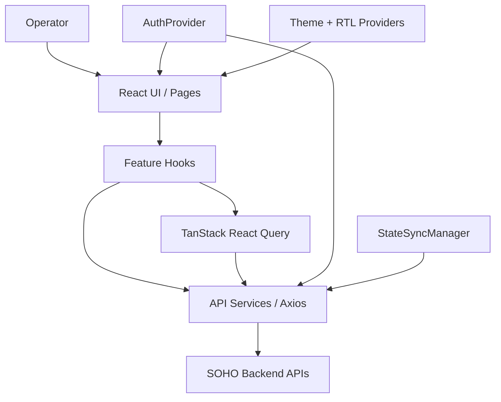

# معرفی پروژه

## هدف

SOHO UI، frontend مدیریتی مبتنی بر مرورگر برای سامانه‌ی مدیریت Storage با نام StoreX است. این application یک interface یکپارچه در اختیار Operator قرار می‌دهد تا health سیستم را مشاهده کند و Storage، sharing، userها، serviceها، تنظیمات network/system، SNMP و برخی عملیات سیستمی را مدیریت کند.

این repository فقط شامل frontend است. پیاده‌سازی زیرساخت Storage، سیستم‌عامل، authentication یا database بر عهده‌ی این repository نیست؛ frontend از طریق APIهای backend با بخش‌هایی که این عملیات را اجرا یا وضعیت آن‌ها را گزارش می‌کنند ارتباط دارد.

مرز دقیق مسئولیت‌ها در [`scope.md`](./scope.md) تعریف شده است.

## مسئولیت‌های اصلی

Frontend مسئول موارد زیر است:

- احراز هویت Operator و نگهداری browser session؛
- محافظت از application routeها در برابر دسترسی unauthenticated؛
- نمایش state مربوط به سیستم و Storage که از APIهای backend دریافت می‌شود؛
- آغاز mutationهای مدیریتی از طریق API layer؛
- مدیریت server-state cache و رفتار refresh در سمت client؛
- هماهنگ‌سازی canonical state snapshotها پس از mutationهای موفقی که domain آن‌ها map شده است؛
- نمایش notificationها و feedback سراسری مربوط به loading/error؛
- ارائه‌ی UI مدیریتی فارسی و RTL با پشتیبانی از light/dark theme؛
- حفظ رفتارهای امن و غیرآشکار lifecycle در frontend، به‌خصوص در عملیات destructive، concurrent یا چندمرحله‌ای.

Frontend، source of truth برای persisted infrastructure state نیست. state سیستم/backend مرجع نهایی و authoritative باقی می‌ماند.

## بخش‌های اصلی Application

Route configuration فعلی، بخش‌های زیر را در application ارائه می‌کند:

| بخش | Route | کاربرد اصلی | وضعیت |
| --- | --- | --- | --- |
| Login | `/login` | احراز هویت Operator | پیاده‌سازی شده |
| Dashboard | `/dashboard` | مانیتورینگ سطح بالای سیستم و Storage | پیاده‌سازی شده |
| Disks | `/disks` | مشاهده و مدیریت state مربوط به diskها | پیاده‌سازی شده |
| Integrated Storage | `/Integrated-space` | مدیریت Storage یکپارچه مبتنی بر ZFS/pool | پیاده‌سازی شده |
| Block Storage | `/block-space` | مدیریت Volumeهای block storage | پیاده‌سازی شده |
| File System | `/file-system` | مدیریت filesystemها و propertyهای مرتبط | پیاده‌سازی شده |
| Services | `/services` | مشاهده و کنترل serviceهای سیستم | پیاده‌سازی شده |
| Users | `/users` | مدیریت ارتباط OS/Samba user | پیاده‌سازی شده، با یک tab در حالت placeholder |
| Settings | `/settings` | تنظیمات عمومی/network و Web User | پیاده‌سازی شده |
| SMB Share | `/share` | مدیریت Samba/SMB sharing | پیاده‌سازی شده |
| NFS Share | `/share-nfs` | مدیریت NFS shareها | پیاده‌سازی شده |
| Web Share | `/web-share` | مدیریت قابلیت Web Share | پیاده‌سازی شده |
| History | `/history` | UI مرتبط با history/audit | فقط placeholder |
| SNMP | `/snmp-service` | مشاهده/configure/test کردن SNMP | پیاده‌سازی شده |

تمام application routeها به‌جز `/login` زیر یک protected layout mount می‌شوند.

برای هر routed area یک feature document در [`../05-features/`](../05-features/) وجود دارد؛ مستند History نیز به‌صورت صریح placeholder بودن آن را توضیح می‌دهد و behavior پیاده‌سازی‌نشده‌ای را فرض نمی‌کند.

## Technology Stack

Frontend فعلی از stack زیر استفاده می‌کند:

- React 19
- TypeScript 5.8
- Vite 7
- React Router 7
- TanStack React Query 5
- Axios
- Material UI 7
- Zustand 5
- React Hook Form
- Zod
- Tailwind CSS 4
- Emotion / Styled Components
- Three.js همراه با React Three Fiber و Drei
- react-hot-toast

برای version دقیق dependencyها به `package.json` مراجعه کنید.

صرف وجود یک dependency به این معنی نیست که برای هر feature جدید نیز همان گزینه انتخاب ترجیحی است. تا زمانی که یک تغییر معماری آگاهانه و مستند انجام نشده، ownership patternهای موجود باید رعایت شوند.

## مدل Ownership در Runtime



جزئیات ownership مربوط به runtime/data در مستندات زیر آمده است:

- [`../02-architecture/frontend-architecture.md`](../02-architecture/frontend-architecture.md)
- [`../02-architecture/runtime-flow.md`](../02-architecture/runtime-flow.md)
- [`../02-architecture/data-flow.md`](../02-architecture/data-flow.md)

## Bootstrap کردن Application

`src/main.tsx` providerهای سراسری application را با ترتیب زیر initialize می‌کند:

```text
StrictMode
└── AuthProvider
    └── QueryClientProvider
        └── Emotion CacheProvider (RTL)
            └── ThemeProvider
                └── App
```

سپس `App`، MUI theme، toaster سراسری، global loader و router را متصل می‌کند.

این ساختار providerها مهم است، زیرا authentication، query caching، RTL styling و theme state همگی concernهای cross-cutting هستند که feature moduleهای مستقل از آن‌ها استفاده می‌کنند.

## مدل Authentication و Session

Authentication با همکاری `AuthProvider`، `axiosInstance`، `authApi`، `authEvents`، `tokenStorage` و منطق session activity مدیریت می‌شود.

Contractهای مهم:

- access token به‌جای persist شدن در browser storage فقط در memory نگهداری می‌شود؛
- refresh token و username در صورت در دسترس بودن `sessionStorage`، در همان scope ذخیره می‌شوند؛
- access tokenهای قدیمی که قبلاً persist شده‌اند به‌صورت proactive حذف می‌شوند؛
- در صورت امکان، access state موجود پیش از refresh غیرضروری verify/restore می‌شود؛
- اگر access state قابل بازیابی نباشد ولی refresh token موجود باشد، frontend تلاش می‌کند token را refresh کند؛
- recovery مربوط به 401، refresh را serialize می‌کند تا requestهای هم‌زمان failشده باعث refresh storm نشوند؛
- authenticated sessionها از idle-activity timeout استفاده می‌کنند؛
- protected routeها پیش از redirect منتظر پایان auth initialization می‌مانند؛
- authentication bypass فقط در development و با flag اختصاصی مجاز است.

مراجع canonical:

- [`../04-core-flows/authentication.md`](../04-core-flows/authentication.md)
- [`../06-api/authentication-api.md`](../06-api/authentication-api.md)

## Server State و React Query

TanStack React Query مالک state معتبر backend است که برای UI در frontend cache می‌شود.

Global query defaultهای فعلی شامل موارد زیر هستند:

- automatic retry غیرفعال است؛
- هنگام mount شدن refetch انجام می‌شود؛
- global refetch هنگام window focus غیرفعال است؛
- global refetch هنگام reconnect غیرفعال است؛
- stale window کوتاهی وجود دارد؛
- query garbage-collection time محدود است.

Feature hookها می‌توانند behavior دقیق‌تری برای polling، stale-time، focus یا invalidation تعریف کنند.

مراجع canonical:

- [`../04-core-flows/server-state-and-cache.md`](../04-core-flows/server-state-and-cache.md)
- [`../04-core-flows/polling-and-data-refresh.md`](../04-core-flows/polling-and-data-refresh.md)

## Persistence و Canonical State Synchronization

یکی از مهم‌ترین contractهای اختصاصی پروژه، جداسازی API traffic عادی از persisted state snapshotها است.

Readهای عادی، polling requestها، refetchهای ناشی از route و mutationهای معمول مجاز نیستند به‌صورت مستقیم persistence مربوط به database snapshot را درخواست کنند. Transport layer، requestهای عادی `/api/` را به `save_to_db=false` normalize می‌کند.

`StateSyncManager` تنها owner در frontend برای درخواست canonical persisted snapshot است. پس از یک mutation موفق که mapping مربوط به آن تعریف شده، domainهای تحت تأثیر resolve می‌شوند و canonical GET snapshotها schedule می‌شوند. فقط همین snapshot requestهایی که به‌صورت داخلی mark شده‌اند توسط frontend به `save_to_db=true` تبدیل می‌شوند.

این design تضمین می‌کند persistence بر اساس authoritative post-operation state انجام شود، نه بر اساس mutation payload خوش‌بینانه یا ناقص.

مرجع canonical:

[`../04-core-flows/state-sync-save-to-db.md`](../04-core-flows/state-sync-save-to-db.md)

## API Integration

Behavior مشترک API به‌صورت مرکزی در مستندات زیر تعریف شده است:

- [`../06-api/api-conventions.md`](../06-api/api-conventions.md)
- [`../06-api/endpoint-map.md`](../06-api/endpoint-map.md)
- [`../06-api/error-handling.md`](../06-api/error-handling.md)

Feature code باید از همین conventionها استفاده کند و transport/persistence/error model موازی ایجاد نکند.

## رفتار Polling و Refresh

Polling به‌صورت selective انجام می‌شود. Live telemetry مانند CPU، memory، network bandwidth، service state و برخی resourceهای مربوط به storage health می‌توانند در زمان نیاز poll شوند. Collectionهای مدیریتی که نیاز به live update ندارند، معمولاً به‌جای continuous polling از mount/refetch/mutation invalidation استفاده می‌کنند.

فهرست canonical:

[`../04-core-flows/polling-and-data-refresh.md`](../04-core-flows/polling-and-data-refresh.md)

## زبان و جهت UI

Application عمدتاً یک interface مدیریتی فارسی است و از RTL styling support استفاده می‌کند.

Identifierهای سورس‌کد و commentهای مهندسی انگلیسی باقی می‌مانند تا conventionهای code/library یکپارچه بمانند. متن‌های user-facing در محل مناسب فارسی هستند.

برای rationale مربوط به RTL design به ADR-005 مراجعه کنید:

[`../02-architecture/decisions/ADR-005-rtl-emotion-cache.md`](../02-architecture/decisions/ADR-005-rtl-emotion-cache.md)

## مدل Build و Deployment

Repository با Vite به یک static artifact تبدیل می‌شود:

```text
dist/
```

در production می‌توان این artifact را با static web serverای مانند Nginx و همراه با SPA fallback برای browser-history routeها serve کرد.

Repository در حال حاضر workflow مربوط به frontend validation در GitHub Actions را دارد که `npm ci`، `npm run lint` و `npm run build` را اجرا می‌کند. با این حال Dockerfile یا Nginx config production در repository نگهداری نمی‌شود؛ بنابراین مستندات operations قرارداد deployment را توضیح می‌دهند و وجود automation مربوط به deployment را فرض نمی‌کنند.

مراجع:

- [`../07-operations/build.md`](../07-operations/build.md)
- [`../07-operations/deployment.md`](../07-operations/deployment.md)
- [`../07-operations/troubleshooting.md`](../07-operations/troubleshooting.md)

## بخش‌های پرریسک برای تغییرات آینده

هنگام تغییر موارد زیر باید دقت بیشتری داشت:

- `src/lib/axiosInstance.ts` — authentication refresh، transport policy، error handling و StateSync scheduling؛
- `src/lib/stateSyncManager.ts` — persistence ownership، cross-domain dependencyها، coalescing و race protection؛
- `src/contexts/AuthContext.tsx` — session restoration، logout behavior و token lifecycle؛
- `src/lib/tokenStorage.ts` — policy حساس به امنیت مربوط به token storage؛
- `src/hooks/useSessionActivityTimeout.ts` — session expiry در reload/focus/visibility changeها؛
- global React Query configuration در `src/main.tsx` — behavior مربوط به cache/refetch در کل UI؛
- workflowهای چند-requestی با semantics مربوط به partial success؛
- mutationهای service/power/network/system که روی availability اثر می‌گذارند.

پیش از این‌که هر فایل پرریسک را به‌عنوان code مستقل در نظر بگیرید، مستند architecture/core-flow/API/feature مرتبط را بخوانید و callerهای آن را بررسی کنید.

## وضعیت Documentation

ساختار اصلی مستندات اکنون در بخش‌های زیر تکمیل شده است:

```text
01-overview
02-architecture
03-development
04-core-flows
05-features
06-api
07-operations
```

کارهای بعدی باید بر consistency audit نهایی نسبت به source، executable validation و همگام نگه‌داشتن مستندات با تغییرات behavior در آینده متمرکز باشند؛ نه ایجاد یک ساختار مستندسازی موازی و رقیب.
