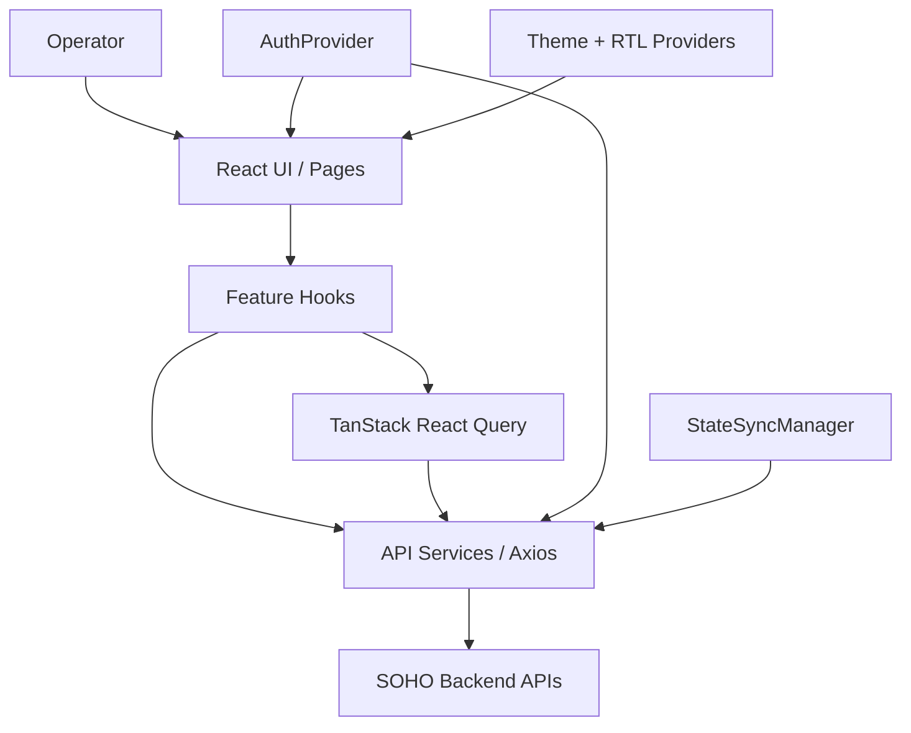

# Project Overview

## Purpose

SOHO UI is the browser-based administrative frontend for the StoreX storage management system. It gives operators a single interface for observing system health and managing storage, sharing, users, services, network/system settings, SNMP, and selected system operations.

This repository contains the frontend only. It does not own the underlying storage, operating-system, authentication, or database implementation; it communicates with backend APIs that perform or report those operations.

Detailed responsibility boundaries are defined in [`scope.md`](./scope.md).

## Primary responsibilities

The frontend is responsible for:

- authenticating the operator and maintaining the browser session;
- protecting application routes from unauthenticated access;
- presenting system and storage state returned by backend APIs;
- initiating administrative mutations through the API layer;
- managing client-side server-state caching and refresh behavior;
- coordinating canonical state snapshots after successful mapped mutations;
- presenting notifications and global loading/error feedback;
- providing Persian/RTL administrative UI with light/dark theme support;
- preserving safe/non-obvious frontend lifecycle behavior around destructive, concurrent, or multi-step operations.

The frontend is not the source of truth for persisted infrastructure state. Backend/system state remains authoritative.

## Main functional areas

The route configuration currently exposes these application areas:

| Area | Route | Primary purpose | Status |
| --- | --- | --- | --- |
| Login | `/login` | Authenticate the operator | Implemented |
| Dashboard | `/dashboard` | High-level system and storage monitoring | Implemented |
| Disks | `/disks` | Inspect and manage disk-related state | Implemented |
| Integrated Storage | `/Integrated-space` | Manage integrated/ZFS pool storage | Implemented |
| Block Storage | `/block-space` | Manage block-storage Volumes | Implemented |
| File System | `/file-system` | Manage filesystems and related properties | Implemented |
| Services | `/services` | Inspect and control system services | Implemented |
| Users | `/users` | Manage OS/Samba user bridge | Implemented with one placeholder tab |
| Settings | `/settings` | General/network/Web-user configuration | Implemented |
| SMB Share | `/share` | Manage Samba/SMB sharing | Implemented |
| NFS Share | `/share-nfs` | Manage NFS shares | Implemented |
| Web Share | `/web-share` | Manage Web Share functionality | Implemented |
| History | `/history` | Historical/audit-oriented UI | Placeholder only |
| SNMP | `/snmp-service` | Inspect/configure/test SNMP | Implemented |

All application routes except `/login` are mounted below a protected layout.

Every routed area has a feature document under [`../05-features/`](../05-features/); History explicitly documents its placeholder state rather than inventing unimplemented behavior.

## Technology stack

The current frontend stack includes:

- React 19
- TypeScript 5.8
- Vite 7
- React Router 7
- TanStack React Query 5
- Axios
- Material UI 7
- Zustand 5
- React Hook Form
- Zod
- Tailwind CSS 4
- Emotion / Styled Components
- Three.js with React Three Fiber and Drei
- react-hot-toast

See `package.json` for exact dependency versions.

The presence of a dependency does not imply that it is the preferred solution for every new feature. Follow the established ownership patterns unless an architectural change is intentional and documented.

## Runtime ownership model



Detailed runtime/data ownership:

- [`../02-architecture/frontend-architecture.md`](../02-architecture/frontend-architecture.md)
- [`../02-architecture/runtime-flow.md`](../02-architecture/runtime-flow.md)
- [`../02-architecture/data-flow.md`](../02-architecture/data-flow.md)

## Application bootstrap

`src/main.tsx` initializes application-wide providers in this order:

```text
StrictMode
└── AuthProvider
    └── QueryClientProvider
        └── Emotion CacheProvider (RTL)
            └── ThemeProvider
                └── App
```

`App` then connects the MUI theme, global toaster, global loader, and router.

This provider structure matters because authentication, query caching, RTL styling, and theme state are cross-cutting concerns used by otherwise independent feature modules.

## Authentication and session model

Authentication is coordinated through `AuthProvider`, `axiosInstance`, `authApi`, `authEvents`, `tokenStorage`, and session-activity logic.

Important contracts:

- access token is kept in memory rather than persisted to browser storage;
- refresh token and username are scoped to `sessionStorage` when available;
- legacy persisted access-token values are proactively removed;
- existing access state is verified/restored before unnecessary refresh where applicable;
- if access state cannot be restored but refresh token exists, frontend attempts token refresh;
- 401 recovery serializes refresh so simultaneous failed requests do not create refresh storms;
- authenticated sessions use an idle-activity timeout;
- protected routes wait for auth initialization before redirecting;
- authentication bypass is allowed only in development with the dedicated flag.

Canonical references:

- [`../04-core-flows/authentication.md`](../04-core-flows/authentication.md)
- [`../06-api/authentication-api.md`](../06-api/authentication-api.md)

## Server state and React Query

TanStack React Query owns authoritative backend state cached for the UI.

Current global query defaults include:

- no automatic retry;
- refetch on mount;
- no global refetch on window focus;
- no global refetch on reconnect;
- a short stale window;
- finite query garbage-collection time.

Feature hooks can define more specific polling, stale-time, focus, or invalidation behavior.

Canonical references:

- [`../04-core-flows/server-state-and-cache.md`](../04-core-flows/server-state-and-cache.md)
- [`../04-core-flows/polling-and-data-refresh.md`](../04-core-flows/polling-and-data-refresh.md)

## Persistence and canonical state synchronization

One of the most important project-specific contracts is the separation between ordinary API traffic and persisted state snapshots.

Normal reads, polling requests, route-driven refetches, and ordinary mutations are not allowed to directly request database snapshot persistence. The transport layer normalizes normal `/api/` traffic to `save_to_db=false`.

`StateSyncManager` is the single frontend owner of canonical persisted snapshot requests. After a successful mapped mutation, affected domains are resolved and canonical GET snapshots are scheduled. Those internally marked snapshot requests are the only frontend requests converted to `save_to_db=true`.

This ensures persistence is based on authoritative post-operation state instead of an optimistic/incomplete mutation payload.

Canonical reference:

[`../04-core-flows/state-sync-save-to-db.md`](../04-core-flows/state-sync-save-to-db.md)

## API integration

Shared API behavior is documented centrally:

- [`../06-api/api-conventions.md`](../06-api/api-conventions.md)
- [`../06-api/endpoint-map.md`](../06-api/endpoint-map.md)
- [`../06-api/error-handling.md`](../06-api/error-handling.md)

Feature code should use these conventions rather than introducing parallel transport/persistence/error models.

## Polling and refresh behavior

Polling is selective. Live telemetry such as CPU, memory, network bandwidth, service state, and selected storage-health resources can poll while required. Administrative collections without live-update requirements generally rely on mount/refetch/mutation invalidation instead of continuous polling.

Canonical inventory:

[`../04-core-flows/polling-and-data-refresh.md`](../04-core-flows/polling-and-data-refresh.md)

## UI language and direction

The application is primarily a Persian administrative interface and uses RTL styling support.

Source-code identifiers and engineering comments remain English so code/library conventions stay consistent. User-facing copy can remain Persian where appropriate.

See ADR-005 for RTL design rationale:

[`../02-architecture/decisions/ADR-005-rtl-emotion-cache.md`](../02-architecture/decisions/ADR-005-rtl-emotion-cache.md)

## Build and deployment model

The repository builds to a static Vite artifact:

```text
dist/
```

A production static web server such as Nginx can serve the artifact with SPA fallback for browser-history routes.

Current repository does not contain CI/CD workflows, Dockerfile, or Nginx config; operations documentation records the deployment contract without claiming automation that does not exist.

References:

- [`../07-operations/build.md`](../07-operations/build.md)
- [`../07-operations/deployment.md`](../07-operations/deployment.md)
- [`../07-operations/troubleshooting.md`](../07-operations/troubleshooting.md)

## High-risk areas for future changes

Take extra care when modifying:

- `src/lib/axiosInstance.ts` — authentication refresh, transport policy, error handling, StateSync scheduling;
- `src/lib/stateSyncManager.ts` — persistence ownership, cross-domain dependencies, coalescing, race protection;
- `src/contexts/AuthContext.tsx` — session restoration, logout behavior, token lifecycle;
- `src/lib/tokenStorage.ts` — security-sensitive token-storage policy;
- `src/hooks/useSessionActivityTimeout.ts` — session expiry across reload/focus/visibility changes;
- global React Query configuration in `src/main.tsx` — cache/refetch behavior across the UI;
- multi-request workflows with partial-success semantics;
- service/power/network/system mutations that affect availability.

Read the relevant architecture/core-flow/API/feature document and inspect callers before treating any high-risk file as isolated code.

## Documentation status

The main documentation structure is now populated across:

```text
01-overview
02-architecture
03-development
04-core-flows
05-features
06-api
07-operations
```

Remaining work should focus on final consistency/source audit, executable validation, and keeping documentation synchronized with future behavior changes rather than creating a second competing documentation structure.
