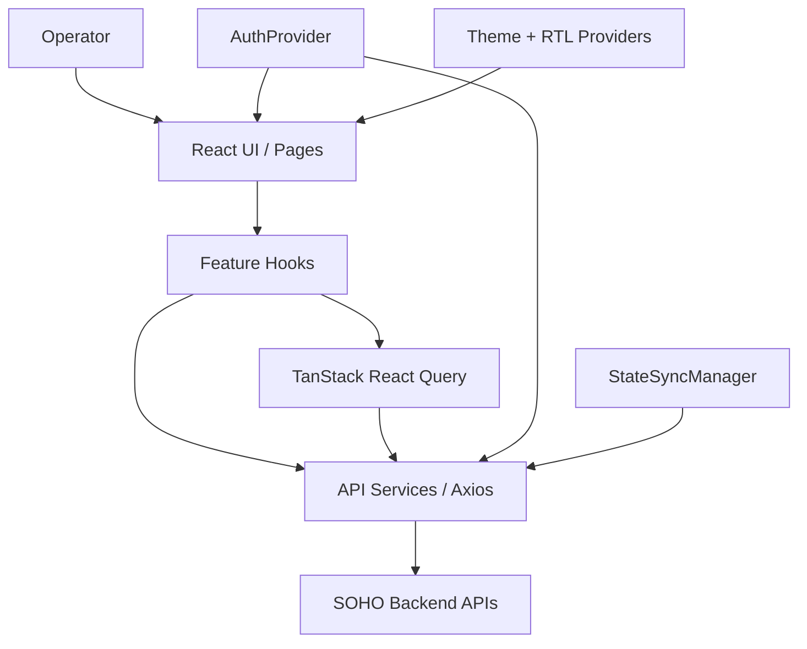

# Project Overview

## Purpose

SOHO UI is the browser-based administrative frontend for the StoreX storage management system. It gives operators a single interface for observing system health and managing storage, sharing, users, services, network-related settings, and selected system operations.

This repository contains the frontend only. It does not own the underlying storage or operating-system state; it communicates with backend APIs that perform or report those operations.

## Primary responsibilities

The frontend is responsible for:

- authenticating the operator and maintaining the browser session;
- protecting application routes from unauthenticated access;
- presenting system and storage state returned by backend APIs;
- initiating administrative mutations through the API layer;
- managing client-side server-state caching and refresh behavior;
- coordinating canonical state snapshots after successful mutations;
- presenting notifications and global loading/error feedback;
- providing Persian/RTL administrative UI with light/dark theme support;
- preventing unsafe duplicate or stale client-side behavior where the frontend owns the lifecycle.

The frontend is not the source of truth for persisted infrastructure state. Backend/system state remains authoritative.

## Main functional areas

The route configuration currently exposes these application areas:

| Area | Route | Primary purpose |
| --- | --- | --- |
| Login | `/login` | Authenticate the operator |
| Dashboard | `/dashboard` | High-level system and storage monitoring |
| Disks | `/disks` | Inspect and manage disk-related state |
| Integrated Storage | `/Integrated-space` | Manage integrated/ZFS pool storage |
| Block Storage | `/block-space` | Manage block-storage volumes |
| File System | `/file-system` | Manage filesystems and related properties |
| Services | `/services` | Inspect and control system services |
| Users | `/users` | Manage supported user domains |
| Settings | `/settings` | Configure system-level frontend-supported settings |
| SMB Share | `/share` | Manage Samba/SMB sharing |
| NFS Share | `/share-nfs` | Manage NFS shares |
| Web Share | `/web-share` | Manage web-share functionality |
| History | `/history` | Display historical/audit-oriented UI |
| SNMP | `/snmp-service` | Inspect and configure SNMP behavior |

All application routes except `/login` are mounted below a protected layout.

## Technology stack

The current frontend stack includes:

- React 19
- TypeScript 5.8
- Vite 7
- React Router 7
- TanStack React Query 5
- Axios
- Material UI 7
- Zustand 5
- React Hook Form
- Zod
- Tailwind CSS 4
- Emotion / Styled Components
- Three.js with React Three Fiber and Drei
- react-hot-toast

The presence of a dependency does not imply that it is the preferred solution for every new feature. Follow the patterns already established in the relevant feature area unless an architectural change is intentional and documented.

## Runtime ownership model

At runtime, responsibilities are roughly divided as follows:



The diagram is intentionally high level. Detailed ownership is documented in the architecture and core-flow documents.

## Application bootstrap

`src/main.tsx` initializes the application-wide providers in this order:

```text
StrictMode
└── AuthProvider
    └── QueryClientProvider
        └── Emotion CacheProvider (RTL)
            └── ThemeProvider
                └── App
```

`App` then connects the MUI theme, global toaster, global loader, and router.

This provider structure matters because authentication, query caching, RTL styling, and theme state are cross-cutting concerns used by many otherwise independent feature modules.

## Authentication and session model

Authentication is coordinated through `AuthProvider`, `axiosInstance`, `authApi`, `authEvents`, `tokenStorage`, and the session-activity timeout hook.

Important current contracts:

- the access token is kept in memory rather than persisted to browser storage;
- the refresh token and username are scoped to `sessionStorage` when available;
- legacy persisted access-token values are proactively removed;
- an existing access token is verified before an unnecessary refresh is attempted;
- if the access token cannot be restored but a refresh token exists, the frontend attempts token refresh;
- 401 handling in the Axios response interceptor serializes refresh behavior so simultaneous failed requests do not start independent refresh storms;
- authenticated sessions use an idle-activity timeout;
- protected routes wait for authentication initialization before redirecting;
- authentication bypass is allowed only in development when the dedicated environment flag is enabled.

These are security- and lifecycle-sensitive behaviors. Changes require review of the authentication flow documentation and relevant in-code comments.

## Server state and React Query

TanStack React Query owns cached server-state used by the UI.

Current global query defaults include:

- no automatic retry;
- refetch on mount;
- no refetch on window focus;
- no refetch on reconnect;
- a short stale window;
- finite query garbage-collection time.

Successful mutations trigger invalidation of active queries at the global mutation-cache level. Failed mutations do not trigger global invalidation.

Feature hooks may define more specific polling or invalidation behavior. The polling audit is the current detailed reference for those exceptions.

## Persistence and canonical state synchronization

One of the most important project-specific contracts is the separation between normal API traffic and persisted state snapshots.

Normal reads, polling requests, route-driven refetches, and mutations are not allowed to directly request database state persistence. They are normalized to `save_to_db=false` by the transport layer.

`StateSyncManager` is the single owner of canonical persisted snapshots. After a successful mutation, the affected state domain or domains are resolved and a canonical GET snapshot is scheduled. These internal snapshot requests are the only requests that are converted to `save_to_db=true`.

This design ensures that the database is updated from authoritative post-operation state rather than from an optimistic or incomplete mutation payload.

The full contract is documented in [`../state-sync-save-to-db.md`](../state-sync-save-to-db.md).

## Polling and refresh behavior

Polling is intentionally selective. Live metrics such as CPU, memory, network bandwidth, and selected storage-health data may poll while their observers are mounted and the tab is visible. Administrative lists that do not need live updates are generally refreshed on mount or after mutation invalidation instead of polling continuously.

The current detailed inventory is documented in [`../api-polling-audit.md`](../api-polling-audit.md).

## UI language and direction

The application is primarily a Persian administrative interface and uses RTL styling support. Source-code identifiers and engineering comments should remain in English so code, library conventions, and technical documentation stay consistent.

User-facing copy may remain Persian where appropriate.

## High-risk areas for future changes

A developer returning to the project should take extra care when modifying:

- `src/lib/axiosInstance.ts` — authentication refresh, transport policy, error handling, state-sync scheduling;
- `src/lib/stateSyncManager.ts` — persistence ownership, cross-domain dependencies, coalescing, race protection;
- `src/contexts/AuthContext.tsx` — session restoration, logout behavior, token lifecycle;
- `src/lib/tokenStorage.ts` — security-sensitive token-storage policy;
- `src/hooks/useSessionActivityTimeout.ts` — session expiry across reload/focus/visibility changes;
- global React Query configuration in `src/main.tsx` — cache and refetch behavior across the entire UI;
- feature mutation hooks that may contain historical/legacy request fields or duplicate invalidation logic.

Before changing one of these areas, read the relevant core-flow documentation and inspect callers rather than treating the file as isolated code.

## Current documentation status

This documentation set is being built incrementally from the current codebase. Existing operational/runtime notes are preserved rather than rewritten prematurely. When a new document supersedes an existing note, the old document should either be migrated with history preserved or replaced by an explicit link to the new source of truth.
