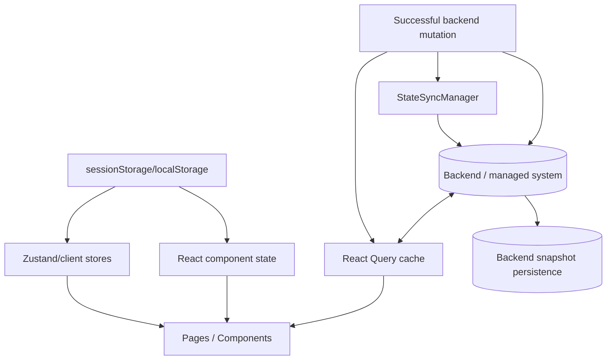
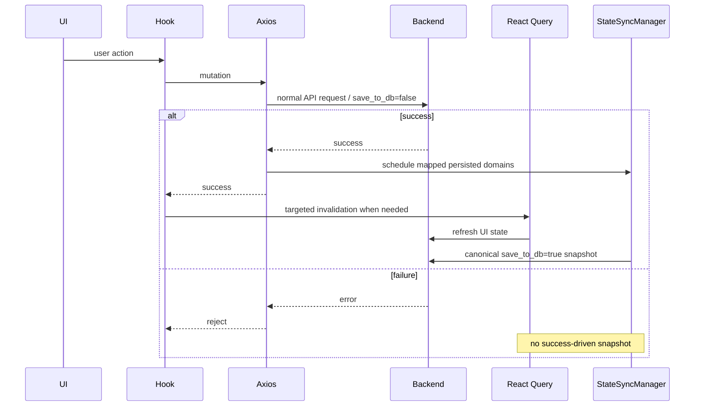

# Data Flow

This document describes data ownership and movement through SOHO UI.

The core distinction is between:

- authoritative backend state;
- React Query server-state cache;
- local UI state;
- browser-persisted client bookkeeping/preferences;
- canonical backend snapshot persistence requested by StateSync.

## Ownership model



## Authoritative backend state

Managed-system resources are authoritative on the backend.

Examples:

- pools;
- disks;
- filesystems;
- volumes;
- services;
- Samba/NFS/Web Shares;
- SNMP configuration;
- OS/Web/Samba users;
- network/system settings.

The browser must not become the source of truth for these values.

## React Query cache

React Query stores temporary copies of server state for rendering and request lifecycle management.

It provides:

- query caching;
- deduplication for identical active query keys;
- stale/fresh policy;
- loading/error state;
- targeted invalidation;
- interval refresh where configured.

React Query cache is not durable persistence.

A reload, garbage collection, logout, or application restart can remove it.

## Query key data flow

```text
backend endpoint
   ↓
feature fetch function
   ↓
normalization
   ↓
React Query key
   ↓
feature/page consumers
```

The query key defines cache identity, not the URL alone.

Two different query keys calling the same endpoint are independent React Query entries.

Examples include dedicated notification capacity keys versus ordinary zpool/filesystem keys.

## Normalization boundary

Backend compatibility/shape normalization should happen before data reaches presentation components.

Examples:

- service status/boolean normalization;
- Web Share flexible response shapes;
- volume/filesystem attribute maps;
- Samba Account Flags;
- NFS option semantics;
- network detail extraction;
- SNMP response defaults.

The target data flow is:

```text
raw API shape
   ↓
service/hook normalizer
   ↓
stable frontend domain model
   ↓
component
```

Avoid this pattern:

```text
raw API shape
   ↓
component A custom parsing
component B different parsing
component C another fallback
```

## Local UI state

Use component/local state for transient interaction state such as:

- modal visibility;
- staged form values;
- selected row;
- confirmation target;
- active tab;
- temporary validation errors;
- pending action metadata.

Local state must not replace backend state that can change independently.

## Zustand state

Zustand is used when client-only state needs to be shared across components with clearer ownership than prop drilling.

An example is `detailSplitViewStore`, which tracks active/pinned detail items per view.

This state is presentation/navigation state, not a backend resource.

When a backend list changes, feature pages prune active/pinned IDs that no longer exist.

## Browser storage

Browser persistence has limited, explicit uses.

### Session/auth bookkeeping

Examples:

- refresh token;
- remembered session username;
- last-activity timestamp.

The access token intentionally remains memory-only.

### UI preferences

Examples include dashboard layout/customization.

### Notification bookkeeping

Notification state/baselines/fingerprints can persist client-side so notification behavior survives relevant UI lifecycle changes.

These values are not authoritative representations of the storage appliance.

## Mutation data flow



## Why UI refresh and persistence are separate

A mutation can affect two different concerns:

### Client freshness

The operator should see the current backend state.

Owner:

```text
React Query invalidation/refetch
```

### Backend persisted snapshot

For domains with the `save_to_db` contract, the backend should persist one canonical complete snapshot.

Owner:

```text
StateSyncManager
```

A query refetch does not imply persistence.

A persistence snapshot does not replace normal UI cache refresh.

## StateSync data flow

Persisted domains are mapped by successful mutation URL.

Canonical snapshot requests are complete resource reads, not copies of mutation payloads.

This is important because a mutation payload may represent only a partial operation, while the persisted representation should reflect current complete system state.

Example:

```text
add one disk to pool
  ↓
mutation succeeds
  ↓
canonical zpool snapshot
  + canonical disk snapshot
```

The database receives current resource state rather than only "disk X was added".

## Cross-domain refresh/persistence

Some operations affect more than one resource view.

Examples:

- zpool mutation can change free-disk inventory;
- filesystem mutation can change pool capacity;
- disk mutation can change pool availability;
- Samba user/group changes can alter membership views from both sides.

These dependencies belong in shared mapping/invalidation architecture rather than hidden inside unrelated presentation components.

## Diagnostic actions

Not every POST/PUT-like action is a persisted state mutation.

Example:

```text
POST /api/snmp/test-connection/
```

This is diagnostic and should not trigger an SNMP configuration snapshot.

Classify operations by semantics, not HTTP verb alone.

## Multi-stage workflow data flow

Several UI operations are composed of multiple backend mutations.

Examples:

- Web user → OS user;
- OS user → Samba user;
- Samba group → add initial members;
- Web Share → set permissions.

These are currently frontend-orchestrated and not transactional.

```text
stage A succeeds
  ↓
stage B fails
  ↓
partial backend state remains
```

Feature docs record these partial-failure states explicitly.

## Polling and data flow

Polling repeatedly runs the ordinary query data path:

```text
interval
  ↓
queryFn
  ↓
axiosInstance
  ↓
backend
  ↓
React Query cache
```

Polling is observational and receives `save_to_db=false` from transport policy.

Polling does not directly invoke StateSync.

## Authentication data flow

Access token:

```text
refresh/login response
  ↓
memory-only tokenStorage
  ↓
Axios Authorization header
```

Refresh token:

```text
login response
  ↓
sessionStorage-backed tokenStorage
  ↓
refresh endpoint when needed
```

This separation reduces persistence of the bearer access token while still allowing session restoration.

## Data-flow review questions

When adding or changing behavior, ask:

1. What is the authoritative source?
2. Is this server state, local UI state, or client bookkeeping?
3. What query key owns the server state?
4. Where is raw API data normalized?
5. What invalidates/refetches this data?
6. Does it poll?
7. Does a mutation affect another domain?
8. Is the domain StateSync-persisted?
9. Is this operation actually mutating state or only diagnostic?
10. Can a multi-stage flow partially succeed?

If those answers are unclear, the ownership boundary is probably not ready for implementation.

## Related documentation

- [`runtime-flow.md`](./runtime-flow.md)
- [`frontend-architecture.md`](./frontend-architecture.md)
- [`../04-core-flows/server-state-and-cache.md`](../04-core-flows/server-state-and-cache.md)
- [`../04-core-flows/state-sync-save-to-db.md`](../04-core-flows/state-sync-save-to-db.md)
- [`../04-core-flows/api-request-lifecycle.md`](../04-core-flows/api-request-lifecycle.md)
