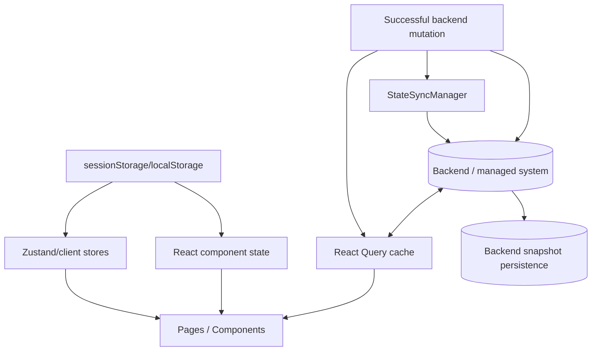
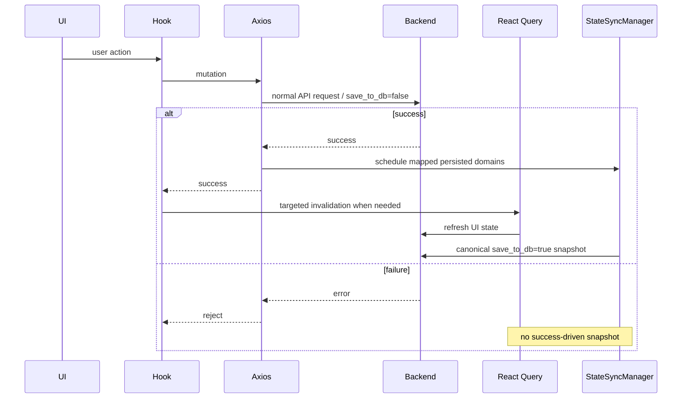

# Data Flow

این سند ownership و حرکت data در SOHO UI را توضیح می‌دهد.

تمایز اصلی بین موارد زیر است:

- authoritative state در backend؛
- server-state cache در React Query؛
- local UI state؛
- browser-persisted client bookkeeping/preferenceها؛
- canonical backend snapshot persistence که توسط StateSync درخواست می‌شود.

## مدل Ownership



## Authoritative Backend State

Resourceهای managed system در backend authoritative هستند.

نمونه‌ها:

- poolها؛
- diskها؛
- filesystemها؛
- volumeها؛
- serviceها؛
- Samba/NFS/Web Shareها؛
- SNMP configuration؛
- OS/Web/Samba userها؛
- network/system settingها.

Browser نباید source of truth این valueها شود.

## React Query Cache

React Query نسخه‌های موقتی server state را برای rendering و request lifecycle management نگه می‌دارد.

قابلیت‌های آن شامل موارد زیر است:

- query caching؛
- deduplication برای active query keyهای یکسان؛
- stale/fresh policy؛
- loading/error state؛
- targeted invalidation؛
- interval refresh در محل‌هایی که configure شده است.

React Query cache، durable persistence نیست.

Reload، garbage collection، logout یا restart شدن application می‌تواند آن را حذف کند.

## Data Flow مربوط به Query Key

```text
backend endpoint
   ↓
feature fetch function
   ↓
normalization
   ↓
React Query key
   ↓
feature/page consumers
```

Query key، cache identity را تعریف می‌کند؛ نه URL به‌تنهایی.

دو query key متفاوت که یک endpoint را call می‌کنند، در React Query entryهای مستقل هستند.

از نمونه‌های این موضوع می‌توان dedicated notification capacity keyها را در برابر zpool/filesystem keyهای معمول نام برد.

## Normalization Boundary

Normalization مربوط به backend compatibility/shape باید پیش از رسیدن data به presentation componentها انجام شود.

نمونه‌ها:

- service status/boolean normalization؛
- flexible response shapeهای Web Share؛
- volume/filesystem attribute mapها؛
- Samba Account Flags؛
- semantics مربوط به NFS option؛
- network detail extraction؛
- defaultهای SNMP response.

Data flow هدف:

```text
raw API shape
   ↓
service/hook normalizer
   ↓
stable frontend domain model
   ↓
component
```

از pattern زیر خودداری کنید:

```text
raw API shape
   ↓
component A custom parsing
component B different parsing
component C another fallback
```

## Local UI State

برای transient interaction stateهایی مانند موارد زیر از component/local state استفاده کنید:

- modal visibility؛
- staged form valueها؛
- selected row؛
- confirmation target؛
- active tab؛
- temporary validation errorها؛
- pending action metadata.

Local state نباید جای backend stateای را بگیرد که می‌تواند مستقل از UI تغییر کند.

## Zustand State

Zustand زمانی استفاده می‌شود که client-only state باید بین componentها share شود و ownership روشن‌تری نسبت به prop drilling نیاز دارد.

یک نمونه `detailSplitViewStore` است که active/pinned detail itemها را برای هر view track می‌کند.

این state مربوط به presentation/navigation است، نه backend resource.

وقتی backend list تغییر می‌کند، feature pageها active/pinned IDهایی را که دیگر وجود ندارند prune می‌کنند.

## Browser Storage

Browser persistence استفاده‌های محدود و صریح دارد.

### Session/Auth Bookkeeping

نمونه‌ها:

- refresh token؛
- session username به‌یادسپرده‌شده؛
- last-activity timestamp.

Access token عمداً فقط در memory نگهداری می‌شود.

### UI Preferenceها

از نمونه‌ها می‌توان Dashboard layout/customization را نام برد.

### Notification Bookkeeping

Notification state/baseline/fingerprintها می‌توانند در سمت client persist شوند تا notification behavior در lifecycle changeهای مرتبط UI حفظ شود.

این valueها representation authoritative از storage appliance نیستند.

## Mutation Data Flow



## چرا UI Refresh و Persistence از هم جدا هستند؟

یک mutation می‌تواند روی دو concern متفاوت اثر بگذارد.

### Client Freshness

Operator باید current backend state را ببیند.

Owner:

```text
React Query invalidation/refetch
```

### Backend Persisted Snapshot

برای domainهایی که `save_to_db` contract دارند، backend باید یک canonical complete snapshot را persist کند.

Owner:

```text
StateSyncManager
```

Query refetch به معنی persistence نیست.

Persistence snapshot نیز جای normal UI cache refresh را نمی‌گیرد.

## StateSync Data Flow

Persisted domainها بر اساس URL مربوط به mutation موفق map می‌شوند.

Canonical snapshot requestها complete resource read هستند، نه کپی mutation payload.

این نکته اهمیت دارد، زیرا mutation payload ممکن است فقط یک partial operation را نمایش دهد، در حالی که persisted representation باید current complete system state را منعکس کند.

مثال:

```text
add one disk to pool
  ↓
mutation succeeds
  ↓
canonical zpool snapshot
  + canonical disk snapshot
```

Database به‌جای صرفاً «disk X اضافه شد»، current resource state را دریافت می‌کند.

## Cross-domain Refresh/Persistence

برخی operationها بیش از یک resource view را تحت تأثیر قرار می‌دهند.

نمونه‌ها:

- zpool mutation می‌تواند free-disk inventory را تغییر دهد؛
- filesystem mutation می‌تواند pool capacity را تغییر دهد؛
- disk mutation می‌تواند pool availability را تغییر دهد؛
- تغییر Samba user/group می‌تواند membership view را از هر دو سمت تغییر دهد.

این dependencyها باید در shared mapping/invalidation architecture قرار بگیرند، نه این‌که داخل presentation componentهای نامرتبط پنهان شوند.

## Diagnostic Actionها

هر action شبیه POST/PUT لزوماً persisted state mutation نیست.

مثال:

```text
POST /api/snmp/test-connection/
```

این operation diagnostic است و نباید configuration snapshot مربوط به SNMP ایجاد کند.

Operationها را بر اساس semantics طبقه‌بندی کنید، نه فقط HTTP verb.

## Data Flow در Multi-stage Workflow

چند UI operation از چند backend mutation تشکیل شده‌اند.

نمونه‌ها:

- Web user → OS user؛
- OS user → Samba user؛
- Samba group → add initial members؛
- Web Share → set permissions.

این workflowها در حال حاضر توسط frontend orchestrate می‌شوند و transactional نیستند.

```text
stage A succeeds
  ↓
stage B fails
  ↓
partial backend state remains
```

Feature documentها این partial-failure stateها را به‌صورت صریح ثبت می‌کنند.

## Polling و Data Flow

Polling به‌صورت تکراری ordinary query data path را اجرا می‌کند:

```text
interval
  ↓
queryFn
  ↓
axiosInstance
  ↓
backend
  ↓
React Query cache
```

Polling observational است و از transport policy مقدار `save_to_db=false` دریافت می‌کند.

Polling مستقیماً StateSync را invoke نمی‌کند.

## Authentication Data Flow

Access token:

```text
refresh/login response
  ↓
memory-only tokenStorage
  ↓
Axios Authorization header
```

Refresh token:

```text
login response
  ↓
sessionStorage-backed tokenStorage
  ↓
refresh endpoint when needed
```

این separation باعث می‌شود persistence مربوط به bearer access token کاهش پیدا کند و در عین حال session restoration امکان‌پذیر بماند.

## پرسش‌های Review مربوط به Data Flow

هنگام اضافه‌کردن یا تغییر behavior بپرسید:

1. Authoritative source چیست؟
2. این data از نوع server state، local UI state یا client bookkeeping است؟
3. کدام query key مالک server state است؟
4. Raw API data کجا normalize می‌شود؟
5. چه چیزی این data را invalidate/refetch می‌کند؟
6. آیا poll می‌شود؟
7. آیا mutation روی domain دیگری اثر می‌گذارد؟
8. آیا domain توسط StateSync persist می‌شود؟
9. آیا operation واقعاً state را mutate می‌کند یا فقط diagnostic است؟
10. آیا multi-stage flow می‌تواند partial success داشته باشد؟

اگر پاسخ این پرسش‌ها روشن نیست، احتمالاً ownership boundary هنوز برای implementation آماده نیست.

## مستندات مرتبط

- [`runtime-flow.md`](./runtime-flow.md)
- [`frontend-architecture.md`](./frontend-architecture.md)
- [`../04-core-flows/server-state-and-cache.md`](../04-core-flows/server-state-and-cache.md)
- [`../04-core-flows/state-sync-save-to-db.md`](../04-core-flows/state-sync-save-to-db.md)
- [`../04-core-flows/api-request-lifecycle.md`](../04-core-flows/api-request-lifecycle.md)
