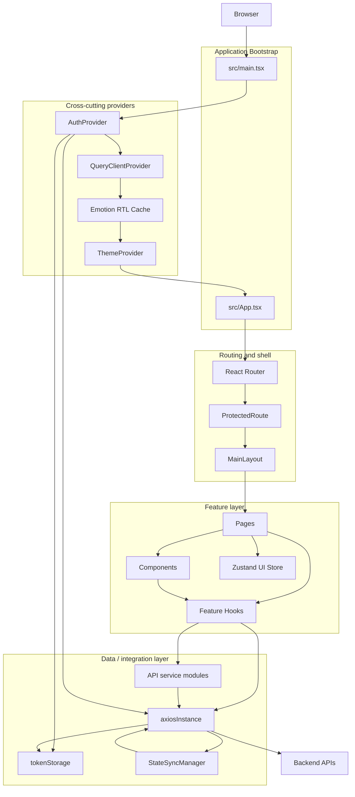
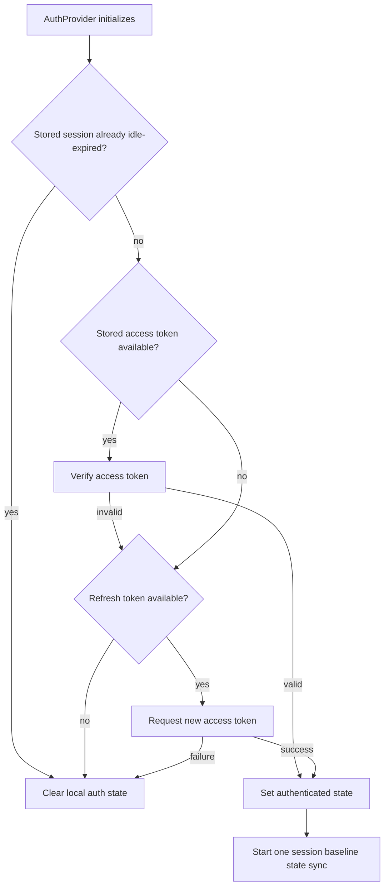
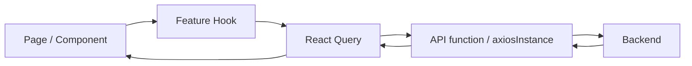
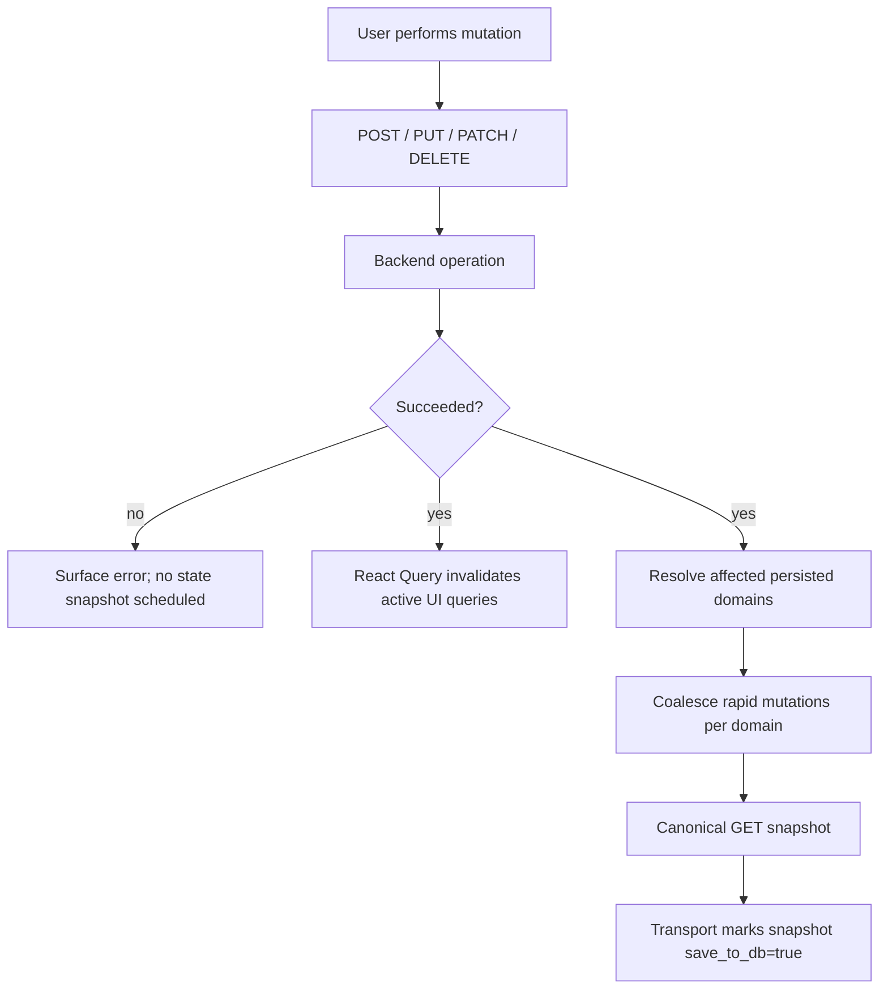

# Frontend Architecture

## Architectural intent

SOHO UI is organized around a React application shell, route-level feature pages, reusable components, feature/data hooks, a centralized HTTP transport, and a small number of cross-cutting providers and managers.

The most important architectural rule is ownership: each class of state or side effect should have one clear owner. Future changes should preserve that ownership unless an intentional architecture decision replaces it.

## Runtime layers

## Bootstrap and global providers

`src/main.tsx` creates the application-wide React Query client and mounts the provider chain.

The global QueryClient currently establishes shared defaults for query retry/refetch/staleness behavior. Its `MutationCache` invalidates active queries only after successful mutations.

Because this configuration affects every feature, changes to it should be treated as architectural rather than local optimization.

`src/App.tsx` is intentionally small. It derives the MUI theme from the custom theme context and mounts global UI infrastructure (`AppToaster`, `GlobalLoader`) before the router.

## Routing and application shell

`src/routes/Routes.tsx` is the route map.

`/login` is public. The rest of the application is mounted beneath `ProtectedRoute` and `MainLayout`.

`ProtectedRoute` has three responsibilities:

1. allow a development-only explicit auth bypass;
2. avoid redirecting while authentication restoration is still running;
3. redirect unauthenticated users to `/login`.

`MainLayout` is more than visual chrome. It currently owns or coordinates several application-shell behaviors, including:

- navigation drawer state;
- session idle timeout handling;
- notification bootstrap;
- theme controls;
- user menu/logout interaction;
- reboot/shutdown confirmation and countdown flow;
- route outlet rendering.

When adding new global behavior, first decide whether it truly belongs in the application shell. Feature-specific behavior should remain closer to the feature.

## Authentication architecture

Authentication spans several modules rather than one component:

| Module | Responsibility |
| --- | --- |
| `src/contexts/AuthContext.tsx` | authenticated React state, session restoration, login/logout orchestration |
| `src/lib/authApi.ts` | authentication API calls |
| `src/lib/axiosInstance.ts` | bearer attachment, 401 handling, refresh serialization |
| `src/lib/authEvents.ts` | communication from transport-level auth events back to React state |
| `src/lib/tokenStorage.ts` | token/username storage policy |
| `src/hooks/useSessionActivityTimeout.ts` | inactivity-based session expiry |
| `src/routes/ProtectedRoute.tsx` | route access decision |

### Token ownership

The access token is deliberately memory-only. The refresh token and username may live in `sessionStorage`.

This division is a security policy, not an incidental implementation detail. Do not move the access token to persistent browser storage merely to simplify reload behavior.

### Session restoration

At startup, `AuthProvider` attempts to restore an existing browser session. In simplified form:

### Concurrent 401 handling

`axiosInstance` serializes access-token refresh. While one refresh request is running, other failed requests are queued. A successful refresh replays the queue with the new access token; a failed refresh clears the session and rejects queued work.

This prevents simultaneous 401 responses from creating a refresh-request storm.

## HTTP transport architecture

`src/lib/axiosInstance.ts` is the shared transport boundary for application API requests.

Its responsibilities currently include:

- API base URL configuration;
- common JSON headers;
- optional mock-adapter setup;
- bearer-token injection;
- persistence-transport policy (`save_to_db`);
- successful mutation detection for state synchronization;
- error logging;
- 401 refresh/retry behavior;
- registration of the StateSyncManager HTTP executor.

Because this file combines several global contracts, comments should explain policy and ordering constraints rather than restating individual Axios calls.

## Server-state ownership

TanStack React Query is the primary owner of remote/server state presented by the UI.

Typical feature flow:

Feature hooks should define query keys and feature-specific polling/invalidations. Components should avoid building independent request lifecycles when an existing hook already owns the same data.

## Client/UI state ownership

Local component state remains appropriate for transient UI state such as modal visibility, form fields, selected rows, countdowns, and temporary errors.

Zustand is currently used selectively rather than as a universal state container. `src/stores/detailSplitViewStore.ts` is an example of shared UI state that benefits from surviving across related component boundaries.

Do not move server state into Zustand merely because multiple components consume it; React Query already owns that category of state.

## Persistence state synchronization

Persistence synchronization is deliberately separated from normal fetching and mutation code.

### Why

The backend database should receive a snapshot of the authoritative post-operation system state rather than a mutation payload that may be partial, normalized differently by the backend, or followed by secondary system changes.

### Ownership

`src/lib/stateSyncManager.ts` owns:

- the set of persisted state domains;
- each domain's canonical GET snapshot endpoint;
- mutation URL to affected-domain mapping;
- mutation coalescing delay;
- per-domain in-flight protection;
- one follow-up sync when a new mutation occurs during an active snapshot;
- one baseline sync per authenticated session.

`axiosInstance` owns enforcing the transport-level rule that normal API requests use `save_to_db=false` and only internal canonical state-sync requests can become `save_to_db=true`.

### Mutation lifecycle

The React Query refresh path and persistence snapshot path are related but separate responsibilities.

## Polling architecture

Polling is feature-specific and must be justified by the freshness requirement of the data.

Live operational metrics may poll frequently. Static administrative lists generally should not.

Polling should normally stop when its observer is unmounted and should not continue in a background tab unless there is a documented reason.

See [`../api-polling-audit.md`](../api-polling-audit.md) for the current endpoint-level behavior.

## Error and feedback surfaces

The project uses several layers of feedback:

- transport-level error logging utilities;
- mutation/query error states inside hooks;
- global loading UI;
- toast notifications for user-facing outcomes;
- feature-specific validation messages.

Do not make the transport layer responsible for every user-facing error message. The layer that has enough business context to explain the failure should own presentation.

## RTL and theme architecture

RTL support is configured through an Emotion cache and the application theme. Theme state is provided through `ThemeContext`, while `App` converts that state into the active MUI theme.

This is cross-cutting UI infrastructure. Directional styling fixes should prefer theme/RTL-aware solutions over one-off hardcoded left/right assumptions.

## Architecture change rule

A change should be accompanied by an Architecture Decision Record (ADR) when it intentionally changes a system-level ownership rule or long-lived architectural choice, for example:

- replacing React Query as server-state owner;
- changing token persistence policy;
- moving persistence snapshots out of StateSyncManager;
- introducing a second HTTP client with different interceptor behavior;
- changing routing/access-control strategy;
- adding a new global state-management system.

Small implementation changes that preserve existing ownership do not need an ADR.
