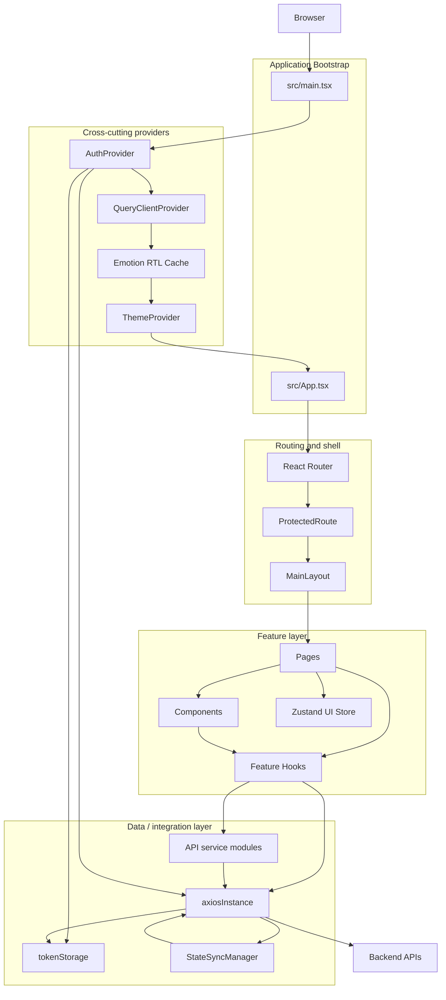
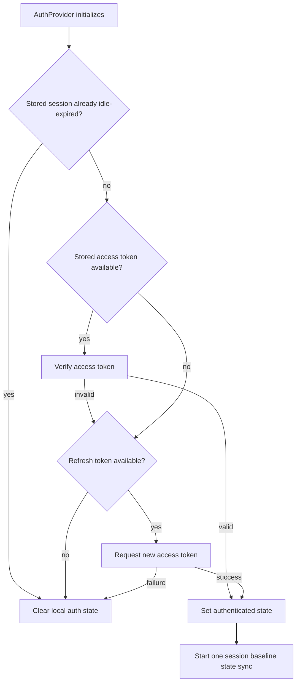
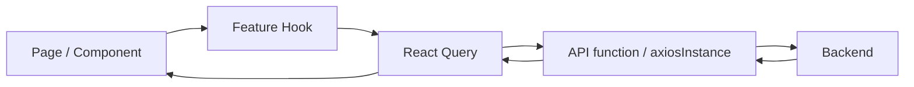
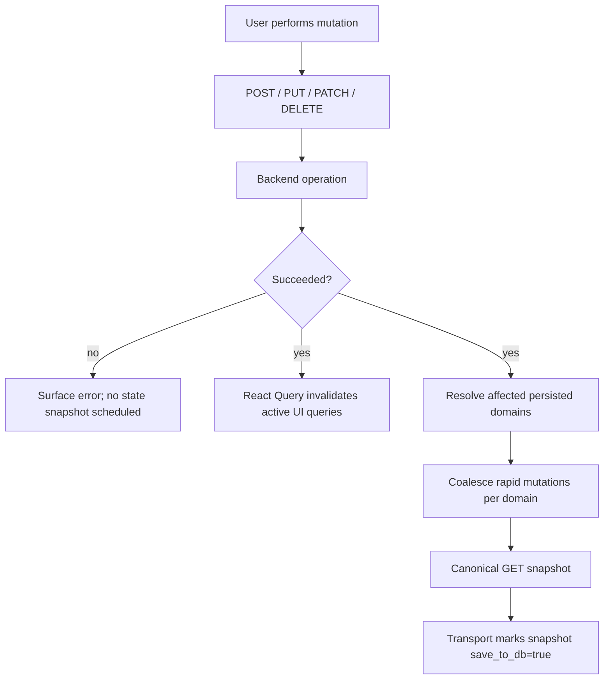

# معماری Frontend

## هدف معماری

SOHO UI حول یک React application shell، route-level feature pageها، reusable componentها، feature/data hookها، HTTP transport متمرکز و تعداد محدودی provider/manager از نوع cross-cutting سازمان‌دهی شده است.

مهم‌ترین rule معماری، ownership است: هر class از state یا side effect باید یک owner روشن داشته باشد. Changeهای آینده باید این ownership را حفظ کنند، مگر این‌که یک architecture decision آگاهانه جایگزین آن شود.

## Runtime Layerها

## Bootstrap و Global Providerها

`src/main.tsx` application-wide React Query client را ایجاد می‌کند و provider chain را mount می‌کند.

Global `QueryClient` در وضعیت فعلی shared defaultهای مربوط به query retry/refetch/staleness behavior را تعیین می‌کند. `MutationCache` آن فقط پس از mutation موفق، active queryها را invalidate می‌کند.

چون این configuration روی همه‌ی featureها اثر دارد، تغییر آن باید architectural change در نظر گرفته شود، نه local optimization.

`src/App.tsx` عمداً کوچک نگه داشته شده است. این فایل MUI theme را از custom theme context استخراج می‌کند و پیش از router، global UI infrastructure شامل `AppToaster` و `GlobalLoader` را mount می‌کند.

## Routing و Application Shell

`src/routes/Routes.tsx` همان route map است.

`/login` عمومی است. بقیه‌ی application زیر `ProtectedRoute` و `MainLayout` mount می‌شود.

`ProtectedRoute` سه مسئولیت دارد:

1. اجازه‌دادن به auth bypass صریح و development-only؛
2. جلوگیری از redirect تا زمانی که authentication restoration هنوز در حال اجراست؛
3. redirect کردن userهای unauthenticated به `/login`.

`MainLayout` فقط visual chrome نیست. این component در حال حاضر چند application-shell behavior را مالک یا هماهنگ می‌کند، از جمله:

- navigation drawer state؛
- session idle timeout handling؛
- notification bootstrap؛
- theme controlها؛
- user menu/logout interaction؛
- reboot/shutdown confirmation و countdown flow؛
- route outlet rendering.

هنگام اضافه‌کردن global behavior جدید ابتدا مشخص کنید آیا واقعاً به application shell تعلق دارد یا خیر. Feature-specific behavior باید نزدیک feature باقی بماند.

## معماری Authentication

Authentication بین چند module تقسیم شده و فقط متعلق به یک component نیست:

| Module | مسئولیت |
| --- | --- |
| `src/contexts/AuthContext.tsx` | authenticated React state، session restoration و login/logout orchestration |
| `src/lib/authApi.ts` | authentication API callها |
| `src/lib/axiosInstance.ts` | Bearer attachment، 401 handling و refresh serialization |
| `src/lib/authEvents.ts` | انتقال transport-level auth eventها به React state |
| `src/lib/tokenStorage.ts` | policy مربوط به token/username storage |
| `src/hooks/useSessionActivityTimeout.ts` | session expiry مبتنی بر inactivity |
| `src/routes/ProtectedRoute.tsx` | تصمیم مربوط به route access |

### Token Ownership

Access token عمداً فقط در memory نگهداری می‌شود. Refresh token و username می‌توانند در `sessionStorage` قرار بگیرند.

این تقسیم‌بندی یک security policy است، نه implementation detail اتفاقی. صرفاً برای ساده‌کردن behavior بعد از reload، access token را به persistent browser storage منتقل نکنید.

### Session Restoration

در startup، `AuthProvider` تلاش می‌کند browser session موجود را restore کند. فرم ساده‌شده‌ی flow:

### Concurrent 401 Handling

`axiosInstance`، access-token refresh را serialize می‌کند. تا زمانی که یک refresh request در حال اجراست، requestهای failشده‌ی دیگر queue می‌شوند. Refresh موفق، queue را با access token جدید replay می‌کند؛ refresh ناموفق session را clear کرده و queued work را reject می‌کند.

این design مانع ایجاد refresh-request storm در اثر چند response هم‌زمان 401 می‌شود.

## معماری HTTP Transport

`src/lib/axiosInstance.ts` shared transport boundary برای application API requestها است.

مسئولیت‌های فعلی آن شامل موارد زیر است:

- API base URL configuration؛
- common JSON headerها؛
- optional mock-adapter setup؛
- Bearer-token injection؛
- persistence-transport policy مربوط به `save_to_db`؛
- تشخیص mutation موفق برای state synchronization؛
- error logging؛
- 401 refresh/retry behavior؛
- register کردن HTTP executor مربوط به StateSyncManager.

چون این فایل چند global contract را هم‌زمان نگه می‌دارد، commentها باید policy و ordering constraintها را توضیح دهند، نه Axios callهای منفرد را تکرار کنند.

## Ownership مربوط به Server State

TanStack React Query owner اصلی remote/server stateای است که در UI نمایش داده می‌شود.

Feature flow معمول:

Feature hookها باید query key و polling/invalidation اختصاصی feature را تعریف کنند. وقتی یک hook موجود همان data را مالک است، component نباید request lifecycle مستقلی بسازد.

## Ownership مربوط به Client/UI State

Local component state برای transient UI stateهایی مثل modal visibility، form field، selected row، countdown و temporary error مناسب است.

Zustand در پروژه به‌صورت selective استفاده می‌شود، نه به‌عنوان universal state container. `src/stores/detailSplitViewStore.ts` نمونه‌ای از shared UI state است که از باقی‌ماندن بین component boundaryهای مرتبط سود می‌برد.

صرفاً چون چند component server state مشابهی را مصرف می‌کنند آن را به Zustand منتقل نکنید؛ React Query از قبل owner این class از state است.

## Persistence State Synchronization

Persistence synchronization عمداً از normal fetching و mutation code جدا شده است.

### چرا؟

Database در backend باید snapshotی از authoritative post-operation system state دریافت کند، نه mutation payloadی که ممکن است partial باشد، backend آن را متفاوت normalize کند یا بعد از آن secondary system change رخ دهد.

### Ownership

`src/lib/stateSyncManager.ts` مسئول موارد زیر است:

- مجموعه‌ی persisted state domainهای فعلی؛
- canonical GET snapshot endpoint هر domain؛
- mapping بین mutation URL و domainهای تحت تأثیر؛
- mutation coalescing delay؛
- per-domain in-flight protection؛
- schedule کردن دقیقاً یک follow-up sync وقتی mutation جدید هنگام snapshot فعال رخ می‌دهد؛
- یک baseline sync در هر authenticated session.

`axiosInstance` مسئول enforce کردن transport-level rule است که API requestهای عادی از `save_to_db=false` استفاده کنند و فقط internal canonical state-sync requestها بتوانند به `save_to_db=true` تبدیل شوند.

### Mutation Lifecycle

React Query refresh path و persistence snapshot path به هم مرتبط‌اند، اما مسئولیت‌های جداگانه دارند.

## معماری Polling

Polling feature-specific است و باید با freshness requirement مربوط به data توجیه شود.

Live operational metricها می‌توانند با cadence بالا poll شوند. Static administrative listها معمولاً نباید continuous polling داشته باشند.

Polling باید در حالت عادی زمانی که observer آن unmount شده متوقف شود و بدون دلیل مستند در background tab ادامه پیدا نکند.

برای endpoint-level behavior فعلی به [`../api-polling-audit.md`](../api-polling-audit.md) مراجعه کنید.

## Surfaceهای Error و Feedback

پروژه چند layer برای feedback دارد:

- transport-level error logging utilityها؛
- mutation/query error state داخل hookها؛
- global loading UI؛
- toast notification برای user-facing outcomeها؛
- feature-specific validation messageها.

Transport layer را مسئول تمام user-facing error messageها نکنید. Layerای که business context کافی برای توضیح failure دارد باید presentation را مالک باشد.

## معماری RTL و Theme

RTL support از طریق Emotion cache و application theme configure شده است. Theme state از طریق `ThemeContext` ارائه می‌شود و `App` آن state را به active MUI theme تبدیل می‌کند.

این بخش cross-cutting UI infrastructure است. Directional styling fixها باید RTL/theme-aware solution را به hardcoded left/right assumptionهای one-off ترجیح دهند.

## Rule مربوط به Architecture Change

وقتی یک change عمداً system-level ownership rule یا architectural choice بلندمدت را تغییر می‌دهد باید Architecture Decision Record (ADR) همراه آن باشد. برای مثال:

- جایگزین‌کردن React Query به‌عنوان server-state owner؛
- تغییر token persistence policy؛
- خارج‌کردن persistence snapshotها از StateSyncManager؛
- معرفی HTTP client دوم با interceptor behavior متفاوت؛
- تغییر routing/access-control strategy؛
- اضافه‌کردن global state-management system جدید.

Implementation changeهای کوچک که ownership موجود را حفظ می‌کنند نیازی به ADR ندارند.
