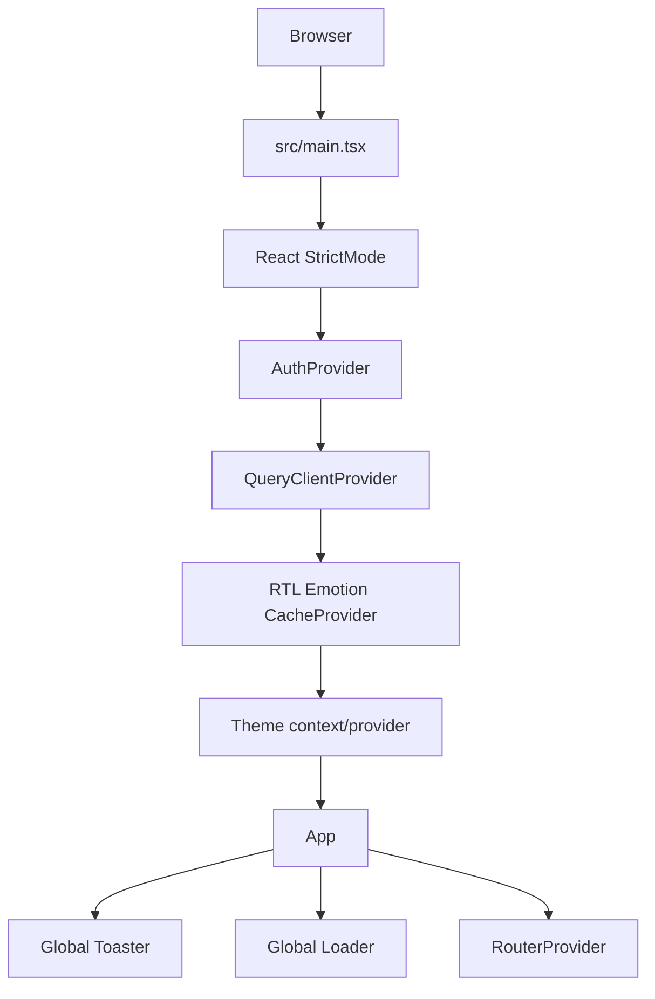
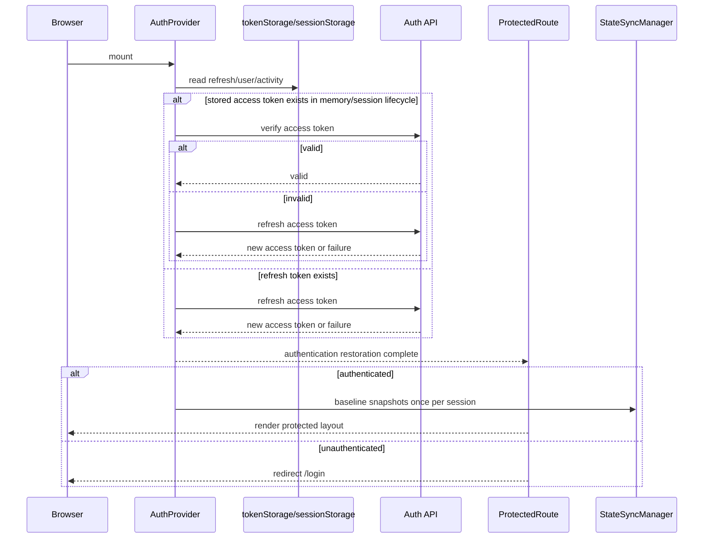
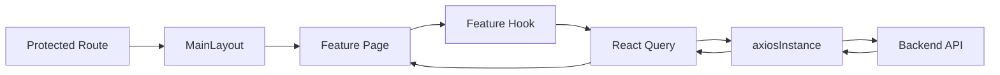
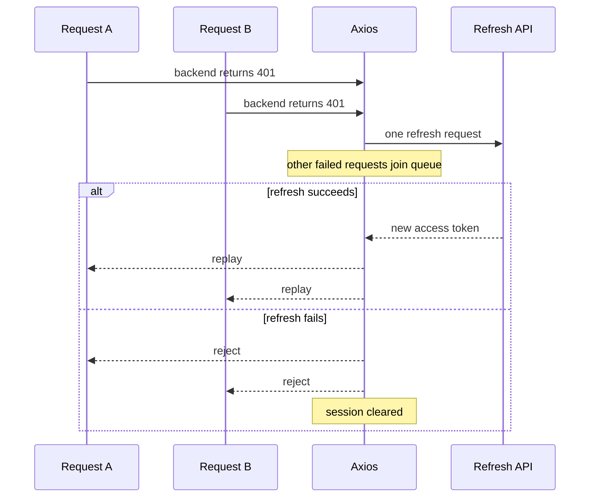
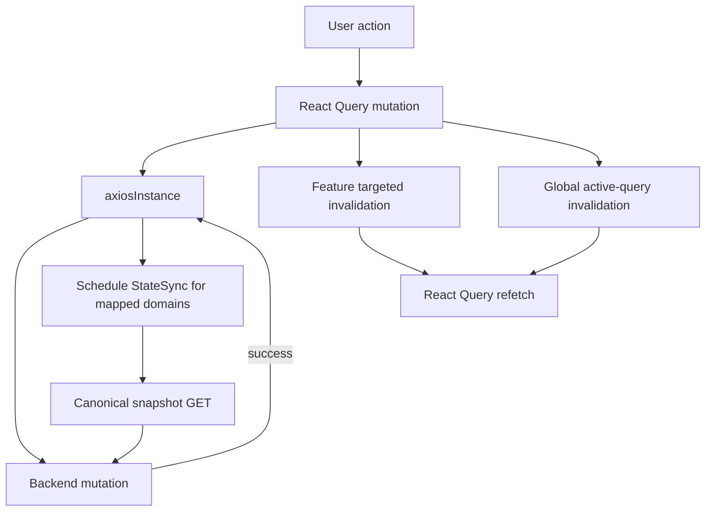

# Runtime Flow

این سند یک نمای فشرده‌ی end-to-end از این موضوع ارائه می‌دهد که SOHO UI چگونه start می‌شود، session را restore می‌کند، protected feature را render می‌کند، API traffic می‌فرستد و به mutationها واکنش نشان می‌دهد.

برای contractهای دقیق‌تر به core-flow documentهای لینک‌شده مراجعه کنید.

## Application Bootstrap



Bootstrap ownership:

- `main.tsx` global providerها و React Query policy را ایجاد می‌کند؛
- `AuthProvider` session را restore/authenticate می‌کند؛
- RTL Emotion cache مسئول style transformation برای styleهای سازگار با RTL است؛
- router بین Login و protected application routeها انتخاب می‌کند؛
- `MainLayout` concernهای authenticated layout مانند navigation، notificationها، idle-session handling و power actionها را مالک است.

## Session Restoration پیش از Protected Routing



تا زمانی که `isAuthLoading` برابر true است، `ProtectedRoute` منتظر می‌ماند. این behavior مانع آن می‌شود که یک session معتبر و قابل restore پیش از پایان restoration به Login redirect شود.

## Runtime مربوط به Protected Feature



Pageها باید feature state را orchestrate کنند و transport/session policy را دوباره پیاده‌سازی نکنند.

## Request Path

برای API traffic عادی:

```text
feature hook
  -> React Query query/mutation
  -> axiosInstance
  -> centralized save_to_db policy
  -> Bearer access token
  -> backend
```

Traffic عادی زیر `/api/` به `save_to_db=false` normalize می‌شود.

فقط internal canonical StateSync requestها `save_to_db=true` درخواست می‌کنند.

## Recovery مربوط به 401



در هر لحظه فقط یک refresh می‌تواند in-flight باشد. این rule از ایجاد refresh storm زمانی جلوگیری می‌کند که چند query mountشده هم‌زمان با token expiry روبه‌رو می‌شوند.

## Flow مربوط به Mutation موفق



UI refresh و persisted snapshot عمداً از یکدیگر جدا هستند.

Mutation موفق ممکن است باعث موارد زیر شود:

- targeted feature invalidation؛
- global active-query invalidation؛
- persisted snapshot scheduling برای StateSync domainهایی که mapping دارند.

Diagnostic POST مانند SNMP connection test نباید فقط به دلیل استفاده از POST به‌عنوان persisted configuration mutation در نظر گرفته شود.

## Polling Runtime

Polling به lifecycle تک‌تک queryها تعلق دارد.

Global polling timer وجود ندارد.

نمونه‌ها:

```text
uptime          1s
CPU/memory      2s
service state   5s
some storage    10-30s
notification capacity 60s
configuration-style resources often no interval
```

برای behavior دقیق فعلی به canonical polling inventory مراجعه کنید.

## Notification Bootstrap

`MainLayout` احراز هویت‌شده، `NotificationBootstrapper` را mount می‌کند و در نتیجه notification observation lifecycleها فعال می‌شوند.

Notification monitoring ترکیبی از موارد زیر را استفاده می‌کند:

- ordinary shared resource query keyها؛
- dedicated notification query keyها؛
- local persisted notification/baseline bookkeeping.

Notification storage صرفاً client bookkeeping است و authoritative backend state محسوب نمی‌شود.

## Logout Runtime

Logout عمداً ابتدا local access را خاتمه می‌دهد:

```text
user requests logout
  -> capture refresh token
  -> clear local auth/session state
  -> protected UI becomes inaccessible immediately
  -> notify backend logout endpoint
```

Latency/failure در backend logout نباید باعث شود protected client routeها همچنان قابل دسترسی بمانند.

## Idle Session Runtime

Authenticated layout، activity را track می‌کند و last activity timestamp را در session storage نگه می‌دارد.

Reload کردن page، idle history را reset نمی‌کند.

اگر elapsed inactivity از window تنظیم‌شده‌ی 30 دقیقه بیشتر شود، frontend session را logout می‌کند و به Login می‌رود.

## برای Debug از کجا شروع کنیم؟

### App Render نمی‌شود

موارد زیر را بررسی کنید:

1. provider bootstrap در `main.tsx`؛
2. TypeScript/runtime error؛
3. router construction؛
4. auth restoration؛
5. global loader state.

### Protected Route به‌اشتباه Redirect می‌شود

موارد زیر را بررسی کنید:

1. lifecycle مربوط به `isAuthLoading`؛
2. token storage؛
3. verify/refresh requestها؛
4. idle timeout؛
5. auth event مربوط به Session Cleared.

### Mutation موفق است ولی Screen Stale مانده

پیش از دست‌زدن به StateSync، targeted/global React Query invalidation را بررسی کنید.

### Live UI صحیح است ولی Persisted Backend Snapshot قدیمی مانده

به‌جای React Query، StateSync URL mapping/scheduling/canonical snapshot را بررسی کنید.

## مستندات مرتبط

- [`frontend-architecture.md`](./frontend-architecture.md)
- [`data-flow.md`](./data-flow.md)
- [`../04-core-flows/authentication.md`](../04-core-flows/authentication.md)
- [`../04-core-flows/api-request-lifecycle.md`](../04-core-flows/api-request-lifecycle.md)
- [`../04-core-flows/server-state-and-cache.md`](../04-core-flows/server-state-and-cache.md)
- [`../04-core-flows/state-sync-save-to-db.md`](../04-core-flows/state-sync-save-to-db.md)
- [`../04-core-flows/polling-and-data-refresh.md`](../04-core-flows/polling-and-data-refresh.md)
