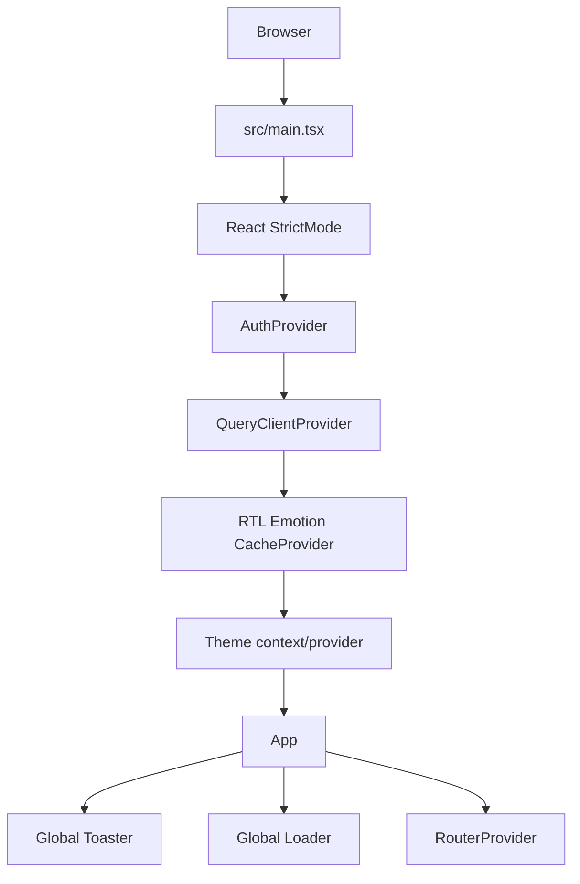
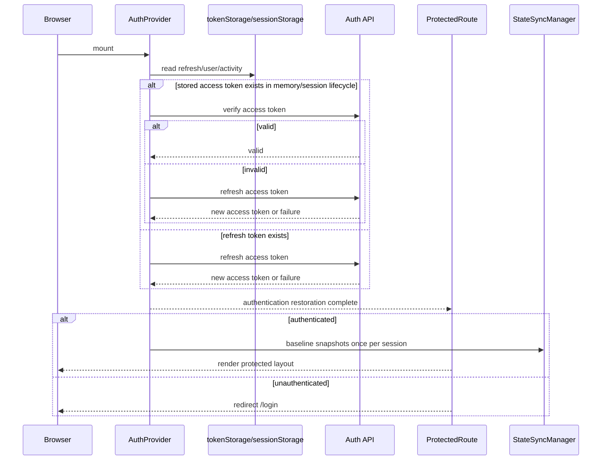
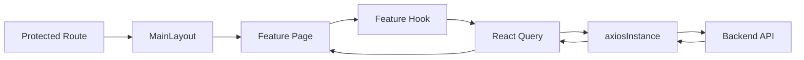
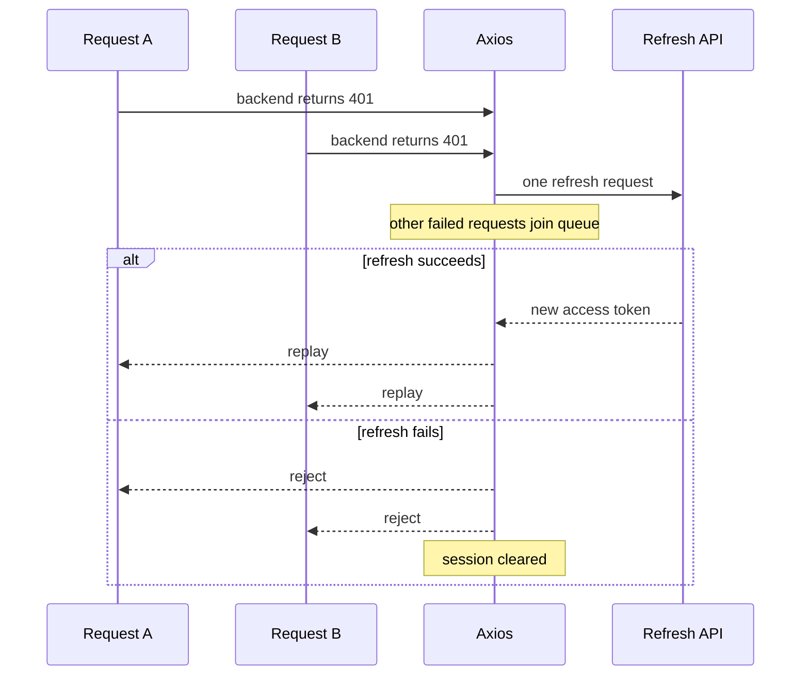
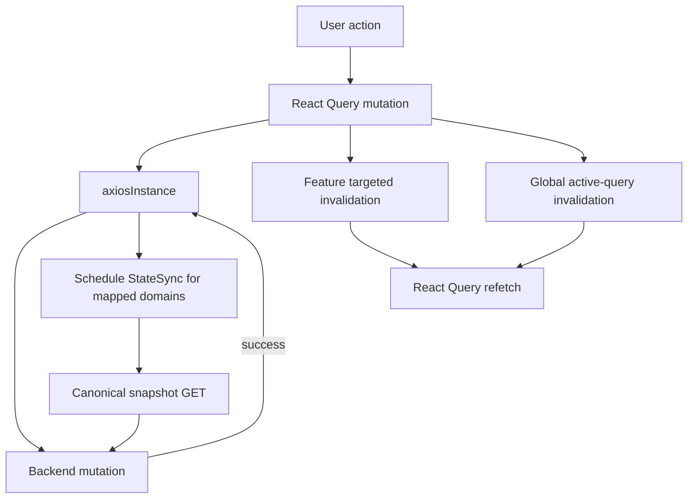

# Runtime Flow

This document provides a compact end-to-end view of how SOHO UI starts, restores a session, renders a protected feature, sends API traffic, and reacts to mutations.

For detailed contracts, follow the linked core-flow documents.

## Application bootstrap



Bootstrap ownership:

- `main.tsx` creates global providers and React Query policy;
- `AuthProvider` restores/authenticates the session;
- RTL Emotion cache owns style transformation for RTL-compatible styles;
- the router chooses Login or protected application routes;
- `MainLayout` owns authenticated-layout concerns such as navigation, notifications, idle-session handling, and power actions.

## Session restoration before protected routing



`ProtectedRoute` waits while `isAuthLoading` is true. This prevents a valid restorable session from being redirected to Login before restoration finishes.

## Protected feature runtime



Pages should orchestrate feature state, not reimplement transport/session policy.

## Request path

For normal API traffic:

```text
feature hook
  -> React Query query/mutation
  -> axiosInstance
  -> centralized save_to_db policy
  -> Bearer access token
  -> backend
```

Normal `/api/` traffic is normalized to `save_to_db=false`.

Only internal canonical StateSync requests request `save_to_db=true`.

## 401 recovery



Only one refresh is allowed in flight. This avoids a refresh storm when many mounted queries encounter token expiry together.

## Successful mutation flow



The UI refresh and persisted snapshot are deliberately separate.

A successful mutation may cause:

- targeted feature invalidation;
- global active-query invalidation;
- persisted snapshot scheduling for mapped StateSync domains.

A diagnostic POST such as SNMP connection testing must not be treated as a persisted configuration mutation solely because it uses POST.

## Polling runtime

Polling belongs to individual query lifecycles.

There is no global polling timer.

Examples:

```text
uptime          1s
CPU/memory      2s
service state   5s
some storage    10-30s
notification capacity 60s
configuration-style resources often no interval
```

See the canonical polling inventory for exact current behavior.

## Notification bootstrap

Authenticated `MainLayout` mounts `NotificationBootstrapper`, which enables notification observation lifecycles.

Notification monitoring uses a combination of:

- ordinary shared resource query keys;
- dedicated notification query keys;
- local persisted notification/baseline bookkeeping.

Notification storage is client bookkeeping, not authoritative backend state.

## Logout runtime

Logout intentionally ends local access first:

```text
user requests logout
  -> capture refresh token
  -> clear local auth/session state
  -> protected UI becomes inaccessible immediately
  -> notify backend logout endpoint
```

Backend logout latency/failure must not leave protected client routes accessible.

## Idle session runtime

Authenticated layout tracks activity and stores the last activity timestamp in session storage.

Reloading the page does not reset idle history.

If elapsed inactivity exceeds the configured 30-minute window, the frontend logs out the session and navigates to Login.

## Where to debug first

### App does not render

Check:

1. `main.tsx` provider bootstrap;
2. TypeScript/runtime error;
3. router construction;
4. auth restoration;
5. global loader state.

### Protected route unexpectedly redirects

Check:

1. `isAuthLoading` lifecycle;
2. token storage;
3. verify/refresh requests;
4. idle timeout;
5. Session Cleared auth event.

### Mutation succeeds but screen is stale

Check targeted/global React Query invalidation before touching StateSync.

### Live UI is correct but persisted backend snapshot is stale

Check StateSync URL mapping/scheduling/canonical snapshot rather than React Query.

## Related documentation

- [`frontend-architecture.md`](./frontend-architecture.md)
- [`data-flow.md`](./data-flow.md)
- [`../04-core-flows/authentication.md`](../04-core-flows/authentication.md)
- [`../04-core-flows/api-request-lifecycle.md`](../04-core-flows/api-request-lifecycle.md)
- [`../04-core-flows/server-state-and-cache.md`](../04-core-flows/server-state-and-cache.md)
- [`../04-core-flows/state-sync-save-to-db.md`](../04-core-flows/state-sync-save-to-db.md)
- [`../04-core-flows/polling-and-data-refresh.md`](../04-core-flows/polling-and-data-refresh.md)
