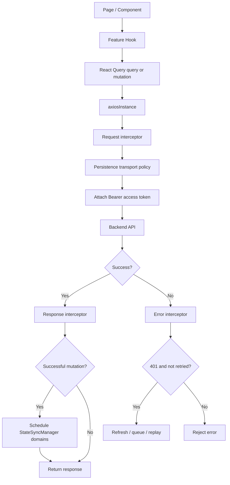

# API Request Lifecycle

این سند توضیح می‌دهد requestهای عادی backend چگونه در SOHO UI حرکت می‌کنند، authentication چگونه به request متصل می‌شود، responseهای 401 چگونه recover می‌شوند، mutationهای موفق چگونه state synchronization را trigger می‌کنند و کدام responsibility به Axios و کدام به React Query تعلق دارد.

## Entry Point اصلی Transport

API traffic عادی application باید از shared instance موجود در `src/lib/axiosInstance.ts` استفاده کند.

این instance با موارد زیر configure شده است:

- `baseURL: import.meta.env.VITE_API_BASE_URL`
- JSON request/response headerها
- optional mock adapter setup در configurationهای development/test-oriented
- request interceptorها
- response interceptorها
- state-sync executor registration

Feature hookها نباید Axios client مستقل بسازند، مگر این‌که architectural reason آگاهانه‌ای وجود داشته باشد؛ مانند authentication transport ایزوله‌شده که در `authentication.md` توضیح داده شده است.

## Request Path سطح بالا



## React Query Ownership

React Query و Axios دو مسئله‌ی متفاوت را حل می‌کنند.

### React Query مالک موارد زیر است

- query lifecycle؛
- loading/error/success state؛
- cache keyها؛
- invalidation؛
- polling/refetch behavior؛
- mutation lifecycle callbackها.

### Axios مالک موارد زیر است

- HTTP transport defaultها؛
- Bearer token attachment؛
- centralized 401 recovery؛
- transport-level `save_to_db` policy؛
- notification مربوط به mutation موفق برای `StateSyncManager`.

Token refresh را به individual React Query hook منتقل نکنید. همچنین Axios را مسئول feature-specific cache invalidation نکنید.

## ترتیب Request Interceptor

برای هر request عادی، request interceptor دو action مهم انجام می‌دهد.

### 1. اعمال Persistence Transport Policy

`applySaveToDbTransportPolicy` پیش از اضافه‌شدن token اجرا می‌شود.

برای requestهای non-auth زیر `/api/`، persistence contract را enforce می‌کند:

- requestهای عادی به‌صورت صریح `save_to_db=false` دارند؛
- فقط canonical state-sync GET requestها مجازند `save_to_db=true` داشته باشند؛
- caller-level `save_to_db` valueهای stale در body formatهای پشتیبانی‌شده به false force می‌شوند؛
- inline query-string valueهای `save_to_db` حذف شده و از طریق Axios params دوباره ساخته می‌شوند؛
- auth endpointها از این policy exclude هستند.

در نتیجه application یک transport-level authority واحد برای snapshot persistence دارد و به هر feature hook اعتماد نمی‌کند که flag صحیح را تنظیم کند.

برای design کامل persistence به [`state-sync-save-to-db.md`](./state-sync-save-to-db.md) مراجعه کنید.

### 2. اضافه‌کردن Access Token

Request interceptor، access token فعلی را از memory-only `tokenStorage` می‌خواند.

در صورت وجود، header زیر را تنظیم می‌کند:

```text
Authorization: Bearer <access-token>
```

Feature code نباید Bearer token را برای API requestهای عادی به‌صورت دستی اضافه کند.

## Internal StateSync Marker

Canonical state-sync requestها از طریق executor ثبت‌شده در انتهای `axiosInstance.ts` ساخته می‌شوند.

Executor، internal header زیر را اضافه می‌کند:

```text
X-Soho-State-Sync: 1
```

Request policy این marker را می‌خواند تا canonical persistence snapshot را از request عادی تشخیص دهد.

Marker پس از انجام نقش داخلی خود از outgoing Axios configuration حذف می‌شود. سپس transport policy برای همان request مقدار `save_to_db=true` را تنظیم می‌کند.

در نتیجه ordinary caller مالک persistence behavior نمی‌شود و در عین حال `StateSyncManager` می‌تواند canonical GET خود را از همان authenticated HTTP stack عبور دهد.

## Successful Response Path

هنگام response موفق، response interceptor موارد زیر را بررسی می‌کند:

- request method؛
- request URL؛
- auth endpoint بودن یا نبودن request.

Mutationهای موفق non-auth API با `POST`، `PUT`، `PATCH` یا `DELETE` function زیر را call می‌کنند:

```text
scheduleStateSyncForMutation(url)
```

`StateSyncManager`، mutation URL را به یک یا چند persisted domain map کرده و canonical snapshotهای مربوطه را schedule می‌کند.

بر اساس contract فعلی GitLab، mappingهای اصلی شامل موارد زیر هستند:

```text
zpool mutation       -> zpool + disk
filesystem mutation  -> filesystem + zpool
disk mutation        -> disk + zpool
nfs mutation         -> nfs
samba sharepoint     -> samba-shares
webshare mutation    -> webshare
```

در contract فعلی، Samba user/group و SNMP StateSync domain مستقل ندارند.

این scheduling از React Query cache invalidation مستقل است.

## UI Cache Refresh در برابر Persisted Snapshot Refresh

این دو مفهوم عمداً جدا هستند.

### React Query Invalidation

برای fresh کردن server-state data در UI استفاده می‌شود.

Global `MutationCache.onSuccess` که در `main.tsx` configure شده، پس از mutation موفق active queryها را invalidate می‌کند و feature hookها نیز در صورت نیاز targeted invalidation انجام می‌دهند.

### StateSyncManager Snapshot

برای ایجاد canonical backend persistence snapshot از طریق GET با `save_to_db=true` استفاده می‌شود.

React Query refetch همچنان request عادی است و در نتیجه `save_to_db=false` دارد.

برای persistence به UI refetch متکی نباشید.

## Error Logging

Response errorها پیش از specialized 401 handling از `logApiErrorDetails(error)` عبور می‌کنند.

این behavior transport-level diagnosticها را متمرکز می‌کند و در صورتی که recovery موفق نشود original rejected error را برای caller-level handling حفظ می‌کند.

## Lifecycle مربوط به 401 Recovery

Response با status `401` فقط زمانی وارد token recovery می‌شود که:

- original request config وجود داشته باشد؛ و
- request قبلاً با `_retry` mark نشده باشد.

### Refresh Token وجود ندارد

اگر refresh token وجود نداشته باشد:

1. token storage clear می‌شود؛
2. `SESSION_CLEARED` emit می‌شود؛
3. original request reject می‌شود.

React auth layer event را دریافت کرده و authenticated state را clear می‌کند.

### Refresh Token وجود دارد

پیش از refresh/replay، request با `_retry = true` mark می‌شود.

این flag یک loop-protection invariant است. اگر replayed request دوباره 401 برگرداند نباید پیوسته refresh و retry شود.

## Single-flight Refresh Queue

Concurrent responseهای 401 نباید concurrent token-refresh request ایجاد کنند.

Axios module از موارد زیر استفاده می‌کند:

```text
isRefreshing
failedQueue
```

اولین request failشده refresh operation را شروع می‌کند.

هر request اضافی که هنگام `isRefreshing === true` مقدار 401 دریافت کند به‌جای آغاز refresh جدید در queue قرار می‌گیرد.

وقتی refresh موفق می‌شود:

1. access token جدید ذخیره می‌شود؛
2. Axios defaultها update می‌شوند؛
3. Authorization header مربوط به original request جایگزین می‌شود؛
4. `TOKEN_REFRESHED` emit می‌شود؛
5. queued requestها با token جدید replay می‌شوند؛
6. original request replay می‌شود.

وقتی refresh fail می‌شود:

1. queued requestها reject می‌شوند؛
2. tokenها clear می‌شوند؛
3. `SESSION_CLEARED` emit می‌شود؛
4. original refresh path reject می‌شود.

این یک concurrency contract است، نه صرفاً optimization. حذف queue می‌تواند refresh storm و raceهایی ایجاد کند که چند refresh response یکدیگر را overwrite کنند.

## Exception مربوط به Authentication Transport

Login، refresh و verify از `authClient` ایزوله در `authApi.ts` استفاده می‌کنند، نه `axiosInstance` اصلی.

این design از circular behavior جلوگیری می‌کند؛ یعنی refresh endpoint خودش به‌عنوان normal expired-token request intercept نشود.

Logout از main instance استفاده می‌کند، چون `/api/system/ui-user/logout/` یک authenticated application endpoint است.

جزئیات در `authentication.md` آمده است.

## Mock API Behavior

`axiosInstance` می‌تواند زمانی که `VITE_USE_MOCKS` به truthy value resolve می‌شود Axios mock adapter را install کند، از جمله:

- `1`
- `true`
- `yes`
- `on`

چون mock adapter روی shared Axios instance نصب می‌شود، feature code برای mocked normal API traffic به transport path جدا نیاز ندارد.

هنگام debug کردن mock response غیرمنتظره، ابتدا این environment variable را بررسی کنید.

## Checklist پیاده‌سازی Mutation

هنگام اضافه‌کردن mutation hook:

1. از shared `axiosInstance` استفاده کنید.
2. Authorization header را دستی اضافه نکنید.
3. Per-hook token-refresh logic جدید اضافه نکنید.
4. برای persistence به caller-level `save_to_db=true` وابسته نباشید.
5. React Query keyهای لازم برای UI freshness فوری را invalidate کنید.
6. اگر mutation persisted state را تغییر می‌دهد، تأیید کنید `StateSyncManager.resolveStateDomainsForMutation()` endpoint را طبق contract فعلی map می‌کند.
7. فقط زمانی StateSync domain جدید اضافه کنید که هیچ canonical domain موجودی state تغییرکرده را نمایش نمی‌دهد.
8. Backend error information را برای user feedback مفید حفظ کنید.
9. Ordering یا cross-domain effect غیرآشکار را مستند کنید.

## Checklist پیاده‌سازی Query

هنگام اضافه‌کردن query hook:

1. از shared Axios instance استفاده کنید.
2. Stable و meaningful React Query key تعریف کنید.
3. فقط زمانی polling تنظیم کنید که data واقعاً continuous refresh نیاز داشته باشد.
4. از background polling خودداری کنید، مگر feature صریحاً به آن نیاز داشته باشد.
5. Ordinary refetch را UI freshness operation با `save_to_db=false` در نظر بگیرید.
6. به‌جای force کردن persistence از query hook، از canonical state-sync system استفاده کنید.

## Failure Scenarioهای رایج

### API Request فاقد Bearer Token است

بررسی کنید:

- `tokenStorage.getAccessToken()` value دارد یا خیر؛
- authentication restoration کامل شده یا خیر؛
- request واقعاً shared Axios instance را استفاده می‌کند یا خیر.

### تعداد زیادی Request هم‌زمان Refresh می‌شوند

این نشانه‌ی bypass یا duplicate شدن single-flight queue است. Feature hookها نباید refresh call مستقل پیاده‌سازی کنند.

### Mutation موفق است ولی Persisted Backend State قدیمی مانده

بررسی کنید:

- endpoint طبق contract به StateSync domain مورد انتظار map می‌شود یا خیر؛
- canonical snapshot endpoint موفق است یا خیر؛
- mutation URL به‌عنوان API mutation classify می‌شود یا خیر؛
- state-sync logها در development.

این مسئله را با اضافه‌کردن `save_to_db=true` به mutation payloadهای پراکنده حل نکنید.

### UI پس از Mutation Stale می‌ماند ولی Persistence صحیح است

این معمولاً React Query invalidation/refetch issue است، نه `StateSyncManager` issue.

### یک GET عادی به‌طور غیرمنتظره State را Persist می‌کند

Internal state-sync marker و transport policy را بررسی کنید. Ordinary caller نباید بتواند به‌صورت تصادفی canonical persistence request ایجاد کند.

## فایل‌های مرتبط

- `src/lib/axiosInstance.ts`
- `src/lib/authApi.ts`
- `src/lib/authEvents.ts`
- `src/lib/tokenStorage.ts`
- `src/lib/stateSyncManager.ts`
- `src/main.tsx`

## مستندات مرتبط

- [`authentication.md`](./authentication.md)
- [`routing-and-access-control.md`](./routing-and-access-control.md)
- [`state-sync-save-to-db.md`](./state-sync-save-to-db.md)
- [`polling-and-data-refresh.md`](./polling-and-data-refresh.md)
- [`../02-architecture/frontend-architecture.md`](../02-architecture/frontend-architecture.md)
