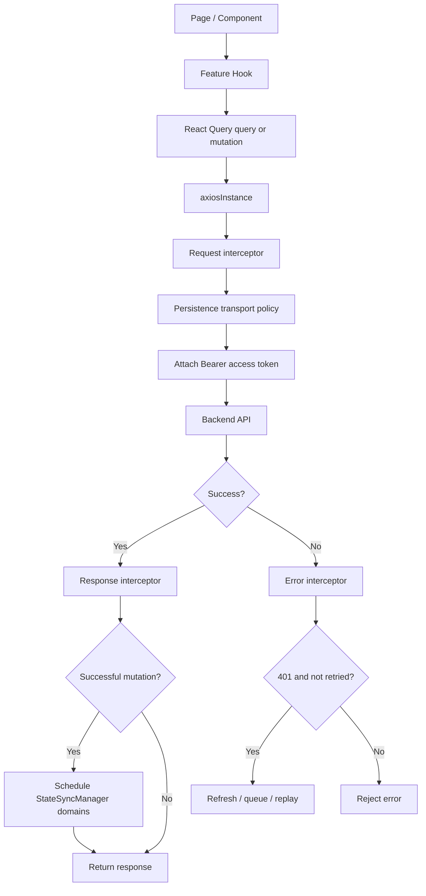

# API Request Lifecycle

This document describes how normal backend requests travel through SOHO UI, how authentication is attached, how 401 responses are recovered, how successful mutations trigger state synchronization, and which responsibilities belong to Axios versus React Query.

## Main transport entry point

Normal application API traffic should use the shared `src/lib/axiosInstance.ts` instance.

It is configured with:

- `baseURL: import.meta.env.VITE_API_BASE_URL`
- JSON request/response headers
- optional mock adapter setup in development/test-oriented configurations
- request interceptors
- response interceptors
- state-sync executor registration

Feature hooks should not create their own Axios clients unless there is a deliberate architectural reason such as the isolated authentication transport described in `authentication.md`.

## High-level request path



## React Query ownership

React Query and Axios solve different problems.

### React Query owns

- query lifecycle;
- loading/error/success state;
- cache keys;
- invalidation;
- polling/refetch behavior;
- mutation lifecycle callbacks.

### Axios owns

- HTTP transport defaults;
- Bearer token attachment;
- centralized 401 recovery;
- transport-level `save_to_db` policy;
- successful mutation notification to `StateSyncManager`.

Do not move token refresh into individual React Query hooks. Do not make Axios responsible for feature-specific cache invalidation.

## Request interceptor order

For each normal request, the request interceptor performs two important actions.

### 1. Apply persistence transport policy

`applySaveToDbTransportPolicy` is executed before the token is attached.

For non-auth `/api/` requests, it enforces the persistence contract:

- normal requests explicitly carry `save_to_db=false`;
- only canonical state-sync GET requests are allowed to carry `save_to_db=true`;
- stale caller-level `save_to_db` values in supported body formats are forced to false;
- inline query-string `save_to_db` values are removed and reconstructed through Axios params;
- auth endpoints are excluded from this policy.

The application therefore has one transport-level authority for snapshot persistence rather than trusting every feature hook to set the correct flag.

See `../state-sync-save-to-db.md` for the full persistence design.

### 2. Attach access token

The request interceptor reads the current in-memory access token from `tokenStorage`.

When present, it sets:

```text
Authorization: Bearer <access-token>
```

Feature code should not manually attach the Bearer token to normal API requests.

## Internal state-sync marker

Canonical state-sync requests are created through the executor registered at the bottom of `axiosInstance.ts`.

The executor adds the internal header:

```text
X-Soho-State-Sync: 1
```

The request policy reads that marker to distinguish a canonical persistence snapshot from a normal request.

The marker is removed from the outgoing Axios configuration after it has served its internal purpose. The transport policy then sets `save_to_db=true` for that request.

This prevents ordinary callers from owning persistence behavior while still allowing `StateSyncManager` to route its canonical GET through the same authenticated HTTP stack.

## Successful response path

On a successful response, the response interceptor checks:

- request method;
- request URL;
- whether the request is an auth endpoint.

Successful non-auth API mutations using `POST`, `PUT`, `PATCH`, or `DELETE` call:

```text
scheduleStateSyncForMutation(url)
```

`StateSyncManager` maps the mutation URL to one or more persisted domains and schedules their canonical snapshots.

Examples include cross-domain dependencies such as:

```text
zpool mutation       -> zpool + disk
filesystem mutation  -> filesystem + zpool
disk mutation        -> disk + zpool
samba user mutation  -> samba-users + samba-groups
```

This scheduling is independent from React Query cache invalidation.

## UI cache refresh versus persisted snapshot refresh

These are intentionally separate concepts.

### React Query invalidation

Used to make UI server-state data fresh for the user.

The global `MutationCache.onSuccess` configured in `main.tsx` invalidates active queries after successful mutations, and feature hooks may also perform targeted invalidation when necessary.

### StateSyncManager snapshot

Used to create the canonical backend persistence snapshot by issuing a GET with `save_to_db=true`.

A React Query refetch remains a normal request and therefore carries `save_to_db=false`.

Do not rely on a UI refetch to persist state.

## Error logging

Response errors are passed through `logApiErrorDetails(error)` before specialized 401 handling.

This centralizes transport-level diagnostics while preserving the original rejected error for caller-level handling when no recovery path succeeds.

## 401 recovery lifecycle

A `401` response enters token recovery only when:

- an original request config exists; and
- the request has not already been marked `_retry`.

### Missing refresh token

If no refresh token exists:

1. token storage is cleared;
2. `SESSION_CLEARED` is emitted;
3. the original request is rejected.

The React auth layer receives the event and clears authenticated state.

### Refresh token exists

The request is marked `_retry = true` before refresh/replay.

This flag is a loop-protection invariant. If the replayed request still returns 401, it must not continually refresh and retry itself.

## Single-flight refresh queue

Concurrent 401 responses must not cause concurrent token-refresh requests.

The Axios module uses:

```text
isRefreshing
failedQueue
```

The first failing request starts the refresh operation.

Any additional 401 request arriving while `isRefreshing === true` is queued instead of starting another refresh.

When the refresh succeeds:

1. the new access token is stored;
2. Axios defaults are updated;
3. the original request Authorization header is replaced;
4. `TOKEN_REFRESHED` is emitted;
5. queued requests are replayed with the new token;
6. the original request is replayed.

When the refresh fails:

1. queued requests are rejected;
2. tokens are cleared;
3. `SESSION_CLEARED` is emitted;
4. the original refresh path rejects.

This is a concurrency contract, not merely an optimization. Removing the queue can produce refresh storms and races where multiple refresh responses overwrite each other.

## Authentication transport exception

Login, refresh, and verify use the isolated `authClient` from `authApi.ts`, not the main `axiosInstance`.

This avoids circular behavior where the refresh endpoint itself could be intercepted as a normal expired-token request.

Logout uses the main instance because `/api/system/ui-user/logout/` is an authenticated application endpoint.

See `authentication.md` for details.

## Mock API behavior

`axiosInstance` can install the Axios mock adapter when `VITE_USE_MOCKS` resolves to a truthy value such as:

- `1`
- `true`
- `yes`
- `on`

Because the mock adapter is attached to the shared Axios instance, feature code does not need a separate transport path for mocked normal API traffic.

When debugging unexpected mock responses, verify this environment variable first.

## Mutation implementation checklist

When adding a mutation hook:

1. Use the shared `axiosInstance`.
2. Do not manually add Authorization headers.
3. Do not add new per-hook token-refresh logic.
4. Do not depend on caller-level `save_to_db=true` for persistence.
5. Invalidate the React Query keys needed for immediate UI freshness.
6. Confirm `StateSyncManager.resolveStateDomainsForMutation()` maps the endpoint when the mutation changes persisted state.
7. Add a new state-sync domain only when no existing canonical domain represents the changed state.
8. Preserve backend error information for useful user feedback.
9. Document non-obvious ordering or cross-domain effects.

## Query implementation checklist

When adding a query hook:

1. Use the shared Axios instance.
2. Define a stable, meaningful React Query key.
3. Set polling only when the data genuinely requires continuous refresh.
4. Avoid background polling unless the feature explicitly needs it.
5. Treat ordinary refetches as UI freshness operations (`save_to_db=false`).
6. Use the canonical state-sync system rather than forcing persistence from the query hook.

## Common failure scenarios

### API request has no Bearer token

Check:

- whether `tokenStorage.getAccessToken()` contains a value;
- whether authentication restoration completed;
- whether the request actually uses the shared Axios instance.

### Many requests refresh at the same time

This indicates the single-flight queue was bypassed or duplicated. Feature hooks should not implement their own refresh calls.

### Mutation succeeds but persisted backend state is stale

Check:

- whether the endpoint maps to the expected state-sync domain;
- whether the canonical snapshot endpoint succeeds;
- whether the mutation URL is being classified as an API mutation;
- state-sync logs in development.

Do not solve this by adding `save_to_db=true` back into arbitrary mutation payloads.

### UI stays stale after mutation but persistence is correct

This is usually a React Query invalidation/refetch issue rather than a `StateSyncManager` issue.

### A normal GET unexpectedly persists state

Inspect the internal state-sync marker and transport policy. Ordinary callers should never be able to produce a canonical persistence request accidentally.

## Related files

- `src/lib/axiosInstance.ts`
- `src/lib/authApi.ts`
- `src/lib/authEvents.ts`
- `src/lib/tokenStorage.ts`
- `src/lib/stateSyncManager.ts`
- `src/main.tsx`

## Related documents

- [`authentication.md`](./authentication.md)
- [`routing-and-access-control.md`](./routing-and-access-control.md)
- [`../state-sync-save-to-db.md`](../state-sync-save-to-db.md)
- [`../api-polling-audit.md`](../api-polling-audit.md)
- [`../02-architecture/frontend-architecture.md`](../02-architecture/frontend-architecture.md)
