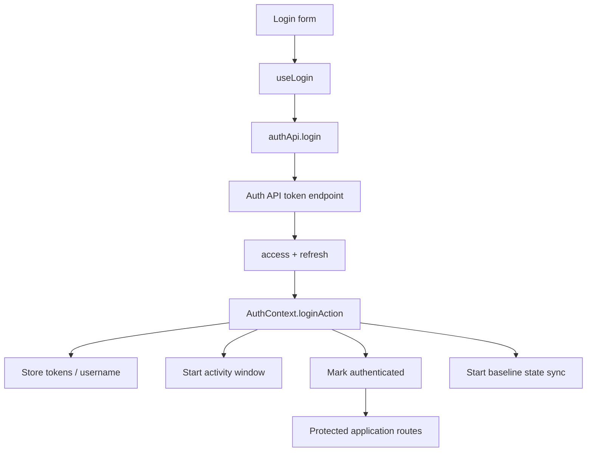
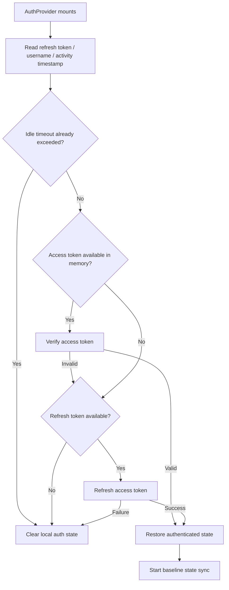
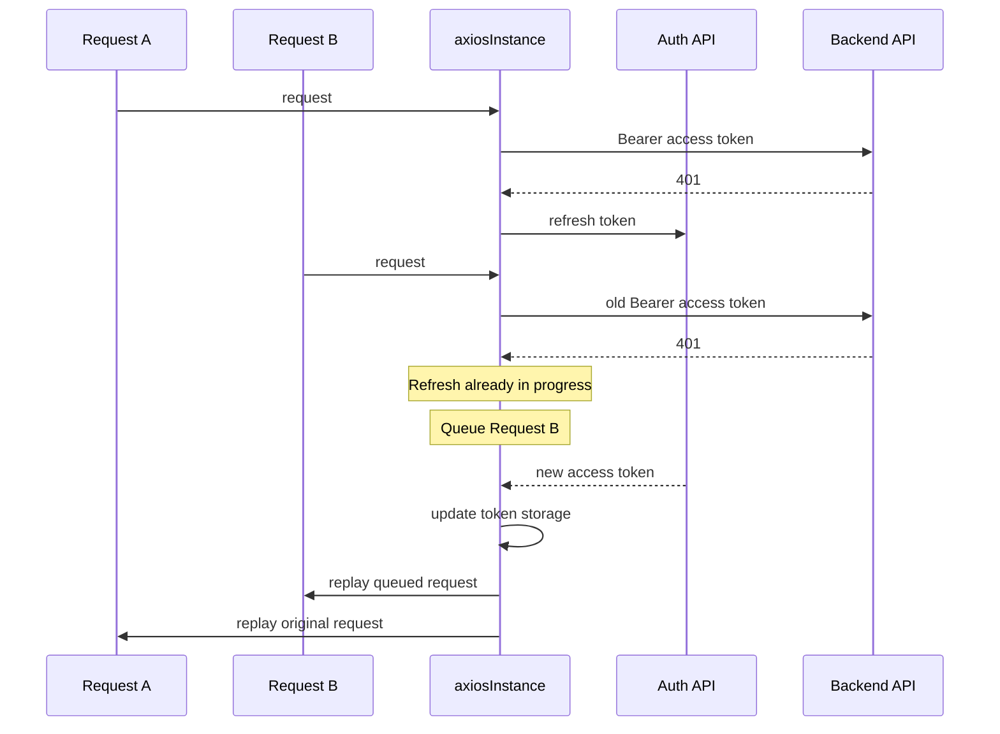
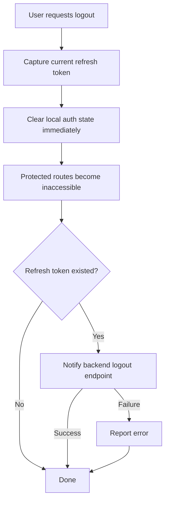

# Authentication Flow

این سند lifecycle مربوط به authentication در SOHO UI را از login تا session restoration، token refresh، idle timeout و logout توضیح می‌دهد.

هدف این است که contractها و orderingهایی حفظ شوند که اگر ماه‌ها بعد authentication code تغییر کند به‌راحتی ممکن است شکسته شوند.

## Scope

مسئولیت‌های authentication بین moduleهای زیر تقسیم شده‌اند:

- `src/pages/LoginPage.tsx` — shell بصری صفحه‌ی login.
- `src/components/LoginForm.tsx` — form state، validation integration، login submission و navigation پس از login.
- `src/hooks/useLogin.ts` — React Query mutation wrapper برای login.
- `src/hooks/useRememberUsername.ts` — فقط username را برای راحتی form به خاطر می‌سپارد.
- `src/lib/authApi.ts` — functionهای API مربوط به login، token refresh، token verification و logout.
- `src/lib/tokenStorage.ts` — policy مربوط به storage access/refresh token و username.
- `src/contexts/AuthContext.tsx` — authoritative React authentication state و lifecycle مربوط به session restoration.
- `src/lib/authEvents.ts` — bridge مربوط به auth event بین transport و React.
- `src/lib/axiosInstance.ts` — Bearer token attachment، 401 recovery، refresh single-flight queue و request replay.
- `src/hooks/useSessionActivityTimeout.ts` — idle-session tracking.
- `src/routes/ProtectedRoute.tsx` — route access gate.
- `src/hooks/useLogout.ts` — user-facing logout mutation و navigation feedback.

## Lifecycle سطح بالا



## Login Flow

`LoginForm` interactive login form را مالک است. پیش از اجرای network mutation، validation از طریق React Hook Form و Zod schema انجام می‌شود.

Submission path:

```text
LoginForm
  -> useLogin
  -> authApi.login
  -> POST token/
  -> { access, refresh }
  -> AuthContext.loginAction(...)
  -> navigate('/dashboard')
```

`useLogin` عمداً session state ندارد و فقط React Query mutation wrapper است. Session فقط زمانی active می‌شود که `loginAction` credentialهای برگشتی را روی `AuthContext` و `tokenStorage` اعمال کند.

## Authentication API Client

`authApi.ts` یک `authClient` اختصاصی برای موارد زیر ایجاد می‌کند:

- login
- access-token refresh
- access-token verification

این client عمداً از `axiosInstance` اصلی جدا است.

این جداسازی یک architectural invariant است: token acquisition و token refresh نباید توسط همان 401-refresh interceptorای process شوند که خودش برای کارکرد به همین endpointها وابسته است. در غیر این صورت refresh request failشده می‌تواند به‌صورت recursive وارد refresh mechanismی شود که قرار است همان failure را resolve کند.

Authentication base URL به ترتیب زیر resolve می‌شود:

1. `VITE_AUTH_API_BASE_URL`، زمانی که صریح configure شده باشد.
2. `VITE_API_BASE_URL` با اضافه‌شدن `/api/auth` در صورت نیاز.
3. Base URL خالی، وقتی هیچ‌کدام configure نشده باشند.

Logout متفاوت است: از `axiosInstance` عادی استفاده می‌کند و `/api/system/ui-user/logout/` را call می‌کند، چون authenticated application endpoint است نه token-issuance endpoint.

## Token Storage Policy

SOHO عمداً lifetime مربوط به access token و refresh token را متفاوت در نظر می‌گیرد.

### Access Token

Access token فقط در memory نگهداری می‌شود.

در `localStorage` یا `sessionStorage` persist نمی‌شود.

Consequenceها:

- full browser reload باعث از دست رفتن access token فعلی می‌شود؛
- در نتیجه session restoration معمولاً از refresh token persistشده برای دریافت access token جدید استفاده می‌کند؛
- نسبت به حالت ذخیره در `localStorage`، access token exposure کمتری در persistent browser storage دارد.

### Refresh Token

Refresh token در `sessionStorage` ذخیره می‌شود.

در reloadهای همان browser tab/session باقی می‌ماند، اما به browser session محدود است و long-term persistence ندارد.

### Username

Authenticated username نیز در `sessionStorage` نگهداری می‌شود تا همراه session قابل restore باشد.

### Legacy Cleanup

`tokenStorage.ts` در initialization، legacy persisted access-token valueها و auth valueهای قدیمی در local storage را حذف می‌کند. بدون security/architecture decision آگاهانه، access-token persistence را دوباره وارد نکنید.

## Semantics مربوط به "Remember me"

Checkbox مربوط به "remember me" در login form **authentication session را طولانی‌تر نمی‌کند**.

`useRememberUsername` فقط username را با key زیر در `localStorage` ذخیره می‌کند:

```text
savedUsername
```

این feature موارد زیر را ذخیره نمی‌کند:

- password؛
- access token؛
- refresh token؛
- authenticated-session flag.

این فقط form convenience است تا در visit بعدی username از قبل پر شود.

## Ordering مربوط به `loginAction`

وقتی login موفق است، `AuthContext.loginAction` به ترتیب این actionها را انجام می‌دهد:

1. reset کردن state-sync session guard.
2. ذخیره‌ی access token جدید.
3. ذخیره‌ی refresh token.
4. authenticated کردن React session.
5. ذخیره‌ی username.
6. ساخت initial activity timestamp.
7. شروع authenticated-session baseline state sync.

Baseline sync، session-scoped است و توسط `StateSyncManager` deduplicate می‌شود.

## Application Startup و Session Restoration

`AuthProvider` نزدیک بالای application tree mount می‌شود و هنگام start شدن frontend، authentication initialization را انجام می‌دهد.

Restoration flow:



چون access token فقط در memory است، full page reload معمولاً به‌جای access-token verification branch از refresh-token branch عبور می‌کند.

Access-token verification branch همچنان زمانی مفید است که access token در lifetime فعلی JavaScript موجود باشد و authentication initialization بخواهد بدون refresh غیرضروری آن را validate کند.

## Authentication Loading State

`isAuthLoading` مانع آن می‌شود که routing خیلی زود user را unauthenticated در نظر بگیرد.

هنگام session restoration، protected-route rendering باید تا زمانی که `AuthProvider` session را restore یا reject نکرده منتظر بماند.

بدون این state، reload ممکن است یک session معتبر را پیش از complete شدن refresh-token restoration برای لحظه‌ای به `/login` redirect کند.

## Recovery مربوط به 401

Application requestهای عادی از `axiosInstance` استفاده می‌کنند.

اگر API request مقدار `401` برگرداند، response interceptor تلاش می‌کند authorization را با refresh token restore کند.



### Single-flight Refresh Rule

در هر لحظه فقط یک refresh request مجاز به اجراست.

Requestهای اضافی که هنگام refresh فعال، `401` دریافت می‌کنند داخل `failedQueue` قرار می‌گیرند.

وقتی refresh موفق می‌شود:

- access token جدید ذخیره می‌شود؛
- default Authorization header به‌روزرسانی می‌شود؛
- `TOKEN_REFRESHED` emit می‌شود؛
- requestهای queueشده با token جدید replay می‌شوند؛
- request اصلی failشده replay می‌شود.

وقتی refresh fail می‌شود:

- requestهای queueشده reject می‌شوند؛
- token storage clear می‌شود؛
- `SESSION_CLEARED` emit می‌شود؛
- `AuthContext` authenticated state را clear می‌کند.

Request flag مربوط به `_retry` از واردشدن یک request منفرد به retry loop بی‌نهایت جلوگیری می‌کند.

## Authentication Event بین Transport و React

Axios layer مستقیماً React context state را mutate نمی‌کند.

در عوض `authEvents.ts` یک `EventTarget` با دو event ارائه می‌دهد:

- `auth:token-refreshed`
- `auth:session-cleared`

`axiosInstance` این eventها را emit می‌کند و `AuthContext` به آن‌ها listen می‌کند.

در نتیجه transport layer مستقل از React باقی می‌ماند، اما session change ناشی از interceptor همچنان می‌تواند UI را update کند.

## Idle Timeout

Authenticated UI از inactivity timeout برابر 30 دقیقه استفاده می‌کند.

Activity timestamp در `sessionStorage` و زیر session activity key ذخیره می‌شود.

User activityهای مرتبط شامل browser interactionهایی مانند موارد زیر هستند:

- click
- keydown
- scroll
- touchstart
- pointerdown
- window focus

Writeها throttle می‌شوند تا `sessionStorage` روی هر high-frequency event update نشود.

### Behavior هنگام Reload

Page reload نباید inactivity timeout را reset کند.

Activity timestamp قبلی حفظ می‌شود. وقتی application دوباره active می‌شود، frontend پیش از درنظرگرفتن return به‌عنوان activity جدید بررسی می‌کند timeout قبلاً رد شده یا خیر.

این یک lifecycle invariant مهم است. آن را با timerای که بعد از هر reload از صفر شروع می‌شود جایگزین نکنید.

## Logout Flow

Logout به‌صورت local-first انجام می‌شود.



`AuthContext.logout` پیش از انتظار برای backend logout request، local session را clear می‌کند.

این ordering intentional است: frontend access باید بلافاصله خاتمه پیدا کند، حتی اگر backend کند، unavailable یا errorدهنده باشد.

`useLogout` همچنان backend logout failure را به user گزارش می‌دهد، ولی navigation به `/login` برمی‌گردد چون local session از قبل تمام شده است.

## وابستگی به StateSync

Authentication lifecycle boundary مربوط به persisted backend snapshotها را تعیین می‌کند.

Login موفق یا restored authenticated session، یک baseline state sync را از طریق `syncAllStateDomainsOnce()` آغاز می‌کند.

Logout یا session clearing، `StateSyncManager` را reset می‌کند تا timerها و session-scoped baseline state وارد authenticated session بعدی نشوند.

برای persistence contract به [`state-sync-save-to-db.md`](./state-sync-save-to-db.md) مراجعه کنید.

## Security Invariantها

هنگام تغییر authentication code، ruleهای زیر را حفظ کنید مگر این‌که architecture/security decision صریحی جایگزین آن‌ها شود:

1. Access tokenها فقط در memory باقی بمانند.
2. Refresh tokenها session-scoped باقی بمانند و به credential بلندمدت در local storage تبدیل نشوند.
3. "Remember me" فقط username را ذخیره کند.
4. Token refresh از auth client ایزوله استفاده کند، نه normal 401-refresh interceptor path.
5. Refresh failشده frontend session را clear کند.
6. Logout پیش از complete شدن backend request، frontend access را revoke کند.
7. Idle timeout از page reload جان سالم به در ببرد.
8. Development auth bypass هرگز در production build فعال نشود.
9. Frontend route guard فقط UX/session control است و جای backend authorization را نمی‌گیرد.

## Failure Scenarioهای رایج

### Reload به‌صورت غیرمنتظره User را به Login می‌فرستد

بررسی کنید:

- refresh token هنوز در `sessionStorage` وجود دارد یا خیر؛
- idle timeout رد شده یا خیر؛
- refresh endpoint موفق است یا خیر؛
- `VITE_AUTH_API_BASE_URL` / `VITE_API_BASE_URL` به auth endpoint مورد انتظار resolve می‌شود یا خیر.

### چند API Call هم‌زمان با 401 Fail می‌شوند

Refresh logic مستقل به هر hook اضافه نکنید. Centralized Axios queue مالک concurrent token recovery است.

موارد زیر را بررسی کنید:

- `isRefreshing`؛
- `failedQueue`؛
- refresh endpoint response؛
- emitted auth eventها.

### Logout Error گزارش می‌کند ولی User از قبل روی Login است

این behavior expected است. Local logout پیش از backend logout notification انجام می‌شود.

### "Remember me" بعد از بسته‌شدن Session، Login را حفظ نمی‌کند

این behavior expected است. این feature فقط username را به خاطر می‌سپارد و authentication credential را persist نمی‌کند.

## راهنمای Extension

هنگام اضافه‌کردن authentication behavior:

- credential transport functionها را در `authApi.ts` نگه دارید؛
- session authority را در `AuthContext` نگه دارید؛
- persistent token policy را در `tokenStorage.ts` نگه دارید؛
- cross-layer interceptor notificationها را در `authEvents.ts` نگه دارید؛
- per-feature token refresh پیاده‌سازی نکنید؛
- session lifetime یا security contract جدید را در همین سند مستند کنید؛
- اگر token-storage یا authentication trust boundary به‌طور اساسی تغییر کرد ADR اضافه کنید.
