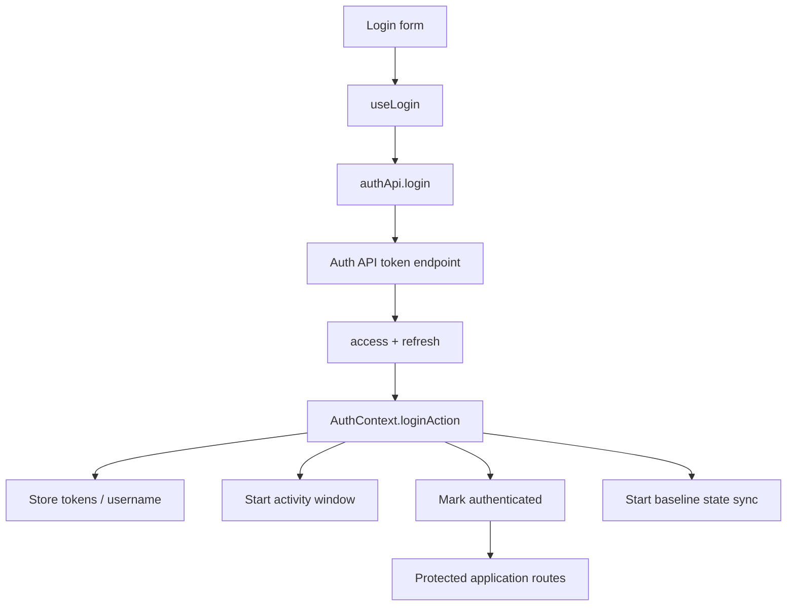
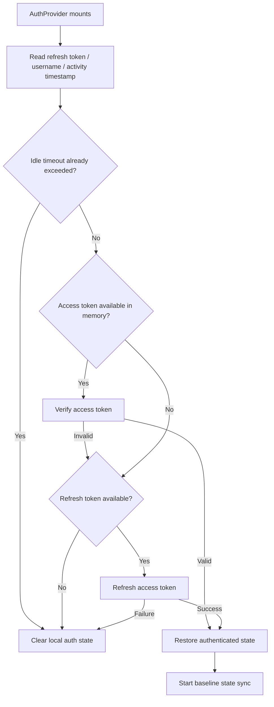
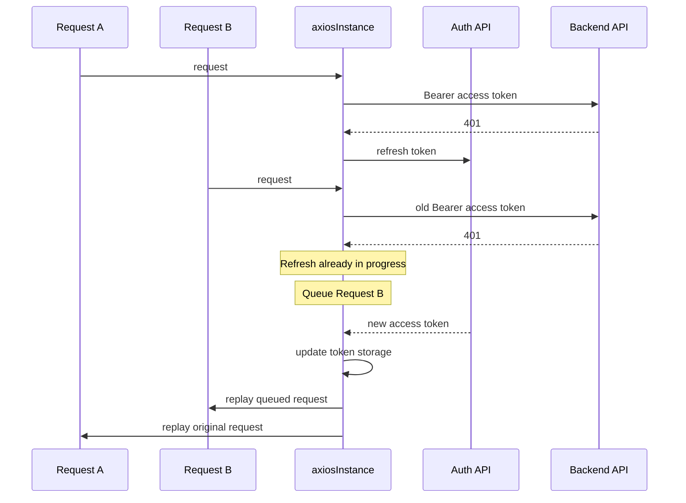
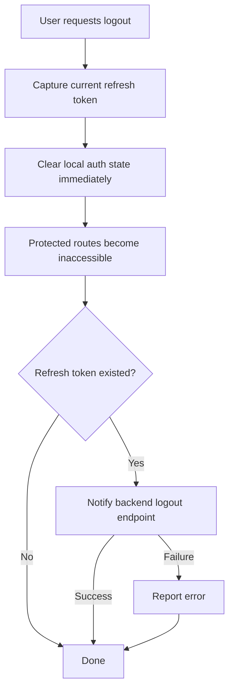

# Authentication Flow

This document describes the SOHO UI authentication lifecycle from login through session restoration, token refresh, idle timeout, and logout.

The goal is to preserve the contracts and ordering that are easy to break when authentication code is changed months later.

## Scope

Authentication responsibilities are split across these modules:

- `src/pages/LoginPage.tsx` — visual login page shell.
- `src/components/LoginForm.tsx` — form state, validation integration, login submission, and post-login navigation.
- `src/hooks/useLogin.ts` — React Query mutation wrapper for login.
- `src/hooks/useRememberUsername.ts` — remembers only the username for form convenience.
- `src/lib/authApi.ts` — login, token refresh, token verification, and logout API functions.
- `src/lib/tokenStorage.ts` — access/refresh token and username storage policy.
- `src/contexts/AuthContext.tsx` — authoritative React authentication state and session restoration lifecycle.
- `src/lib/authEvents.ts` — transport-to-React auth event bridge.
- `src/lib/axiosInstance.ts` — Bearer token attachment, 401 recovery, refresh single-flight queue, and request replay.
- `src/hooks/useSessionActivityTimeout.ts` — idle-session tracking.
- `src/routes/ProtectedRoute.tsx` — route access gate.
- `src/hooks/useLogout.ts` — user-facing logout mutation and navigation feedback.

## High-level lifecycle



## Login flow

`LoginForm` owns the interactive login form. Validation is performed through React Hook Form and the Zod schema before the network mutation is executed.

The submission path is:

```text
LoginForm
  -> useLogin
  -> authApi.login
  -> POST token/
  -> { access, refresh }
  -> AuthContext.loginAction(...)
  -> navigate('/dashboard')
```

`useLogin` intentionally contains no session state. It is only the React Query mutation wrapper. The session becomes active only when `loginAction` applies the returned credentials to `AuthContext` and `tokenStorage`.

## Authentication API client

`authApi.ts` creates a dedicated `authClient` for:

- login
- access-token refresh
- access-token verification

This client is intentionally separate from the main `axiosInstance`.

That separation is an architectural invariant: token acquisition and token refresh must not be processed by the same 401-refresh interceptor that depends on those endpoints. Otherwise a failed refresh request can recursively enter the refresh mechanism it is supposed to resolve.

The authentication base URL is resolved in this order:

1. `VITE_AUTH_API_BASE_URL`, when explicitly configured.
2. `VITE_API_BASE_URL` with `/api/auth` appended when needed.
3. Empty base URL when neither is configured.

Logout is different: it uses the normal `axiosInstance` and calls `/api/system/ui-user/logout/` because it is an authenticated application endpoint rather than a token-issuance endpoint.

## Token storage policy

SOHO deliberately gives access and refresh tokens different storage lifetimes.

### Access token

The access token is memory-only.

It is not persisted in `localStorage` or `sessionStorage`.

Consequences:

- a full browser reload loses the current access token;
- session restoration therefore normally uses the persisted refresh token to obtain a new access token;
- the access token has less exposure to persistent browser storage than if it were stored in `localStorage`.

### Refresh token

The refresh token is stored in `sessionStorage`.

It survives page reloads in the same browser tab/session, but is scoped to the browser session instead of long-term persistent storage.

### Username

The authenticated username is also stored in `sessionStorage` so it can be restored with the session.

### Legacy cleanup

`tokenStorage.ts` removes legacy persisted access-token values and old local-storage auth values during initialization. Do not reintroduce access-token persistence without a deliberate security/architecture decision.

## "Remember me" semantics

The login form's "remember me" checkbox does **not** extend the authentication session.

`useRememberUsername` stores only the username in `localStorage` under `savedUsername`.

It does not store:

- the password;
- the access token;
- the refresh token;
- an authenticated-session flag.

This feature is only a form convenience that pre-fills the username on a later visit.

## `loginAction` ordering

When login succeeds, `AuthContext.loginAction` performs these actions:

1. Reset the state-sync session guard.
2. Store the new access token.
3. Store the refresh token.
4. Mark the React session authenticated.
5. Store the username.
6. Create the initial activity timestamp.
7. Start the authenticated-session baseline state sync.

The baseline sync is session-scoped and deduplicated by `StateSyncManager`.

## Application startup and session restoration

`AuthProvider` is mounted near the top of the application tree and performs authentication initialization once the frontend starts.

The restoration flow is:



Because the access token is memory-only, a normal full page reload usually follows the refresh-token branch rather than the access-token verification branch.

The access-token verification branch is still useful when an access token exists within the current JavaScript lifetime and authentication initialization needs to validate it without performing an unnecessary refresh.

## Authentication loading state

`isAuthLoading` prevents routing from deciding too early that the user is unauthenticated.

During session restoration, protected-route rendering must wait until `AuthProvider` has either restored or rejected the session.

Without this state, a reload could briefly redirect a valid session to `/login` before refresh-token restoration completes.

## 401 recovery

Normal application requests use `axiosInstance`.

If an API request returns `401`, the response interceptor attempts to restore authorization with the refresh token.



### Single-flight refresh rule

Only one refresh request is allowed to run at a time.

Additional requests that receive `401` while refresh is already running are placed in `failedQueue`.

When refresh succeeds:

- the new access token is stored;
- the default Authorization header is updated;
- `TOKEN_REFRESHED` is emitted;
- queued requests are replayed with the new token;
- the original failed request is replayed.

When refresh fails:

- queued requests are rejected;
- token storage is cleared;
- `SESSION_CLEARED` is emitted;
- `AuthContext` clears the authenticated state.

The `_retry` request flag prevents an individual request from entering an infinite retry loop.

## Transport-to-React authentication events

The Axios layer does not directly mutate React context state.

Instead, `authEvents.ts` exposes an `EventTarget` with two events:

- `auth:token-refreshed`
- `auth:session-cleared`

`axiosInstance` emits these events and `AuthContext` listens to them.

This keeps the transport layer independent from React while still allowing interceptor-driven session changes to update the UI.

## Idle timeout

The authenticated UI uses a 30-minute inactivity timeout.

The activity timestamp is stored in `sessionStorage` under the session activity key.

Relevant user activity includes browser interactions such as:

- click
- keydown
- scroll
- touchstart
- pointerdown
- window focus

Writes are throttled to avoid updating `sessionStorage` on every high-frequency event.

### Reload behavior

A page reload must not reset the inactivity timeout.

The previous activity timestamp is preserved. When the application becomes active again, the frontend checks whether the timeout was already exceeded before treating the return as new activity.

This is an important lifecycle invariant. Do not replace it with a timer that starts from zero on each reload.

## Logout flow

Logout is local-first.



`AuthContext.logout` clears the local session before waiting for the backend logout request.

This ordering is intentional: frontend access must end immediately even when the backend is slow, unavailable, or returns an error.

`useLogout` still reports backend logout failure to the user, but navigation returns to `/login` because the local session has already ended.

## State-sync coupling

Authentication establishes the lifecycle boundary for persisted backend snapshots.

A successful login or restored authenticated session starts one baseline state sync through `syncAllStateDomainsOnce()`.

Logout or session clearing resets `StateSyncManager` so timers and session-scoped baseline state do not leak into another authenticated session.

See `../state-sync-save-to-db.md` for the persistence contract.

## Security invariants

When changing authentication code, preserve these rules unless an explicit architecture/security decision replaces them:

1. Access tokens remain memory-only.
2. Refresh tokens remain session-scoped, not long-term local-storage credentials.
3. "Remember me" stores only the username.
4. Token refresh uses the isolated auth client, not the normal 401-refresh interceptor path.
5. Failed refresh clears the frontend session.
6. Logout revokes frontend access before the backend request completes.
7. Idle timeout survives page reloads.
8. Development auth bypass must never activate in production builds.
9. Frontend route guards are UX/session controls, not a substitute for backend authorization.

## Common failure scenarios

### Reload unexpectedly sends the user to login

Check:

- whether the refresh token still exists in `sessionStorage`;
- whether the idle timeout was exceeded;
- whether the refresh endpoint succeeds;
- whether `VITE_AUTH_API_BASE_URL` / `VITE_API_BASE_URL` resolves to the expected auth endpoint.

### Multiple API calls fail with 401 at once

Do not add independent refresh logic to each hook. The centralized Axios queue owns concurrent token recovery.

Inspect:

- `isRefreshing`;
- `failedQueue`;
- refresh endpoint response;
- emitted auth events.

### Logout reports an error but the user is already on login

That is expected. Local logout happens before backend logout notification.

### "Remember me" does not preserve login after closing the session

That is expected. It remembers only the username and does not persist authentication credentials.

## Extension guidance

When adding authentication behavior:

- keep credential transport functions in `authApi.ts`;
- keep session authority in `AuthContext`;
- keep persistent token policy in `tokenStorage.ts`;
- keep cross-layer interceptor notifications in `authEvents.ts`;
- do not implement per-feature token refresh;
- document any new session lifetime or security contract here;
- add an ADR if token-storage or authentication trust boundaries change substantially.
