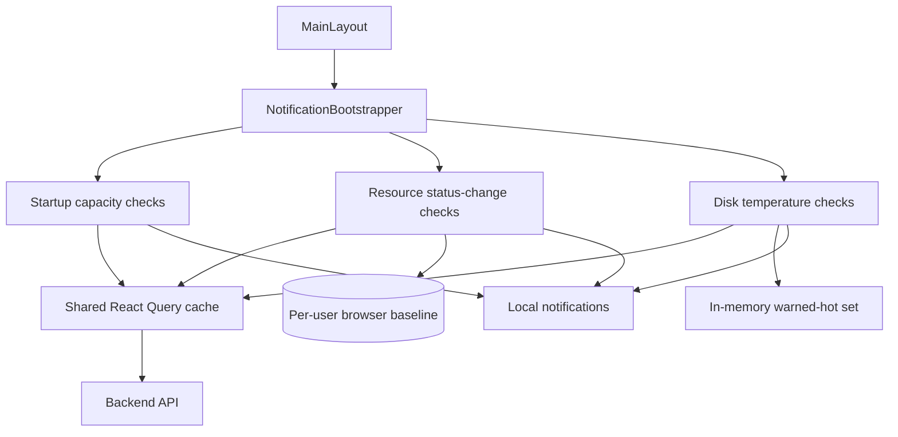
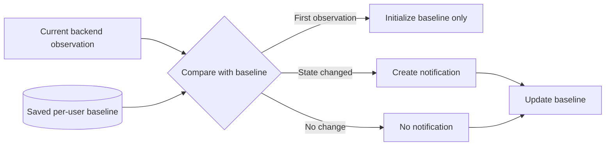
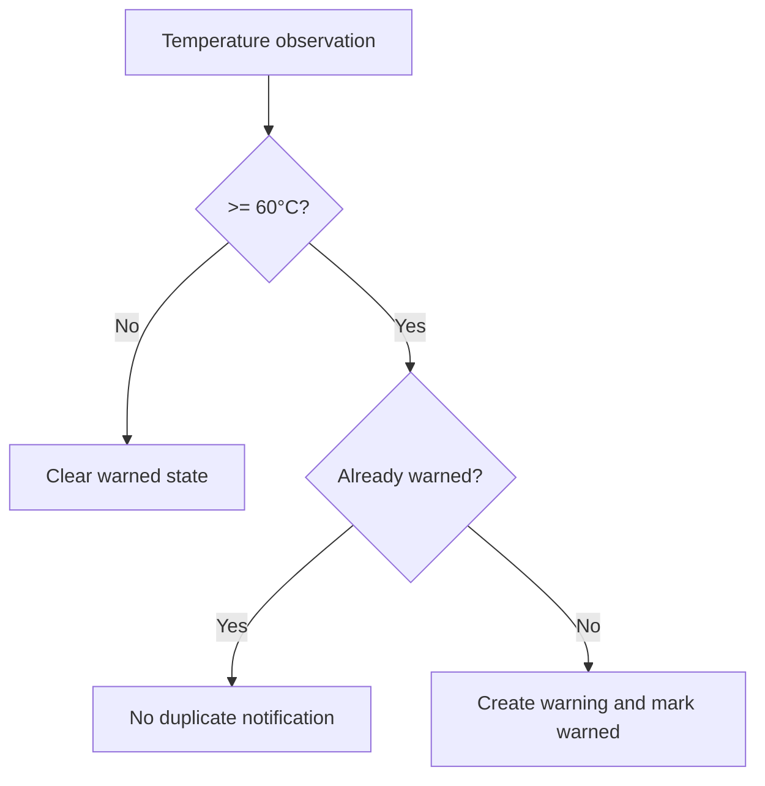

# Notifications

This document describes the frontend notification subsystem, especially how it observes server state without becoming a second polling or persistence system.

## Ownership

`NotificationBootstrapper` mounts notification-monitoring hooks inside the authenticated application layout.

The current bootstrapper composes three responsibilities:

- startup capacity checks;
- resource status-change notifications;
- disk temperature notifications.

Notifications consume backend state through existing hooks and React Query. They do not own backend database snapshot persistence.

## Runtime model

## Important separation

Notification state can include browser-local bookkeeping such as:

- previous observed resource state;
- notification history;
- per-user baseline data;
- whether a hot disk has already produced a warning.

This data is **not authoritative managed-system state**.

The backend remains the source of truth for pools, disks, filesystems, services, shares, users, and configuration.

Do not use notification local storage as an application cache or persistence source.

## Startup capacity checks

`useStartupNotificationChecks` performs capacity-oriented checks after the notification bootstrapper obtains usable data.

The current checks include high-utilization conditions for resources such as:

- zpools;
- filesystems;
- volumes.

The current warning threshold is 80% where the hook applies percentage-based capacity checks.

### One-shot behavior

A ref tracks whether startup checks have already been performed for the current bootstrapper lifecycle/user context.

The hook should not create repeated identical startup notifications every time the same query data re-renders.

### Query reuse

Startup checks subscribe to normal resource hooks. For zpool data, the notification code uses the shared zpool query and current zpool refresh policy.

React Query is expected to coalesce consumers of the same query key. Do not create a separate notification-specific fetch loop when the same resource can be observed through the shared cache.

## Resource status-change notifications

`useResourceStatusChangeNotifications` detects transitions rather than merely reporting the current state on every render.

Conceptually:

### First observation

The first valid observation establishes the baseline. It should not be treated as a change event simply because the frontend did not previously know the state.

### Per-user baseline

The baseline is scoped to the current notification user key so one user's observation history does not become another user's comparison baseline.

### Stable disk identity

Disk comparison cannot safely rely only on a display name. A slot/device may later contain a physically different disk.

The hook uses available identity fields such as serial/WWN/path identifiers to decide whether the currently observed device is the same physical resource. If identity changes, the saved baseline is replaced rather than interpreting the replacement as an ordinary status transition on the old disk.

This is a maintenance-critical behavior. Do not simplify identity matching to only a UI label without understanding replacement scenarios.

### No dedicated zpool polling loop

The resource-status observer can subscribe to zpool data with its own interval disabled. It reacts to updates in the shared cache rather than owning a second periodic request for the same resource.

This avoids duplicate background work.

## Disk temperature notifications

`useDiskTemperatureNotifications` monitors normalized disk temperature data.

The current high-temperature threshold is 60°C.

### Duplicate suppression

A disk that remains above the threshold should not generate a new warning on every refresh interval.

The hook remembers which disks have already produced a hot warning.

If the disk cools below the threshold, the warned marker is cleared. A later new over-temperature event can therefore produce a new warning.

If a disk disappears from the observed set, stale warning state for that disk should not remain indefinitely.

## Notification data and polling

Notification hooks should follow this priority:

1. reuse a shared query already providing the resource;
2. explicitly disable an observer's own polling if it only needs cache updates;
3. add notification-specific polling only when the required signal is otherwise unavailable and the operational need justifies it.

See [`polling-and-data-refresh.md`](./polling-and-data-refresh.md) for the canonical polling inventory.

## Notification data and `save_to_db`

Notification reads are observational reads.

They must not persist backend snapshots and must never set `save_to_db=true`.

Normal requests are forced to `save_to_db=false` by the Axios transport policy. StateSync remains the only frontend persistence owner.

## Relationship to mutations

After a successful mutation, active React Query data can be invalidated/refetched. Notification observers that consume the same query keys may then see the new state.

This is desirable: notifications should react to the same canonical UI server-state stream rather than maintaining separate copies.

A failed mutation should not be treated as a successful resource state change merely because an optimistic UI action occurred unless a feature explicitly implements and documents optimistic updates.

## Local notification storage

Browser storage used by notification hooks is appropriate for small client-local concerns such as:

- notification history;
- read/unread markers;
- previous observation baselines.

It is not appropriate for:

- authoritative disk inventory;
- current pool capacity source of truth;
- user/account authorization;
- backend settings;
- persistence snapshots.

When browser storage is unavailable or cleared, notification bookkeeping may reset. The managed system itself must remain unaffected.

## User isolation

Any persisted notification baseline or history that depends on an authenticated user should include user scoping.

When changing the notification storage format:

- preserve per-user separation;
- consider migration/cleanup of old storage keys;
- do not leak one user's administrative observations into another user's session.

## Adding a notification rule

Before implementing a new rule, answer these questions:

1. What authoritative backend data drives the rule?
2. Is that data already available through a shared query key?
3. Is the rule based on current state or a transition between states?
4. Does it need a baseline?
5. What is the stable identity of the observed resource?
6. How are duplicate notifications suppressed?
7. When should duplicate suppression reset?
8. Should the state survive reloads?
9. Must stored notification state be scoped per user?
10. Does the rule need new polling, or can it observe existing cache updates?

## Current notification rule types

### Capacity threshold

Use when a resource is considered noteworthy above a defined utilization percentage.

Required safeguards:

- normalize capacity values before comparison;
- avoid repeated startup duplicates;
- ensure a query failure is not interpreted as zero/full capacity.

### Status transition

Use when a resource changes from one operational state to another.

Required safeguards:

- establish baseline first;
- compare stable resource identity;
- only notify on actual transitions;
- update baseline after processing.

### Temperature threshold

Use for over-temperature events.

Required safeguards:

- threshold is explicit;
- duplicate warnings are suppressed while continuously hot;
- suppression resets after recovery;
- removed resources clean up warning state.

## Debugging missing notifications

1. Confirm `NotificationBootstrapper` is mounted in the authenticated layout.
2. Confirm the user key is what you expect.
3. Confirm the underlying React Query data is loading successfully.
4. If transition-based, inspect the saved baseline.
5. Confirm this is not intentionally the first observation.
6. Confirm the resource identity did not change and reset the baseline.
7. For temperature alerts, confirm the threshold and normalized temperature value.
8. Confirm duplicate suppression is not intentionally active.
9. Confirm notification storage is available.

## Debugging duplicate notifications

1. Determine whether multiple bootstrapper instances are mounted.
2. Check whether a notification hook created its own polling loop in addition to a shared resource query.
3. Verify duplicate-suppression state survives the expected lifecycle.
4. Verify baseline keys are stable and user-scoped.
5. Check whether unstable resource identifiers make one device appear as many different resources.
6. Check whether mount/unmount cycles repeatedly reset one-shot refs.

## Maintenance invariants

Preserve these rules:

- notification hooks observe authoritative backend state through shared data hooks;
- notifications do not own `save_to_db` persistence;
- local notification storage is bookkeeping, not application source of truth;
- first observations establish baselines rather than fabricating change events;
- stable hardware/resource identity matters for transition detection;
- repeated hot/status observations should not spam duplicate notifications;
- notification observers should avoid redundant polling whenever shared cache data is sufficient;
- user-specific notification state remains isolated by user key.

## Related files

- `src/components/notifications/NotificationBootstrapper.tsx`
- `src/hooks/useStartupNotificationChecks.ts`
- `src/hooks/useResourceStatusChangeNotifications.ts`
- `src/hooks/useDiskTemperatureNotifications.ts`
- `src/hooks/useLocalNotifications.ts`
- `src/hooks/useZpool.ts`
- `src/lib/axiosInstance.ts`

## Related documentation

- [`server-state-and-cache.md`](./server-state-and-cache.md)
- [`polling-and-data-refresh.md`](./polling-and-data-refresh.md)
- [`state-sync-save-to-db.md`](./state-sync-save-to-db.md)
