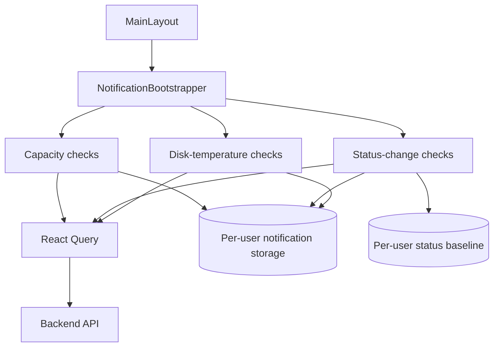
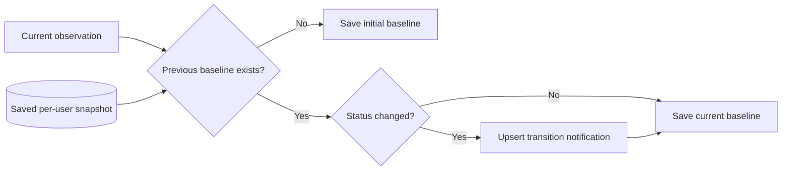

# Notifications

This document describes the frontend notification subsystem as implemented today.

Notifications observe backend state through React Query and store notification bookkeeping in browser storage. They **do not** own backend database snapshot persistence.

## Bootstrap ownership

`NotificationBootstrapper` is mounted from the authenticated application layout and starts three monitoring flows:

- capacity notifications via `useStartupNotificationChecks`;
- pool/disk/service status-transition notifications via `useResourceStatusChangeNotifications`;
- disk-temperature notifications via `useDiskTemperatureNotifications`.



## Notification storage is bookkeeping, not system state

The notification subsystem stores browser-local information such as:

- notification history;
- read/unread timestamps;
- expiration timestamps;
- prior resource-status snapshots;
- last capacity-check timestamps.

This information is not authoritative state for pools, disks, filesystems, services, users, shares, or system configuration.

The backend remains the source of truth for managed-system state.

## Local notification lifecycle

`src/utils/notificationStorage.ts` stores notifications under a per-user key:

```text
soho:notifications:<userKey>
```

The default notification TTL is 10 days.

`upsertNotification` deduplicates by `fingerprint`:

- if no matching fingerprint exists, a new notification is created;
- if one exists, the existing notification is updated instead of adding another row;
- its `updatedAt` and expiration time are refreshed;
- escalation from warning to critical clears `readAt` so the stronger state becomes unread again.

This fingerprint behavior is a major part of duplicate suppression throughout the subsystem.

## Capacity checks

`useStartupNotificationChecks` monitors capacity for:

- zpools;
- filesystems.

It does not currently check volumes.

### Thresholds

The canonical thresholds are defined in `notificationCapacityRules.ts`:

| Capacity | Severity |
| ---: | --- |
| below 75% | no capacity notification |
| 75% to below 90% | warning |
| 90% and above | critical |

Do not duplicate these numbers in feature code. Use the exported constants/rules.

### Polling cadence

Capacity monitoring creates two dedicated React Query entries:

- `['notifications', 'capacity', 'zpool']`
- `['notifications', 'capacity', 'filesystems']`

Both execute every 60 seconds while the bootstrapper is mounted, with background polling disabled.

These are **separate cache entries** from normal page-level zpool/filesystem queries even though they reuse `fetchZpools` and `fetchFileSystems`.

This is current behavior and means capacity monitoring can produce an independent request cadence. Do not describe these queries as shared page-query consumers unless the implementation is later changed to use shared keys.

### Check throttling

The hook stores the last completed capacity-check timestamp per user:

```text
soho:notifications:last-capacity-check:<userKey>
```

Even when fresh query data arrives, the notification rule itself will not be processed more often than the configured 60-second capacity-check interval.

`processedCompleteFetchAtRef` also prevents processing the same completed pair of zpool/filesystem query results twice during one mounted lifecycle.

### Capacity notification fingerprints

Pool capacity notifications use a fingerprint based on the pool name.

Filesystem capacity notifications use a fingerprint based on the pool/filesystem identity.

Because storage uses upsert semantics, an ongoing capacity condition updates an existing notification instead of creating an unbounded stream of duplicates.

## Resource status-change notifications

`useResourceStatusChangeNotifications` observes three resource families:

- pools via `useZpool()`;
- disks via `useDisk()`;
- services via `useServices()`.

### Current refresh behavior

This observer does not disable the underlying resource hooks' polling.

Current behavior is therefore determined by those hooks:

- zpool uses its default 30-second interval;
- services use their current 5-second interval;
- `useDisk()` has no interval unless one is supplied by its caller.

Where multiple consumers use the same query key, React Query can share the query/cache. However, notification-specific capacity queries use different keys and are independent.

### First observation establishes the baseline

Status-change notification logic compares current normalized state with a previously saved per-user snapshot.



The first observation is not a status transition. It initializes the comparison baseline.

### Resource identity

Pool identity uses the normalized pool name.

Service identity uses the service unit name.

Disk identity currently prefers:

1. `details.wwn`;
2. `details.wwid`;
3. the resolved disk display/device name as fallback.

This identity is used to match the current disk against the previous snapshot.

If disk identity semantics change in the backend, review this logic before modifying labels or snapshot formats.

### Unavailable resource families

When one resource family cannot be observed successfully during a check, previous baseline entries for that unavailable family are retained instead of being silently deleted.

This prevents a temporary query failure from looking like all resources of that type disappeared.

### Transition fingerprints

Status transition fingerprints include:

- resource type;
- resource ID;
- previous status;
- current status.

As a result, the same transition fingerprint is updated rather than duplicated, while a different transition can produce a distinct notification.

## Disk-temperature notifications

`useDiskTemperatureNotifications` observes `useDiskInventory` every 30 seconds while mounted.

Background polling is disabled by `useDiskInventory`.

### Temperature thresholds

The rules are defined in `notificationTemperatureRules.ts`:

| Temperature | Behavior |
| ---: | --- |
| below 60°C | no temperature notification |
| 60°C to below 70°C | warning |
| 70°C and above | critical |

### Stable fingerprint

Temperature rule identity prefers:

1. `wwn`;
2. `wwid`;
3. `uuid`;
4. disk name.

The generated fingerprint is:

```text
disk-temperature:<entityId>
```

A disk that remains hot therefore updates the same stored notification rather than generating a new notification every 30 seconds.

If severity escalates from warning to critical, `upsertNotification` marks that notification unread again.

### Signature guard

The hook also calculates a signature from disk name, WWN, WWID, and temperature. The same successful inventory result is not processed twice during the same mounted lifecycle.

This guard prevents duplicate rule execution caused by React re-renders; fingerprint upsert remains the durable duplicate-control mechanism in storage.

## Polling summary for notifications

| Monitor | Data source | Interval |
| --- | --- | ---: |
| Capacity: zpool | dedicated notification query using `fetchZpools` | 60 s |
| Capacity: filesystems | dedicated notification query using `fetchFileSystems` | 60 s |
| Status: pools | `useZpool()` / `['zpool']` | 30 s default |
| Status: disks | `useDisk()` / `['disk']` | no interval by this caller |
| Status: services | `useServices()` / `['services']` | 5 s |
| Temperature | `useDiskInventory()` / `['disk','inventory']` | 30 s |

See [`polling-and-data-refresh.md`](./polling-and-data-refresh.md) for the application-wide inventory.

## Notification reads never persist backend snapshots

All notification data reads are observational.

They must not set `save_to_db=true`.

The Axios transport policy forces normal API traffic to `save_to_db=false`; only `StateSyncManager` owns canonical persistence snapshots.

## Relationship to successful mutations

A successful mutation can invalidate active React Query state. Notification observers sharing those query keys may then receive fresh data before their next scheduled interval.

Notification-specific capacity queries use dedicated keys, so they are not automatically the same cache entry as page-level queries.

Do not assume that all notification monitors receive every feature invalidation unless their exact query key is covered by that invalidation/global active refetch behavior.

## User isolation

Notification history, capacity-check timestamps, and resource-status snapshots are user-scoped where the current storage helpers accept `userKey`.

When changing storage keys or formats:

- preserve user separation;
- migrate or safely discard obsolete formats;
- never expose one user's administrative notification history in another user's session.

## Adding a new notification rule

Before implementing a new rule, answer:

1. What authoritative backend state drives it?
2. Is an existing query key sufficient, or is a dedicated query intentionally required?
3. What refresh cadence is operationally justified?
4. Is the rule about current state or a state transition?
5. What stable entity identity should be used?
6. What fingerprint prevents duplicate notifications?
7. Does severity escalation need to reset read state?
8. Does the rule require a persisted baseline?
9. Must browser bookkeeping be scoped per user?
10. How does the rule behave when a resource query fails temporarily?

Do not add polling and then separately add a second timer in the notification rule itself unless both layers are explicitly necessary.

## Debugging missing notifications

1. Confirm `NotificationBootstrapper` is mounted under the authenticated layout.
2. Confirm the expected data query is successful.
3. Check the exact query key and polling cadence for that monitor.
4. For capacity alerts, inspect the per-user last-check timestamp.
5. For status changes, inspect the saved prior snapshot and current normalized status.
6. Confirm this is not intentionally the first baseline observation.
7. Verify entity identity is stable.
8. For temperature, verify 60°C/70°C thresholds and normalized inventory temperature.
9. Inspect the generated fingerprint and any existing notification with that fingerprint.

## Debugging duplicate notifications or requests

Separate two questions:

### Duplicate notifications

Inspect fingerprints, status baselines, and signature guards.

### Duplicate network requests

Inspect React Query keys. Capacity monitoring intentionally uses notification-specific keys, while status monitors may share ordinary resource keys.

A request visible twice with different query keys is not React Query deduplication failure; it represents two independent query entries.

## Maintenance invariants

Preserve these rules:

- notifications never own backend snapshot persistence;
- browser notification storage is bookkeeping, not managed-system source of truth;
- thresholds come from centralized rule modules;
- first status observations establish a baseline rather than fabricating a transition;
- resource identity and fingerprints must remain stable enough for deduplication;
- temporary unavailable resource families must not erase valid prior baselines accidentally;
- capacity checks currently use dedicated 60-second notification queries;
- temperature checks currently use a 30-second disk-inventory query;
- notification documentation must describe actual query keys/cadences, not an assumed ideal sharing model.

## Related files

- `src/components/notifications/NotificationBootstrapper.tsx`
- `src/hooks/useStartupNotificationChecks.ts`
- `src/hooks/useResourceStatusChangeNotifications.ts`
- `src/hooks/useDiskTemperatureNotifications.ts`
- `src/hooks/useDiskInventory.ts`
- `src/utils/notificationStorage.ts`
- `src/utils/notificationCapacityRules.ts`
- `src/utils/notificationStatusRules.ts`
- `src/utils/notificationTemperatureRules.ts`

## Related documentation

- [`server-state-and-cache.md`](./server-state-and-cache.md)
- [`polling-and-data-refresh.md`](./polling-and-data-refresh.md)
- [`state-sync-save-to-db.md`](./state-sync-save-to-db.md)
