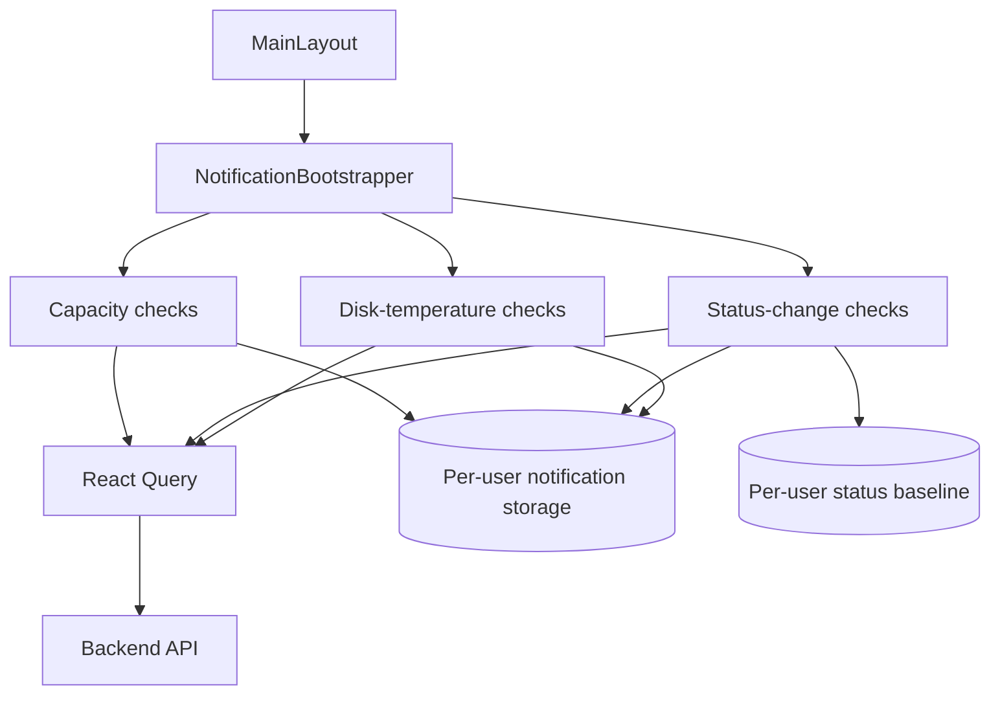
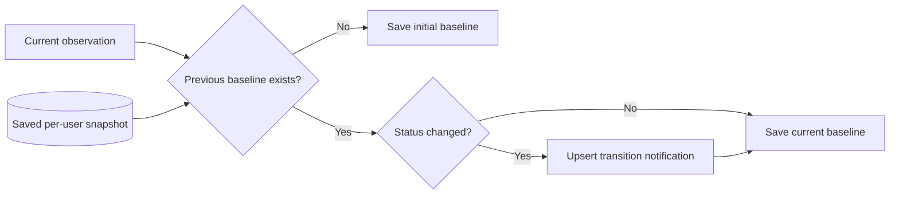

# Notificationها

این سند notification subsystem در frontend را مطابق implementation فعلی توضیح می‌دهد.

Notificationها backend state را از طریق React Query observe می‌کنند و notification bookkeeping را در browser storage نگه می‌دارند. آن‌ها **مالک backend database snapshot persistence نیستند**.

## Bootstrap Ownership

`NotificationBootstrapper` از authenticated application layout mount می‌شود و سه monitoring flow را شروع می‌کند:

- capacity notificationها از طریق `useStartupNotificationChecks`؛
- pool/disk/service status-transition notificationها از طریق `useResourceStatusChangeNotifications`؛
- disk-temperature notificationها از طریق `useDiskTemperatureNotifications`.



## Notification Storage فقط Bookkeeping است، نه System State

Notification subsystem اطلاعات browser-local مانند موارد زیر را ذخیره می‌کند:

- notification history؛
- read/unread timestamp؛
- expiration timestamp؛
- prior resource-status snapshot؛
- last capacity-check timestamp.

این اطلاعات authoritative state برای pool، disk، filesystem، service، user، share یا system configuration نیستند.

Backend همچنان source of truth برای managed-system state است.

## Local Notification Lifecycle

`src/utils/notificationStorage.ts`، notificationها را زیر per-user key زیر ذخیره می‌کند:

```text
soho:notifications:<userKey>
```

Default notification TTL برابر 10 روز است.

`upsertNotification` بر اساس `fingerprint` deduplicate می‌کند:

- اگر fingerprint مشابه وجود نداشته باشد، notification جدید ساخته می‌شود؛
- اگر وجود داشته باشد، notification موجود update می‌شود و row جدید ساخته نمی‌شود؛
- `updatedAt` و expiration time refresh می‌شوند؛
- escalation از warning به critical مقدار `readAt` را clear می‌کند تا severity قوی‌تر دوباره unread شود.

این fingerprint behavior بخش اصلی duplicate suppression در subsystem است.

## Capacity Checkها

`useStartupNotificationChecks` capacity را برای موارد زیر monitor می‌کند:

- zpoolها؛
- filesystemها.

در حال حاضر volumeها را check نمی‌کند.

### Thresholdها

Canonical thresholdها در `notificationCapacityRules.ts` تعریف شده‌اند:

| Capacity | Severity |
| ---: | --- |
| کمتر از 75% | بدون capacity notification |
| 75% تا کمتر از 90% | warning |
| 90% و بالاتر | critical |

این numberها را در feature code duplicate نکنید؛ از exported constant/ruleها استفاده کنید.

### Polling Cadence

Capacity monitoring دو React Query entry اختصاصی ایجاد می‌کند:

- `['notifications', 'capacity', 'zpool']`
- `['notifications', 'capacity', 'filesystems']`

هر دو تا زمانی که bootstrapper mount است هر 60 ثانیه اجرا می‌شوند و background polling غیرفعال است.

این‌ها با وجود reuse کردن `fetchZpools` و `fetchFileSystems`، **cache entryهای جدا** از ordinary page-level zpool/filesystem query هستند.

این behavior فعلی است و یعنی capacity monitoring می‌تواند cadence مستقل request داشته باشد. تا زمانی که implementation به shared key تغییر نکرده، این queryها را shared page-query consumer توصیف نکنید.

### Check Throttling

Hook، timestamp مربوط به آخرین capacity check کامل‌شده را برای هر user زیر key زیر ذخیره می‌کند:

```text
soho:notifications:last-capacity-check:<userKey>
```

حتی اگر query data تازه برسد، notification rule با فرکانسی بیشتر از configured capacity-check interval یعنی 60 ثانیه process نمی‌شود.

`processedCompleteFetchAtRef` نیز مانع process شدن دوباره‌ی همان pair کامل‌شده از zpool/filesystem query result در یک mounted lifecycle می‌شود.

### Capacity Notification Fingerprint

Pool capacity notification از fingerprint مبتنی بر pool name استفاده می‌کند.

Filesystem capacity notification از fingerprint مبتنی بر identity مربوط به pool/filesystem استفاده می‌کند.

چون storage از upsert semantics استفاده می‌کند، condition مداوم capacity همان notification موجود را update می‌کند و stream نامحدود duplicate ایجاد نمی‌شود.

## Resource Status-change Notificationها

`useResourceStatusChangeNotifications` سه resource family را observe می‌کند:

- poolها از طریق `useZpool()`؛
- diskها از طریق `useDisk()`؛
- serviceها از طریق `useServices()`.

### Refresh Behavior فعلی

این observer، polling مربوط به underlying resource hookها را disable نمی‌کند.

در نتیجه behavior فعلی از همان hookها تعیین می‌شود:

- zpool از default interval برابر 30 ثانیه استفاده می‌کند؛
- serviceها interval فعلی 5 ثانیه دارند؛
- `useDisk()` تا زمانی که caller interval ارسال نکرده باشد interval ندارد.

هرجا چند consumer query key یکسان استفاده کنند React Query می‌تواند query/cache را share کند. با این حال notification-specific capacity queryها key متفاوت دارند و مستقل‌اند.

### First Observation، Baseline را می‌سازد

Status-change notification logic، current normalized state را با per-user snapshot قبلی مقایسه می‌کند.



First observation یک status transition نیست و فقط comparison baseline اولیه را initialize می‌کند.

### Resource Identity

Pool identity از normalized pool name استفاده می‌کند.

Service identity از service unit name استفاده می‌کند.

Disk identity در حال حاضر به ترتیب زیر ترجیح می‌دهد:

1. `details.wwn`؛
2. `details.wwid`؛
3. resolved disk display/device name به‌عنوان fallback.

این identity برای match کردن current disk با previous snapshot استفاده می‌شود.

اگر disk identity semantics در backend تغییر کرد، پیش از تغییر labelها یا snapshot formatها این logic را review کنید.

### Resource Familyهای Unavailable

اگر یک resource family هنگام check قابل observe نباشد، previous baseline entryهای همان unavailable family به‌جای حذف‌شدن حفظ می‌شوند.

این کار مانع آن می‌شود که temporary query failure شبیه ناپدیدشدن همه‌ی resourceهای آن type دیده شود.

### Transition Fingerprintها

Status transition fingerprint شامل موارد زیر است:

- resource type؛
- resource ID؛
- previous status؛
- current status.

در نتیجه transition یکسان به‌جای duplicate شدن update می‌شود و transition متفاوت می‌تواند notification مستقل ایجاد کند.

## Disk-temperature Notificationها

`useDiskTemperatureNotifications` تا زمانی که mounted است هر 30 ثانیه `useDiskInventory` را observe می‌کند.

Background polling توسط `useDiskInventory` غیرفعال است.

### Temperature Thresholdها

Ruleها در `notificationTemperatureRules.ts` تعریف شده‌اند:

| Temperature | Behavior |
| ---: | --- |
| کمتر از 60°C | بدون temperature notification |
| 60°C تا کمتر از 70°C | warning |
| 70°C و بالاتر | critical |

### Stable Fingerprint

Temperature rule identity به ترتیب زیر ترجیح می‌دهد:

1. `wwn`؛
2. `wwid`؛
3. `uuid`؛
4. disk name.

Fingerprint تولیدشده:

```text
disk-temperature:<entityId>
```

در نتیجه diskای که همچنان داغ است هر 30 ثانیه notification جدید نمی‌سازد و همان stored notification را update می‌کند.

اگر severity از warning به critical escalate کند، `upsertNotification` همان notification را دوباره unread می‌کند.

### Signature Guard

Hook همچنین signatureای از disk name، WWN، WWID و temperature می‌سازد. یک successful inventory result یکسان در همان mounted lifecycle دوبار process نمی‌شود.

این guard از duplicate rule execution ناشی از React re-render جلوگیری می‌کند؛ fingerprint upsert همچنان durable duplicate-control mechanism در storage است.

## خلاصه‌ی Polling مربوط به Notificationها

| Monitor | Data Source | Interval |
| --- | --- | ---: |
| Capacity: zpool | dedicated notification query با `fetchZpools` | 60 s |
| Capacity: filesystems | dedicated notification query با `fetchFileSystems` | 60 s |
| Status: pools | `useZpool()` / `['zpool']` | 30 s default |
| Status: disks | `useDisk()` / `['disk']` | بدون interval از طرف این caller |
| Status: services | `useServices()` / `['services']` | 5 s |
| Temperature | `useDiskInventory()` / `['disk','inventory']` | 30 s |

برای inventory سراسری application به [`polling-and-data-refresh.md`](./polling-and-data-refresh.md) مراجعه کنید.

## Notification Readها هیچ‌گاه Backend Snapshot را Persist نمی‌کنند

تمام notification data readها observational هستند.

نباید `save_to_db=true` تنظیم کنند.

Axios transport policy normal API traffic را به `save_to_db=false` force می‌کند؛ فقط `StateSyncManager` canonical persistence snapshot را مالک است.

## ارتباط با Mutation موفق

Mutation موفق می‌تواند active React Query state را invalidate کند. Notification observerهایی که همان query key را share می‌کنند ممکن است پیش از interval بعدی data تازه دریافت کنند.

Notification-specific capacity queryها dedicated key دارند، بنابراین الزاماً همان cache entry مربوط به page-level query نیستند.

فرض نکنید همه‌ی notification monitorها هر feature invalidation را دریافت می‌کنند، مگر exact query key آن‌ها توسط invalidation/global active refetch behavior پوشش داده شود.

## User Isolation

Notification history، capacity-check timestamp و resource-status snapshot در محل‌هایی که helper فعلی `userKey` می‌پذیرد user-scoped هستند.

هنگام تغییر storage key یا format:

- user separation را حفظ کنید؛
- obsolete format را migrate یا به‌شکل ایمن discard کنید؛
- notification history مدیریتی یک user را در session user دیگر expose نکنید.

## اضافه‌کردن Notification Rule جدید

پیش از implementation پاسخ دهید:

1. کدام authoritative backend state آن را drive می‌کند؟
2. Existing query key کافی است یا dedicated query عمداً لازم است؟
3. چه refresh cadence از نظر operational توجیه دارد؟
4. Rule درباره‌ی current state است یا state transition؟
5. چه stable entity identity باید استفاده شود؟
6. چه fingerprintی جلوی duplicate notification را می‌گیرد؟
7. آیا severity escalation باید read state را reset کند؟
8. آیا rule به persisted baseline نیاز دارد؟
9. Browser bookkeeping باید per-user scope داشته باشد؟
10. هنگام temporary resource query failure چه behaviorی دارد؟

Polling اضافه نکنید و بعد بدون نیاز صریح timer دوم مستقلی داخل notification rule نسازید.

## Debug کردن Missing Notification

1. تأیید کنید `NotificationBootstrapper` زیر authenticated layout mount است.
2. تأیید کنید expected data query موفق است.
3. Exact query key و polling cadence مربوط به monitor را بررسی کنید.
4. برای capacity alert، per-user last-check timestamp را بررسی کنید.
5. برای status change، saved prior snapshot و current normalized status را بررسی کنید.
6. مطمئن شوید این مورد intentionally first baseline observation نیست.
7. Stable بودن entity identity را verify کنید.
8. برای temperature، thresholdهای 60°C/70°C و normalized inventory temperature را بررسی کنید.
9. Generated fingerprint و notification موجود با همان fingerprint را بررسی کنید.

## Debug کردن Duplicate Notification یا Request

دو سؤال را جدا کنید:

### Duplicate Notification

Fingerprint، status baseline و signature guard را بررسی کنید.

### Duplicate Network Request

React Query keyها را بررسی کنید. Capacity monitoring عمداً notification-specific key دارد، در حالی که status monitorها ممکن است ordinary resource key را share کنند.

Request مشابه با query key متفاوت، failure در React Query deduplication نیست؛ دو query entry مستقل است.

## Maintenance Invariantها

این ruleها را حفظ کنید:

- notificationها هرگز backend snapshot persistence را مالک نیستند؛
- browser notification storage فقط bookkeeping است، نه managed-system source of truth؛
- thresholdها از centralized rule module می‌آیند؛
- first status observation baseline می‌سازد و transition جعلی ایجاد نمی‌کند؛
- resource identity و fingerprint باید برای deduplication به‌اندازه‌ی کافی stable بمانند؛
- temporary unavailable resource family نباید valid prior baseline را تصادفی پاک کند؛
- capacity checkها در حال حاضر dedicated notification query با 60 ثانیه هستند؛
- temperature checkها در حال حاضر از disk-inventory query با 30 ثانیه استفاده می‌کنند؛
- notification documentation باید actual query key/cadence را توصیف کند، نه ideal sharing model فرضی.

## فایل‌های مرتبط

- `src/components/notifications/NotificationBootstrapper.tsx`
- `src/hooks/useStartupNotificationChecks.ts`
- `src/hooks/useResourceStatusChangeNotifications.ts`
- `src/hooks/useDiskTemperatureNotifications.ts`
- `src/hooks/useDiskInventory.ts`
- `src/utils/notificationStorage.ts`
- `src/utils/notificationCapacityRules.ts`
- `src/utils/notificationStatusRules.ts`
- `src/utils/notificationTemperatureRules.ts`

## مستندات مرتبط

- [`server-state-and-cache.md`](./server-state-and-cache.md)
- [`polling-and-data-refresh.md`](./polling-and-data-refresh.md)
- [`state-sync-save-to-db.md`](./state-sync-save-to-db.md)
