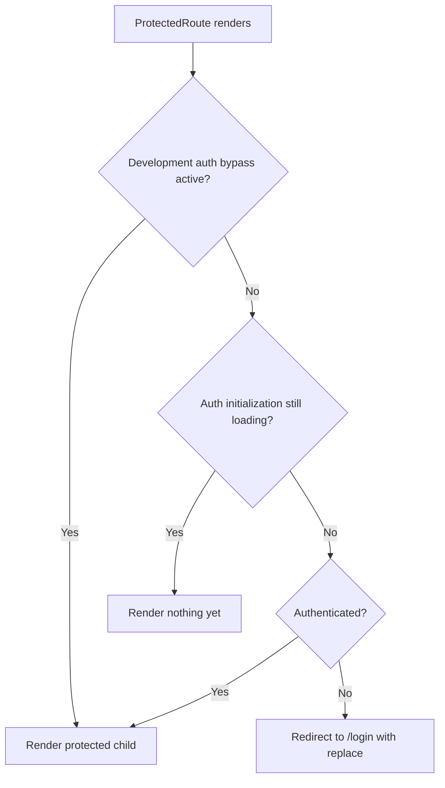

# Routing and Access Control

This document describes how SOHO UI decides which page to render, how authenticated routes are protected, and which responsibilities belong to frontend routing versus backend authorization.

## Route ownership

The application router is defined in `src/routes/Routes.tsx` with React Router's `createBrowserRouter`.

The route tree has two main branches:

```text
/login
/
```

`/login` is public.

The `/` branch is wrapped by `ProtectedRoute` and renders `MainLayout`. All normal application pages live below this protected branch.

## Current route map

```text
/login                         -> LoginPage
/
└── ProtectedRoute
    └── MainLayout
        ├── index              -> redirect to /dashboard
        ├── dashboard          -> Dashboard
        ├── disks              -> Disks
        ├── Integrated-space   -> IntegratedStorage
        ├── block-space        -> BlockStorage
        ├── file-system        -> FileSystem
        ├── services           -> Services
        ├── users              -> Users
        ├── settings           -> Settings
        ├── share              -> Share
        ├── share-nfs          -> ShareNfs
        ├── web-share          -> WebShare
        ├── history            -> History
        ├── snmp-service       -> SnmpService
        └── *                  -> NotFoundPage

*                                -> NotFoundPage
```

Route names are part of the current public frontend URL contract. Renaming a path can affect bookmarks, links, deployment rewrites, and external references even when the component itself is unchanged.

## ProtectedRoute contract

`ProtectedRoute` reads two values from `AuthContext`:

- `isAuthenticated`
- `isAuthLoading`

Its decision order is important.



### Why `isAuthLoading` comes before redirect

Authentication may need an asynchronous refresh-token call when the application starts.

If `ProtectedRoute` redirected immediately whenever `isAuthenticated === false`, a valid persisted session could be sent to `/login` before `AuthProvider` had a chance to restore it.

Therefore the route guard waits while authentication initialization is unresolved.

## Development authentication bypass

The application supports a development-only auth bypass controlled by `VITE_AUTH_BYPASS`.

The bypass requires **both** conditions:

1. `import.meta.env.DEV` is true.
2. `VITE_AUTH_BYPASS` contains a recognized truthy value such as `1`, `true`, `yes`, or `on`.

The production guard is intentional. A configuration flag alone must not be capable of bypassing authentication in a production build.

Do not weaken this invariant by removing the `import.meta.env.DEV` requirement.

## Login navigation

After a successful login, `LoginForm` calls `AuthContext.loginAction(...)` and then navigates to `/dashboard`.

The session is established before navigation. The dashboard should not be used as the mechanism that finalizes authentication.

## Logout navigation

User-triggered logout is exposed through `useLogout`.

`AuthContext.logout` clears the local session first. `useLogout` then navigates to `/login` on both backend success and backend failure.

This is expected because frontend access has already been revoked locally before the backend logout request finishes.

## Idle-timeout navigation

`MainLayout` enables `useSessionActivityTimeout` for the authenticated application shell.

When the idle timeout fires:

1. logout is attempted;
2. the user receives an expiration toast;
3. navigation replaces the current page with `/login`.

The timeout belongs at the authenticated layout level because it applies to the whole protected application, not to an individual feature page.

## MainLayout as the protected shell

`MainLayout` is more than visual chrome. It owns authenticated-shell responsibilities such as:

- navigation drawer;
- top application bar;
- notification bootstrap;
- idle-session timeout integration;
- system power-action coordination;
- nested route outlet.

A feature page rendered below `MainLayout` should not duplicate these application-wide lifecycle responsibilities.

## Not-found behavior

There are two catch-all paths:

- one inside the authenticated route tree;
- one at the global router level.

This allows unknown protected URLs and unknown top-level URLs to both resolve to `NotFoundPage` while preserving the route hierarchy.

## Frontend route guard versus authorization

`ProtectedRoute` only controls frontend rendering/navigation.

It must not be treated as a security boundary for backend resources.

Backend endpoints must independently validate authentication and authorization. A user can call an API without using the React router, and frontend source code is visible to the client.

The correct model is:

```text
Frontend route guard
    -> prevents invalid UI navigation / improves session UX

Backend authentication + authorization
    -> protects actual data and operations
```

## Adding a protected page

When adding a new authenticated page:

1. Create the page/component in the appropriate feature location.
2. Add the route as a child of the protected `MainLayout` route.
3. Add navigation metadata only if the page should be discoverable from the application navigation.
4. Keep authentication checks centralized in `ProtectedRoute`; do not add ad-hoc login redirects to every page.
5. Confirm the backend endpoints used by the page enforce their own permissions.
6. Add or update feature documentation with the route entry point.

## Adding a public page

A genuinely public page should be placed outside the protected `/` branch.

Before doing this, explicitly decide whether the page may be viewed without an authenticated session. Public placement should not be used merely to work around a routing problem.

## Common mistakes

### Redirecting from every feature page

Do not duplicate `if (!authenticated) navigate('/login')` logic across pages. It creates inconsistent loading behavior and races with session restoration.

### Treating `isAuthenticated` as persisted truth

`isAuthenticated` is React runtime state. Session restoration is based on the token/session policy in `AuthContext` and `tokenStorage`.

### Enabling auth bypass in deployment configuration

The bypass exists only for local/development workflows. Production deployments should not depend on it.

### Renaming routes casually

Route paths are user-visible URLs. Treat route renames like interface changes and check navigation links, bookmarks, Nginx SPA fallback behavior, and documentation.

## Related documents

- [`authentication.md`](./authentication.md)
- [`api-request-lifecycle.md`](./api-request-lifecycle.md)
- [`../02-architecture/frontend-architecture.md`](../02-architecture/frontend-architecture.md)
