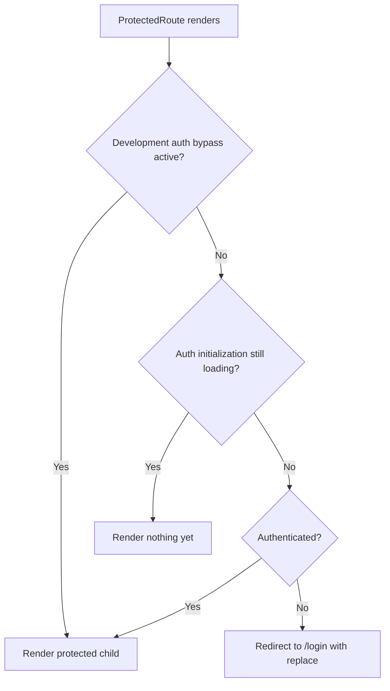

# Routing و Access Control

این سند توضیح می‌دهد SOHO UI چگونه تصمیم می‌گیرد کدام page را render کند، authenticated routeها چگونه protect می‌شوند و کدام responsibility به frontend routing و کدام به backend authorization تعلق دارد.

## Route Ownership

Application router در `src/routes/Routes.tsx` و با `createBrowserRouter` مربوط به React Router تعریف شده است.

Route tree دو branch اصلی دارد:

```text
/login
/
```

`/login` عمومی است.

Branch مربوط به `/` با `ProtectedRoute` wrap شده و `MainLayout` را render می‌کند. تمام pageهای عادی application زیر همین protected branch قرار دارند.

## Route Map فعلی

```text
/login                         -> LoginPage
/
└── ProtectedRoute
    └── MainLayout
        ├── index              -> redirect to /dashboard
        ├── dashboard          -> Dashboard
        ├── disks              -> Disks
        ├── Integrated-space   -> IntegratedStorage
        ├── block-space        -> BlockStorage
        ├── file-system        -> FileSystem
        ├── services           -> Services
        ├── users              -> Users
        ├── settings           -> Settings
        ├── share              -> Share
        ├── share-nfs          -> ShareNfs
        ├── web-share          -> WebShare
        ├── history            -> History
        ├── snmp-service       -> SnmpService
        └── *                  -> NotFoundPage

*                                -> NotFoundPage
```

Route nameها بخشی از public frontend URL contract فعلی هستند. Rename کردن path حتی اگر component تغییری نکرده باشد می‌تواند روی bookmarkها، linkها، deployment rewriteها و external referenceها اثر بگذارد.

## Contract مربوط به ProtectedRoute

`ProtectedRoute` دو value را از `AuthContext` می‌خواند:

- `isAuthenticated`
- `isAuthLoading`

ترتیب decisionهای آن مهم است.



### چرا `isAuthLoading` باید پیش از Redirect بررسی شود؟

هنگام start شدن application، authentication ممکن است به یک refresh-token call asynchronous نیاز داشته باشد.

اگر `ProtectedRoute` هر زمان `isAuthenticated === false` بود بلافاصله redirect می‌کرد، یک persisted session معتبر ممکن بود پیش از آن‌که `AuthProvider` فرصت restore کردنش را داشته باشد به `/login` فرستاده شود.

به همین دلیل route guard تا زمانی که authentication initialization unresolved است منتظر می‌ماند.

## Development Authentication Bypass

Application از auth bypass مخصوص development که با `VITE_AUTH_BYPASS` کنترل می‌شود پشتیبانی می‌کند.

Bypass نیازمند برقرار بودن **هر دو** condition زیر است:

1. `import.meta.env.DEV` برابر true باشد.
2. `VITE_AUTH_BYPASS` یک truthy value شناخته‌شده مانند `1`، `true`، `yes` یا `on` داشته باشد.

Production guard intentional است. Configuration flag به‌تنهایی نباید بتواند در production build authentication را bypass کند.

با حذف requirement مربوط به `import.meta.env.DEV` این invariant را تضعیف نکنید.

## Login Navigation

پس از login موفق، `LoginForm` ابتدا `AuthContext.loginAction(...)` را call می‌کند و سپس به `/dashboard` navigate می‌کند.

Session پیش از navigation ایجاد می‌شود. Dashboard نباید mechanismی باشد که authentication را finalize می‌کند.

## Logout Navigation

Logout که توسط user آغاز می‌شود از طریق `useLogout` expose شده است.

`AuthContext.logout` ابتدا local session را clear می‌کند. سپس `useLogout` چه backend logout موفق باشد و چه fail شود، به `/login` navigate می‌کند.

این behavior expected است، چون frontend access پیش از پایان backend logout request از قبل local revoke شده است.

## Idle-timeout Navigation

`MainLayout`، `useSessionActivityTimeout` را برای authenticated application shell فعال می‌کند.

وقتی idle timeout اجرا می‌شود:

1. logout تلاش می‌شود؛
2. expiration toast به user نمایش داده می‌شود؛
3. navigation با replace کردن current page به `/login` می‌رود.

Timeout در سطح authenticated layout قرار دارد چون روی کل protected application اعمال می‌شود، نه روی یک feature page خاص.

## MainLayout به‌عنوان Protected Shell

`MainLayout` فقط visual chrome نیست. این component authenticated-shell responsibilityهایی مانند موارد زیر را مالک است:

- navigation drawer؛
- top application bar؛
- notification bootstrap؛
- integration مربوط به idle-session timeout؛
- system power-action coordination؛
- nested route outlet.

Feature pageای که زیر `MainLayout` render می‌شود نباید این application-wide lifecycle responsibilityها را duplicate کند.

## Behavior مربوط به Not Found

دو catch-all path وجود دارد:

- یکی داخل authenticated route tree؛
- یکی در global router level.

در نتیجه هم unknown protected URL و هم unknown top-level URL به `NotFoundPage` resolve می‌شوند و route hierarchy حفظ می‌شود.

## Frontend Route Guard در برابر Authorization

`ProtectedRoute` فقط frontend rendering/navigation را کنترل می‌کند.

نباید به‌عنوان security boundary برای backend resourceها در نظر گرفته شود.

Backend endpointها باید authentication و authorization را مستقلاً validate کنند. User می‌تواند بدون استفاده از React router مستقیماً API را call کند و frontend source code نیز برای client قابل مشاهده است.

مدل صحیح:

```text
Frontend route guard
    -> prevents invalid UI navigation / improves session UX

Backend authentication + authorization
    -> protects actual data and operations
```

## اضافه‌کردن Protected Page

هنگام اضافه‌کردن authenticated page جدید:

1. Page/component را در feature location مناسب ایجاد کنید.
2. Route را به‌عنوان child مربوط به protected `MainLayout` route اضافه کنید.
3. فقط زمانی navigation metadata اضافه کنید که page باید از application navigation discoverable باشد.
4. Authentication check را در `ProtectedRoute` متمرکز نگه دارید؛ ad-hoc login redirect به هر page اضافه نکنید.
5. تأیید کنید backend endpointهای استفاده‌شده توسط page permissionهای خود را enforce می‌کنند.
6. Feature documentation را با route entry point مربوطه اضافه یا به‌روزرسانی کنید.

## اضافه‌کردن Public Page

Page واقعاً public باید خارج از protected `/` branch قرار بگیرد.

پیش از انجام این کار صریحاً مشخص کنید page مجاز است بدون authenticated session دیده شود یا خیر. Public placement نباید صرفاً workaround برای routing problem باشد.

## اشتباه‌های رایج

### Redirect از هر Feature Page

منطق `if (!authenticated) navigate('/login')` را بین pageها duplicate نکنید. این کار loading behavior ناسازگار و race با session restoration ایجاد می‌کند.

### درنظرگرفتن `isAuthenticated` به‌عنوان Persisted Truth

`isAuthenticated` یک React runtime state است. Session restoration بر اساس token/session policy در `AuthContext` و `tokenStorage` انجام می‌شود.

### فعال‌کردن Auth Bypass در Deployment Configuration

Bypass فقط برای local/development workflow وجود دارد. Production deployment نباید به آن وابسته باشد.

### Rename کردن بی‌دلیل Routeها

Route pathها URLهای user-visible هستند. Route rename را مانند interface change در نظر بگیرید و navigation link، bookmark، Nginx SPA fallback behavior و documentation را بررسی کنید.

## مستندات مرتبط

- [`authentication.md`](./authentication.md)
- [`api-request-lifecycle.md`](./api-request-lifecycle.md)
- [`../02-architecture/frontend-architecture.md`](../02-architecture/frontend-architecture.md)
