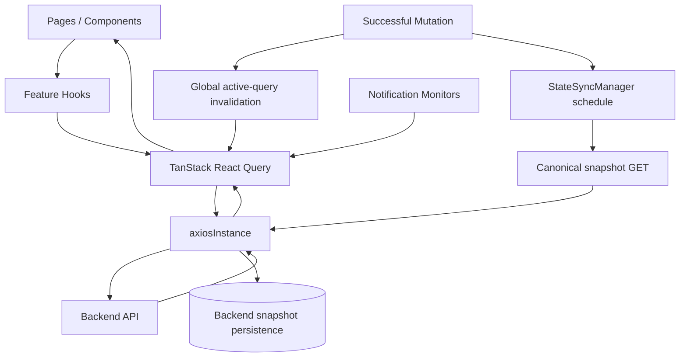
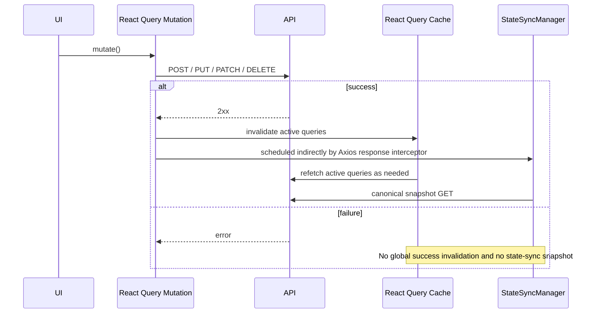

# Server State and Cache

This document defines how SOHO UI reads, caches, refreshes, invalidates, and observes backend state.

The most important rule is that **UI freshness and database snapshot persistence are separate responsibilities**.

- TanStack React Query owns client-side server-state caching and UI freshness.
- Axios owns transport-wide request/response policy.
- `StateSyncManager` owns canonical backend snapshot persistence for the domains that support `save_to_db`.
- Feature hooks own query keys, endpoint-specific normalization, and feature-specific refresh cadence.
- Notification monitoring also uses React Query, but currently mixes ordinary shared resource keys with dedicated monitoring keys.

Do not merge these responsibilities into one mechanism.

## Runtime ownership



The two arrows after a successful mutation serve different goals:

1. React Query invalidation refreshes client-side server state used by the UI and observers.
2. StateSyncManager schedules canonical persisted snapshots where the backend contract requires them.

A developer should never rely on query invalidation to persist backend state, and should never use `save_to_db=true` as a way to refresh the UI.

## Global QueryClient policy

The application creates one `QueryClient` in `src/main.tsx`.

Current defaults are:

| Setting | Value | Meaning |
| --- | --- | --- |
| `retry` | `false` | Queries do not retry globally. Hooks may override this intentionally. |
| `refetchOnMount` | `always` | Mounted consumers normally revalidate from the backend. |
| `refetchOnWindowFocus` | `false` | Focusing the tab does not create a global refetch storm. |
| `refetchOnReconnect` | `false` | Reconnect does not globally refetch every query. |
| `staleTime` | `10_000` ms | Default data freshness window. |
| `gcTime` | `5` minutes | Unused query data remains cached for this period by default. |
| mutation retry | `false` | Mutations are not repeated automatically. |

Hooks can override these values when the endpoint has a different runtime requirement.

## Successful mutation behavior

The global `MutationCache` invalidates active queries only when a mutation succeeds.



This success-only behavior prevents a failed operation from making the UI look as if state changed and prevents persistence work from being scheduled for an unsuccessful mutation.

Feature hooks may also invalidate focused query keys in their own `onSuccess` handlers. This is allowed when a feature knows exactly which views require immediate refresh. The global invalidation remains a safety net for active server-state consumers.

## Query keys are contracts

Query keys identify cache entries and query lifecycles.

Examples verified from current hooks include:

- `['zpool']`
- `['disk']`
- `['disk', 'partitioned']` — historical key currently used for available unpartitioned disks in storage workflows
- `['disk', 'inventory']`
- `['filesystems']`
- `['volumes']`
- `['services']`
- `['services', 'status', serviceUnit]`
- `['cpu']`
- `['memory']`
- `['system', 'uptime']`
- `['network']`
- `['network', 'bandwidth-snapshots', interfaceNames]`
- `['notifications', 'capacity', 'zpool']`
- `['notifications', 'capacity', 'filesystems']`

Consumers using the same key can share cache state and request lifecycle. Consumers using different keys are independent React Query entries even when they call the same endpoint or fetch function.

Therefore a query key is not just a label. It defines ownership and invalidation behavior.

Before changing a query key, search for:

- all consumers;
- targeted invalidation calls;
- notification monitors;
- polling configuration;
- any code relying on the existing cache lifecycle.

## Shared resource keys versus dedicated monitor keys

The codebase currently uses both patterns.

### Shared/ordinary resource keys

Status-change notifications use ordinary resource hooks:

- zpool status observes `useZpool()` / `['zpool']`;
- disk status observes `useDisk()` / `['disk']`;
- service status observes `useServices()` / `['services']`.

When a page uses the same key, React Query can share that entry.

Dashboard widgets follow the same principle for domain data such as `['zpool']` instead of creating page-specific copies of the same resource.

The Services page additionally creates one `['services','status', unit]` query per service. Those entries are intentionally distinct from the shared list query.

### Dedicated monitoring keys

Capacity notifications intentionally create separate entries:

- `['notifications','capacity','zpool']`;
- `['notifications','capacity','filesystems']`.

These reuse the resource fetch functions but have their own 60-second monitoring lifecycle.

Disk-temperature monitoring uses `['disk','inventory']` at 30 seconds.

Different keys can result in separate backend requests. Do not assume React Query deduplicates by URL or fetch function; query-key identity is what matters.

When introducing a dedicated key, document why its cadence/lifecycle should be independent from the ordinary resource query.

## Cache data is not application persistence

React Query cache is temporary browser memory. It is not an authoritative persisted representation of the managed storage system.

The cache may disappear when:

- the page reloads;
- the application process is restarted;
- a query is garbage-collected;
- a user signs out;
- query configuration changes.

Therefore:

- never treat React Query cache as durable storage;
- never put backend snapshot semantics into a query key;
- never use local React state to replace authoritative backend data;
- use the backend API as the source of truth for managed-system state.

## Local component state versus server state

Use local React state for ephemeral UI concerns such as:

- modal open/closed state;
- selected rows;
- unsaved form values;
- temporary confirmation state;
- countdowns and animations.

Browser-persisted UI preferences such as the Dashboard layout are also distinct from server state: they may survive a reload, but they are still client-side presentation state rather than authoritative managed-system data.

Use React Query for data whose authoritative value comes from the backend.

A useful test is: **if another operator or backend process could change the value without this component knowing, it is server state.**

## Polling is an endpoint-specific policy

There is deliberately no global polling interval. Each hook or monitoring query decides whether its data needs continuous refresh.

Examples:

- uptime refreshes every second on the Dashboard;
- CPU and memory telemetry refresh every two seconds;
- network bandwidth refreshes every two seconds once interface names are known;
- zpool/storage views refresh more slowly;
- the Dashboard 3D slot view overrides the default pool-slot cadence to 10 seconds;
- filesystem and Volume list data currently rely on mount/refetch/invalidation rather than continuous polling;
- Services runs both a 5-second list query and 5-second per-unit status queries;
- some detail queries poll only while the relevant UI is enabled;
- notification capacity monitors use dedicated 60-second queries;
- disk-temperature monitoring uses a 30-second inventory query.

The canonical polling inventory is maintained in [`polling-and-data-refresh.md`](./polling-and-data-refresh.md).

## Background polling policy

Continuous queries normally use `refetchIntervalInBackground: false`.

This matters because administrative dashboards can otherwise continue generating traffic when the browser tab is hidden.

If a future feature truly requires background polling, document the operational reason before enabling it.

## Feature-level overrides are part of the contract

A hook default is not always the final runtime behavior. Pages/components can intentionally override cadence or lifecycle.

Examples:

- `usePoolDeviceSlots()` defaults to 30 seconds, while `ServerSlots3DWidget` supplies 10 seconds;
- Integrated Storage enables its legacy `['disk','partitioned']` query only while Create/Add/Replace workflows need available unpartitioned disks and supplies a 5-second interval;
- `useDiskInventory()` explicitly opts into window-focus refetch although the global QueryClient disables it.

When debugging or documenting freshness, inspect both the hook and the caller.

## Notifications are React Query consumers with their own bookkeeping

Notifications are not a second backend state platform, but they do not all use the same cache entries as pages.

Current patterns are:

1. status-change monitoring uses ordinary zpool/disk/services resource hooks;
2. capacity monitoring uses dedicated notification query keys and a 60-second cadence;
3. temperature monitoring uses the disk-inventory query key and a 30-second cadence.

Notification history, prior-status snapshots, check timestamps, and fingerprints stored in browser storage are local bookkeeping only. They are not authoritative backend state.

See [`notifications.md`](./notifications.md).

## Relationship to `save_to_db`

Normal React Query requests are observational reads and must not persist snapshots.

The centralized Axios transport policy normalizes normal API traffic to `save_to_db=false`.

Only canonical internal state-sync requests created by `StateSyncManager` are allowed to request `save_to_db=true`.

Legacy caller-level persistence flags are being removed from hooks because they are misleading even when Axios neutralizes them.

See [`state-sync-save-to-db.md`](./state-sync-save-to-db.md).

## StateSync coverage is explicit

Not every React Query resource automatically has a persisted StateSync domain.

For example, the current frontend defines persisted domains for zpool, filesystem, disk, NFS, Samba resources, Web Share, and SNMP, but not for Volume or system-service control.

That distinction must be treated as an explicit backend/frontend contract. A feature without a StateSync domain must not invent `save_to_db=true` locally. If persistence is required, extend centralized StateSync only after confirming the canonical snapshot endpoint and cross-domain effects.

## Adding a new server-state query

When adding a new query:

1. identify the authoritative backend endpoint;
2. choose a stable query key representing the intended cache/lifecycle owner;
3. check whether an existing key already represents the same state and cadence;
4. use a dedicated key only when an independent lifecycle is intentional;
5. normalize API data in the hook or API layer rather than in many components;
6. decide whether continuous polling is actually necessary;
7. if polling is required, define the interval intentionally and disable background polling unless justified;
8. define `staleTime` based on how quickly the resource changes;
9. identify mutations that must invalidate the query;
10. determine whether the resource is a persisted StateSync domain or UI-only/operational server state;
11. document non-obvious lifecycle constraints.

## Adding a mutation

For a normal mutation:

```ts
await axiosInstance.post('/api/example/', payload);
```

Do not add caller-level `save_to_db=true`.

After success:

- use targeted invalidation if the feature needs immediate specific refreshes;
- allow the global MutationCache to revalidate active server state;
- let the Axios response interceptor and StateSyncManager handle persisted snapshot domains.

If the mutation affects multiple persisted domains, extend `resolveStateDomainsForMutation` instead of adding ad-hoc snapshot calls inside the feature hook.

If no StateSync domain exists, confirm whether that is intentional before adding one.

## Debugging stale UI data

When the UI appears stale, inspect in this order:

1. Is the expected query mounted and enabled?
2. What exact query key owns the data?
3. Is it an ordinary resource key, a per-entity key, or a dedicated monitor key?
4. Is its query key the same key that a targeted mutation invalidates?
5. Does the query intentionally poll, or is refresh expected only on invalidation/mount/manual refresh?
6. Did the caller override the hook's interval, `enabled`, focus, or reconnect behavior?
7. Is `staleTime` delaying a behavior you expected to be immediate?
8. Did the mutation actually succeed?
9. Is the endpoint response correct before normalization?
10. Are multiple hooks representing equivalent backend data under intentionally different keys?

Do not solve a UI freshness issue by enabling `save_to_db=true`.

## Debugging duplicate network requests

If equivalent endpoint traffic appears multiple times:

1. compare the query keys, not only the URLs;
2. check notification-specific monitoring keys;
3. account for intentional per-entity queries such as `['services','status', unit]`;
4. compare polling intervals and enabled lifecycles;
5. inspect caller-specific overrides such as the 3D slot 10-second cadence;
6. check whether mutation invalidation occurred at the same time as a scheduled poll;
7. inspect mount/unmount revalidation;
8. only then investigate framework-level causes such as StrictMode.

Different query keys are independent entries and can legitimately create separate requests.

## Debugging persistence

If the backend database snapshot is stale while the live UI is correct, inspect StateSync rather than React Query:

1. Did the mutation pass through `axiosInstance`?
2. Did it succeed?
3. Does its URL map to a persisted domain?
4. If no domain maps, is persistence actually part of the feature contract?
5. Was a canonical snapshot scheduled?
6. Was the snapshot coalesced with another mutation?
7. Did a sync fail while another was in flight?
8. Does the canonical endpoint still return the complete state required for persistence?

## Maintenance invariants

Preserve these rules when refactoring:

- React Query owns client-side server-state freshness, not database persistence;
- `StateSyncManager` is the only frontend owner of `save_to_db=true` snapshots;
- failed mutations must not schedule persistence snapshots;
- polling should be scoped to mounted/enabled consumers and normally stop in the background;
- identical query keys may share lifecycle, while different keys represent independent entries;
- per-entity query fan-out must be treated as intentional backend load and documented where material;
- caller-level query overrides are part of runtime behavior and must be considered during audits;
- dedicated notification monitoring keys must be documented as independent traffic when applicable;
- browser notification storage and dashboard-layout storage are client bookkeeping/preferences, not authoritative server state;
- feature code must not call persistence snapshots ad hoc.

## Related files

- `src/main.tsx`
- `src/lib/axiosInstance.ts`
- `src/lib/stateSyncManager.ts`
- `src/hooks/useCpu.ts`
- `src/hooks/useMemory.ts`
- `src/hooks/useSystemUptime.ts`
- `src/hooks/useNetwork.ts`
- `src/hooks/useZpool.ts`
- `src/hooks/useFileSystems.ts`
- `src/hooks/useVolumes.ts`
- `src/hooks/useDisk.ts`
- `src/hooks/useDiskInventory.ts`
- `src/hooks/useServices.ts`
- `src/hooks/useServiceStatuses.ts`
- `src/hooks/useStartupNotificationChecks.ts`
- `src/hooks/useResourceStatusChangeNotifications.ts`
- `src/hooks/useDiskTemperatureNotifications.ts`
- `src/components/dashboard/server-3d/ServerSlots3DWidget.tsx`
- `src/components/notifications/NotificationBootstrapper.tsx`

## Related documentation

- [`api-request-lifecycle.md`](./api-request-lifecycle.md)
- [`state-sync-save-to-db.md`](./state-sync-save-to-db.md)
- [`polling-and-data-refresh.md`](./polling-and-data-refresh.md)
- [`notifications.md`](./notifications.md)
- [`../05-features/dashboard.md`](../05-features/dashboard.md)
- [`../05-features/disks.md`](../05-features/disks.md)
- [`../05-features/integrated-storage.md`](../05-features/integrated-storage.md)
- [`../05-features/block-storage.md`](../05-features/block-storage.md)
- [`../05-features/file-system.md`](../05-features/file-system.md)
- [`../05-features/services.md`](../05-features/services.md)
