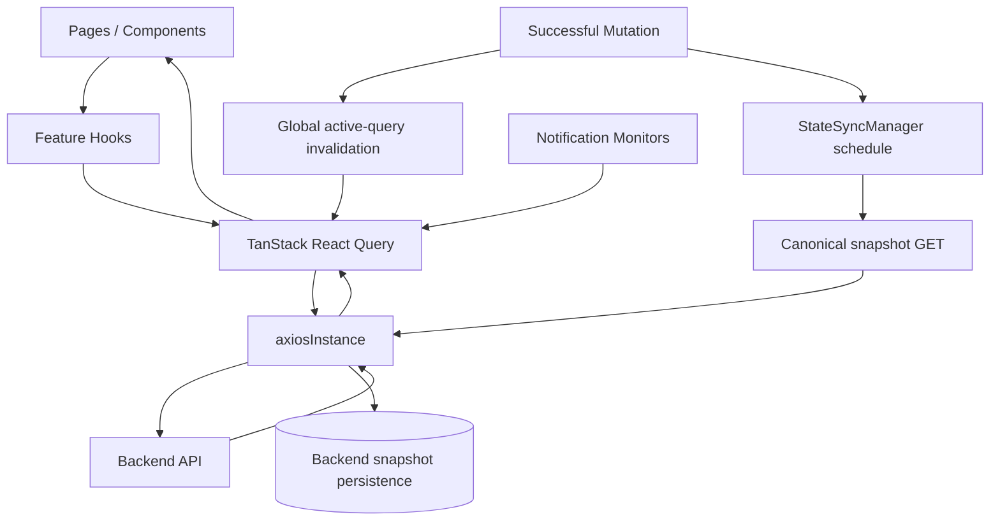
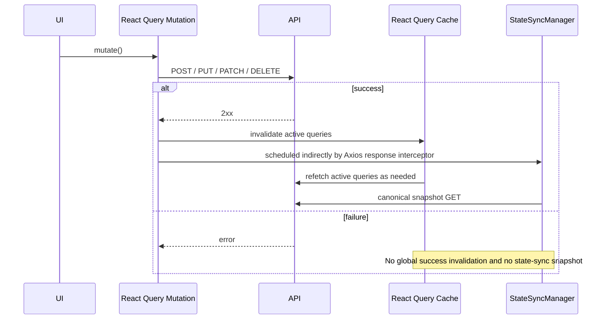

# Server State و Cache

این سند تعریف می‌کند SOHO UI چگونه backend state را read، cache، refresh، invalidate و observe می‌کند.

مهم‌ترین rule این است که **UI freshness و database snapshot persistence دو مسئولیت جدا هستند**.

- TanStack React Query مالک client-side server-state caching و UI freshness است.
- Axios مالک transport-wide request/response policy است.
- `StateSyncManager` مالک canonical backend snapshot persistence برای domainهایی است که `save_to_db` contract دارند.
- Feature hookها مالک query key، endpoint-specific normalization و feature-specific refresh cadence هستند.
- Notification monitoring نیز از React Query استفاده می‌کند، اما در حال حاضر ترکیبی از shared resource keyهای عادی و dedicated monitoring keyها دارد.

این responsibilityها را در یک mechanism ادغام نکنید.

## Runtime Ownership



دو path پس از mutation موفق هدف‌های متفاوتی دارند:

1. React Query invalidation، client-side server state مورد استفاده‌ی UI و observerها را refresh می‌کند.
2. `StateSyncManager` در domainهایی که backend contract نیاز دارد canonical persisted snapshot را schedule می‌کند.

هیچ‌گاه به query invalidation برای persist کردن backend state متکی نباشید و از `save_to_db=true` نیز به‌عنوان راهی برای refresh کردن UI استفاده نکنید.

## Global QueryClient Policy

Application یک `QueryClient` واحد در `src/main.tsx` ایجاد می‌کند.

Defaultهای فعلی:

| Setting | Value | معنی |
| --- | --- | --- |
| `retry` | `false` | Queryها به‌صورت global retry نمی‌شوند؛ hook می‌تواند آگاهانه override کند. |
| `refetchOnMount` | `always` | Consumerهای mountشده معمولاً data را از backend دوباره validate می‌کنند. |
| `refetchOnWindowFocus` | `false` | Focus شدن tab باعث global refetch storm نمی‌شود. |
| `refetchOnReconnect` | `false` | Reconnect باعث refetch سراسری همه‌ی queryها نمی‌شود. |
| `staleTime` | `10_000` ms | Default freshness window مربوط به data. |
| `gcTime` | `5` دقیقه | Query data بدون استفاده به‌صورت default تا این مدت در cache می‌ماند. |
| mutation retry | `false` | Mutationها به‌صورت خودکار تکرار نمی‌شوند. |

Hookها زمانی که endpoint runtime requirement متفاوتی دارد می‌توانند این valueها را override کنند.

## Behavior پس از Mutation موفق

Global `MutationCache` فقط وقتی mutation موفق است active queryها را invalidate می‌کند.



این success-only behavior مانع آن می‌شود که operation failشده UI را طوری نشان دهد که انگار state تغییر کرده و همچنین جلوی schedule شدن persistence برای mutation ناموفق را می‌گیرد.

Feature hook می‌تواند در `onSuccess` خود targeted query keyها را هم invalidate کند. این کار زمانی مجاز است که feature دقیقاً بداند کدام view باید فوراً refresh شود. Global invalidation همچنان safety net برای active server-state consumerها باقی می‌ماند.

## Query Keyها Contract هستند

Query key، cache entry و query lifecycle را مشخص می‌کند.

نمونه‌های تأییدشده از hookهای فعلی:

- `['zpool']`
- `['disk']`
- `['disk', 'partitioned']` — historical key که در storage workflowها برای available unpartitioned disk استفاده می‌شود
- `['disk', 'inventory']`
- `['filesystems']`
- `['volumes']`
- `['services']`
- `['services', 'status', serviceUnit]`
- `['cpu']`
- `['memory']`
- `['system', 'uptime']`
- `['network']`
- `['network', 'bandwidth-snapshots', interfaceNames]`
- `['notifications', 'capacity', 'zpool']`
- `['notifications', 'capacity', 'filesystems']`

Consumerهایی با key یکسان می‌توانند cache state و request lifecycle را share کنند. Consumerهایی با key متفاوت حتی اگر endpoint یا fetch function یکسان داشته باشند entryهای مستقل React Query هستند.

بنابراین query key صرفاً label نیست؛ ownership و invalidation behavior را تعریف می‌کند.

پیش از تغییر query key این موارد را search کنید:

- تمام consumerها؛
- targeted invalidation callها؛
- notification monitorها؛
- polling configuration؛
- هر codeای که به cache lifecycle فعلی وابسته است.

## Shared Resource Key در برابر Dedicated Monitor Key

Codebase در حال حاضر هر دو pattern را دارد.

### Shared/Ordinary Resource Keyها

Status-change notificationها از ordinary resource hookها استفاده می‌کنند:

- zpool status از `useZpool()` / `['zpool']` observe می‌شود؛
- disk status از `useDisk()` / `['disk']` observe می‌شود؛
- service status از `useServices()` / `['services']` observe می‌شود.

وقتی page همان key را استفاده کند، React Query می‌تواند entry را share کند.

Dashboard widgetها نیز برای domain data مانند `['zpool']` همین اصل را رعایت می‌کنند و page-specific copy از همان resource نمی‌سازند.

Services page علاوه بر این برای هر service یک query با key زیر می‌سازد:

```text
['services','status', unit]
```

این entryها عمداً از shared list query مستقل هستند.

### Dedicated Monitoring Keyها

Capacity notificationها عمداً entryهای جدا ایجاد می‌کنند:

- `['notifications','capacity','zpool']`؛
- `['notifications','capacity','filesystems']`.

این‌ها resource fetch function را reuse می‌کنند، اما lifecycle مانیتورینگ مستقل 60 ثانیه‌ای دارند.

Disk-temperature monitoring از `['disk','inventory']` با interval برابر 30 ثانیه استفاده می‌کند.

Keyهای متفاوت می‌توانند backend requestهای مستقل ایجاد کنند. React Query بر اساس URL یا fetch function deduplicate نمی‌کند؛ query-key identity تعیین‌کننده است.

هنگام معرفی dedicated key، دلیل مستقل‌بودن cadence/lifecycle آن نسبت به ordinary resource query را مستند کنید.

## Cache Data، Application Persistence نیست

React Query cache حافظه‌ی موقت browser است و persisted representation authoritative از managed storage system نیست.

Cache ممکن است در شرایط زیر از بین برود:

- page reload؛
- restart شدن application process؛
- garbage collection شدن query؛
- sign out شدن user؛
- تغییر query configuration.

بنابراین:

- React Query cache را durable storage در نظر نگیرید؛
- backend snapshot semantics را داخل query key قرار ندهید؛
- local React state را جایگزین authoritative backend data نکنید؛
- برای managed-system state از backend API به‌عنوان source of truth استفاده کنید.

یک معیار ساده: **اگر Operator دیگری یا backend process می‌تواند value را بدون اطلاع component تغییر دهد، آن value server state است.**

## Local Component State در برابر Server State

برای ephemeral UI concernهایی مانند موارد زیر از local React state استفاده کنید:

- modal open/closed state؛
- selected rowها؛
- unsaved form valueها؛
- temporary confirmation state؛
- countdown و animation.

Browser-persisted UI preference مانند Dashboard layout نیز از server state جداست. ممکن است reload را survive کند، اما همچنان client-side presentation state است نه authoritative managed-system data.

## Polling یک Endpoint-specific Policy است

عمداً global polling interval وجود ندارد. هر hook یا monitoring query تصمیم می‌گیرد data به continuous refresh نیاز دارد یا خیر.

نمونه‌ها:

- uptime در Dashboard هر 1 ثانیه refresh می‌شود؛
- CPU و memory telemetry هر 2 ثانیه؛
- network bandwidth پس از مشخص شدن interface nameها هر 2 ثانیه؛
- zpool/storage viewها با cadence کندتر؛
- Dashboard 3D slot view، default pool-slot cadence را به 10 ثانیه override می‌کند؛
- filesystem و Volume list فعلاً به mount/refetch/invalidation متکی‌اند و continuous polling ندارند؛
- Services هم list query پنج‌ثانیه‌ای و هم per-unit status query پنج‌ثانیه‌ای دارد؛
- بعضی detail queryها فقط وقتی UI مربوطه enabled است poll می‌شوند؛
- notification capacity monitorها dedicated query با cadence برابر 60 ثانیه دارند؛
- disk-temperature monitoring از inventory query با cadence برابر 30 ثانیه استفاده می‌کند.

Canonical polling inventory در [`polling-and-data-refresh.md`](./polling-and-data-refresh.md) نگهداری می‌شود.

## Background Polling Policy

Continuous queryها معمولاً از این value استفاده می‌کنند:

```text
refetchIntervalInBackground: false
```

این موضوع مهم است چون admin dashboard در غیر این صورت می‌تواند زمانی که browser tab hidden است همچنان traffic تولید کند.

اگر feature آینده واقعاً background polling نیاز دارد، دلیل operational آن را پیش از فعال‌سازی مستند کنید.

## Feature-level Override بخشی از Contract است

Hook default همیشه final runtime behavior نیست. Page/component می‌تواند cadence یا lifecycle را عمداً override کند.

نمونه‌ها:

- `usePoolDeviceSlots()` به‌صورت default 30 ثانیه است، ولی `ServerSlots3DWidget` مقدار 10 ثانیه می‌دهد؛
- Integrated Storage، legacy query با key `['disk','partitioned']` را فقط زمانی enable می‌کند که Create/Add/Replace workflow به available unpartitioned disk نیاز دارد و interval برابر 5 ثانیه می‌دهد؛
- `useDiskInventory()` با وجود global policy، به‌صورت صریح window-focus refetch را فعال می‌کند.

هنگام debug یا مستندسازی freshness، هم hook و هم caller را بررسی کنید.

## Notificationها React Query Consumer هستند، با Bookkeeping مستقل

Notificationها backend state platform جدا نیستند، اما همه‌ی آن‌ها همان cache entry مربوط به pageها را استفاده نمی‌کنند.

Patternهای فعلی:

1. status-change monitoring از ordinary zpool/disk/services resource hookها استفاده می‌کند؛
2. capacity monitoring از dedicated notification query key و cadence برابر 60 ثانیه استفاده می‌کند؛
3. temperature monitoring از disk-inventory query key با cadence برابر 30 ثانیه استفاده می‌کند.

Notification history، prior-status snapshot، check timestamp و fingerprintهایی که در browser storage نگه داشته می‌شوند صرفاً local bookkeeping هستند و authoritative backend state نیستند.

به [`notifications.md`](./notifications.md) مراجعه کنید.

## ارتباط با `save_to_db`

Normal React Query requestها observational read هستند و نباید snapshot persist کنند.

Centralized Axios transport policy، normal API traffic را به `save_to_db=false` normalize می‌کند.

فقط internal canonical state-sync requestهایی که توسط `StateSyncManager` ساخته می‌شوند مجازند `save_to_db=true` داشته باشند.

Legacy caller-level persistence flagها در حال حذف شدن از hookها هستند چون حتی اگر Axios آن‌ها را neutralize کند misleading هستند.

به [`state-sync-save-to-db.md`](./state-sync-save-to-db.md) مراجعه کنید.

## StateSync Coverage صریح است

هر React Query resource الزاماً persisted StateSync domain ندارد.

بر اساس contract صحیح فعلی GitLab، frontend برای `zpool`، `filesystem`، `disk`، `nfs`، `samba-shares` و `webshare` persisted StateSync domain دارد.

در حال حاضر `volume`، system-service control، `samba-users`، `samba-groups` و `snmp` StateSync domain مستقل ندارند.

این distinction باید به‌عنوان explicit backend/frontend contract در نظر گرفته شود. Feature بدون StateSync domain نباید local `save_to_db=true` اختراع کند. اگر persistence لازم است، فقط پس از تأیید canonical snapshot endpoint و cross-domain effectها centralized StateSync را extend کنید.

## اضافه‌کردن Server-state Query جدید

هنگام اضافه‌کردن query جدید:

1. authoritative backend endpoint را مشخص کنید؛
2. stable query keyای انتخاب کنید که cache/lifecycle owner موردنظر را نمایش دهد؛
3. بررسی کنید existing key همان state و cadence را از قبل نمایش می‌دهد یا خیر؛
4. فقط وقتی lifecycle مستقل intentional است dedicated key استفاده کنید؛
5. API data را در hook یا API layer normalize کنید، نه در چند component؛
6. تصمیم بگیرید continuous polling واقعاً لازم است یا خیر؛
7. اگر polling لازم است interval را intentional تعیین کرده و background polling را بدون justification غیرفعال نگه دارید؛
8. `staleTime` را بر اساس سرعت تغییر resource تعیین کنید؛
9. mutationهایی را که باید query را invalidate کنند مشخص کنید؛
10. تعیین کنید resource یک persisted StateSync domain است یا فقط UI/operational server state؛
11. lifecycle constraint غیرآشکار را مستند کنید.

## اضافه‌کردن Mutation

برای mutation عادی:

```ts
await axiosInstance.post('/api/example/', payload);
```

Caller-level `save_to_db=true` اضافه نکنید.

پس از success:

- اگر feature به immediate specific refresh نیاز دارد targeted invalidation انجام دهید؛
- اجازه دهید global MutationCache active server state را revalidate کند؛
- اجازه دهید Axios response interceptor و StateSyncManager persisted snapshot domainها را handle کنند.

اگر mutation چند persisted domain را تحت تأثیر قرار می‌دهد، `resolveStateDomainsForMutation` را extend کنید؛ ad-hoc snapshot call داخل feature hook اضافه نکنید.

اگر StateSync domain وجود ندارد، پیش از اضافه‌کردن آن تأیید کنید نبودنش intentional است یا خیر.

## Debug کردن Stale UI Data

وقتی UI stale به نظر می‌رسد به این ترتیب بررسی کنید:

1. آیا query مورد انتظار mounted و enabled است؟
2. دقیقاً کدام query key مالک data است؟
3. ordinary resource key، per-entity key یا dedicated monitor key است؟
4. آیا targeted mutation همان query key را invalidate می‌کند؟
5. آیا query عمداً poll می‌شود یا refresh فقط با invalidation/mount/manual refresh انتظار می‌رود؟
6. آیا caller، interval، `enabled`، focus یا reconnect behavior مربوط به hook را override کرده؟
7. آیا `staleTime` behavior مورد انتظار را delay می‌کند؟
8. آیا mutation واقعاً موفق شده؟
9. endpoint response قبل از normalization صحیح است؟
10. آیا چند hook، equivalent backend data را با keyهای عمداً متفاوت نمایش می‌دهند؟

UI freshness issue را با فعال‌کردن `save_to_db=true` حل نکنید.

## Debug کردن Duplicate Network Request

اگر equivalent endpoint traffic چند بار دیده می‌شود:

1. query keyها را مقایسه کنید، نه فقط URLها؛
2. notification-specific monitoring keyها را بررسی کنید؛
3. per-entity queryهای intentional مانند `['services','status', unit]` را در نظر بگیرید؛
4. polling interval و enabled lifecycle را مقایسه کنید؛
5. caller-specific override مانند cadence ده‌ثانیه‌ای 3D slot را بررسی کنید؛
6. بررسی کنید mutation invalidation هم‌زمان با scheduled poll رخ نداده باشد؛
7. mount/unmount revalidation را بررسی کنید؛
8. بعد از این‌ها سراغ framework-level causeهایی مثل StrictMode بروید.

Query keyهای متفاوت entry مستقل هستند و می‌توانند به‌صورت legitimate request مستقل ایجاد کنند.

## Debug کردن Persistence

اگر backend database snapshot stale است ولی live UI صحیح است، StateSync را بررسی کنید نه React Query:

1. آیا mutation از `axiosInstance` عبور کرده؟
2. آیا موفق شده؟
3. آیا URL آن به persisted domain map می‌شود؟
4. اگر domain map نمی‌شود، آیا persistence واقعاً بخشی از feature contract است؟
5. آیا canonical snapshot schedule شده؟
6. آیا snapshot با mutation دیگری coalesce شده؟
7. آیا هنگام in-flight بودن sync failure رخ داده؟
8. آیا canonical endpoint هنوز complete state موردنیاز persistence را برمی‌گرداند؟

## Maintenance Invariantها

هنگام refactor این ruleها را حفظ کنید:

- React Query مالک client-side server-state freshness است، نه database persistence؛
- `StateSyncManager` تنها frontend owner برای snapshotهای `save_to_db=true` است؛
- mutation failشده نباید persistence snapshot schedule کند؛
- polling باید به mounted/enabled consumer محدود باشد و معمولاً در background متوقف شود؛
- query key یکسان می‌تواند lifecycle را share کند، در حالی که key متفاوت entry مستقل است؛
- per-entity query fan-out باید intentional backend load در نظر گرفته شود و هرجا مهم است مستند شود؛
- caller-level query override بخشی از runtime behavior است و باید در auditها لحاظ شود؛
- dedicated notification monitoring key در صورت وجود باید به‌عنوان traffic مستقل مستند شود؛
- browser notification storage و dashboard-layout storage فقط client bookkeeping/preference هستند، نه authoritative server state؛
- feature code نباید persistence snapshot را ad-hoc call کند.

## فایل‌های مرتبط

- `src/main.tsx`
- `src/lib/axiosInstance.ts`
- `src/lib/stateSyncManager.ts`
- `src/hooks/useCpu.ts`
- `src/hooks/useMemory.ts`
- `src/hooks/useSystemUptime.ts`
- `src/hooks/useNetwork.ts`
- `src/hooks/useZpool.ts`
- `src/hooks/useFileSystems.ts`
- `src/hooks/useVolumes.ts`
- `src/hooks/useDisk.ts`
- `src/hooks/useDiskInventory.ts`
- `src/hooks/useServices.ts`
- `src/hooks/useServiceStatuses.ts`
- `src/hooks/useStartupNotificationChecks.ts`
- `src/hooks/useResourceStatusChangeNotifications.ts`
- `src/hooks/useDiskTemperatureNotifications.ts`
- `src/components/dashboard/server-3d/ServerSlots3DWidget.tsx`
- `src/components/notifications/NotificationBootstrapper.tsx`

## مستندات مرتبط

- [`api-request-lifecycle.md`](./api-request-lifecycle.md)
- [`state-sync-save-to-db.md`](./state-sync-save-to-db.md)
- [`polling-and-data-refresh.md`](./polling-and-data-refresh.md)
- [`notifications.md`](./notifications.md)
- [`../05-features/dashboard.md`](../05-features/dashboard.md)
- [`../05-features/disks.md`](../05-features/disks.md)
- [`../05-features/integrated-storage.md`](../05-features/integrated-storage.md)
- [`../05-features/block-storage.md`](../05-features/block-storage.md)
- [`../05-features/file-system.md`](../05-features/file-system.md)
- [`../05-features/services.md`](../05-features/services.md)
