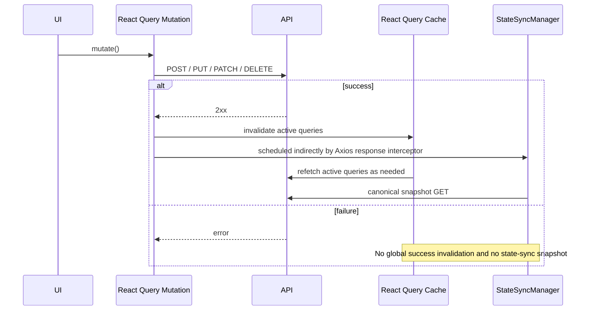

# Server State and Cache

This document defines how SOHO UI reads, caches, refreshes, invalidates, and observes backend state.

The most important rule is that **UI freshness and database snapshot persistence are separate responsibilities**.

- TanStack React Query owns client-side server-state caching and UI freshness.
- Axios owns transport-wide request/response policy.
- `StateSyncManager` owns canonical backend snapshot persistence for the domains that support `save_to_db`.
- Feature hooks own query keys, endpoint-specific normalization, and feature-specific refresh cadence.
- Notification hooks observe shared server state and should avoid creating redundant polling loops.

Do not merge these responsibilities into one mechanism.

## Runtime ownership


The two arrows after a successful mutation serve different goals:

1. React Query invalidation refreshes data visible to the user.
2. StateSyncManager schedules canonical persisted snapshots where the backend contract requires them.

A developer should never rely on query invalidation to persist backend state, and should never use `save_to_db=true` as a way to refresh the UI.

## Global QueryClient policy

The application creates one `QueryClient` in `src/main.tsx`.

Current defaults are:

| Setting | Value | Meaning |
| --- | --- | --- |
| `retry` | `false` | Queries do not retry globally. Hooks may override this intentionally. |
| `refetchOnMount` | `always` | Mounted consumers normally revalidate from the backend. |
| `refetchOnWindowFocus` | `false` | Focusing the tab does not create a global refetch storm. |
| `refetchOnReconnect` | `false` | Reconnect does not globally refetch every query. |
| `staleTime` | `10_000` ms | Default data freshness window. |
| `gcTime` | `5` minutes | Unused query data remains cached for this period by default. |
| mutation retry | `false` | Mutations are not repeated automatically. |

Hooks can override these values when the endpoint has a different runtime requirement.

## Successful mutation behavior

The global `MutationCache` invalidates active queries only when a mutation succeeds.



This success-only behavior prevents a failed operation from making the UI look as if state changed and prevents persistence work from being scheduled for an unsuccessful mutation.

Feature hooks may also invalidate focused query keys in their own `onSuccess` handlers. This is allowed when a feature knows exactly which views require immediate refresh. The global invalidation remains a safety net for active server-state consumers.

## Query keys are contracts

Query keys identify shared backend state. Components that represent the same backend resource should reuse the same key rather than inventing page-local variants without a reason.

Examples include:

- `['zpool']`
- `['disk']`
- `['disk', 'partitioned']`
- `['filesystems']`
- `['services']`
- `['service-status', serviceName]`
- `['system', 'cpu']`
- `['system', 'memory']`
- `['network']`
- `['network-bandwidth', interfaces]`

Reusing query keys allows React Query to deduplicate requests, share data between pages and notification observers, and apply invalidation predictably.

Before changing a query key, search for all consumers and invalidation calls that depend on it.

## Cache data is not application persistence

React Query cache is temporary browser memory. It is not an authoritative persisted representation of the managed storage system.

The cache may disappear when:

- the page reloads,
- the application process is restarted,
- a query is garbage-collected,
- a user signs out,
- query configuration changes.

Therefore:

- never treat React Query cache as durable storage;
- never put backend snapshot semantics into a query key;
- never use local React state to replace authoritative backend data;
- use the backend API as the source of truth for managed-system state.

## Local component state versus server state

Use local React state for ephemeral UI concerns such as:

- modal open/closed state,
- selected rows,
- unsaved form values,
- temporary confirmation state,
- countdowns and animations.

Use React Query for data whose authoritative value comes from the backend.

A useful test is: **if another operator or backend process could change the value without this component knowing, it is server state.**

## Polling is an endpoint-specific policy

There is deliberately no global polling interval. Each hook decides whether its data needs continuous refresh.

Examples:

- CPU and memory telemetry refresh quickly.
- Network bandwidth refreshes quickly while observed.
- Zpool/storage views refresh more slowly.
- Filesystem list data currently relies on mount/refetch/invalidation rather than continuous polling.
- Some detail queries poll only while the relevant UI is enabled.
- Some resource lists do not poll continuously at all.

The canonical polling inventory is maintained in [`polling-and-data-refresh.md`](./polling-and-data-refresh.md).

## Background polling policy

Continuous queries normally use `refetchIntervalInBackground: false`.

This matters because administrative dashboards can otherwise continue generating traffic when the browser tab is hidden.

If a future feature truly requires background polling, document the operational reason before enabling it.

## Notifications observe shared state

Notification hooks are consumers of server state, not a second data platform.

The notification subsystem follows two patterns:

1. startup/capacity checks subscribe to existing query keys and let React Query coalesce matching requests;
2. status-change observers explicitly disable their own polling when they only need to react to cache updates produced elsewhere.

Local notification history or status baselines stored in browser storage are notification bookkeeping only. They are not authoritative backend state.

See [`notifications.md`](./notifications.md).

## Relationship to `save_to_db`

Normal React Query requests are observational reads and must not persist snapshots.

Even when a legacy hook accidentally includes `save_to_db` in a request, the centralized Axios transport policy normalizes normal API traffic to `save_to_db=false`.

Only canonical internal state-sync requests created by `StateSyncManager` are allowed to request `save_to_db=true`.

See [`state-sync-save-to-db.md`](./state-sync-save-to-db.md).

## Adding a new server-state query

When adding a new query:

1. identify the authoritative backend endpoint;
2. choose a stable query key representing the resource, not the component;
3. normalize API data in the hook or API layer rather than in many components;
4. decide whether continuous polling is actually necessary;
5. if polling is required, define the interval intentionally and disable background polling unless justified;
6. define `staleTime` based on how quickly the resource changes;
7. identify mutations that must invalidate the query;
8. determine whether the resource is a persisted StateSync domain or UI-only server state;
9. document non-obvious lifecycle constraints.

## Adding a mutation

For a normal mutation:

```ts
await axiosInstance.post('/api/example/', payload);
```

Do not add caller-level `save_to_db=true`.

After success:

- use targeted invalidation if the feature needs immediate specific refreshes;
- allow the global MutationCache to revalidate active server state;
- let the Axios response interceptor and StateSyncManager handle persisted snapshot domains.

If the mutation affects multiple persisted domains, extend `resolveStateDomainsForMutation` instead of adding ad-hoc snapshot calls inside the feature hook.

## Debugging stale UI data

When the UI appears stale, inspect in this order:

1. Is the expected query mounted and enabled?
2. Is its query key the same key that the mutation invalidates?
3. Does the hook intentionally poll, or is refresh expected only on invalidation/mount?
4. Is `staleTime` delaying a behavior you expected to be immediate?
5. Did the mutation actually succeed?
6. Is the endpoint response correct before normalization?
7. Are multiple hooks representing the same backend state under different query keys?
8. Is a notification observer intentionally configured with polling disabled?

Do not solve a UI freshness issue by enabling `save_to_db=true`.

## Debugging persistence

If the backend database snapshot is stale while the live UI is correct, inspect StateSync rather than React Query:

1. Did the mutation pass through `axiosInstance`?
2. Did it succeed?
3. Does its URL map to a persisted domain?
4. Was a canonical snapshot scheduled?
5. Was the snapshot coalesced with another mutation?
6. Did a sync fail while another was in flight?
7. Does the canonical endpoint still return the complete state required for persistence?

## Maintenance invariants

Preserve these rules when refactoring:

- React Query owns UI server-state freshness, not database persistence.
- `StateSyncManager` is the only frontend owner of `save_to_db=true` snapshots.
- failed mutations must not schedule persistence snapshots.
- polling should be scoped to mounted/enabled consumers and normally stop in the background.
- notification observers should reuse shared query state where possible.
- query keys should represent resources consistently across the application.
- feature code should not call persistence snapshots ad hoc.

## Related files

- `src/main.tsx`
- `src/lib/axiosInstance.ts`
- `src/lib/stateSyncManager.ts`
- `src/hooks/useZpool.ts`
- `src/hooks/useFileSystems.ts`
- `src/hooks/useDisk.ts`
- `src/hooks/useServices.ts`
- `src/hooks/useServiceStatuses.ts`
- `src/hooks/useNetwork.ts`
- `src/components/notifications/NotificationBootstrapper.tsx`

## Related documentation

- [`api-request-lifecycle.md`](./api-request-lifecycle.md)
- [`state-sync-save-to-db.md`](./state-sync-save-to-db.md)
- [`polling-and-data-refresh.md`](./polling-and-data-refresh.md)
- [`notifications.md`](./notifications.md)
