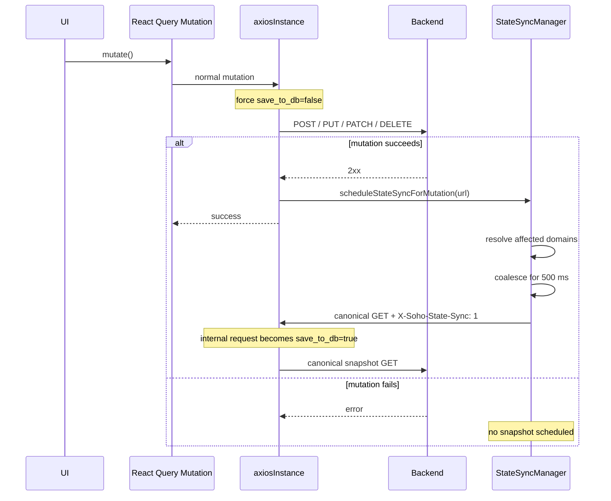
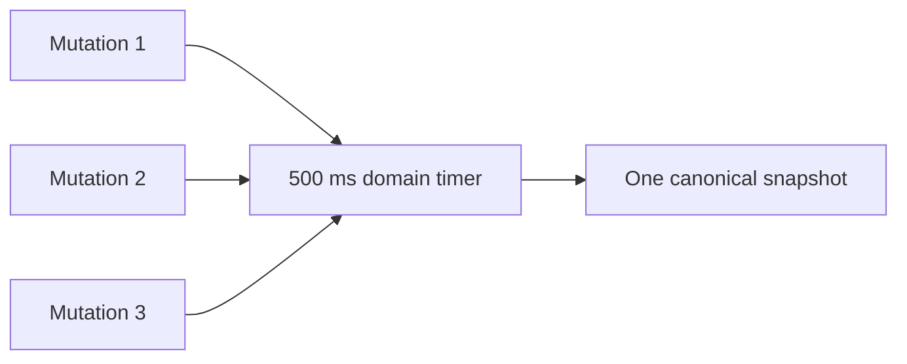
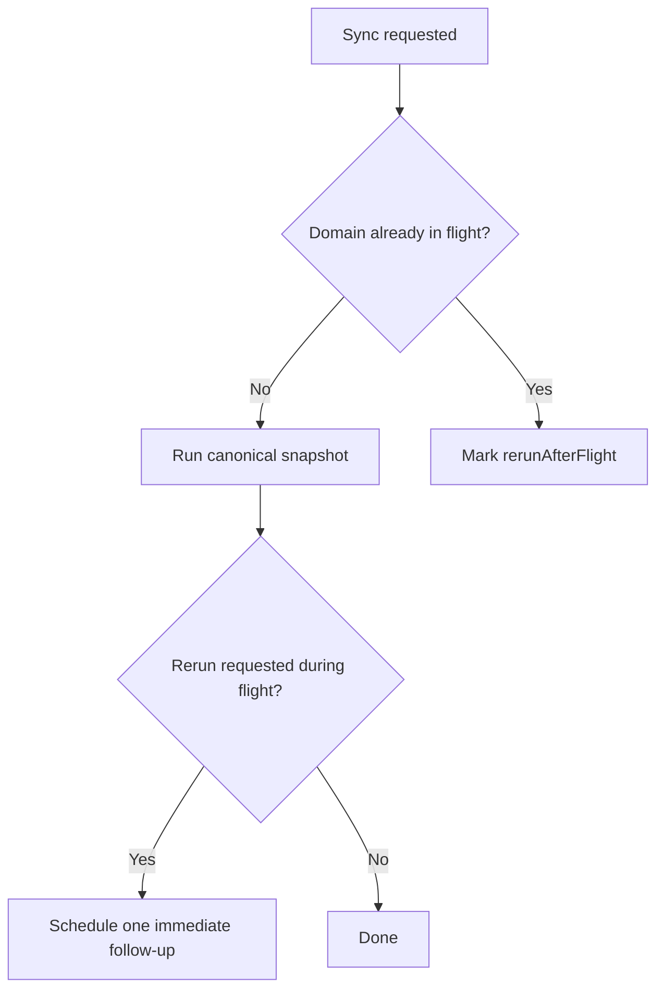

# StateSync و `save_to_db`

این سند، contract canonical در frontend برای persistence مربوط به backend state snapshot است.

Rule مرکزی ساده است:

> Requestهای عادی application، live state را با `save_to_db=false` مشاهده یا mutate می‌کنند. فقط canonical snapshot GETهایی که توسط `StateSyncManager` ساخته می‌شوند مجازند `save_to_db=true` ارسال کنند.

این rule مانع آن می‌شود که feature hookها، polling، UI refetch یا legacy caller flagها درباره‌ی زمان overwrite شدن database snapshot در backend تصمیم بگیرند.

## چرا این Mechanism وجود دارد؟

بعضی endpointهای SOHO backend می‌توانند هم live state مربوط به managed system را برگردانند و هم در صورت دریافت `save_to_db=true` همان state را داخل backend database persist کنند.

بدون ownership متمرکز، مشکلات زیر ممکن است رخ دهند:

- polling query به‌صورت مداوم snapshot بنویسد؛
- page refetch به‌صورت غیرمنتظره state را persist کند؛
- چند mutation باعث duplicate full snapshot شوند؛
- legacy hookها state ناقص یا با timing نامناسب را persist کنند؛
- React Query refresh behavior به persistence behavior وابسته شود؛
- concurrent mutationها باعث شوند snapshot ذخیره‌شده از actual system state عقب بماند.

`StateSyncManager` برای این وجود دارد که persistence صریح، ordered و مستقل از UI data freshness باشد.

## End-to-End Mutation Flow



## Transport Enforcement

`src/lib/axiosInstance.ts` همان enforcement boundary است.

برای requestهای non-auth زیر `/api/` این موارد را انجام می‌دهد:

1. هر inline `save_to_db` query parameter را حذف می‌کند؛
2. authoritative query parameter را خودش اضافه می‌کند؛
3. normal traffic را به `save_to_db=false` force می‌کند؛
4. stale body flagها را در JSON، `FormData` و `URLSearchParams` به false normalize می‌کند؛
5. internal StateSync request را از طریق private state-sync marker تشخیص می‌دهد؛
6. internal marker را پیش از transport حذف می‌کند؛
7. فقط همان internal requestها را مجاز می‌کند به `save_to_db=true` تبدیل شوند.

این behavior عمداً defensive است. ممکن است بعضی legacy feature hookها هنوز caller-level flag قدیمی داشته باشند، اما آن flagها نباید authoritative باشند.

## Internal Marker

StateSync از marker زیر استفاده می‌کند:

```text
X-Soho-State-Sync: 1
```

این marker یک API feature برای ordinary hookها نیست و feature code نباید آن را تنظیم کند.

Request interceptor این marker را consume می‌کند و request را به canonical persistence form تبدیل می‌کند.

## Persisted Domainها

بر اساس contract صحیح فعلی در GitLab، StateSync domainهای frontend عبارت‌اند از:

| Domain | Canonical snapshot request |
| --- | --- |
| `zpool` | `GET /api/zpool/` |
| `filesystem` | `GET /api/filesystem/?detail=true` |
| `disk` | `GET /api/disk` |
| `nfs` | `GET /api/nfs/shares/` |
| `samba-shares` | `GET /api/samba/sharepoints/?property=all` |
| `webshare` | `GET /api/webshare/?detail=true` |

Definitionها داخل `STATE_SYNC_DEFINITIONS` در `src/lib/stateSyncManager.ts` قرار دارند.

در contract فعلی:

- `samba-users` یک StateSync domain مستقل نیست؛
- `samba-groups` یک StateSync domain مستقل نیست؛
- `snmp` یک StateSync domain نیست.

بنابراین وجود endpoint یا mutation در این namespaceها به‌تنهایی نباید باعث schedule شدن canonical persistence snapshot از سمت frontend شود.

Canonical endpoint باید complete domain state مورد نیاز برای backend persistence را نمایش دهد. صرفاً چون یک component از page-specific detail endpoint استفاده می‌کند، آن endpoint را به‌عنوان canonical snapshot انتخاب نکنید.

## Mutation-to-Domain Mapping

یک mutation می‌تواند بیش از resource داخل URL خودش اثر داشته باشد.

Mapping فعلی:

| Mutation URL family | Snapshot domains |
| --- | --- |
| `/api/zpool...` | `zpool`, `disk` |
| `/api/filesystem...` | `filesystem`, `zpool` |
| `/api/disk...` | `disk`, `zpool` |
| `/api/nfs...` | `nfs` |
| `/api/samba/sharepoints...` | `samba-shares` |
| سایر `/api/samba...` | `samba-shares` |
| `/api/webshare...` | `webshare` |
| `/api/snmp...` | هیچ StateSync domain |

Cross-domain dependencyهای موجود intentional هستند.

نمونه‌ها:

- تغییر pool می‌تواند مشخص کند کدام diskها free هستند؛
- تغییر filesystem می‌تواند pool capacity را تغییر دهد؛
- تغییر disk می‌تواند pool state را تغییر دهد؛
- mutationهای مربوط به Samba user/group ممکن است UI membership data را از طریق React Query refresh تحت تأثیر قرار دهند، اما در contract فعلی frontend برای آن‌ها StateSync domain جداگانه‌ای وجود ندارد.

اگر mutation جدید چند persisted view را تغییر می‌دهد، mapping مرکزی را update کنید؛ canonical snapshot را مستقیماً از mutation hook call نکنید.

## SNMP و Diagnostic Operationها

SNMP در contract فعلی GitLab StateSync domain ندارد.

به‌خصوص endpoint زیر diagnostic است:

```text
POST /api/snmp/test-connection/
```

این request فقط connectivity/configuration را test می‌کند و نباید persistence snapshot ایجاد کند.

حتی برای سایر SNMP mutationها نیز تا زمانی که backend/frontend contract به‌صورت صریح تغییر نکرده، frontend StateSync نباید SNMP snapshot schedule کند.

HTTP method یا URL namespace به‌تنهایی مجوز persistence نیست.

## Coalescing برای Mutationهای سریع

Mutation-triggered snapshotها برای هر domain از default delay برابر 500 ms استفاده می‌کنند.



هر mutation جدید برای همان domain، pending timer را reset می‌کند. این behavior مانع آن می‌شود که burst مربوط به operationها بعد از هر request یک full snapshot ایجاد کند.

Domainهای متفاوت timer مستقل دارند.

## In-flight Protection

اگر snapshot مربوط به یک domain در حال اجرا باشد و mutation مرتبط دیگری رخ دهد، StateSync برای همان domain snapshot concurrent دیگری start نمی‌کند.

در عوض mark می‌کند که یک follow-up run لازم است.



این property مهم است: database باید در نهایت روی newest state قرار بگیرد، بدون این‌که برای هر mutation overlapping snapshot ایجاد شود.

## Login/Session Baseline

پس از login موفق یا session restoration، frontend برای هر registered persisted domain یک baseline snapshot درخواست می‌کند.

`syncAllStateDomainsOnce()` session baseline promise را memoize می‌کند تا React renderهای تکراری، React StrictMode behavior یا token-refresh eventها نتوانند در همان authenticated session duplicate full snapshot ایجاد کنند.

Baseline هنگام پایان authenticated session یا آغاز login جدید reset می‌شود.

## Session Reset

`resetStateSyncManager()` موارد زیر را clear می‌کند:

- scheduled snapshot timerها؛
- queued follow-up flagها؛
- session baseline promise.

این behavior مانع آن می‌شود که work scheduleشده در authenticated session قبلی به session بعدی نشت کند.

## ارتباط با React Query

StateSync و React Query دو مسئله‌ی جدا را حل می‌کنند.

### React Query

به این سؤال پاسخ می‌دهد:

> UI در حال حاضر باید چه backend stateای را نمایش دهد؟

React Query مسئول cache، refetch، invalidation، stale data، query lifecycle و shared client-side server state است.

### StateSyncManager

به این سؤال پاسخ می‌دهد:

> Backend چه زمانی باید canonical snapshot مربوط به managed-system state را persist کند؟

StateSyncManager مسئول domain mapping، persistence scheduling، coalescing و session baseline snapshot است.

یک mutation موفق می‌تواند هر دو system را trigger کند، اما هیچ‌کدام جای دیگری را نمی‌گیرد.

## چرا Polling Request نباید Persist کند؟

Polling hook ممکن است هر چند ثانیه یک بار اجرا شود. اگر polling request مالک `save_to_db=true` باشد، صرف باز ماندن Dashboard می‌تواند به‌طور مداوم database snapshot را overwrite کند.

در آن صورت persistence frequency به UI visibility وابسته می‌شود، نه state change یا session synchronization.

به همین دلیل observational readها همیشه normal request هستند و از طریق Axios مقدار `save_to_db=false` می‌گیرند.

## چرا Manual Refresh نباید Persist کند؟

Manual refresh یک UI action برای دریافت live data تازه‌تر است و persistence event محسوب نمی‌شود.

Persistence behavior را به refresh button، `refetch()`، React Query invalidation یا route navigation متصل نکنید.

## Legacy Caller Flagها

بعضی hookهای قدیمی ممکن است fieldهایی مانند این داشته باشند:

```ts
save_to_db: true
```

یا explicit false flag در request param/body.

Axios interceptor از معماری محافظت می‌کند و normal request را مستقل از این stale valueها authoritative false می‌کند. با این حال misleading legacy field باید هنگام maintenance حذف شود، چون به‌اشتباه القا می‌کند hook مالک persistence است.

هنگام حذف چنین fieldای verify کنید:

- request همچنان از `axiosInstance` عبور می‌کند؛
- endpoint برای semantic purpose متفاوت به field نیاز ندارد؛
- اگر persistence لازم است، mutation موفق به StateSync domain صحیح map می‌شود.

## اضافه‌کردن Persisted Domain جدید

برای اضافه‌کردن persisted domain جدید:

1. `StateSyncDomain` را extend کنید؛
2. دقیقاً یک canonical complete-state definition به `STATE_SYNC_DEFINITIONS` اضافه کنید؛
3. mutation URL familyهای مرتبط را در `resolveStateDomainsForMutation` map کنید؛
4. verify کنید canonical request بعد از login/session restoration قابل call و ایمن است؛
5. verify کنید rapid mutationها بدون از دست‌دادن semantics لازم قابل coalesce هستند؛
6. پس از وجود test infrastructure، test مربوطه را اضافه/update کنید؛
7. domain جدید را در همین سند مستند کنید.

Feature-level `save_to_db=true` call اضافه نکنید.

## اضافه‌کردن Mutation به Domain موجود

در حالت معمول hook-specific persistence code لازم نیست.

اگر URL endpoint جدید از قبل با mapping موجود match شود، mutation موفق آن خودکار snapshot صحیح را schedule می‌کند.

در غیر این صورت `resolveStateDomainsForMutation` را extend کنید.

## Authentication Endpointها Exclude هستند

Authentication endpointها از persistence policy exclude هستند. Token issuance، verification و refresh از managed-system snapshot operationها نیستند.

Dedicated auth client نیز در محل لازم token endpointها را از main response-refresh interceptor جدا نگه می‌دارد.

## Failure Behavior

Snapshot failure، mutation موفق اصلی را retroactively fail نمی‌کند؛ mutation از قبل live backend/system state را تغییر داده است.

در development، StateSync domain sync failureها را log می‌کند. اگر freshness مربوط به persisted snapshot در آینده alerting requirement حیاتی شد، ممکن است operational monitoring قوی‌تری لازم باشد.

Mutation success را صرفاً به دلیل fail شدن snapshot بعدی مخفی نکنید، مگر این‌که product/backend contract صریحاً به transactional persistence تغییر کند.

## Debugging Checklist

وقتی behavior مربوط به `save_to_db` اشتباه به نظر می‌رسد:

1. مشخص کنید request عادی است یا internal StateSync request؛
2. final query parameterها را در browser DevTools بررسی کنید؛
3. تأیید کنید request از `axiosInstance` استفاده می‌کند؛
4. تأیید کنید auth endpoint به‌اشتباه application state endpoint classify نشده؛
5. successful mutation URL را با `resolveStateDomainsForMutation` مقایسه کنید؛
6. canonical domain endpoint را verify کنید؛
7. pending coalescing timer برابر 500 ms را بررسی کنید؛
8. بررسی کنید همان domain از قبل in-flight نباشد؛
9. بررسی کنید فقط یک follow-up run queue شده باشد؛
10. verify کنید session baseline عمداً قبلاً deduplicate نشده باشد.

## Maintenance Invariantها

این ruleها نباید شکسته شوند:

- normal `/api/` traffic مالک persistence نیست؛
- caller-level `save_to_db=true` authoritative نیست؛
- فقط canonical snapshot GETهای StateSync می‌توانند persist کنند؛
- persistence فقط پس از mutation موفق یا session baseline initialization اجرا می‌شود؛
- rapid same-domain mutationها coalesce می‌شوند؛
- در هر لحظه حداکثر یک snapshot برای هر domain اجرا می‌شود؛
- mutation هنگام in-flight snapshot حداکثر یک follow-up ضروری ایجاد می‌کند؛
- cross-domain dependencyها صریح باقی می‌مانند؛
- feature hookها canonical persistence snapshot را مستقیم call نمی‌کنند؛
- `samba-users`، `samba-groups` و `snmp` تا زمانی که contract تغییر نکرده نباید به‌عنوان StateSync domain فرض شوند.

## فایل‌های مرتبط

- `src/lib/stateSyncManager.ts`
- `src/lib/axiosInstance.ts`
- `src/contexts/AuthContext.tsx`
- `src/main.tsx`

## مستندات مرتبط

- [`server-state-and-cache.md`](./server-state-and-cache.md)
- [`api-request-lifecycle.md`](./api-request-lifecycle.md)
- [`polling-and-data-refresh.md`](./polling-and-data-refresh.md)
