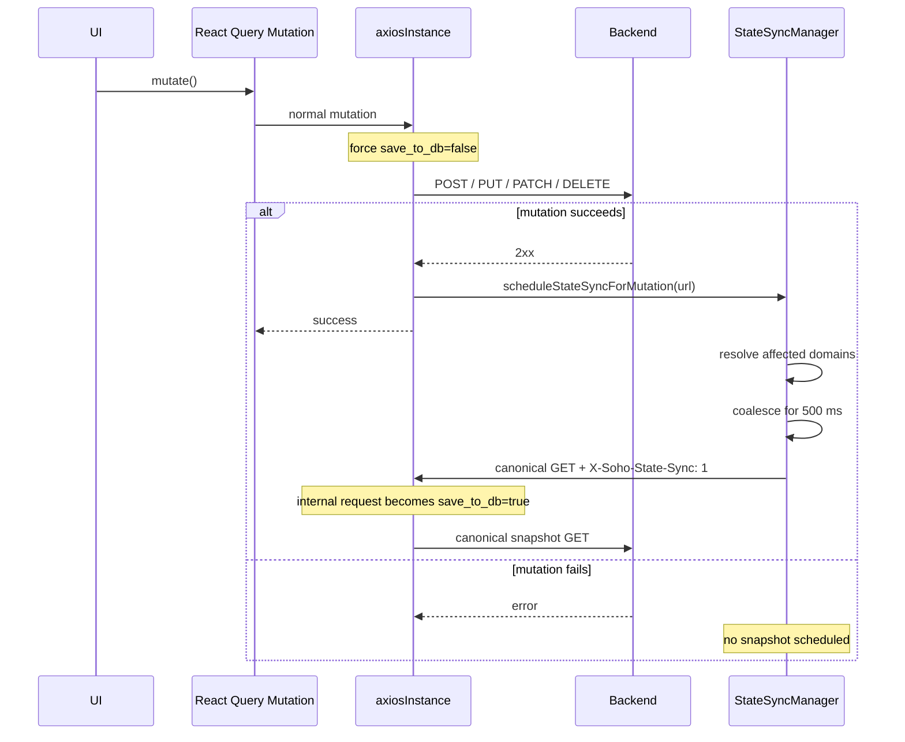
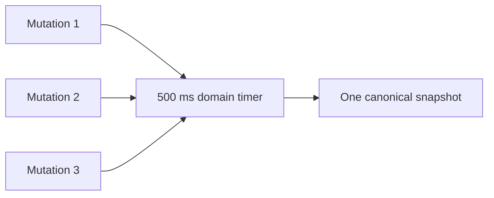
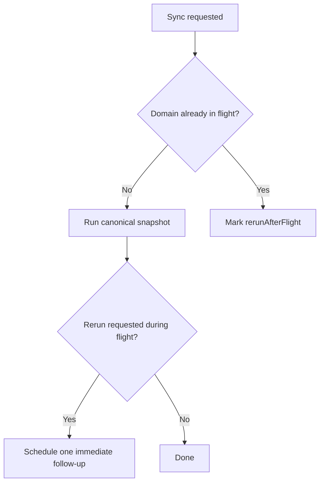

# State Sync and `save_to_db`

This document is the canonical frontend contract for backend state-snapshot persistence.

The central rule is simple:

> Normal application requests observe or mutate live state with `save_to_db=false`. Only canonical snapshot GET requests created by `StateSyncManager` may send `save_to_db=true`.

This rule prevents feature hooks, polling, UI refetches, and legacy caller flags from deciding when the backend database should be overwritten.

## Why this mechanism exists

Some SOHO backend endpoints can both return the live state of the managed system and persist that state into the backend database when `save_to_db=true` is supplied.

Without central ownership, several problems are possible:

- a polling query could repeatedly write snapshots;
- a page refetch could unexpectedly persist state;
- multiple mutations could trigger duplicate full snapshots;
- legacy hooks could persist incomplete or badly timed state;
- React Query refresh behavior could become coupled to persistence behavior;
- concurrent mutations could leave the stored snapshot behind the actual system state.

`StateSyncManager` exists to make persistence explicit, ordered, and independent from UI data freshness.

## End-to-end mutation flow



## Transport enforcement

`src/lib/axiosInstance.ts` is the enforcement boundary.

For non-auth `/api/` requests it:

1. removes any inline `save_to_db` query parameter;
2. adds the authoritative query parameter itself;
3. forces normal traffic to `save_to_db=false`;
4. normalizes stale body flags in JSON, `FormData`, and `URLSearchParams` to false;
5. recognizes internal StateSync requests through the private state-sync marker;
6. removes the internal marker before transport;
7. allows only those internal requests to become `save_to_db=true`.

This is deliberately defensive. Older feature hooks may still contain legacy caller-level flags, but those flags must not be authoritative.

## Internal marker

StateSync uses:

```text
X-Soho-State-Sync: 1
```

as an internal transport marker.

This marker is not an API feature for ordinary hooks. Feature code must not set it.

The request interceptor consumes the marker and converts the request into the canonical persistence form.

## Persisted domains

The current persisted state domains are:

| Domain | Canonical snapshot request |
| --- | --- |
| `zpool` | `GET /api/zpool/` |
| `filesystem` | `GET /api/filesystem/?detail=true` |
| `disk` | `GET /api/disk` |
| `nfs` | `GET /api/nfs/shares/` |
| `samba-users` | `GET /api/samba/users/?property=all` |
| `samba-groups` | `GET /api/samba/groups/?property=all&contain_system_groups=false` |
| `samba-shares` | `GET /api/samba/sharepoints/?property=all` |
| `webshare` | `GET /api/webshare/?detail=true` |
| `snmp` | `GET /api/snmp/info/` |

The definitions live in `STATE_SYNC_DEFINITIONS` in `src/lib/stateSyncManager.ts`.

A canonical endpoint must represent the complete domain state needed by backend persistence. Do not choose a page-specific detail endpoint simply because a component already uses it.

## Mutation-to-domain mapping

A mutation can affect more than the resource named in its URL.

Current mapping:

| Mutation URL family | Snapshot domains |
| --- | --- |
| `/api/zpool...` | `zpool`, `disk` |
| `/api/filesystem...` | `filesystem`, `zpool` |
| `/api/disk...` | `disk`, `zpool` |
| `/api/nfs...` | `nfs` |
| `/api/samba/users...` | `samba-users`, `samba-groups` |
| `/api/samba/groups...` | `samba-groups`, `samba-users` |
| `/api/samba/sharepoints...` | `samba-shares` |
| other `/api/samba...` | all Samba domains |
| `/api/webshare...` | `webshare` |
| `/api/snmp...` | `snmp` |

These cross-domain dependencies are intentional.

Examples:

- changing a pool can change which disks are free;
- changing a filesystem can change pool capacity;
- changing a disk can change pool state;
- Samba user/group membership is visible from both user and group views.

If a new mutation changes multiple persisted views, update this mapping rather than calling snapshots directly from the mutation hook.

## Coalescing rapid mutations

Mutation-triggered snapshots use a default delay of 500 ms per domain.



Each new mutation for the same domain resets the pending timer. This prevents bursts of operations from causing a full snapshot after every individual request.

Different domains keep independent timers.

## In-flight protection

If a domain snapshot is already running and another relevant mutation occurs, StateSync does not start a concurrent snapshot for that domain.

Instead it records that one follow-up run is required.



This property is important: the database should eventually end on the newest state without creating overlapping snapshots for every mutation.

## Login/session baseline

After a successful login or session restoration, the frontend initiates one baseline snapshot for every registered persisted domain.

`syncAllStateDomainsOnce()` memoizes the session baseline promise so repeated React renders, React StrictMode behavior, and token-refresh events cannot start duplicate full snapshots during the same authenticated session.

The baseline is reset when the authenticated session ends or a new login begins.

## Session reset

`resetStateSyncManager()` clears:

- scheduled snapshot timers;
- queued follow-up flags;
- the session baseline promise.

This prevents work scheduled under one authenticated session from being treated as work belonging to a later session.

## Relationship to React Query

StateSync and React Query solve separate problems.

### React Query

Answers:

> What backend state should the UI currently display?

It handles cache, refetch, invalidation, stale data, query lifecycle, and shared client-side server state.

### StateSyncManager

Answers:

> When should the backend persist a canonical snapshot of managed-system state?

It handles domain mapping, persistence scheduling, coalescing, and session baseline snapshots.

A successful mutation may trigger both systems, but one does not replace the other.

## Why polling requests must not persist

A polling hook can execute every few seconds. If polling requests owned `save_to_db=true`, merely keeping a dashboard open could continuously overwrite database snapshots.

That would make persistence frequency depend on UI visibility rather than state changes or session synchronization.

For this reason, observational reads are always normal requests and therefore receive `save_to_db=false` through Axios.

## Why manual refresh must not persist

Manual refresh is a UI action asking for fresher live data. It is not a persistence event.

Do not attach persistence behavior to refresh buttons, `refetch()`, React Query invalidation, or route navigation.

## Legacy caller flags

Some older hooks may contain fields such as:

```ts
save_to_db: true
```

or explicit false flags in request params/bodies.

The Axios interceptor protects the architecture by making normal requests authoritative false regardless of these stale values. However, misleading legacy fields should be removed during maintenance because they falsely imply that the hook controls persistence.

When removing one, verify that:

- the request still passes through `axiosInstance`;
- the endpoint does not require the field for a different semantic purpose;
- a successful mutation is mapped to the appropriate StateSync domain when persistence is needed.

## Adding a persisted domain

To add a new persisted domain:

1. extend `StateSyncDomain`;
2. add exactly one canonical complete-state definition to `STATE_SYNC_DEFINITIONS`;
3. map relevant successful mutation URL families in `resolveStateDomainsForMutation`;
4. verify the canonical request can safely be called after login/session restoration;
5. verify rapid mutations can be coalesced without losing required semantics;
6. add/update tests when test infrastructure exists;
7. document the new domain here.

Do not add a feature-level `save_to_db=true` call.

## Adding a mutation to an existing domain

Usually no hook-specific persistence code is needed.

If the new endpoint URL already matches an existing mapping, its successful mutation will automatically schedule the correct snapshot.

If not, extend `resolveStateDomainsForMutation`.

## Authentication endpoints are excluded

Authentication endpoints are excluded from the persistence policy. Token issuance, verification, and refresh are not managed-system snapshot operations.

The dedicated auth client also keeps token endpoints away from the main response-refresh interceptor where appropriate.

## Failure behavior

A snapshot failure does not retroactively fail the original successful mutation. The mutation already changed live backend/system state.

In development, StateSync logs failed domain sync operations. Operational monitoring may need stronger reporting in the future if persisted snapshot freshness becomes a critical alerting requirement.

Do not hide a mutation success merely because a later snapshot failed unless the product/backend contract is explicitly changed to require transactional persistence.

## Debugging checklist

When `save_to_db` behavior looks wrong:

1. identify whether the request is a normal request or internal StateSync request;
2. inspect the final query parameters in browser DevTools;
3. confirm the request uses `axiosInstance`;
4. confirm auth endpoints are not being mistaken for application state endpoints;
5. check the successful mutation URL against `resolveStateDomainsForMutation`;
6. verify the canonical domain endpoint;
7. look for a pending 500 ms coalescing timer;
8. check whether the same domain is already in flight;
9. check whether one follow-up run is queued;
10. verify the session baseline has not already been deduplicated intentionally.

## Maintenance invariants

Do not break these rules:

- normal `/api/` traffic does not own persistence;
- caller-level `save_to_db=true` is not authoritative;
- only StateSync canonical snapshot GETs may persist;
- persistence runs only after successful mutations or session baseline initialization;
- rapid same-domain mutations are coalesced;
- at most one snapshot per domain runs at a time;
- a mutation during an in-flight snapshot produces at most one necessary follow-up run;
- cross-domain dependencies remain explicit;
- feature hooks do not directly call canonical persistence snapshots.

## Related files

- `src/lib/stateSyncManager.ts`
- `src/lib/axiosInstance.ts`
- `src/contexts/AuthContext.tsx`
- `src/main.tsx`

## Related documentation

- [`server-state-and-cache.md`](./server-state-and-cache.md)
- [`api-request-lifecycle.md`](./api-request-lifecycle.md)
- [`polling-and-data-refresh.md`](./polling-and-data-refresh.md)
