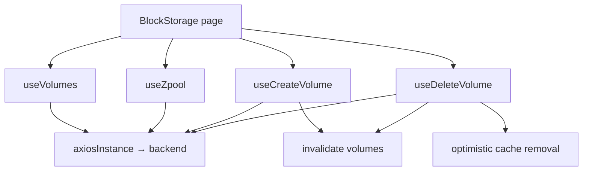

# Block Storage

## هدف

Block Storage، feature مربوط به SOHO UI برای list کردن، ساخت، refresh و حذف backend Volume resourceهایی است که به storage poolها مرتبط‌اند.

Route: `/block-space`

Entry point: `src/pages/BlockStorage.tsx`

در مقایسه با Integrated Storage، این feature orchestration surface کوچک‌تری دارد: page، Volume collection را می‌خواند، zpoolها را فقط برای ساخت pool optionهای Create modal می‌خواند و create/delete behavior را به hookهای اختصاصی واگذار می‌کند.

## مسئولیت‌های اصلی

Page موارد زیر را هماهنگ می‌کند:

- خواندن current Volume collection؛
- derive کردن dynamic table columnها از Volume attributeهای برگشتی؛
- manual refresh مربوط به Volume state؛
- ساخت sorted pool option از canonical zpool query؛
- ساخت Volume داخل selected pool؛
- حذف Volume پشت confirmation flow؛
- نمایش نتیجه‌ی create/delete از طریق toast notification.

## Runtime Flow



## Volume Query

Hook: `useVolumes()`

Query key:

```text
['volumes']
```

Endpoint:

```text
GET /api/volume/
```

Hook continuous polling configure نمی‌کند. از lifecycle عادی React Query پیروی می‌کند و page header نیز می‌تواند صریحاً آن را refresh کند.

Refresh action مربوط به page مستقیماً `refetch()` را call می‌کند و هنگام refetch شدن disabled است.

## Volume Response Normalization

Backend `data` payload در دو shape پذیرفته می‌شود:

- array از raw Volume objectها؛
- objectای که با full Volume name key شده است.

هر item به `VolumeEntry` normalize می‌شود که شامل موارد زیر است:

- `id` / `fullName`؛
- `poolName`؛
- `volumeName`؛
- flat `attributes` list؛
- `attributeMap` lookup؛
- original enriched raw object.

Expected logical name format:

```text
pool/volume
```

اگر backend usable name ارائه نکند، normalizer fallback nameای مانند `volume-1` می‌سازد تا frontend همچنان stable entry برای render داشته باشد.

Entryها ابتدا بر اساس pool و سپس Volume name sort می‌شوند.

## Dynamic Table Attributeها

`BlockStorage.tsx` تمام normalized Volumeها را inspect می‌کند و unionای از attribute keyها می‌سازد و `name` را exclude می‌کند.

در نتیجه `VolumesTable` می‌تواند backend-provided Volume propertyها را بدون hard-code کردن کل attribute schema در page render کند.

هنگام اضافه‌شدن backend attribute جدید، verify کنید باید خودکار نمایش داده شود یا table باید عمداً آن را suppress/localize کند.

## Pool Optionها

Create-Volume pool optionها از canonical zpool hook می‌آیند:

```text
['zpool']
```

بنابراین Block Storage page یک implementation جداگانه برای pool list نگه نمی‌دارد.

Zpool query هنگام mounted بودن از cadence عادی 30 ثانیه‌ای استفاده می‌کند، در حالی که خود Volume query continuous interval ندارد.

## ساخت Volume

Hook: `useCreateVolume()`

Endpoint:

```text
POST /api/volume/create
```

Domain payload:

```text
volume_name
volsize
```

Full name ارسالی به‌شکل زیر ساخته می‌شود:

```text
<pool>/<volume>
```

Whitespace پیش از mutation حذف می‌شود.

Size با backend suffix ارسال می‌شود:

- UI `GB` → `G`
- UI `TB` → `T`

مثال:

```json
{
  "volume_name": "tank/app-data",
  "volsize": "100G"
}
```

### Frontend Validation

پیش از submit، hook موارد زیر را require می‌کند:

- selected pool؛
- Volume name غیرخالی؛
- numeric size غیرخالی؛
- size بزرگ‌تر از صفر.

Modal، characterهای فارسی را از name input حذف می‌کند و هنگام واردشدن Persian character، validation message توضیحی کوتاه نمایش می‌دهد.

این checkها Operator UX را بهتر می‌کنند. Backend validation همچنان authoritative است.

### Success Behavior

پس از create موفق:

1. `['volumes']` invalidate می‌شود؛
2. Create modal بسته/reset می‌شود؛
3. page-level success toast نمایش داده می‌شود.

## حذف Volume

Hook: `useDeleteVolume()`

Endpoint:

```text
DELETE /api/volume/delete
```

Axios request body:

```json
{
  "volume_name": "pool/volume"
}
```

Deletion confirmation-driven است. `requestDelete()` target entry را ذخیره می‌کند و `ConfirmDeleteVolumeModal` را باز می‌کند؛ فقط `confirmDelete()` mutation را شروع می‌کند.

### Success Behavior

Hook ابتدا item حذف‌شده را با `setQueryData()` از cache فعلی `['volumes']` حذف می‌کند و سپس query را invalidate می‌کند.

این کار feedback فوری در UI می‌دهد، ولی authoritative post-mutation state را دوباره از backend می‌گیرد.

## Error Handling

Create errorها از common API fieldهای زیر normalize می‌شوند:

- `detail`؛
- `message`؛
- `errors`.

Delete errorها در حال حاضر از Error برگشتی Axios mutation path استفاده می‌کنند و هم به‌صورت `errorMessage` در confirmation controller و هم از طریق page toast callback expose می‌شوند.

Create/delete failشده نباید modal را طوری ببندد که انگار operation موفق بوده است.

## StateSync Boundary

`StateSyncManager` فعلی **domain مربوط به `volume` ندارد** و mutationهای `/api/volume/*` را به canonical `save_to_db=true` snapshot map نمی‌کند.

بنابراین behavior فعلی frontend برای Volume mutation:

```text
Volume mutation
  → backend request
  → successful response
  → React Query volume refresh
  → no volume-specific StateSync snapshot
```

برای جبران این موضوع به‌صورت ad-hoc `save_to_db=true` به Volume hookها اضافه نکنید.

اگر Volume state باید در snapshot database مربوط به backend persist شود، ابتدا backend persistence contract را تأیید کنید و سپس centralized StateSync architecture را آگاهانه extend کنید.

این یک architectural boundary است که به backend/product confirmation نیاز دارد و feature component نباید local درباره‌ی آن تصمیم بگیرد.

## Invariantهای مهم

- `['volumes']` canonical client cache key برای Volume collection است.
- Pool optionها `useZpool()` را reuse می‌کنند و duplicate pool state نگه نمی‌دارند.
- Manual refresh observational است و نباید persistence side effect ایجاد کند.
- Delete confirmation-driven باقی می‌ماند.
- Optimistic cache removal پس از delete با invalidation دنبال می‌شود تا backend authoritative باقی بماند.
- Volume persistence در حال حاضر خارج از StateSync domainهای تعریف‌شده است؛ داخل UI component workaround نسازید.

## Failure Scenarioهای رایج

### Create Modal هیچ Pool Option ندارد

Canonical query یعنی `['zpool']` و backend response آن را بررسی کنید، نه Volume query را.

### Volume جدید بعد از Create دیده نمی‌شود

بررسی کنید:

1. `POST /api/volume/create` موفق بوده یا خیر؛
2. `['volumes']` invalidate شده یا خیر؛
3. response مربوط به `GET /api/volume/`؛
4. response normalization در صورتی که backend shape مربوط به `data` را تغییر داده باشد.

### Volume حذف‌شده لحظه‌ای ناپدید می‌شود و برمی‌گردد

Optimistic cache removal کار کرده، اما authoritative refetch همچنان Volume را برگردانده است. Backend delete operation را بررسی کنید و refetch را suppress نکنید.

### Volume Attributeها از Table ناپدید شده‌اند

Raw backend attribute nameها و dynamic union ساخته‌شده در `BlockStorage.tsx` را بررسی کنید. Page فقط `name` را از dynamic attribute list exclude می‌کند.

### Backend Snapshot شامل Volume Change نیست

ابتدا React Query را debug نکنید. Frontend در حال حاضر Volume StateSync domain ندارد. تأیید کنید Volume snapshot persistence واقعاً بخشی از backend contract هست یا خیر.

## راهنمای Extension

### اضافه‌کردن Volume Mutation

1. backend call را در hook/lib function اختصاصی قرار دهید؛
2. پیش از mutation، Operator input را validate کنید؛
3. پس از success، `['volumes']` را invalidate کنید؛
4. destructive operation را پشت confirmation نگه دارید؛
5. به‌جای local persistence flag، بررسی کنید operation به centralized StateSync domain جدید نیاز دارد یا خیر؛
6. هر non-atomic/multi-step backend semantic را مستند کنید.

### اضافه‌کردن Fixed Table Property

اگر backend attribute نیازمند formatting خاص یا business meaning است، explicit table column را به اتکای صرف به dynamic attribute union ترجیح دهید.

## فایل‌های مرتبط

- `src/pages/BlockStorage.tsx`
- `src/components/block-storage/VolumesTable.tsx`
- `src/components/block-storage/CreateVolumeModal.tsx`
- `src/components/block-storage/ConfirmDeleteVolumeModal.tsx`
- `src/hooks/useVolumes.ts`
- `src/hooks/useCreateVolume.ts`
- `src/hooks/useDeleteVolume.ts`
- `src/hooks/useZpool.ts`

## مستندات مرتبط

- [`../04-core-flows/server-state-and-cache.md`](../04-core-flows/server-state-and-cache.md)
- [`../04-core-flows/api-request-lifecycle.md`](../04-core-flows/api-request-lifecycle.md)
- [`../04-core-flows/state-sync-save-to-db.md`](../04-core-flows/state-sync-save-to-db.md)
