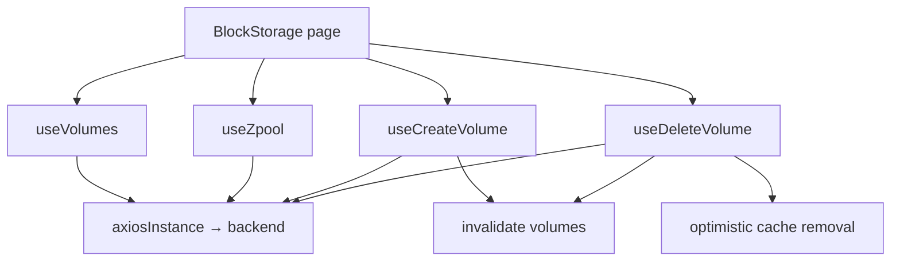

# Block Storage

## Purpose

Block Storage is the SOHO UI feature for listing, creating, refreshing, and deleting backend Volume resources associated with storage pools.

Route: `/block-space`

Entry point: `src/pages/BlockStorage.tsx`

Compared with Integrated Storage, this feature has a deliberately smaller orchestration surface: the page reads the Volume collection, reads zpools only to build the Create modal's pool choices, and delegates create/delete behavior to dedicated hooks.

## Main responsibilities

The page coordinates:

- reading the current Volume collection;
- deriving dynamic table columns from returned Volume attributes;
- manually refreshing Volume state;
- building sorted pool options from the canonical zpool query;
- creating a Volume in a selected pool;
- deleting a Volume behind a confirmation flow;
- surfacing create/delete outcomes through toast notifications.

## Runtime flow



## Volume query

Hook: `useVolumes()`

Query key:

```text
['volumes']
```

Endpoint:

```text
GET /api/volume/
```

The hook does not configure continuous polling. It follows the normal React Query lifecycle and can also be explicitly refreshed by the page header.

The page's Refresh action calls the query's `refetch()` directly and disables itself while a refetch is in progress.

## Volume response normalization

The backend `data` payload is accepted in two shapes:

- an array of raw Volume objects;
- an object keyed by full Volume name.

Each item is normalized into a `VolumeEntry` containing:

- `id` / `fullName`;
- `poolName`;
- `volumeName`;
- a flat `attributes` list;
- an `attributeMap` lookup;
- the original enriched raw object.

The expected logical name format is:

```text
pool/volume
```

If the backend does not expose a usable name, the normalizer creates a fallback name such as `volume-1` so the frontend can still render a stable entry.

Entries are sorted first by pool and then by Volume name.

## Dynamic table attributes

`BlockStorage.tsx` inspects every normalized Volume and builds a union of attribute keys, excluding `name`.

This allows `VolumesTable` to render backend-provided Volume properties without the page hard-coding the complete attribute schema.

When adding backend attributes, verify whether they should appear automatically or whether the table should intentionally suppress/localize them.

## Pool options

Create-Volume pool choices come from the canonical zpool hook:

```text
['zpool']
```

This means the Block Storage page itself does not maintain a second pool list implementation.

The zpool query currently uses its ordinary 30-second cadence while mounted, even though the Volume query itself has no continuous interval.

## Create Volume

Hook: `useCreateVolume()`

Endpoint:

```text
POST /api/volume/create
```

Domain payload:

```text
volume_name
volsize
```

The submitted full name is built as:

```text
<pool>/<volume>
```

Whitespace is removed before mutation.

The size is submitted with a backend suffix:

- UI `GB` → `G`
- UI `TB` → `T`

Example:

```json
{
  "volume_name": "tank/app-data",
  "volsize": "100G"
}
```

### Frontend validation

Before submitting, the hook requires:

- a selected pool;
- a non-empty Volume name;
- a non-empty numeric size;
- size greater than zero.

The modal removes Persian characters from the name input and temporarily shows an explanatory validation message when Persian characters are entered.

These checks improve operator UX. Backend validation remains authoritative.

### Success behavior

After a successful create:

1. invalidate `['volumes']`;
2. close/reset the Create modal;
3. show the page-level success toast.

## Delete Volume

Hook: `useDeleteVolume()`

Endpoint:

```text
DELETE /api/volume/delete
```

Axios request body:

```json
{
  "volume_name": "pool/volume"
}
```

Deletion is confirmation-driven. `requestDelete()` stores the target entry, which opens `ConfirmDeleteVolumeModal`; only `confirmDelete()` starts the mutation.

### Success behavior

The hook first removes the deleted item from the existing `['volumes']` cache with `setQueryData()` and then invalidates the query.

This gives immediate UI feedback while still asking the backend for authoritative post-mutation state.

## Error handling

Create errors are normalized from common API fields:

- `detail`;
- `message`;
- `errors`.

Delete errors currently use the Error returned by the Axios mutation path and are exposed inside the confirmation controller as `errorMessage` as well as through the page toast callback.

A failed create/delete must not close its modal as though the operation succeeded.

## StateSync boundary

The current `StateSyncManager` does **not** define a `volume` domain and does not map `/api/volume/*` mutations to a canonical `save_to_db=true` snapshot.

Therefore the current frontend behavior for Volume mutations is:

```text
Volume mutation
  → backend request
  → successful response
  → React Query volume refresh
  → no volume-specific StateSync snapshot
```

Do not silently add an ad-hoc `save_to_db=true` flag to Volume hooks to compensate for this.

If Volume state is expected to be persisted into the backend's snapshot database, first confirm the backend persistence contract and then extend the centralized StateSync architecture deliberately.

This is an architectural boundary requiring backend/product confirmation, not something a feature component should decide locally.

## Important invariants

- `['volumes']` is the canonical client cache key for the Volume collection.
- Pool choices reuse `useZpool()` rather than maintaining duplicate pool state.
- Manual refresh is observational and must not trigger persistence side effects.
- Delete remains confirmation-driven.
- Optimistic cache removal after delete is followed by invalidation so the backend remains authoritative.
- Volume persistence is currently outside the defined StateSync domains; do not work around that inside UI components.

## Common failure scenarios

### Create modal has no pool options

Inspect the canonical `['zpool']` query and its backend response rather than the Volume query.

### A newly created Volume does not appear

Check:

1. whether `POST /api/volume/create` succeeded;
2. whether `['volumes']` was invalidated;
3. the response from `GET /api/volume/`;
4. response normalization if the backend changed its `data` shape.

### Deleted Volume briefly disappears then returns

The optimistic cache removal worked, but the authoritative refetch still returned the Volume. Investigate the backend delete operation rather than suppressing the refetch.

### Volume attributes disappear from the table

Check the raw backend attribute names and the dynamic union built by `BlockStorage.tsx`. The page excludes only `name` from the dynamic attribute list.

### Backend snapshot does not contain Volume changes

Do not debug React Query first. The frontend currently has no Volume StateSync domain. Confirm whether Volume snapshot persistence is part of the backend contract.

## Extension guide

### Adding a Volume mutation

1. place the backend call in a dedicated hook/lib function;
2. validate operator input before mutation;
3. invalidate `['volumes']` on success;
4. keep confirmation around destructive operations;
5. confirm whether the operation requires a new centralized StateSync domain rather than adding persistence flags locally;
6. document any non-atomic/multi-step backend semantics.

### Adding a fixed table property

If a backend attribute needs special formatting or business meaning, prefer an explicit table column instead of relying only on the dynamic attribute union.

## Related files

- `src/pages/BlockStorage.tsx`
- `src/components/block-storage/VolumesTable.tsx`
- `src/components/block-storage/CreateVolumeModal.tsx`
- `src/components/block-storage/ConfirmDeleteVolumeModal.tsx`
- `src/hooks/useVolumes.ts`
- `src/hooks/useCreateVolume.ts`
- `src/hooks/useDeleteVolume.ts`
- `src/hooks/useZpool.ts`

## Related documentation

- [`../04-core-flows/server-state-and-cache.md`](../04-core-flows/server-state-and-cache.md)
- [`../04-core-flows/api-request-lifecycle.md`](../04-core-flows/api-request-lifecycle.md)
- [`../04-core-flows/state-sync-save-to-db.md`](../04-core-flows/state-sync-save-to-db.md)
