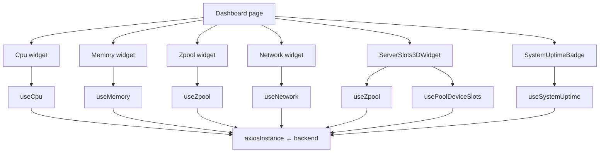
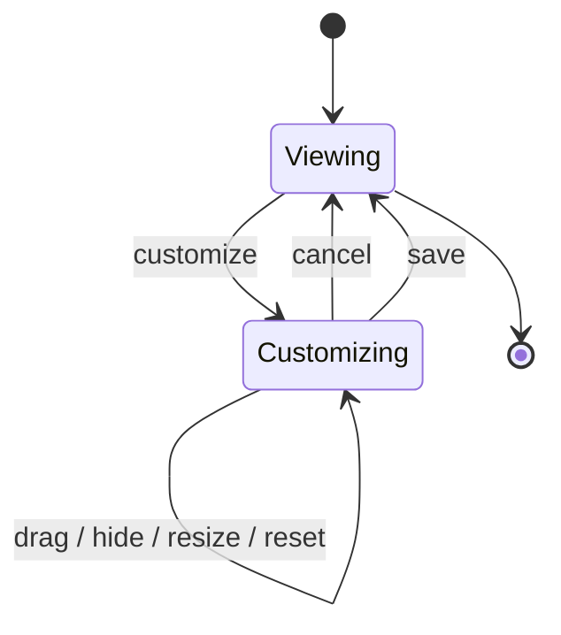

# Dashboard

## هدف

Dashboard سطح اصلی مانیتورینگ و نمای کلی SOHO UI برای operator است. این صفحه telemetry زنده‌ی سیستم، سلامت storage، visualization مربوط به slotهای سرور، system uptime و layout قابل شخصی‌سازی widgetها برای هر کاربر را در یکجا ترکیب می‌کند.

Route:

```text
/dashboard
```

Entry point:

```text
src/pages/Dashboard.tsx
```

این صفحه عمداً نقش aggregation layer را دارد. Dashboard مالک persistence مربوط به backend state منابع مانیتور‌شده نیست و domain logic موجود در feature hookهای هر widget را نیز دوباره پیاده‌سازی نمی‌کند.

## مسئولیت‌های اصلی

Dashboard مسئول موارد زیر است:

- compose کردن widgetهای مانیتورینگ در یک grid واکنش‌گرا؛
- امکان جابه‌جایی، hide، restore و resize کردن widgetها توسط operator؛
- persist کردن صرفاً preference مربوط به Dashboard layout در `localStorage` مرورگر؛
- scope کردن layoutهای ذخیره‌شده بر اساس username کاربر authenticated؛
- نمایش telemetry با refresh سریع، بدون ادامه‌ی polling در tab مخفی؛
- ارائه‌ی نمای سه‌بعدی slotهای سرور و کنترل‌های موجود برای system power action.

Dashboard مسئول موارد زیر نیست:

- persisted backend state snapshotها؛
- پیاده‌سازی authentication/session؛
- ایجاد API clientهای تکراری برای CPU، memory، network، zpool، disk-slot یا uptime؛
- در نظر گرفتن layout preference به‌عنوان authoritative server-side state.

## registry فعلی widgetها

registry فعال در `Dashboard.tsx` در حال حاضر دقیقاً شامل widgetهای زیر است:

| Widget id | Component | کاربرد اصلی |
| --- | --- | --- |
| `cpu` | `Cpu` | نمایش زنده‌ی مصرف CPU و اطلاعات processor |
| `memory` | `Memory` | نمایش زنده‌ی memory utilization |
| `zpool-overview` | `Zpool` | نمای کلی health/capacity مربوط به poolها |
| `server-3d-slots` | `ServerSlots3DWidget` | visualization تعاملی chassis سرور و disk slotها |
| `network` | `Network` | اطلاعات network traffic و interfaceها |

Widget idها را مانند persisted UI-schema identifier در نظر بگیرید، زیرا Dashboard layoutهای ذخیره‌شده به آن‌ها reference می‌دهند.

تعریف widgetهای حذف‌شده را به شکل commented code نگه ندارید. Git history مرجع بازیابی موارد حذف‌شده است و source فعال باید فقط product surface فعلی را نشان دهد.

## runtime data flow



React Query مالک server state مربوط به runtime monitoring است. خود صفحه فقط layout-customization state را مدیریت می‌کند.

## نقشه‌ی API و refresh

| Data | Query key | Endpoint(s) | رفتار refresh |
| --- | --- | --- | --- |
| CPU | `['cpu']` | `GET /api/system/cpu/` | هر 2 ثانیه در زمان mount بودن؛ بدون background interval |
| Memory | `['memory']` | `GET /api/system/memory/` | هر 2 ثانیه در زمان mount بودن؛ بدون background interval |
| Zpool overview | `['zpool']` | `GET /api/zpool/` | به‌صورت پیش‌فرض هر 30 ثانیه |
| Network base data | `['network']` | `GET /api/system/network` و سپس detail GET برای هر interface | وابسته به query lifecycle؛ bandwidth جدا است |
| Network bandwidth | `['network','bandwidth-snapshots',interfaceNames]` | برای هر interface، `GET /api/system/network/{name}/bandwidth/` | هر 2 ثانیه در حالت active |
| System uptime | `['system','uptime']` | `GET /api/system/uptime/` | هر 1 ثانیه در زمان mount بودن |
| 3D slot zpool list | `['zpool']` | `GET /api/zpool/` | هر 30 ثانیه |
| 3D slot mapping | خانواده‌ی query key مربوط به zpool/device slot | disk inventory + endpointهای device برای هر pool | override برابر 10 ثانیه در `ServerSlots3DWidget` |

تمام این requestها observational هستند و نباید مالک persistence با `save_to_db=true` باشند.

## Dashboard layout state

Layout state شامل ساختار زیر است:

```ts
interface LayoutState {
  order: string[];
  hidden: string[];
  sizeOverrides: Record<string, string>;
}
```

صفحه میان این دو state تفاوت قائل می‌شود:

- `persistedLayout` — آخرین layout تأیید و commit‌شده‌ی کاربر؛
- `draftLayout` — draft فعال هنگام customization، یا `null` وقتی customization فعال نیست.

این تفکیک عمدی است. Drag، hide یا resize نباید بلافاصله preference ذخیره‌شده را overwrite کند؛ operator باید بتواند بدون side effect عملیات را Cancel کند.

## contract مربوط به localStorage

Base key:

```text
dashboard-layout.v2
```

Per-user key:

```text
dashboard-layout.v2:<lowercase-username>
```

Fallback در نبود username:

```text
dashboard-layout.v2:guest
```

این storage صرفاً برای UI preference است و هیچ ارتباطی با token storage یا StateSync persistence ندارد.

## نرمال‌سازی layout

داده‌ی persist‌شده‌ی مرورگر بالقوه stale در نظر گرفته می‌شود، زیرا تعریف widgetها ممکن است میان releaseها تغییر کند.

نرمال‌سازی موارد زیر را انجام می‌دهد:

- حذف widget idهای ناشناخته؛
- حذف idهای تکراری؛
- اضافه کردن widgetهای فعلی که در layoutهای قدیمی وجود ندارند؛
- حذف hidden idهایی که دیگر وجود ندارند؛
- نگه‌داشتن size override فقط برای widget idهای فعلی.

این compatibility behavior یک maintenance invariant است. اضافه، حذف یا rename کردن widget id بدون در نظر گرفتن layoutهای ذخیره‌شده می‌تواند customization state کاربر را خراب کند.

## جریان customization



هنگام شروع customization، صفحه committed layout را در یک draft clone می‌کند.

در Save:

1. draft نسبت به widget registry فعال normalize می‌شود؛
2. نتیجه به committed/persisted state منتقل می‌شود؛
3. customization mode پایان می‌یابد؛
4. persistence effect، preference تأییدشده را در `localStorage` می‌نویسد.

در Cancel، draft discard می‌شود.

## قانون drag-and-drop

فقط widgetهای visible در sortable interaction شرکت می‌کنند.

Reorder کردن widgetهای visible باید hidden widget idها را در ordering کامل حفظ کند تا widgetهای مخفی بعداً به شکل قابل پیش‌بینی restore شوند.

به همین دلیل drag handler نباید کل آرایه‌ی `order` را صرفاً با نتیجه‌ی visible DnD جایگزین کند.

## layout presetها

Widgetها می‌توانند موارد زیر را تعریف کنند:

- responsive column span؛
- row span؛
- minimum height؛
- named layout preset اختیاری.

صفحه یک preset با نام `default` را از base configuration می‌سازد. انتخاب default به‌جای ذخیره‌ی کپی دیگری از default layout data، size override اضافی را حذف می‌کند.

Responsive spanها پیش از تولید CSS grid declaration clamp می‌شوند.

## Server 3D widget

`ServerSlots3DWidget` داده‌ها و stateهای زیر را ترکیب می‌کند:

- zpool list فعلی؛
- pool-device membership؛
- global disk inventory؛
- physical slot metadata؛
- local selected-slot state؛
- actionهای reboot/poweroff از `SystemPowerActionsContext`.

Slot mapping عمداً با interval برابر 10 ثانیه refresh می‌شود که از cadence عادی 30 ثانیه‌ای pool-device سریع‌تر است.

Failure در resolve کردن deviceهای یک pool باید isolated باقی بماند تا pool/slotهای موفق همچنان render شوند.

## system power actionها

UI سه‌بعدی سرور می‌تواند از طریق shared system power-action context درخواست‌های زیر را انجام دهد:

```text
reboot
poweroff
```

Backend فعلی این actionها را به شکل GET با side effect ارائه می‌کند. این endpointها نباید prefetch شوند، نباید با فرض safe read به‌صورت خودکار retry شوند و نباید telemetry عادی تلقی شوند.

جزئیات در:

[`../06-api/endpoint-map.md`](../06-api/endpoint-map.md)

## فرمت uptime

Uptime badge فشرده انتظار format عددی زیر را از backend دارد:

```text
YY/MM/DD-HH:MM:SS
```

Formatter بخش‌های non-zero مربوط به year/month را حفظ می‌کند و آن‌ها را با حدس به day تبدیل نمی‌کند. مقدار `human_readable` backend، در صورت وجود، به‌عنوان tooltip توضیحی استفاده می‌شود.

## مدیریت خطا

هر widget loading/error state خودش را در boundary مربوط به hook/component مدیریت می‌کند.

Dashboard نباید تمام خطاهای widgetها را به یک page-level failure تبدیل کند، چون telemetry resourceهای مختلف availability مستقل دارند.

Widget سه‌بعدی نیز باید در صورت failure برخی pool-device resolutionها، slot data موفق را حفظ کند.

## قواعد مهم معماری

- Dashboard customization یک browser UI preference است، نه managed-system state.
- Layout persistence بر اساس username نرمال‌شده scope می‌شود.
- فقط layoutهای commit‌شده در `localStorage` نوشته می‌شوند.
- Layoutهای ذخیره‌شده نسبت به registry فعلی normalize می‌شوند.
- Monitoring GETها observational هستند و نباید database snapshot ایجاد کنند.
- High-frequency telemetry polling در tab مخفی متوقف می‌شود.
- Widgetها باید domain hook/query keyهای موجود را reuse کنند و Dashboard-specific API implementation جدید نسازند.
- نمای سه‌بعدی سرور consumer داده‌های storage/disk است، نه source of truth دوم.
- Widgetهای حذف‌شده باید در Git history بمانند، نه در commented production code.

## failure scenarioهای رایج

### layout ذخیره‌شده بعد از تغییر registry خراب به نظر می‌رسد

Widget idهای فعلی و layout normalization را بررسی کنید. Rename یک id عملاً persisted-schema migration محسوب می‌شود؛ بدون migration صریح، id قدیمی discard می‌شود.

### تغییرات Dashboard قبل از Save persist می‌شوند

Handlerها باید `draftLayout` را تغییر دهند، نه committed layout state را.

### Cancel layout قبلی را برنمی‌گرداند

بررسی کنید customization از clone مربوط به committed layout شروع شده باشد و nested array/objectها in-place mutate نشده باشند.

### telemetry requestهای تکراری دیده می‌شوند

پیش از تغییر polling، query-key reuse را بررسی کنید. یک domain resource معمولاً باید React Query state مشترک داشته باشد.

### slotهای سه‌بعدی stale هستند ولی zpool cardها fresh هستند

این resourceها عمداً cadence متفاوتی دارند. `usePoolDeviceSlots`، enablement و override ده‌ثانیه‌ای نمای سه‌بعدی را بررسی کنید.

## راهنمای توسعه

### افزودن widget

1. در صورت امکان feature component و domain hook را خارج از Dashboard پیاده‌سازی یا reuse کنید.
2. یک id پایدار به `dashboardWidgets` registry فعال اضافه کنید.
3. responsive spanهای منطقی تعریف کنید.
4. Layout preset را فقط برای use case واقعی operator اضافه کنید.
5. بررسی کنید layoutهای قدیمی `localStorage` همچنان درست normalize شوند.
6. اگر widget polling دارد، مستندات polling را به‌روزرسانی کنید.
7. هرگز `save_to_db=true` را به Dashboard readها اضافه نکنید.

### rename یا حذف widget

Widget id را persisted schema identifier در نظر بگیرید. Rename باعث از دست رفتن preference قدیمی آن id می‌شود مگر اینکه migration صریح اضافه شود.

تعریف obsolete را از source حذف کنید و آن را به commented code تبدیل نکنید.

## فایل‌های مرتبط

- `src/pages/Dashboard.tsx`
- `src/components/Cpu.tsx`
- `src/components/Memory.tsx`
- `src/components/Network.tsx`
- `src/components/Zpool.tsx`
- `src/components/dashboard/SystemUptimeBadge.tsx`
- `src/components/dashboard/DashboardLayoutPanel.tsx`
- `src/components/dashboard/SortableWidget.tsx`
- `src/components/dashboard/server-3d/ServerSlots3DWidget.tsx`
- `src/hooks/useCpu.ts`
- `src/hooks/useMemory.ts`
- `src/hooks/useNetwork.ts`
- `src/hooks/useZpool.ts`
- `src/hooks/usePoolDeviceSlots.ts`
- `src/hooks/useSystemUptime.ts`

## مستندات مرتبط

- [`../04-core-flows/server-state-and-cache.md`](../04-core-flows/server-state-and-cache.md)
- [`../04-core-flows/polling-and-data-refresh.md`](../04-core-flows/polling-and-data-refresh.md)
- [`../04-core-flows/state-sync-save-to-db.md`](../04-core-flows/state-sync-save-to-db.md)
- [`../06-api/endpoint-map.md`](../06-api/endpoint-map.md)
