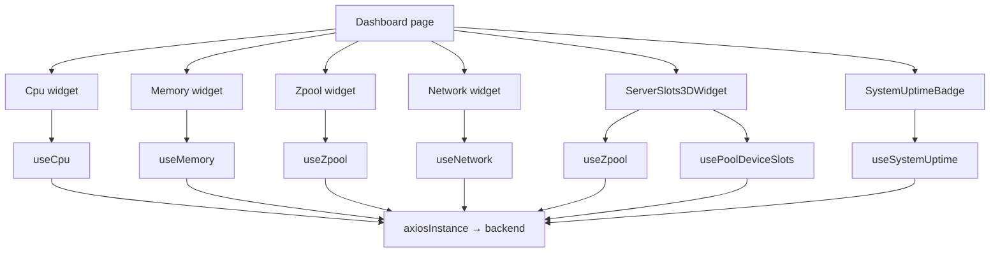
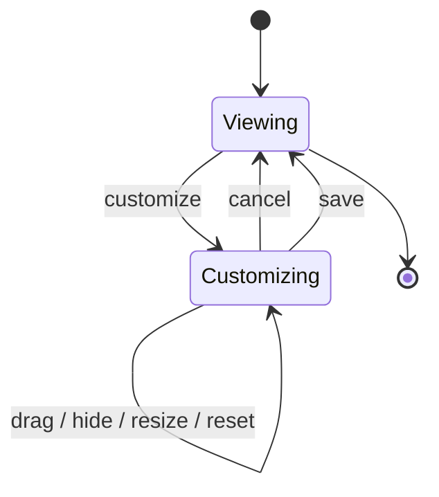

# Dashboard

## Purpose

The Dashboard is the operator-facing monitoring and overview surface of SOHO UI. It combines live system telemetry, storage health, server-slot visualization, system uptime, and a per-user customizable widget layout.

Route: `/dashboard`

Entry point: `src/pages/Dashboard.tsx`

The page is intentionally an aggregation layer. It does not own backend persistence for monitored resources and it does not duplicate domain logic implemented by the feature hooks used by each widget.

## Main responsibilities

The Dashboard is responsible for:

- composing monitoring widgets into one responsive grid;
- allowing the operator to reorder, hide, restore, and resize widgets;
- persisting only the dashboard layout preference in browser `localStorage`;
- scoping saved layouts by authenticated username;
- presenting high-frequency telemetry without hidden-tab background polling;
- exposing the 3D server-slot view and existing system power-action controls.

It is not responsible for:

- persisted backend state snapshots;
- authentication/session implementation;
- duplicating CPU, memory, network, zpool, disk-slot, or uptime API clients;
- treating layout preferences as authoritative server-side state.

## Current widget registry

The active registry in `Dashboard.tsx` currently contains exactly these widgets:

| Widget id | Component | Primary purpose |
| --- | --- | --- |
| `cpu` | `Cpu` | Live CPU usage and processor information. |
| `memory` | `Memory` | Live memory utilization. |
| `zpool-overview` | `Zpool` | Pool health/capacity overview. |
| `server-3d-slots` | `ServerSlots3DWidget` | Interactive server chassis and disk-slot visualization. |
| `network` | `Network` | Network traffic and interface information. |

Treat widget ids as persisted UI-schema identifiers because saved dashboard layouts reference them.

Do not keep removed widget definitions as commented code. Git history is the source for removed registry entries; active source should describe the current product surface only.

## Runtime data flow



React Query owns runtime monitoring server state. The page itself owns only layout-customization state.

## API and refresh map

| Data | Query key | Endpoint(s) | Refresh behavior |
| --- | --- | --- | --- |
| CPU | `['cpu']` | `GET /api/system/cpu/` | 2 seconds while mounted; no background interval. |
| Memory | `['memory']` | `GET /api/system/memory/` | 2 seconds while mounted; no background interval. |
| Zpool overview | `['zpool']` | `GET /api/zpool/` | 30 seconds by default. |
| Network base data | `['network']` | `GET /api/system/network`, then per-interface detail GET | Query lifecycle driven; bandwidth is separate. |
| Network bandwidth | `['network','bandwidth-snapshots',interfaceNames]` | per-interface `GET /api/system/network/{name}/bandwidth/` | 2 seconds while active. |
| System uptime | `['system','uptime']` | `GET /api/system/uptime/` | 1 second while mounted. |
| 3D slot zpool list | `['zpool']` | `GET /api/zpool/` | 30 seconds. |
| 3D slot mapping | zpool/device slot key family | disk inventory + per-pool device endpoints | 10-second override in `ServerSlots3DWidget`. |

All of these requests are observational. They must not own `save_to_db=true` persistence.

## Dashboard layout state

Layout state contains:

```ts
interface LayoutState {
  order: string[];
  hidden: string[];
  sizeOverrides: Record<string, string>;
}
```

The page separates:

- `persistedLayout` — last committed user layout;
- `draftLayout` — active customization draft, or `null` when not customizing.

This distinction is intentional. Dragging, hiding, or resizing must not immediately overwrite the stored preference; the operator can cancel safely.

## localStorage contract

Base key:

```text
dashboard-layout.v2
```

Per-user key:

```text
dashboard-layout.v2:<lowercase-username>
```

Fallback when no username exists:

```text
dashboard-layout.v2:guest
```

This is UI preference storage only. It is unrelated to token storage or StateSync persistence.

## Layout normalization

Persisted browser data is treated as potentially stale because widget definitions can change between releases.

Normalization therefore:

- removes unknown widget ids;
- removes duplicate ids;
- appends current widgets missing from older saved layouts;
- drops hidden ids that no longer exist;
- keeps only size overrides for current widget ids.

This compatibility behavior is a maintenance invariant. Adding/removing/renaming widget ids without considering saved layouts can break user customization state.

## Customization flow



When customization starts, the page clones the committed layout into a draft.

On Save:

1. normalize the draft against the active widget registry;
2. copy it to committed/persisted state;
3. exit customization mode;
4. persistence effect writes the committed preference to `localStorage`.

On Cancel, the draft is discarded.

## Drag-and-drop rule

Only visible widgets participate in sortable interaction.

Reordering visible widgets must preserve hidden widget ids inside the complete saved ordering so hidden widgets can later be restored predictably.

That is why drag handling does not simply replace the complete `order` array with the visible DnD result.

## Layout presets

Widgets can define:

- responsive column spans;
- row spans;
- minimum height;
- optional named layout presets.

The page synthesizes a `default` preset from base configuration. Selecting default removes a redundant size override instead of storing another copy of default layout data.

Responsive spans are clamped before CSS grid declarations are generated.

## Server 3D widget

`ServerSlots3DWidget` combines:

- current zpool list;
- pool-device membership;
- global disk inventory;
- physical slot metadata;
- local selected-slot state;
- reboot/poweroff actions from `SystemPowerActionsContext`.

Slot mapping intentionally uses a 10-second refresh interval, faster than the ordinary 30-second pool-device cadence.

Per-pool device failures can remain isolated so successful pools/slots continue rendering.

## System power actions

The 3D/server UI can request:

```text
reboot
poweroff
```

through the shared system power-action context.

The backend currently exposes these as GET requests with side effects. They must not be prefetched, automatically retried as safe reads, or treated as ordinary telemetry.

See [`../06-api/endpoint-map.md`](../06-api/endpoint-map.md).

## Uptime formatting

The compact uptime badge expects backend numeric format:

```text
YY/MM/DD-HH:MM:SS
```

The formatter preserves non-zero year/month parts rather than guessing month/year conversion into days. Backend `human_readable` content is explanatory tooltip text when available.

## Error handling

Each widget owns its loading/error state through its hook/component boundary.

The Dashboard should not collapse all widget errors into one page failure because independent telemetry resources have independent availability.

The 3D widget likewise preserves successful slot data when individual pool-device resolution fails.

## Important architecture rules

- Dashboard customization is a browser UI preference, not managed-system state.
- Layout persistence is scoped by normalized username.
- Only committed layouts are written to `localStorage`.
- Saved layouts are normalized against the current registry.
- Monitoring GETs are observational and must not trigger database snapshots.
- High-frequency telemetry polling stops in a hidden tab.
- Widgets should reuse domain hooks/query keys instead of creating dashboard-only API implementations.
- The 3D server view consumes storage/disk state; it is not a second source of truth.
- Removed widgets belong in Git history, not commented production registry code.

## Common failure scenarios

### Saved layout looks corrupted after registry change

Inspect current widget ids and layout normalization. A renamed id is effectively a persisted-schema migration; without explicit migration, the old id is discarded.

### Dashboard changes persist before Save

Handlers should mutate `draftLayout`, not committed layout state.

### Cancel does not restore prior layout

Verify customization starts from a clone of committed layout and nested arrays/objects are not mutated in place.

### Duplicate telemetry requests appear

Verify query-key reuse before changing polling. The same domain resource should normally share React Query state.

### 3D slots are stale while zpool cards are fresh

The resources intentionally use different refresh cadences. Inspect `usePoolDeviceSlots`, enablement, and the 10-second 3D override.

## Extension guide

### Adding a widget

1. Implement/reuse the feature component and domain hook outside the Dashboard where practical.
2. Add one stable id to the active `dashboardWidgets` registry.
3. Define sensible responsive spans.
4. Add layout presets only for real operator use cases.
5. Verify old `localStorage` layouts normalize correctly.
6. If the widget polls, update polling documentation.
7. Never add `save_to_db=true` to dashboard reads.

### Renaming/removing a widget

Treat widget ids as persisted schema identifiers. A rename discards old preference state for that id unless explicit migration is added.

Remove obsolete definitions from source rather than commenting them out.

## Related files

- `src/pages/Dashboard.tsx`
- `src/components/Cpu.tsx`
- `src/components/Memory.tsx`
- `src/components/Network.tsx`
- `src/components/Zpool.tsx`
- `src/components/dashboard/SystemUptimeBadge.tsx`
- `src/components/dashboard/DashboardLayoutPanel.tsx`
- `src/components/dashboard/SortableWidget.tsx`
- `src/components/dashboard/server-3d/ServerSlots3DWidget.tsx`
- `src/hooks/useCpu.ts`
- `src/hooks/useMemory.ts`
- `src/hooks/useNetwork.ts`
- `src/hooks/useZpool.ts`
- `src/hooks/usePoolDeviceSlots.ts`
- `src/hooks/useSystemUptime.ts`

## Related documentation

- [`../04-core-flows/server-state-and-cache.md`](../04-core-flows/server-state-and-cache.md)
- [`../04-core-flows/polling-and-data-refresh.md`](../04-core-flows/polling-and-data-refresh.md)
- [`../04-core-flows/state-sync-save-to-db.md`](../04-core-flows/state-sync-save-to-db.md)
- [`../06-api/endpoint-map.md`](../06-api/endpoint-map.md)
