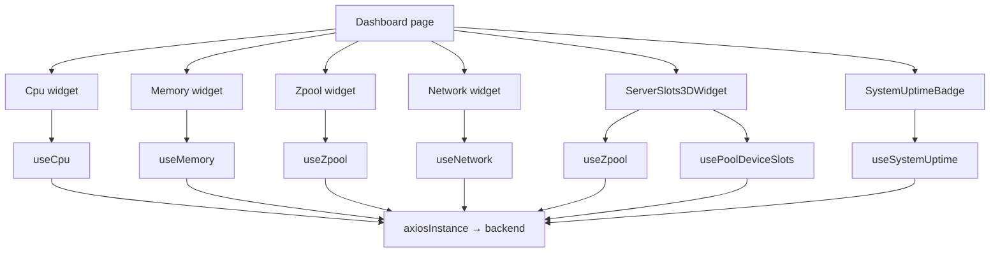
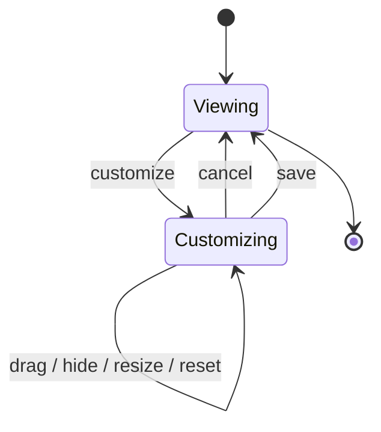

# Dashboard

## Purpose

The Dashboard is the operator-facing monitoring and overview surface of SOHO UI. It combines live system telemetry, storage health, server-slot visualization, system uptime, and a per-user customizable widget layout.

The page is intentionally an aggregation layer. It does not own backend persistence for monitored resources and it does not duplicate the domain logic implemented by the feature hooks used by each widget.

Route: `/dashboard`

Entry point: `src/pages/Dashboard.tsx`

## Main responsibilities

The Dashboard is responsible for:

- composing monitoring widgets into one responsive grid;
- allowing the operator to reorder, hide, restore, and resize widgets;
- persisting only the dashboard layout preference in browser `localStorage`;
- scoping saved layouts by authenticated username;
- presenting high-frequency telemetry without enabling hidden-tab background polling;
- exposing the 3D server-slot view and its existing system power-action controls.

It is not responsible for:

- persisting backend state snapshots;
- deciding authentication/session behavior;
- owning the implementation of CPU, memory, network, zpool, disk-slot, or uptime APIs;
- using the dashboard layout as an authoritative server-side user preference.

## Current widget registry

The current active widget registry in `Dashboard.tsx` contains:

| Widget id | Component | Primary purpose |
| --- | --- | --- |
| `cpu` | `Cpu` | Live CPU usage and processor information. |
| `memory` | `Memory` | Live memory utilization. |
| `zpool-overview` | `Zpool` | Pool health/capacity overview. |
| `server-3d-slots` | `ServerSlots3DWidget` | Interactive server chassis and disk-slot visualization. |
| `network` | `Network` | Network traffic and interface information. |

Older SystemInfo and Disk widget definitions remain commented in the page and are not part of the runtime widget registry.

## Runtime data flow



React Query is the server-state owner for all runtime monitoring data. The page itself owns only layout customization state.

## API and refresh map

| Data | Query key | Endpoint(s) | Refresh behavior |
| --- | --- | --- | --- |
| CPU | `['cpu']` | `GET /api/system/cpu/` | 2 seconds while mounted; no background interval. |
| Memory | `['memory']` | `GET /api/system/memory/` | 2 seconds while mounted; no background interval. |
| Zpool overview | `['zpool']` | `GET /api/zpool/` | 30 seconds by default. |
| Network base data | `['network']` | `GET /api/system/network`, then per-interface detail GET | Query lifecycle driven; bandwidth is separate. |
| Network bandwidth | `['network', 'bandwidth-snapshots', interfaceNames]` | per-interface `GET /api/system/network/{name}/bandwidth/` | 2 seconds while active. |
| System uptime | `['system', 'uptime']` | `GET /api/system/uptime/` | 1 second while mounted. |
| 3D slot zpool list | `['zpool']` | `GET /api/zpool/` | 30 seconds. |
| 3D slot mapping | `['zpool','devices','slots', ...]` | disk inventory plus per-pool devices endpoints | 10-second override in `ServerSlots3DWidget`. |

All of these requests are observational. They must not own `save_to_db=true` persistence.

## Dashboard layout state

Layout state has three fields:

```ts
interface LayoutState {
  order: string[];
  hidden: string[];
  sizeOverrides: Record<string, string>;
}
```

The state is split into:

- `persistedLayout`: the last committed user layout;
- `draftLayout`: the active customization draft, or `null` when not customizing.

This distinction is intentional. Dragging, hiding, or resizing widgets must not immediately overwrite the stored layout. The operator can cancel the draft safely.

## localStorage contract

The current base key is:

```text
dashboard-layout.v2
```

The final key is scoped by normalized username:

```text
dashboard-layout.v2:<lowercase-username>
```

If no username is available, the fallback is:

```text
dashboard-layout.v2:guest
```

This is UI preference storage only. It is not backend state and must not be confused with authentication token storage or StateSync persistence.

## Layout normalization

Persisted layout data is treated as untrusted/stale input because widget definitions can change between releases.

`createNormalizedState()` therefore:

- removes unknown widget ids;
- removes duplicate ids;
- appends newly introduced widgets that are missing from older saved layouts;
- drops hidden ids that no longer exist;
- keeps only size override ids that still exist in the current widget definition.

This compatibility normalization is a maintenance invariant. Without it, adding/removing/renaming widgets could break previously stored user layouts.

## Customization flow



When customization starts, the page clones `persistedLayout` into `draftLayout`.

On Save:

1. normalize the draft against the current registry;
2. copy it into `persistedLayout`;
3. leave customization mode;
4. the persistence effect writes the committed layout to `localStorage`.

On Cancel, the draft is discarded and no persisted layout change occurs.

## Drag-and-drop rule

Only visible widgets participate in the sortable interaction. Reordering visible widgets must preserve the positions of hidden widget ids inside the complete saved ordering so hidden widgets can later be restored predictably.

This is why `handleDragEnd()` does not simply replace the complete `order` array with the visible array returned by DnD Kit.

## Layout presets

Each widget can define responsive columns, row spans, minimum height, and optional named layout presets.

The page always synthesizes a `default` preset from the widget's base layout configuration. Choosing the default removes the corresponding entry from `sizeOverrides` rather than storing a redundant override.

Responsive grid spans are clamped to valid values before generating CSS grid declarations.

## Server 3D widget

`ServerSlots3DWidget` combines:

- the current zpool list;
- pool-device membership;
- global disk inventory;
- physical slot metadata;
- a local selected-slot state;
- system reboot/poweroff actions supplied by `SystemPowerActionsContext`.

The slot mapping intentionally uses a 10-second refresh interval, faster than the 30-second default `usePoolDeviceSlots` cadence.

Per-pool device failures are represented in `errorsByPool` so one failed pool lookup does not prevent successful pools from being shown.

## Uptime formatting

The compact uptime badge expects backend numeric format:

```text
YY/MM/DD-HH:MM:SS
```

The formatter preserves non-zero year and month parts explicitly rather than guessing conversions from months or years into days. The backend `human_readable` field is used as explanatory tooltip content when available.

## Error handling

Each widget handles its own loading/error state through its hook/component boundary. The Dashboard page should not collapse all widget errors into one page-level failure because one telemetry source failing should not make unrelated monitoring data disappear.

The 3D server widget similarly allows partial pool-device errors while keeping successfully resolved slots visible.

## Important business and architecture rules

- Dashboard customization is a browser UI preference, not managed-system state.
- Layout persistence is per normalized username.
- Only committed layouts are written to localStorage.
- Saved layout data must be normalized against the current widget registry.
- Monitoring GETs are observational and must not trigger database snapshots.
- High-frequency telemetry polling stops in a hidden tab.
- A widget should reuse the domain hook/query key for the resource it represents instead of creating a dashboard-only API implementation.
- The 3D server view is a consumer of storage/disk state; it is not a second storage-state source of truth.

## Common failure scenarios

### A saved layout appears corrupted after adding a widget

Check `createNormalizedState()` and the widget registry ids. New widget ids should be appended automatically. Renaming an id is effectively a migration and the old persisted id will be discarded.

### Dashboard changes are saved immediately instead of after Save

Check that UI actions mutate `draftLayout`, not `persistedLayout`.

### Cancel does not restore the previous layout

Check that customization started from `cloneLayoutState(persistedLayout)` and that no handler mutated nested arrays/objects in place.

### Duplicate telemetry requests appear

Check query-key reuse before changing polling. The same domain resource should share React Query state where appropriate.

### 3D slots are stale while zpool cards are fresh

The two resources use different refresh cadences. Inspect `usePoolDeviceSlots`, its `enabled` state, and the 10-second override in `ServerSlots3DWidget`.

## Extension guide

### Adding a dashboard widget

1. Build the feature component and its domain hook outside the Dashboard page when possible.
2. Add one stable id to `dashboardWidgets`.
3. Define sensible responsive default spans.
4. Add layout presets only when they offer a real operator use case.
5. Confirm old localStorage layouts normalize correctly when the new widget is introduced.
6. If the widget polls, document its interval in `docs/04-core-flows/polling-and-data-refresh.md`.
7. Do not add `save_to_db=true` to dashboard reads.

### Renaming/removing a widget

Treat widget ids as persisted schema identifiers. A rename will cause old layout state for that id to be discarded unless an explicit migration is added.

## Related files

- `src/pages/Dashboard.tsx`
- `src/components/Cpu.tsx`
- `src/components/Memory.tsx`
- `src/components/Network.tsx`
- `src/components/Zpool.tsx`
- `src/components/dashboard/SystemUptimeBadge.tsx`
- `src/components/dashboard/DashboardLayoutPanel.tsx`
- `src/components/dashboard/SortableWidget.tsx`
- `src/components/dashboard/server-3d/ServerSlots3DWidget.tsx`
- `src/hooks/useCpu.ts`
- `src/hooks/useMemory.ts`
- `src/hooks/useNetwork.ts`
- `src/hooks/useZpool.ts`
- `src/hooks/usePoolDeviceSlots.ts`
- `src/hooks/useSystemUptime.ts`

## Related documentation

- [`../04-core-flows/server-state-and-cache.md`](../04-core-flows/server-state-and-cache.md)
- [`../04-core-flows/polling-and-data-refresh.md`](../04-core-flows/polling-and-data-refresh.md)
- [`../04-core-flows/state-sync-save-to-db.md`](../04-core-flows/state-sync-save-to-db.md)
