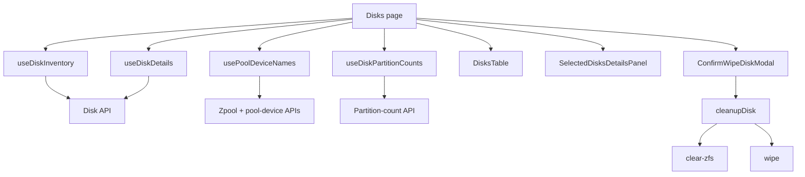

# Disks

## Purpose

The Disks feature is the operational inventory and maintenance surface for physical disks known to the SOHO backend.

It supports:

- reading the current disk inventory;
- opening one or more disk detail views;
- showing slot, capacity, WWN, state, and partition information;
- identifying disks already owned by a zpool;
- preventing unsafe wipe actions for disks that are not eligible;
- running the disk cleanup flow behind an explicit confirmation modal.

Route: `/disks`

Entry point: `src/pages/Disks.tsx`

## Runtime flow



## Main server-state queries

### Disk inventory

Hook: `useDiskInventory()`

Query key:

```text
['disk', 'inventory']
```

Endpoint:

```text
GET /api/disk/
```

The hook sorts returned disks by disk name and enables refetch on window focus.

The backend response is normalized in `src/lib/diskApi.ts`. If `ok === false`, the frontend throws a normalized Error rather than returning an empty success result.

### Disk detail

Hook: `useDiskDetails(diskNames)`

Each selected/pinned disk gets its own query:

```text
['disk', 'detail', diskName]
```

Endpoint:

```text
GET /api/disk/{diskName}/
```

Detail queries use a 10-second stale time and refetch on window focus.

### Pool-owned disk names

Hook: `usePoolDeviceNames()`

The hook first reads the current zpool list, then loads device membership for each pool. The resulting unique disk-name list is used to mark disks that are already in use by integrated storage.

The query key includes the current pool names:

```text
['zpool', 'devices', ...poolNames]
```

This data is not only informational: it participates in the wipe-safety decision.

### Partition counts

Hook: `useDiskPartitionCounts(diskNames)`

One query is created per unique disk:

```text
['disk', 'partition-count', diskName]
```

Partition-count data has a 30-second stale time.

The page converts the hook result into a lookup so the table can decide whether a destructive action should be available.

## Detail split-view state

The page uses `useDetailSplitViewStore` with view id:

```text
disks
```

The store owns:

- `activeItemId`;
- pinned item ids;
- active-item changes;
- unpin operations;
- per-view cleanup.

The page builds `detailIds` as the union of the active disk and pinned disks, then loads details for that set.

When the disk inventory changes, ids that no longer exist are removed from the detail state. This prevents stale pinned panels from surviving after the backend no longer reports the disk.

The view is also cleared when the Disks page mounts/unmounts so selection from another visit does not leak unintentionally into a new session of the page.

## Wipe eligibility rules

A wipe is intentionally unavailable unless the disk is eligible.

The table combines several inputs:

- whether pool-device ownership is still loading;
- whether the disk is currently a member of a zpool;
- whether a wipe is already in progress for that disk;
- whether partition-count data is still loading;
- whether the disk currently has partitions;
- whether the caller supplied a wipe handler.

The current action states are effectively:

### Disk belongs to a pool and has partitions

The action is disabled and the table shows `در حال استفاده`.

### Disk has no partitions

The action is disabled and the table shows `آزاد`.

### Partition state is not ready

The action remains disabled until the safety decision can be made.

### Eligible partitioned disk not currently owned by a pool

The wipe action becomes available.

These checks are frontend safety UX. The backend must still enforce its own authorization and storage-integrity rules.

## Destructive cleanup flow

The page never starts cleanup directly from a row click. The wipe icon first stores the target disk in `wipeTargetDisk`, which opens `ConfirmWipeDiskModal`.

Only the confirmation action calls:

```ts
cleanupDisk(diskName)
```

`cleanupDisk()` performs two operations in sequence:

1. `POST /api/disk/{diskName}/clear-zfs/`
2. `POST /api/disk/{diskName}/wipe/`

The first step is best-effort. If `clear-zfs` fails, the error is captured but the wipe step is still attempted.

The wipe step is mandatory: if it fails, the overall cleanup rejects.

The return value records whether clear-ZFS succeeded:

```ts
interface CleanupDiskResult {
  clearZfsSucceeded: boolean;
  clearZfsError?: string;
}
```

The current page only treats the overall resolved cleanup as success; it does not expose a separate warning when `clear-zfs` failed but the wipe succeeded.

## Mutation refresh behavior

After a successful cleanup, the page invalidates:

```text
['disk', 'inventory']
['disk', 'partition-count', diskName]
```

The Axios success interceptor may separately schedule StateSync work for persisted domains. The page must not add `save_to_db=true` to the cleanup calls.

## Loading and operation state

`wipingDisks` is a map keyed by disk name so the UI can track destructive operations per disk rather than using one global boolean.

This prevents one active wipe from losing the identity of the disk being processed and allows the table to disable the correct action.

The confirmation modal remains tied to `wipeTargetDisk` and is cleared after success or explicit close.

## Error handling

The feature has several independent error surfaces:

- inventory query error;
- pool-device lookup error;
- disk-detail query error per selected disk;
- partition-count query state per disk;
- cleanup mutation error.

Pool-device lookup failures are surfaced through a toast from the page.

Cleanup errors are normalized through `extractApiErrorMessage()` and shown in the existing loading toast.

A detail failure should not make the complete disk inventory unusable.

## Important invariants

- Never enable wipe solely from `disk.has_partition`; prefer the dedicated partition-count result when it is available.
- Do not allow a disk reported as part of a zpool to become wipe-enabled through frontend state drift.
- Destructive cleanup must stay behind explicit confirmation.
- Disk names are used as row ids and query identity; normalize/encode them before putting them into endpoints.
- Detail-view ids must be pruned when inventory items disappear.
- React Query cache freshness is separate from StateSync persistence.
- A failed `clear-zfs` currently does not prevent the subsequent wipe attempt.

## Common failure scenarios

### Wipe button is unexpectedly disabled

Check, in order:

1. pool-device lookup loading/error state;
2. whether the disk name is in the pool-owned set;
3. partition-count loading state;
4. returned partition count versus `disk.has_partition` fallback;
5. whether the disk is already in `wipingDisks`.

### A disk remains pinned after disappearing from the backend

Check the inventory reconciliation effect in `Disks.tsx` and the exact row id used by the table/store.

### Inventory refreshes but partition state looks stale

The inventory and partition counts use different query keys. Successful cleanup explicitly invalidates both relevant keys.

### Disk cleanup reports failure after the pool was changed

Inspect both cleanup steps. Pool destruction/other operations may succeed while a later disk wipe fails; multi-step storage operations must not be mentally treated as atomic unless the backend provides that guarantee.

## Extension guide

### Adding a new disk column

Prefer normalized data from `DiskInventoryItem`. If the field requires another backend request, do not put request logic inside `renderCell`; add a hook/query layer and provide prepared data to the table.

### Adding a new destructive disk action

1. define backend eligibility rules;
2. mirror useful safety constraints in the frontend;
3. require explicit confirmation;
4. centralize the API operation under `src/lib` or a dedicated mutation hook;
5. invalidate only the affected query families on success;
6. document whether the operation is atomic or multi-step;
7. never use frontend-only checks as the security boundary.

## Related files

- `src/pages/Disks.tsx`
- `src/components/disks/DisksTable.tsx`
- `src/components/disks/ConfirmWipeDiskModal.tsx`
- `src/components/disks/SelectedDisksDetailsPanel.tsx`
- `src/hooks/useDiskInventory.ts`
- `src/hooks/useDiskPartitionCounts.ts`
- `src/hooks/usePoolDeviceNames.ts`
- `src/lib/diskApi.ts`
- `src/lib/diskMaintenance.ts`
- `src/lib/diskPartitions.ts`
- `src/lib/poolDevices.ts`
- `src/stores/detailSplitViewStore.ts`

## Related documentation

- [`../04-core-flows/server-state-and-cache.md`](../04-core-flows/server-state-and-cache.md)
- [`../04-core-flows/api-request-lifecycle.md`](../04-core-flows/api-request-lifecycle.md)
- [`../04-core-flows/state-sync-save-to-db.md`](../04-core-flows/state-sync-save-to-db.md)
