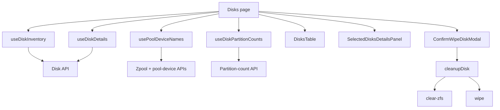

# Disks

## هدف

Feature مربوط به Disks، سطح عملیاتی inventory و maintenance برای diskهای فیزیکی شناخته‌شده توسط SOHO backend است.

این feature موارد زیر را پشتیبانی می‌کند:

- خواندن disk inventory فعلی؛
- باز کردن یک یا چند نمای detail برای diskها؛
- نمایش slot، capacity، WWN، state و اطلاعات partition؛
- تشخیص diskهایی که در حال حاضر توسط یک zpool استفاده می‌شوند؛
- جلوگیری از wipe ناامن برای diskهایی که شرایط لازم را ندارند؛
- اجرای جریان disk cleanup پشت یک confirmation modal صریح.

Route:

```text
/disks
```

Entry point:

```text
src/pages/Disks.tsx
```

## runtime flow



## queryهای اصلی server state

### Disk inventory

Hook:

```text
useDiskInventory()
```

Query key:

```text
['disk', 'inventory']
```

Endpoint:

```text
GET /api/disk/
```

این hook diskهای برگشتی را بر اساس disk name sort می‌کند و refetch روی window focus را فعال نگه می‌دارد.

Backend response در `src/lib/diskApi.ts` normalize می‌شود. اگر `ok === false` باشد، frontend به‌جای بازگرداندن empty success result یک `Error` نرمال‌شده throw می‌کند.

### Disk detail

Hook:

```text
useDiskDetails(diskNames)
```

برای هر disk انتخاب‌شده یا pinned یک query مستقل ایجاد می‌شود:

```text
['disk', 'detail', diskName]
```

Endpoint:

```text
GET /api/disk/{diskName}/
```

Detail queryها `staleTime` ده‌ثانیه‌ای دارند و روی window focus نیز refetch می‌شوند.

### disk nameهای متعلق به pool

Hook:

```text
usePoolDeviceNames()
```

این hook ابتدا zpool list فعلی را می‌خواند و سپس device membership هر pool را load می‌کند. لیست unique از disk nameها برای مشخص کردن diskهایی استفاده می‌شود که در حال حاضر توسط Integrated Storage در حال استفاده‌اند.

Query key شامل pool nameهای فعلی است:

```text
['zpool', 'devices', ...poolNames]
```

این data صرفاً informational نیست و در تصمیم‌گیری مربوط به wipe safety نیز نقش دارد.

### Partition countها

Hook:

```text
useDiskPartitionCounts(diskNames)
```

برای هر disk unique یک query ایجاد می‌شود:

```text
['disk', 'partition-count', diskName]
```

Partition-count data دارای `staleTime` برابر 30 ثانیه است.

صفحه نتیجه‌ی hook را به یک lookup تبدیل می‌کند تا table بتواند تشخیص دهد destructive action باید در دسترس باشد یا خیر.

## detail split-view state

صفحه از `useDetailSplitViewStore` با view id زیر استفاده می‌کند:

```text
disks
```

Store مالک موارد زیر است:

- `activeItemId`؛
- pinned item idها؛
- تغییر active item؛
- unpin operationها؛
- cleanup به ازای هر view.

صفحه `detailIds` را از union میان active disk و pinned diskها می‌سازد و سپس detail همین مجموعه را load می‌کند.

وقتی disk inventory تغییر می‌کند، idهایی که دیگر وجود ندارند از detail state حذف می‌شوند. این کار مانع باقی ماندن pinned panelهای stale پس از حذف disk از backend response می‌شود.

View هنگام mount/unmount شدن صفحه‌ی Disks نیز clear می‌شود تا selection مربوط به بازدید قبلی ناخواسته وارد session بعدی صفحه نشود.

## قوانین wipe eligibility

Wipe عمداً تا زمانی که disk eligible نباشد در دسترس قرار نمی‌گیرد.

Table چند ورودی را با هم ترکیب می‌کند:

- آیا pool-device ownership هنوز loading است؛
- آیا disk در حال حاضر member یک zpool است؛
- آیا wipe برای همان disk در حال اجراست؛
- آیا partition-count data هنوز loading است؛
- آیا disk در حال حاضر partition دارد؛
- آیا caller اصلاً wipe handler ارائه کرده است یا خیر.

وضعیت actionها در عمل به شکل زیر است:

### Disk داخل pool است و partition دارد

Action disabled است و table مقدار `در حال استفاده` را نمایش می‌دهد.

### Disk هیچ partitionی ندارد

Action disabled است و table مقدار `آزاد` را نمایش می‌دهد.

### وضعیت partition هنوز آماده نیست

Action تا زمانی که safety decision قابل انجام نباشد disabled می‌ماند.

### Disk partitioned است ولی در حال حاضر متعلق به pool نیست

Wipe action در دسترس قرار می‌گیرد.

این checkها frontend safety UX هستند. Backend همچنان باید authorization و storage-integrity ruleهای خودش را enforce کند.

## destructive cleanup flow

صفحه هیچ‌وقت cleanup را مستقیم از row click شروع نمی‌کند. Wipe icon ابتدا target disk را در `wipeTargetDisk` قرار می‌دهد و این state باعث باز شدن `ConfirmWipeDiskModal` می‌شود.

فقط action مربوط به confirmation تابع زیر را فراخوانی می‌کند:

```ts
cleanupDisk(diskName)
```

`cleanupDisk()` دو عملیات را به ترتیب اجرا می‌کند:

1. `POST /api/disk/{diskName}/clear-zfs/`
2. `POST /api/disk/{diskName}/wipe/`

مرحله‌ی اول best-effort است. اگر `clear-zfs` fail شود، error capture می‌شود ولی wipe همچنان اجرا می‌شود.

مرحله‌ی wipe اجباری است؛ اگر این مرحله fail شود، cleanup کلی reject می‌شود.

Return value مشخص می‌کند clear-ZFS موفق بوده است یا خیر:

```ts
interface CleanupDiskResult {
  clearZfsSucceeded: boolean;
  clearZfsError?: string;
}
```

صفحه‌ی فعلی فقط cleanup resolve‌شده را success در نظر می‌گیرد و در حال حاضر warning جداگانه‌ای برای حالت «`clear-zfs` fail شده ولی wipe موفق بوده» نمایش نمی‌دهد.

## رفتار refresh پس از mutation

بعد از cleanup موفق، صفحه queryهای زیر را invalidate می‌کند:

```text
['disk', 'inventory']
['disk', 'partition-count', diskName]
```

Axios success interceptor ممکن است مستقل از این کار، StateSync مربوط به persisted domainها را schedule کند. صفحه نباید `save_to_db=true` را به cleanup callها اضافه کند.

## loading و operation state

`wipingDisks` یک map بر اساس disk name است تا UI بتواند destructive operation را به ازای هر disk track کند، نه با یک global boolean.

این ساختار مانع گم شدن identity دیسک هنگام wipe فعال می‌شود و اجازه می‌دهد table فقط action مربوط به همان disk را disable کند.

Confirmation modal به `wipeTargetDisk` متصل است و بعد از success یا close صریح clear می‌شود.

## مدیریت خطا

این feature چند error surface مستقل دارد:

- inventory query error؛
- pool-device lookup error؛
- disk-detail query error برای هر disk انتخاب‌شده؛
- partition-count query state به ازای هر disk؛
- cleanup mutation error.

Pool-device lookup failure از طریق toast در صفحه نمایش داده می‌شود.

Cleanup error با `extractApiErrorMessage()` normalize شده و داخل loading toast موجود نمایش داده می‌شود.

Failure یک detail query نباید کل disk inventory را unusable کند.

## invariantهای مهم

- هرگز wipe را فقط بر اساس `disk.has_partition` فعال نکنید؛ در صورت موجود بودن، dedicated partition-count result اولویت دارد.
- diskی که backend آن را member یک zpool گزارش می‌کند نباید به‌دلیل drift در frontend state wipe-enabled شود.
- destructive cleanup باید پشت confirmation صریح باقی بماند.
- Disk name برای row id و query identity استفاده می‌شود؛ پیش از قرار دادن در endpoint آن را normalize/encode کنید.
- وقتی inventory item حذف می‌شود، detail-view id مربوط به آن باید prune شود.
- React Query cache freshness مستقل از StateSync persistence است.
- Failure در `clear-zfs` فعلاً مانع اجرای مرحله‌ی بعدی wipe نمی‌شود.

## failure scenarioهای رایج

### Wipe button به‌شکل غیرمنتظره disabled است

به‌ترتیب این موارد را بررسی کنید:

1. loading/error state مربوط به pool-device lookup؛
2. آیا disk name در pool-owned set قرار دارد؛
3. partition-count loading state؛
4. partition count برگشتی در مقابل fallback یعنی `disk.has_partition`؛
5. آیا disk از قبل در `wipingDisks` قرار دارد.

### Disk بعد از ناپدید شدن از backend همچنان pinned مانده

Inventory reconciliation effect در `Disks.tsx` و row id دقیق استفاده‌شده توسط table/store را بررسی کنید.

### Inventory refresh می‌شود ولی partition state stale به نظر می‌رسد

Inventory و partition count از query keyهای متفاوت استفاده می‌کنند. Cleanup موفق هر دو key مرتبط را صریحاً invalidate می‌کند.

### Disk cleanup پس از تغییر pool failure گزارش می‌دهد

هر دو مرحله‌ی cleanup را بررسی کنید. Pool destruction یا operationهای دیگر ممکن است موفق باشند ولی wipe بعدی fail شود؛ multi-step storage operation را atomic در نظر نگیرید مگر backend این guarantee را ارائه کند.

## راهنمای توسعه

### افزودن column جدید برای disk

ترجیحاً از data نرمال‌شده‌ی `DiskInventoryItem` استفاده کنید. اگر field جدید به backend request جدا نیاز دارد، request logic را داخل `renderCell` قرار ندهید؛ یک hook/query layer ایجاد کنید و data آماده را به table بدهید.

### افزودن destructive disk action جدید

1. backend eligibility ruleها را مشخص کنید.
2. safety constraintهای مفید را در frontend نیز mirror کنید.
3. confirmation صریح الزامی باشد.
4. API operation را در `src/lib` یا mutation hook اختصاصی centralize کنید.
5. بعد از success فقط query familyهای متاثر را invalidate کنید.
6. atomic یا multi-step بودن operation را مستند کنید.
7. frontend-only checkها را security boundary در نظر نگیرید.

## فایل‌های مرتبط

- `src/pages/Disks.tsx`
- `src/components/disks/DisksTable.tsx`
- `src/components/disks/ConfirmWipeDiskModal.tsx`
- `src/components/disks/SelectedDisksDetailsPanel.tsx`
- `src/hooks/useDiskInventory.ts`
- `src/hooks/useDiskPartitionCounts.ts`
- `src/hooks/usePoolDeviceNames.ts`
- `src/lib/diskApi.ts`
- `src/lib/diskMaintenance.ts`
- `src/lib/diskPartitions.ts`
- `src/lib/poolDevices.ts`
- `src/stores/detailSplitViewStore.ts`

## مستندات مرتبط

- [`../04-core-flows/server-state-and-cache.md`](../04-core-flows/server-state-and-cache.md)
- [`../04-core-flows/api-request-lifecycle.md`](../04-core-flows/api-request-lifecycle.md)
- [`../04-core-flows/state-sync-save-to-db.md`](../04-core-flows/state-sync-save-to-db.md)
