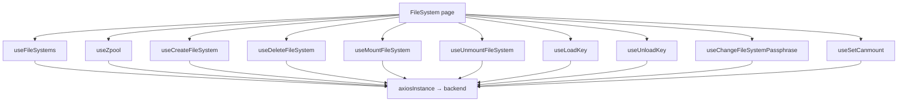

# File System

## هدف

Feature مربوط به File System، resourceهای filesystem-like داخل Integrated Storage poolها را مدیریت می‌کند. این بخش filesystem CRUD را با runtime mount state، تنظیم automatic mount و lifecycle مربوط به encryption key ترکیب می‌کند.

Route:

```text
/file-system
```

Entry point:

```text
src/pages/FileSystem.tsx
```

## مسئولیت‌های اصلی

صفحه موارد زیر را coordinate می‌کند:

- لیست و normalize کردن filesystem state؛
- ساخت filesystem داخل pool انتخاب‌شده؛
- حذف filesystem پشت confirmation؛
- mount و unmount؛
- toggle کردن property مربوط به `canmount`؛
- load و unload کردن encryption key؛
- تغییر encryption passphrase؛
- نمایش detail مربوط به filesystemهای selected/pinned؛
- جلوگیری از باقی ماندن detail selectionهای stale پس از حذف resource؛
- نمایش نتیجه‌ی operationها از طریق toast notification.

## runtime flow



تمام filesystem mutationها پس از success، canonical filesystem collection را invalidate می‌کنند. StateSync به‌صورت مستقل canonical persisted snapshotهای مربوط به filesystem mutationها را schedule می‌کند.

## filesystem list

Hook:

```text
useFileSystems()
```

Query key:

```text
['filesystems']
```

Primary endpoint:

```text
GET /api/filesystem/?detail=true
```

این hook `staleTime` برابر 15 ثانیه دارد و continuous refetch interval تعریف نمی‌کند.

### Response compatibility

Fetcher فعلی دو نسل از backend response را پشتیبانی می‌کند.

حالت preferred یک detailed list response واحد از endpoint زیر است:

```text
/api/filesystem/?detail=true
```

اگر backend فقط filesystem nameها را برگرداند، frontend برای هر name یک detail request جدا اجرا می‌کند:

```text
GET /api/filesystem/detail/?name=<filesystem>
```

Failure یک legacy detail request فقط برای همان filesystem مقدار `null` تولید می‌کند و کل list را fail نمی‌کند. بنابراین در old-backend fallback mode ممکن است partial list دریافت شود.

## نرمال‌سازی filesystem

هر `FileSystemEntry` نرمال‌شده شامل موارد زیر است:

- `id` / full filesystem name؛
- `poolName`؛
- `filesystemName`؛
- `mountpoint`؛
- attribute entryهای مناسب نمایش؛
- `attributeMap` با تحمل تفاوت در case؛
- raw backend data.

Normalizer برای attribute-map هم original-case key و هم lowercase key تولید می‌کند تا rendering feature نسبت به تفاوت case در backend propertyها مقاوم باشد.

فرمت full name منطقی:

```text
pool/filesystem
```

## pool optionها

گزینه‌های pool در Create-Filesystem از canonical zpool query می‌آیند و endpoint مخصوص filesystem برای pool list وجود ندارد.

صفحه pool nameها را برای نمایش به‌صورت case-insensitive sort می‌کند.

## detail split view

این feature از view id زیر استفاده می‌کند:

```text
filesystems
```

هنگام mount، صفحه filesystem detail state مربوط به بازدید قبلی را clear می‌کند. همان view در unmount نیز clear می‌شود.

در زمان mount بودن، filesystem idهای فعلی با active/pinned detail idها reconcile می‌شوند:

- pinned idهایی که دیگر backend برنمی‌گرداند unpin می‌شوند؛
- active id حذف‌شده clear می‌شود.

این رفتار مانع باقی ماندن stale detail panel پس از delete یا تغییر خارجی backend می‌شود.

## Create File System

Hook:

```text
useCreateFileSystem()
```

Endpoint:

```text
POST /api/filesystem/
```

Domain payload fieldها:

```text
pool_name
fs_name
quota
reservation
mountpoint
encryption
passphrase
```

UI فعلی مقدار `reservation` را برابر quota ارسالی قرار می‌دهد و mountpoint را با فرمت زیر تولید می‌کند:

```text
/<pool>/<filesystem>
```

Quota unitها به شکل `G` یا `T` ارسال می‌شوند.

### قوانین name

Modal و hook این frontend ruleها را enforce می‌کنند:

- pool باید انتخاب شده باشد؛
- filesystem name نباید خالی باشد؛
- name باید با حرف انگلیسی شروع شود؛
- بعد از character اول فقط حروف انگلیسی، عدد، `-` و `_` مجازند؛
- characterهای فارسی از input حذف می‌شوند؛
- name نباید با filesystem دیگری در همان pool duplicate باشد؛
- filesystem name نباید برابر selected pool name باشد.

Modal duplicate/same-as-pool check را با filesystem collection فعلی انجام می‌دهد. Backend validation همچنان authoritative است، چون client state می‌تواند stale باشد یا operator دیگری هم‌زمان همان name را ایجاد کند.

### قوانین quota

Quota باید:

- وجود داشته باشد؛
- به finite number parse شود؛
- بزرگ‌تر از صفر باشد.

Modal ورودی عددی decimal-style را می‌پذیرد و operator می‌تواند Gigabyte یا Terabyte را انتخاب کند.

## Encryption هنگام create

Encryption اختیاری است.

وقتی فعال باشد، modal فعلی passphrase را بر اساس ruleهای زیر validate می‌کند:

- non-empty؛
- حداقل 8 character؛
- حداقل یک حرف انگلیسی؛
- حداقل یک عدد یا symbol؛
- فقط از متن فارسی تشکیل نشده باشد.

پیش از ارسال، passphrase ابتدا UTF-8 encode و سپس Base64 encode می‌شود.

نکته‌ی مهم: **Base64 فقط encoding است، encryption نیست.** Confidentiality مربوط به passphrase همچنان به HTTPS/TLS و handling سمت backend وابسته است. Base64 را security boundary در نظر نگیرید.

وقتی encryption غیرفعال است، payload مقدار `encryption: 'off'` و passphrase خالی ارسال می‌کند.

## Delete File System

Hook:

```text
useDeleteFileSystem()
```

Endpoint:

```text
DELETE /api/filesystem/delete/?name=<pool/filesystem>
```

Delete پشت confirmation انجام می‌شود.

پس از success، hook:

1. filesystem حذف‌شده را از cache فعلی `['filesystems']` حذف می‌کند؛
2. `['filesystems']` را برای authoritative refetch invalidate می‌کند؛
3. confirmation modal را از طریق callback صفحه می‌بندد.

صفحه برای backend messageهایی که شامل `shareConfiguration` هستند error handling اختصاصی دارد: operator باید shareهای وابسته را حذف کند و سپس delete filesystem را دوباره امتحان کند.

این dependency rule باید توسط backend enforce شود؛ frontend message فقط explanatory UX است.

## Mount File System

Hook:

```text
useMountFileSystem()
```

Endpoint:

```text
POST /api/filesystem/mount/?name=<pool/filesystem>
```

پس از success، `['filesystems']` invalidate می‌شود.

Table mounted state را از backend attributeهایی مثل `mounted` derive می‌کند و valueهایی مانند `yes`، `on`، `true` و `mounted` را truthy در نظر می‌گیرد.

## Unmount File System

Hook:

```text
useUnmountFileSystem()
```

Endpoint:

```text
POST /api/filesystem/unmount/?name=<pool/filesystem>&force=<boolean>
```

Hook یک `force` flag اختیاری دارد؛ صفحه‌ی فعلی آن را بدون force فراخوانی می‌کند، بنابراین `force=false` رفتار عادی UI است.

پس از success، `['filesystems']` invalidate می‌شود.

## automatic mount با `canmount`

Hook:

```text
useSetCanmount()
```

Endpoint:

```text
POST /api/filesystem/set-canmount/?name=<pool/filesystem>&state=on|off
```

Table valueهای `on`، `yes`، `true` و `1` را برای `canmount` به‌عنوان truthy normalize می‌کند.

Table این property را به شکل toggle ارائه می‌کند. وقتی mutation مربوط به `canmount` pending است، implementation فعلی با استفاده از shared pending state تمام filesystem operation buttonها را disable می‌کند.

## encryption-key actionها

Encryption action فقط زمانی نمایش داده می‌شود که backend attributeها نشان دهند encryption فعال است.

Valueهای زیر non-encrypted در نظر گرفته می‌شوند:

```text
off
false
no
disabled
none
—
-
empty string
```

### Load key

Hook:

```text
useLoadKey()
```

Endpoint:

```text
POST /api/filesystem/load-key/?name=<pool/filesystem>
```

Body:

```json
{
  "passphrase": "<base64-encoded UTF-8 passphrase>"
}
```

UI پیش از mutation یک passphrase modal باز می‌کند.

### Unload key

Hook:

```text
useUnloadKey()
```

Endpoint:

```text
POST /api/filesystem/unload-key/?name=<pool/filesystem>
```

Passphrase body لازم نیست.

### Change passphrase

Hook:

```text
useChangeFileSystemPassphrase()
```

Endpoint:

```text
POST /api/filesystem/change-passphrase/?name=<pool/filesystem>
```

Body:

```json
{
  "new_passphrase": "<base64-encoded UTF-8 passphrase>"
}
```

Table فقط وقتی Change Passphrase را فعال می‌کند که encryption key ظاهراً loaded باشد.

Loaded-key state از attribute مربوط به `keystatus` derive می‌شود و valueهایی مانند `available`، `loaded`، `on`، `yes` و `true` را recognize می‌کند.

## رفتار action locking

`FileSystemsTable` در حال حاضر page-level booleanهایی مانند موارد زیر دریافت می‌کند:

- `isMounting`؛
- `isUnmounting`؛
- `isKeyLoading`؛
- `isKeyUnloading`؛
- `isChangingPassphrase`؛
- `isSettingCanmount`.

این مقدارها به یک `anyPending` ترکیب می‌شوند.

در نتیجه وقتی **هر** filesystem operational mutation در حالت pending باشد، action controlهای **تمام rowها** disable می‌شوند.

این رفتار فعلی است و per-row lock نیست. اگر UX آینده نیاز به concurrent operation روی filesystemهای مستقل داشته باشد، mutation state باید بر اساس resource identity key شود؛ فقط تغییر condition buttonهای table کافی نیست.

## ارتباط با StateSync

تمام mutation URLهای زیر namespace `/api/filesystem...` به‌صورت مرکزی map می‌شوند به:

```text
filesystem + zpool
```

در `resolveStateDomainsForMutation()`.

دلیل cross-domain mapping این است که filesystem operation می‌تواند pool-level capacity/state را نیز تغییر دهد.

Lifecycle مورد انتظار:

```text
successful filesystem mutation
  → React Query invalidates ['filesystems'] for UI freshness
  → Axios response interceptor maps /api/filesystem
  → StateSyncManager schedules filesystem and zpool snapshots
  → canonical GET /api/filesystem/?detail=true with save_to_db=true
  → canonical GET /api/zpool/ with save_to_db=true
```

Feature hookها نباید مالک `save_to_db=true` باشند.

## مدیریت خطا

هر operational hook، full filesystem name مربوط به resource را به callback صفحه می‌دهد تا toast message مشخص کند failure مربوط به کدام filesystem بوده است.

Create/Delete modal-specific error state دارند. Mount/key/property actionها فعلاً error را از طریق toast callback گزارش می‌کنند و row-level persistent error state ندارند.

Failure یک operation نباید filesystem collection موفق را پاک کند.

## invariantهای مهم

- `['filesystems']` canonical ordinary filesystem collection key است.
- Preferred list endpoint یک detailed request واحد است؛ per-name detail fan-out فقط برای compatibility با backend قدیمی وجود دارد.
- پس از filesystem mutation موفق، هم filesystem و هم zpool StateSync schedule می‌شوند.
- Frontend duplicate-name validation مفید است ولی جای backend uniqueness enforcement را نمی‌گیرد.
- Delete باید confirmation-driven بماند و backend dependency errorها authoritative هستند.
- Base64 کردن passphrase فقط encoding است، نه encryption.
- Change Passphrase فقط وقتی فعال است که UI key را loaded تشخیص دهد.
- Operation locking فعلی در سطح کل table است، نه هر filesystem.
- وقتی filesystem از backend حذف می‌شود، detail selection باید reconcile شود.

## failure scenarioهای رایج

### List روی backend قدیمی به‌شکل غیرمنتظره خالی است

Response اولیه‌ی `/api/filesystem/?detail=true` را بررسی کنید. اگر فقط name برمی‌گرداند، بررسی کنید fallback endpoint یعنی `/api/filesystem/detail/` هنوز parameter مربوط به `name` را می‌پذیرد.

### فقط یک filesystem در legacy fallback mode ناپدید است

Compatibility detail loader failure مربوط به یک detail request را catch کرده و همان entry را حذف می‌کند. Per-name detail request را بررسی کنید.

### Create با وجود pass شدن modal validation fail می‌شود

Frontend checkها می‌توانند stale باشند. Backend response مربوط به uniqueness، capacity، mountpoint، encryption و naming validation را بررسی کنید.

### Delete می‌گوید share وابسته وجود دارد

Share configuration وابسته را از feature مربوط به Share حذف کنید و سپس دوباره تلاش کنید. Backend dependency rule را در frontend bypass نکنید.

### Change Passphrase disabled است

Attributeهای `encryption` و `keystatus` نرمال‌شده را بررسی کنید. Encryption action برای non-encrypted filesystem مخفی است و Change Passphrase علاوه بر آن نیازمند key-loaded state است.

### هنگام یک operation همه rowها disabled می‌شوند

این رفتار فعلی table است، چون pending flagها page-global هستند. برای per-row concurrency باید keyed mutation state اضافه شود.

### Backend database snapshot stale به نظر می‌رسد

بررسی کنید mutation موفق از `axiosInstance` عبور کرده باشد و سپس centralized filesystem/zpool StateSync schedule را بررسی کنید. `save_to_db=true` را به feature hook اضافه نکنید.

## راهنمای توسعه

### افزودن filesystem mutation

1. hook یا API function اختصاصی اضافه کنید.
2. در صورت مناسب بودن از URL داخل filesystem API contract استفاده کنید تا centralized StateSync mapping درست بماند.
3. بعد از success، `['filesystems']` را invalidate کنید.
4. برای destructive action confirmation وابسته به resource اضافه کنید.
5. مستند کنید operation آیا zpool state را تغییر می‌دهد یا cross-domain effect جدیدی دارد.
6. caller-owned persistence flag اضافه نکنید.

### تغییر encryption handling

Passphrase handling را security-sensitive در نظر بگیرید و این موارد را verify کنید:

- transport security requirement؛
- آیا backend هنوز Base64 encoding را انتظار دارد؛
- آیا passphrase بیش از حد لازم در React/browser memory باقی می‌ماند؛
- validation contract میان frontend و backend.

Base64 را encryption معرفی نکنید.

## فایل‌های مرتبط

- `src/pages/FileSystem.tsx`
- `src/components/file-system/FileSystemsTable.tsx`
- `src/components/file-system/CreateFileSystemModal.tsx`
- `src/components/file-system/FileSystemPassphraseModal.tsx`
- `src/components/file-system/ConfirmDeleteFileSystemModal.tsx`
- `src/components/file-system/SelectedFileSystemsDetailsPanel.tsx`
- `src/hooks/useFileSystems.ts`
- `src/hooks/useCreateFileSystem.ts`
- `src/hooks/useDeleteFileSystem.ts`
- `src/hooks/useMountFileSystem.ts`
- `src/hooks/useUnmountFileSystem.ts`
- `src/hooks/useLoadKey.ts`
- `src/hooks/useUnloadKey.ts`
- `src/hooks/useChangeFileSystemPassphrase.ts`
- `src/hooks/useSetCanmount.ts`
- `src/lib/stateSyncManager.ts`
- `src/stores/detailSplitViewStore.ts`

## مستندات مرتبط

- [`../04-core-flows/server-state-and-cache.md`](../04-core-flows/server-state-and-cache.md)
- [`../04-core-flows/api-request-lifecycle.md`](../04-core-flows/api-request-lifecycle.md)
- [`../04-core-flows/state-sync-save-to-db.md`](../04-core-flows/state-sync-save-to-db.md)
- [`../04-core-flows/polling-and-data-refresh.md`](../04-core-flows/polling-and-data-refresh.md)
