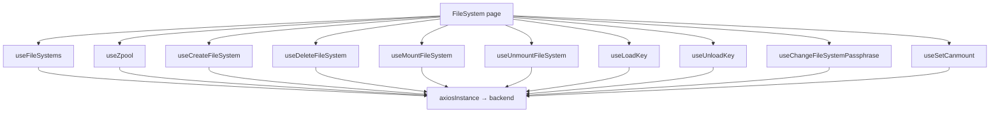

# File System

## Purpose

The File System feature manages filesystem-like storage resources inside integrated storage pools. It combines filesystem CRUD with runtime mount state, automatic-mount configuration, and encryption-key lifecycle operations.

Route: `/file-system`

Entry point: `src/pages/FileSystem.tsx`

## Main responsibilities

The page coordinates:

- listing and normalizing filesystem state;
- creating a filesystem inside a selected pool;
- deleting a filesystem behind confirmation;
- mounting and unmounting;
- toggling the `canmount` property;
- loading and unloading encryption keys;
- changing encryption passphrases;
- showing selected/pinned filesystem details;
- preventing stale detail selections when resources disappear;
- surfacing operation results through toast notifications.

## Runtime flow



All filesystem mutations invalidate the canonical filesystem collection after success. StateSync independently schedules canonical persisted snapshots for filesystem mutations.

## Filesystem list

Hook: `useFileSystems()`

Query key:

```text
['filesystems']
```

Primary endpoint:

```text
GET /api/filesystem/?detail=true
```

The hook uses a 15-second `staleTime` and does not configure a continuous refetch interval.

### Response compatibility

The current fetcher supports two backend generations.

Preferred behavior is a single detailed list response from `/api/filesystem/?detail=true`.

If the backend returns only filesystem names, the frontend falls back to one detail request per name:

```text
GET /api/filesystem/detail/?name=<filesystem>
```

A failed legacy detail request returns `null` for that filesystem rather than failing the complete list. This means old-backend fallback mode can produce a partial list.

## Filesystem normalization

Each normalized `FileSystemEntry` contains:

- `id` / full filesystem name;
- `poolName`;
- `filesystemName`;
- `mountpoint`;
- display-friendly attribute entries;
- a case-tolerant `attributeMap`;
- raw backend data.

The normalizer creates both original-case and lowercase attribute-map keys so feature rendering can tolerate backend property casing differences.

The logical full-name format is:

```text
pool/filesystem
```

## Pool options

Create-Filesystem pool choices come from the canonical zpool query rather than a filesystem-specific pool endpoint.

The page sorts pool names case-insensitively for display.

## Detail split view

The feature uses detail view id:

```text
filesystems
```

On mount, the page clears any previous filesystem detail state. It also clears the same view on unmount.

While mounted, current filesystem ids are reconciled with active/pinned detail ids:

- pinned ids no longer returned by the backend are unpinned;
- an active id that disappears is cleared.

This prevents stale detail panels after delete or external backend changes.

## Create File System

Hook: `useCreateFileSystem()`

Endpoint:

```text
POST /api/filesystem/
```

Domain payload fields are:

```text
pool_name
fs_name
quota
reservation
mountpoint
encryption
passphrase
```

The current UI sets `reservation` equal to the submitted quota and generates the mountpoint as:

```text
/<pool>/<filesystem>
```

Quota units are submitted as `G` or `T`.

### Name rules

The modal and hook enforce these frontend rules:

- pool must be selected;
- filesystem name must be non-empty;
- name must start with an English letter;
- after the first character, English letters, numbers, `-`, and `_` are allowed;
- Persian characters are removed from the input;
- name must not duplicate another filesystem name inside the same pool;
- filesystem name must not equal the selected pool name.

The modal performs duplicate/same-as-pool checks using the currently loaded filesystem collection. Backend validation remains authoritative because client state can be stale or another operator can create the same name concurrently.

### Quota rules

Quota must:

- be present;
- parse as a finite number;
- be greater than zero.

The modal accepts decimal-style numeric input and lets the operator select Gigabytes or Terabytes.

## Encryption at creation

Encryption is optional.

When enabled, the modal currently requires the passphrase to satisfy all of these UI rules:

- non-empty;
- at least 8 characters;
- at least one English letter;
- at least one number or symbol;
- not composed only of Persian text.

Before sending, the passphrase is UTF-8 encoded and then Base64 encoded.

Important: **Base64 is transport encoding, not encryption.** The confidentiality of the passphrase still depends on HTTPS/TLS and backend handling. Do not treat Base64 as a security boundary.

When encryption is disabled, the payload sends `encryption: 'off'` and an empty passphrase.

## Delete File System

Hook: `useDeleteFileSystem()`

Endpoint:

```text
DELETE /api/filesystem/delete/?name=<pool/filesystem>
```

Deletion is confirmation-driven.

On success the hook:

1. removes the deleted filesystem from the current `['filesystems']` cache;
2. invalidates `['filesystems']` for authoritative refetch;
3. closes the confirmation modal through the page callback.

The page contains special error handling for backend messages containing `shareConfiguration`: the operator is told to remove related shares before trying to delete the filesystem again.

This dependency rule must remain backend-enforced; frontend messaging is only an explanatory UX layer.

## Mount File System

Hook: `useMountFileSystem()`

Endpoint:

```text
POST /api/filesystem/mount/?name=<pool/filesystem>
```

After success, `['filesystems']` is invalidated.

The table derives mounted state from backend attributes such as `mounted`, accepting values including `yes`, `on`, `true`, and `mounted`.

## Unmount File System

Hook: `useUnmountFileSystem()`

Endpoint:

```text
POST /api/filesystem/unmount/?name=<pool/filesystem>&force=<boolean>
```

The hook supports an optional `force` flag; the current page calls it without forcing, so `force=false` is the normal UI behavior.

After success, `['filesystems']` is invalidated.

## Automatic mount (`canmount`)

Hook: `useSetCanmount()`

Endpoint:

```text
POST /api/filesystem/set-canmount/?name=<pool/filesystem>&state=on|off
```

The table normalizes truthy `canmount` values from `on`, `yes`, `true`, and `1`.

The table exposes this property as a toggle. While a `canmount` mutation is pending, the current implementation disables all filesystem operation buttons through the shared pending state.

## Encryption-key actions

Encryption actions are shown only when the filesystem's backend attributes indicate encryption is enabled.

Values interpreted as non-encrypted include:

```text
off
false
no
disabled
none
—
-
empty string
```

### Load key

Hook: `useLoadKey()`

Endpoint:

```text
POST /api/filesystem/load-key/?name=<pool/filesystem>
```

Body:

```json
{
  "passphrase": "<base64-encoded UTF-8 passphrase>"
}
```

The UI opens a passphrase modal before calling the mutation.

### Unload key

Hook: `useUnloadKey()`

Endpoint:

```text
POST /api/filesystem/unload-key/?name=<pool/filesystem>
```

No passphrase body is required.

### Change passphrase

Hook: `useChangeFileSystemPassphrase()`

Endpoint:

```text
POST /api/filesystem/change-passphrase/?name=<pool/filesystem>
```

Body:

```json
{
  "new_passphrase": "<base64-encoded UTF-8 passphrase>"
}
```

The table only enables the Change Passphrase action while the encryption key appears loaded.

The loaded-key state is derived from the `keystatus` attribute, recognizing values such as `available`, `loaded`, `on`, `yes`, and `true`.

## Action locking behavior

`FileSystemsTable` currently receives page-level booleans such as:

- `isMounting`;
- `isUnmounting`;
- `isKeyLoading`;
- `isKeyUnloading`;
- `isChangingPassphrase`;
- `isSettingCanmount`.

It combines them into one `anyPending` value.

As a result, while **any** filesystem operational mutation is pending, action controls for **all rows** are disabled.

This is current behavior, not a per-row lock. If future UX requires concurrent operations on independent filesystems, mutation state must be keyed by resource identity rather than changing only the table button conditions.

## StateSync relationship

All `/api/filesystem...` mutation URLs map centrally to:

```text
filesystem + zpool
```

in `resolveStateDomainsForMutation()`.

The reason for the cross-domain mapping is that filesystem operations can also change pool-level capacity/state.

The intended lifecycle is:

```text
successful filesystem mutation
  → React Query invalidates ['filesystems'] for UI freshness
  → Axios response interceptor maps /api/filesystem
  → StateSyncManager schedules filesystem and zpool snapshots
  → canonical GET /api/filesystem/?detail=true with save_to_db=true
  → canonical GET /api/zpool/ with save_to_db=true
```

Feature hooks must not own `save_to_db=true`.

## Error handling

Each operational hook reports the affected full filesystem name to its page callback so toast messages identify the failing resource.

Create/Delete maintain modal-specific error state. Mount/key/property actions currently report errors through toast callbacks rather than a persistent row-level error state.

One operation failing must not erase the successfully fetched filesystem collection.

## Important invariants

- `['filesystems']` is the canonical ordinary filesystem collection key.
- The preferred list endpoint is one detailed request; per-name detail fan-out exists only for compatibility with older backend behavior.
- Filesystem and zpool StateSync are both scheduled after successful filesystem mutations.
- Frontend duplicate-name validation is helpful but cannot replace backend uniqueness enforcement.
- Delete remains confirmation-driven and backend dependency errors must remain authoritative.
- Passphrase Base64 conversion is encoding only, not encryption.
- Change Passphrase is enabled only when the UI believes the key is loaded.
- Current operation locking is global to the table, not per filesystem.
- Detail selections must be reconciled when filesystem entries disappear.

## Common failure scenarios

### List is unexpectedly empty on an older backend

Inspect the initial `/api/filesystem/?detail=true` response. If it returns names only, verify the fallback detail endpoint `/api/filesystem/detail/` still accepts the `name` parameter.

### One filesystem is missing only in legacy fallback mode

The compatibility detail loader catches an individual detail failure and drops that entry. Inspect the per-name detail request.

### Create fails although modal validation passes

Frontend checks can be stale. Inspect backend uniqueness, capacity, mountpoint, encryption, and naming validation from the API response.

### Delete says related shares exist

Remove dependent share configuration using the relevant Share feature, then retry. Do not bypass the backend dependency rule in the frontend.

### Change Passphrase action is disabled

Check normalized `encryption` and `keystatus` attributes. Encryption actions are hidden for non-encrypted filesystems, and Change Passphrase also requires key-loaded state.

### All rows become disabled during one operation

That is current table behavior because operation pending flags are page-global. A per-row concurrency change requires keyed mutation state.

### Backend database snapshot appears stale

Verify the successful mutation passed through `axiosInstance`, then inspect the centralized filesystem/zpool StateSync schedule. Do not add `save_to_db=true` to the feature hook.

## Extension guide

### Adding a filesystem mutation

1. add a dedicated hook or API function;
2. use a URL under the filesystem API contract when appropriate so centralized StateSync mapping remains correct;
3. invalidate `['filesystems']` after success;
4. add resource-aware confirmation for destructive actions;
5. document whether the operation changes zpool state or introduces new cross-domain effects;
6. do not add caller-owned persistence flags.

### Changing encryption handling

Treat passphrase handling as security-sensitive. Confirm:

- transport security requirements;
- whether backend still expects Base64 encoding;
- whether passphrases may be retained in React/browser memory longer than necessary;
- validation contract between frontend and backend.

Do not describe Base64 as encryption.

## Related files

- `src/pages/FileSystem.tsx`
- `src/components/file-system/FileSystemsTable.tsx`
- `src/components/file-system/CreateFileSystemModal.tsx`
- `src/components/file-system/FileSystemPassphraseModal.tsx`
- `src/components/file-system/ConfirmDeleteFileSystemModal.tsx`
- `src/components/file-system/SelectedFileSystemsDetailsPanel.tsx`
- `src/hooks/useFileSystems.ts`
- `src/hooks/useCreateFileSystem.ts`
- `src/hooks/useDeleteFileSystem.ts`
- `src/hooks/useMountFileSystem.ts`
- `src/hooks/useUnmountFileSystem.ts`
- `src/hooks/useLoadKey.ts`
- `src/hooks/useUnloadKey.ts`
- `src/hooks/useChangeFileSystemPassphrase.ts`
- `src/hooks/useSetCanmount.ts`
- `src/lib/stateSyncManager.ts`
- `src/stores/detailSplitViewStore.ts`

## Related documentation

- [`../04-core-flows/server-state-and-cache.md`](../04-core-flows/server-state-and-cache.md)
- [`../04-core-flows/api-request-lifecycle.md`](../04-core-flows/api-request-lifecycle.md)
- [`../04-core-flows/state-sync-save-to-db.md`](../04-core-flows/state-sync-save-to-db.md)
- [`../04-core-flows/polling-and-data-refresh.md`](../04-core-flows/polling-and-data-refresh.md)
