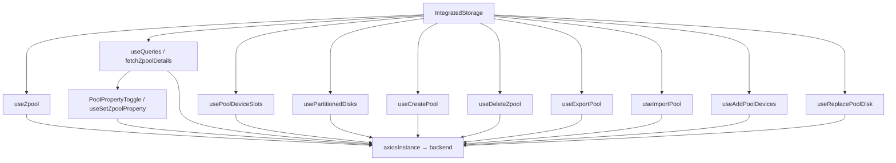

# Integrated Storage

## Purpose

Integrated Storage is the SOHO UI feature for managing ZFS pool-like storage resources represented by the frontend as integrated spaces.

It is one of the most orchestration-heavy pages in the frontend because a single operator workflow can involve:

- zpool list state;
- zpool detail state;
- physical disk inventory;
- disk slot mapping;
- available replacement/addition disks;
- pool property mutations;
- create/delete/import/export/add/replace mutations;
- several modal lifecycles;
- detail comparison state.

Route: `/Integrated-space`

The route check inside the page is case-normalized and expects `/integrated-space`.

Entry point: `src/pages/IntegratedStorage.tsx`

## Main responsibilities

The page coordinates:

- displaying the current integrated-storage pools;
- creating a pool;
- deleting/destroying a pool and cleaning its former disks;
- exporting a pool;
- importing an available pool;
- adding devices to an existing pool;
- replacing an existing pool disk;
- showing physical slot information;
- loading selected/pinned pool details;
- editing selected boolean-like zpool properties;
- refreshing the affected React Query resources after successful mutations.

The page should remain an orchestration layer. Endpoint normalization and reusable domain logic should live in hooks/lib modules rather than accumulating directly inside JSX.

## High-level runtime flow



## Primary zpool list

Hook: `useZpool()`

Query key:

```text
['zpool']
```

Endpoint:

```text
GET /api/zpool/
```

On this page the hook is enabled only when the current route is the Integrated Storage route and polls every 30 seconds.

The hook normalizes backend fields for:

- total/used/free capacity;
- capacity percentage;
- health;
- deduplication ratio;
- fragmentation;
- vdev type and display label.

The page must consume normalized values instead of reimplementing zpool response parsing.

## Pool detail state

Selected and pinned pool ids are loaded with `useQueries()`.

Each detail query uses:

```text
['zpool', poolName, 'details']
```

Endpoint:

```text
GET /api/zpool/{poolName}/
```

Current detail behavior:

- at most four comparison items are loaded (`MAX_COMPARISON_ITEMS = 4`);
- each active query polls every 30 seconds;
- stale time is 25 seconds;
- retries are disabled;
- window-focus and reconnect refetch are disabled;
- the global loader is skipped.

If detail data is temporarily absent, the page may fall back to the normalized raw data already available on the list entry.

## Detail split-view state

The feature uses detail view id:

```text
pools
```

Active and pinned pool ids are reconciled against the current pool list. Pools that disappear from the backend are removed from selection state.

This prevents stale comparison panels from surviving after a destroy/export or external backend change.

## Physical slot mapping

Hook: `usePoolDeviceSlots(poolNames)`

Conceptual query key:

```text
['zpool', 'devices', 'slots', poolNames.join(',')]
```

The slot loader combines two backend data sources:

1. global disk inventory;
2. each pool's device list.

It builds lookup aliases from disk name, path, WWN/WWID, and partition identifiers so backend representations using different identifiers can still resolve to one physical inventory item.

Per-pool device failures are captured in `errorsByPool`; one failing pool does not reject slot results for every other pool.

The page does not load slot mapping immediately. `shouldLoadPoolSlots` gates the work until slot-dependent UI is requested. Once enabled, it uses a 30-second interval.

The Dashboard 3D server widget intentionally uses a faster 10-second override for the same domain hook.

## Disk options used by Create/Add/Replace

The current hook is named:

```text
usePartitionedDisks
```

This name is misleading.

The implementation calls `/api/disk/{disk}/has-partitions/`, negates `has_partitions`, and returns disks considered eligible because they do **not** have partitions. The Integrated Storage modals also describe these as disks without partitions.

Therefore, when reading the current code, treat this hook as an **available/unpartitioned disk source**, despite the historical exported name.

The query key is:

```text
['disk', 'partitioned']
```

The page enables this query only while one of these workflows is open:

- Create Pool;
- Replace Disk;
- Add Pool Devices.

While required, the page polls it every 5 seconds.

The data-building flow uses:

- `GET /api/disk/names/` (with no-trailing-slash fallback on 404);
- per disk `GET /api/disk/{disk}/has-partitions/`;
- per eligible disk `GET /api/disk/{disk}/` to resolve WWN and slot metadata.

Device values prefer stable by-id/WWN-derived identifiers when available, with normalized device path as fallback.

## Create Pool

Hook: `useCreatePool()`

Endpoint:

```text
POST /api/zpool/create/
```

Payload domain fields:

```text
pool_name
devices
vdev_type
```

The hook validates:

- pool name;
- vdev selection;
- selected-device count against the vdev type.

On success it invalidates the zpool and free-disk query families, closes the modal, and the page performs an additional targeted Integrated Storage refresh.

Persistence flags must not be owned by this mutation; StateSync is responsible for canonical persisted snapshots after successful mutations.

## Add Devices

Hook: `useAddPoolDevices()`

Endpoint:

```text
POST /api/zpool/{poolName}/add/
```

Before enabling submission, the hook loads the existing pool vdev type and validates the new selected-device count using the shared vdev rules.

The vdev-type query is deliberately modal-scoped and short-lived (`staleTime: 0`, `gcTime: 0`) so a later Add operation rechecks the current pool type.

On success the hook invalidates:

```text
['zpool']
['zpool', 'devices', ...]
['zpool', 'devices', 'slots', ...]
['disk', 'partitioned']
```

The page also refreshes Integrated Storage state and slot mapping.

## Replace Disk

Hook: `useReplacePoolDisk()`

Endpoint for each replacement:

```text
POST /api/zpool/{poolName}/replace/
```

The current mutation accepts an array of replacement payloads and sends them sequentially.

The UI currently submits one replacement at a time, containing:

```text
old_device
new_device
```

The old device is normalized through `normalizeReplacementOldDevice()`. New-device options come from the available/unpartitioned disk source described above.

After success the same main storage/device query families are invalidated and slot mapping is refetched.

## Delete / Destroy Pool

Hook: `useDeleteZpool()`

The delete workflow is multi-step and is not frontend-atomic.

Current sequence:

1. load the pool's device names;
2. destroy the pool:
   `POST /api/zpool/{poolName}/destroy/`;
3. for each former pool disk, call `cleanupDisk()`;
4. each cleanup attempts `clear-zfs` and then `wipe`.

If pool destruction succeeds but a later disk cleanup fails, the hook ultimately reports an error even though the pool may already be gone.

This operational fact is important during troubleshooting: a reported Delete error does not necessarily mean the destroy call was rolled back.

On successful completion the hook removes the pool optimistically from the current `['zpool']` cache, then invalidates zpool and free-disk data.

The page has special UI handling for errors containing `shareConfiguration`, telling the operator to remove dependent filesystems first.

The backend remains the authoritative dependency/integrity boundary.

## Export Pool

Hook: `useExportPool()`

Endpoint:

```text
POST /api/zpool/export/
```

Domain payload:

```text
pool_name
```

The operation is confirmation-driven through modal state. On success the page refreshes the zpool/detail/device state affected by the operation.

## Import Pool

Hook: `useImportPool()`

The same endpoint is used for discovery and mutation:

```text
GET  /api/zpool/import/
POST /api/zpool/import/
```

The importable-pool query is enabled only while the Import modal is open.

The response normalizer accepts several backend shapes and attempts common pool-name field names (`name`, `pool_name`, `poolName`, `pool`, `id`).

After a successful import the hook invalidates both the main zpool key and the importable-pool key.

## Interactive pool properties

Selected detail fields are rendered as `PoolPropertyToggle` for:

```text
autoexpand
autoreplace
autotrim
listsnapshots
multihost
```

`PoolPropertyToggle` normalizes common backend boolean-like values such as `on`, `enabled`, `true`, `yes`, and `1`.

Mutation hook: `useSetZpoolProperty(poolName)`

Endpoint:

```text
POST /api/zpool/{poolName}/set-property/
```

Payload domain fields:

```text
prop
value: 'on' | 'off'
```

After success, both the selected pool detail query and main zpool query are invalidated.

## Central page refresh helper

`refreshIntegratedStorageData(poolName?)` exists to coalesce common page-level invalidation after successful mutations.

It invalidates:

```text
['zpool']
selected pool detail key when poolName is known
['zpool', 'devices']
['disk', 'partitioned']
```

It does nothing when the page is no longer on the Integrated Storage route.

This route guard prevents an asynchronous mutation callback from causing unnecessary page-specific refresh work after navigation.

## Polling and conditional loading

The feature deliberately avoids running every expensive query all the time.

| Resource | Behavior |
| --- | --- |
| Zpool list | 30 s while on Integrated Storage route. |
| Selected/pinned pool details | 30 s, max 4 active comparisons. |
| Pool slots | Loaded on demand; 30 s once enabled. |
| Available/unpartitioned disks | 5 s only while Create/Add/Replace UI needs them. |
| Importable pools | Only while Import modal is open. |
| Pool vdev type for Add Devices | Only while Add modal is open. |

This conditional behavior is part of the feature's backend-load control and should be preserved during refactoring.

## StateSync relationship

Normal Integrated Storage mutations must not decide when backend database snapshots are persisted.

Correct ownership is:

```text
feature mutation
  → axiosInstance
  → successful backend mutation
  → React Query invalidation for UI freshness
  → Axios response interceptor
  → StateSyncManager schedules canonical zpool/disk snapshot(s)
```

Caller-level `save_to_db=true` is legacy behavior and should not be introduced into new feature code.

## Important invariants

- Zpool list state is shared through the canonical `['zpool']` key.
- Detail queries are bounded to four comparison items.
- Slot queries must remain conditional because they fan out across inventory and per-pool endpoints.
- Available disk polling must run only while a disk-selection workflow is open.
- Prefer stable WWN/by-id identifiers when generating mutation device values.
- One pool-device lookup failure must not erase successful slot results for other pools.
- Pool deletion is a multi-step destructive workflow and must remain confirmation-driven.
- UI invalidation and StateSync persistence are separate concerns.
- The current `usePartitionedDisks` name does not accurately describe its returned eligible disks; verify semantics before reusing it elsewhere.

## Common failure scenarios

### Create/Add/Replace modal shows no disks

Check:

1. whether the page considers the modal open;
2. `shouldFetchPartitionedDisks`;
3. `/api/disk/names/`;
4. each `has-partitions` response;
5. metadata requests used to build WWN/path values;
6. whether the frontend/backend agree that eligible disks should have no partitions.

### Slot numbers are missing

Check identifier matching across:

- pool device `disk_name`/path;
- disk inventory name/path;
- WWN/WWID;
- partition aliases.

The slot resolver intentionally tries several aliases because backend endpoints can represent the same physical disk differently.

### Delete reports failure but the pool disappeared

Inspect the sequence. `destroy` happens before post-destroy disk cleanup. A later wipe failure can produce an error after the pool is already destroyed.

### Details do not update after property change

Verify that `useSetZpoolProperty` invalidates both `zpoolDetailQueryKey(poolName)` and `zpoolQueryKey`, and verify the mutation actually succeeded.

### Too many storage requests appear

Check whether slot loading or available-disk polling became enabled outside its modal/detail lifecycle. Do not solve the problem by removing necessary invalidation blindly.

## Extension guide

### Adding a new pool mutation

1. put endpoint-specific mutation logic in a hook/lib module;
2. keep modal/form state outside the transport layer;
3. define validation before mutation;
4. use canonical query keys for invalidation;
5. map the mutation URL in StateSync if it affects a persisted domain;
6. do not add `save_to_db=true` at the caller;
7. document partial-failure semantics if the workflow has multiple backend calls.

### Adding a new pool detail property

If the field is display-only, add it through detail localization/rendering.

If it is editable:

1. define its backend value contract;
2. reuse or extend a dedicated mutation hook;
3. invalidate the exact pool detail and list resources;
4. document whether it is safe to model as an immediate toggle.

## Related files

- `src/pages/IntegratedStorage.tsx`
- `src/components/integrated-storage/PoolsTable.tsx`
- `src/components/integrated-storage/SelectedPoolsDetailsPanel.tsx`
- `src/components/integrated-storage/CreatePoolModal.tsx`
- `src/components/integrated-storage/AddPoolDiskModal.tsx`
- `src/components/integrated-storage/ReplaceDiskModal.tsx`
- `src/components/integrated-storage/ImportPoolModal.tsx`
- `src/components/integrated-storage/PoolPropertyToggle.tsx`
- `src/hooks/useZpool.ts`
- `src/hooks/useZpoolDetails.ts`
- `src/hooks/usePoolDeviceSlots.ts`
- `src/hooks/useDisk.ts`
- `src/hooks/useCreatePool.ts`
- `src/hooks/useDeleteZpool.ts`
- `src/hooks/useExportPool.ts`
- `src/hooks/useImportPool.ts`
- `src/hooks/useAddPoolDevices.ts`
- `src/hooks/useReplacePoolDisk.ts`
- `src/hooks/useSetZpoolProperty.ts`
- `src/lib/diskMaintenance.ts`
- `src/lib/poolDevices.ts`
- `src/stores/detailSplitViewStore.ts`

## Related documentation

- [`../04-core-flows/server-state-and-cache.md`](../04-core-flows/server-state-and-cache.md)
- [`../04-core-flows/polling-and-data-refresh.md`](../04-core-flows/polling-and-data-refresh.md)
- [`../04-core-flows/api-request-lifecycle.md`](../04-core-flows/api-request-lifecycle.md)
- [`../04-core-flows/state-sync-save-to-db.md`](../04-core-flows/state-sync-save-to-db.md)
