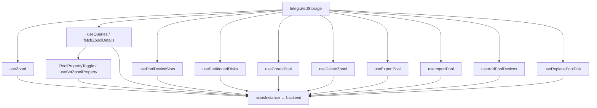

# Integrated Storage

## هدف

Integrated Storage feature مربوط به مدیریت storage resourceهای شبیه ZFS pool است که در frontend به‌صورت integrated space نمایش داده می‌شوند.

این صفحه یکی از orchestration-heavyترین بخش‌های frontend است، چون یک workflow واحد ممکن است هم‌زمان با موارد زیر درگیر باشد:

- zpool list state؛
- zpool detail state؛
- physical disk inventory؛
- disk slot mapping؛
- diskهای قابل استفاده برای replace/add؛
- pool property mutationها؛
- create/delete/import/export/add/replace mutationها؛
- چند modal lifecycle؛
- detail comparison state.

Route:

```text
/Integrated-space
```

Route check داخل صفحه case-normalized است و `/integrated-space` را انتظار دارد.

Entry point:

```text
src/pages/IntegratedStorage.tsx
```

## مسئولیت‌های اصلی

صفحه موارد زیر را coordinate می‌کند:

- نمایش poolهای فعلی Integrated Storage؛
- create کردن pool؛
- destroy کردن pool و cleanup کردن diskهای قبلی آن؛
- export کردن pool؛
- import کردن pool قابل دسترس؛
- اضافه کردن device به pool موجود؛
- replace کردن disk موجود در pool؛
- نمایش physical slot information؛
- load کردن detail مربوط به poolهای selected/pinned؛
- edit کردن برخی zpool propertyهای boolean-like؛
- refresh کردن React Query resourceهای متاثر پس از mutation موفق.

صفحه باید orchestration layer باقی بماند. Endpoint normalization و reusable domain logic باید در hook/lib moduleها قرار بگیرند و مستقیماً داخل JSX انباشته نشوند.

## high-level runtime flow



## zpool list اصلی

Hook:

```text
useZpool()
```

Query key:

```text
['zpool']
```

Endpoint:

```text
GET /api/zpool/
```

در این صفحه hook فقط زمانی enabled است که route فعلی Integrated Storage باشد و هر 30 ثانیه polling انجام می‌دهد.

Hook backend fieldهای زیر را normalize می‌کند:

- total/used/free capacity؛
- capacity percentage؛
- health؛
- deduplication ratio؛
- fragmentation؛
- vdev type و display label.

صفحه باید normalized valueها را مصرف کند و parsing مربوط به zpool response را دوباره پیاده‌سازی نکند.

## pool detail state

Pool idهای selected و pinned با `useQueries()` load می‌شوند.

هر detail query از key زیر استفاده می‌کند:

```text
['zpool', poolName, 'details']
```

Endpoint:

```text
GET /api/zpool/{poolName}/
```

رفتار فعلی detail:

- حداکثر چهار comparison item هم‌زمان load می‌شوند (`MAX_COMPARISON_ITEMS = 4`)؛
- هر query فعال هر 30 ثانیه polling می‌کند؛
- `staleTime` برابر 25 ثانیه است؛
- retry غیرفعال است؛
- refetch روی window focus و reconnect غیرفعال است؛
- global loader skip می‌شود.

اگر detail data موقتاً وجود نداشته باشد، صفحه می‌تواند از normalized raw data موجود در list entry به‌عنوان fallback استفاده کند.

## detail split-view state

این feature از view id زیر استفاده می‌کند:

```text
pools
```

Active و pinned pool idها با pool list فعلی reconcile می‌شوند. Poolهایی که دیگر backend برنمی‌گرداند از selection state حذف می‌شوند.

این رفتار مانع باقی ماندن stale comparison panel پس از destroy/export یا تغییر خارجی backend می‌شود.

## physical slot mapping

Hook:

```text
usePoolDeviceSlots(poolNames)
```

Conceptual query key:

```text
['zpool', 'devices', 'slots', poolNames.join(',')]
```

Slot loader دو منبع backend را ترکیب می‌کند:

1. global disk inventory؛
2. device list هر pool.

برای resolve کردن یک physical disk از representationهای مختلف backend، alias lookup از disk name، path، WWN/WWID و partition identifier ساخته می‌شود.

Failure مربوط به deviceهای یک pool در `errorsByPool` capture می‌شود؛ failure یک pool نباید slot result همه‌ی poolهای دیگر را reject کند.

صفحه slot mapping را بلافاصله load نمی‌کند. `shouldLoadPoolSlots` کار را تا زمانی که UI وابسته به slot واقعاً نیاز داشته باشد gate می‌کند. پس از enable شدن، interval برابر 30 ثانیه است.

Dashboard 3D widget برای همین domain hook عمداً override سریع‌تر 10 ثانیه‌ای دارد.

## disk optionهای Create/Add/Replace

Hook فعلی نام زیر را دارد:

```text
usePartitionedDisks
```

این نام misleading است.

Implementation endpoint `/api/disk/{disk}/has-partitions/` را call می‌کند، مقدار `has_partitions` را negate می‌کند و diskهایی را eligible می‌داند که **partition ندارند**. Modalهای Integrated Storage نیز همین diskها را بدون partition معرفی می‌کنند.

بنابراین در code فعلی، این hook را با وجود نام historical آن، source مربوط به **available/unpartitioned disk** در نظر بگیرید.

Query key:

```text
['disk', 'partitioned']
```

صفحه فقط در زمان باز بودن workflowهای زیر query را enable می‌کند:

- Create Pool؛
- Replace Disk؛
- Add Pool Devices.

در این حالت query هر 5 ثانیه polling می‌کند.

Data-building flow از موارد زیر استفاده می‌کند:

- `GET /api/disk/names/` با fallback بدون trailing slash در 404؛
- برای هر disk، `GET /api/disk/{disk}/has-partitions/`؛
- برای هر disk eligible، `GET /api/disk/{disk}/` جهت resolve کردن WWN و slot metadata.

Device value در صورت وجود stable by-id/WWN identifier را ترجیح می‌دهد و normalized device path fallback است.

## Create Pool

Hook:

```text
useCreatePool()
```

Endpoint:

```text
POST /api/zpool/create/
```

Domain payload fieldها:

```text
pool_name
devices
vdev_type
```

Hook موارد زیر را validate می‌کند:

- pool name؛
- vdev selection؛
- تعداد selected device متناسب با vdev type.

پس از success، zpool و free-disk query familyها invalidate می‌شوند، modal بسته می‌شود و صفحه یک targeted Integrated Storage refresh اضافی انجام می‌دهد.

Persistence flag نباید مالکیت این mutation باشد؛ StateSync پس از mutation موفق canonical persisted snapshotها را مدیریت می‌کند.

## Add Devices

Hook:

```text
useAddPoolDevices()
```

Endpoint:

```text
POST /api/zpool/{poolName}/add/
```

پیش از enable شدن submit، hook vdev type فعلی pool را load می‌کند و تعداد device جدید را با shared vdev ruleها validate می‌کند.

Vdev-type query عمداً modal-scoped و short-lived است (`staleTime: 0`, `gcTime: 0`) تا Add operation بعدی type فعلی pool را دوباره بررسی کند.

پس از success، این queryها invalidate می‌شوند:

```text
['zpool']
['zpool', 'devices', ...]
['zpool', 'devices', 'slots', ...]
['disk', 'partitioned']
```

صفحه نیز Integrated Storage state و slot mapping را refresh می‌کند.

## Replace Disk

Hook:

```text
useReplacePoolDisk()
```

Endpoint برای هر replacement:

```text
POST /api/zpool/{poolName}/replace/
```

Mutation فعلی array از replacement payloadها می‌پذیرد و آن‌ها را sequential ارسال می‌کند.

UI فعلی در هر بار یک replacement می‌فرستد:

```text
old_device
new_device
```

Old device با `normalizeReplacementOldDevice()` normalize می‌شود. New-device optionها از available/unpartitioned disk source گفته‌شده می‌آیند.

پس از success، همان storage/device query familyهای اصلی invalidate و slot mapping refetch می‌شود.

## Delete / Destroy Pool

Hook:

```text
useDeleteZpool()
```

Delete workflow multi-step است و از سمت frontend atomic نیست.

Sequence فعلی:

1. device nameهای pool load می‌شوند؛
2. pool destroy می‌شود: `POST /api/zpool/{poolName}/destroy/`؛
3. برای هر disk قبلی pool، `cleanupDisk()` اجرا می‌شود؛
4. هر cleanup ابتدا `clear-zfs` و سپس `wipe` را تلاش می‌کند.

اگر pool destruction موفق باشد ولی disk cleanup بعدی fail شود، hook در نهایت error گزارش می‌دهد، در حالی که pool ممکن است از قبل حذف شده باشد.

این نکته در troubleshooting مهم است: Delete error لزوماً به این معنا نیست که destroy rollback شده است.

پس از completion موفق، hook pool را به‌صورت optimistic از cache فعلی `['zpool']` حذف می‌کند و سپس zpool و free-disk data را invalidate می‌کند.

صفحه برای errorهای حاوی `shareConfiguration` پیام خاصی دارد و از operator می‌خواهد ابتدا filesystem وابسته را حذف کند.

Backend همچنان authoritative dependency/integrity boundary است.

## Export Pool

Hook:

```text
useExportPool()
```

Endpoint:

```text
POST /api/zpool/export/
```

Domain payload:

```text
pool_name
```

Operation از طریق modal state confirmation-driven است. پس از success، صفحه zpool/detail/device state متاثر را refresh می‌کند.

## Import Pool

Hook:

```text
useImportPool()
```

همان endpoint برای discovery و mutation استفاده می‌شود:

```text
GET  /api/zpool/import/
POST /api/zpool/import/
```

Importable-pool query فقط وقتی Import modal باز است enabled می‌شود.

Response normalizer چند backend shape را می‌پذیرد و field nameهای رایج `name`، `pool_name`، `poolName`، `pool` و `id` را برای یافتن pool name امتحان می‌کند.

بعد از import موفق، هم main zpool key و هم importable-pool key invalidate می‌شوند.

## interactive pool propertyها

برخی selected detail fieldها با `PoolPropertyToggle` render می‌شوند:

```text
autoexpand
autoreplace
autotrim
listsnapshots
multihost
```

`PoolPropertyToggle` backend valueهای رایج مثل `on`، `enabled`، `true`، `yes` و `1` را به‌عنوان boolean-like value normalize می‌کند.

Mutation hook:

```text
useSetZpoolProperty(poolName)
```

Endpoint:

```text
POST /api/zpool/{poolName}/set-property/
```

Payload:

```text
prop
value: 'on' | 'off'
```

پس از success، هم detail query مربوط به pool و هم main zpool query invalidate می‌شوند.

## helper مرکزی refresh صفحه

`refreshIntegratedStorageData(poolName?)` برای coalesce کردن invalidationهای رایج page-level بعد از mutation موفق وجود دارد.

این موارد را invalidate می‌کند:

```text
['zpool']
selected pool detail key when poolName is known
['zpool', 'devices']
['disk', 'partitioned']
```

اگر صفحه دیگر روی Integrated Storage route نباشد، helper کاری انجام نمی‌دهد.

این route guard مانع آن می‌شود که asynchronous mutation callback پس از navigation، page-specific refresh غیرضروری اجرا کند.

## polling و conditional loading

Feature عمداً تمام queryهای expensive را دائماً اجرا نمی‌کند.

| Resource | رفتار |
| --- | --- |
| Zpool list | هر 30 ثانیه تا زمانی که روی Integrated Storage route هستیم |
| Selected/pinned pool details | هر 30 ثانیه، حداکثر 4 comparison فعال |
| Pool slots | on-demand؛ پس از enable شدن هر 30 ثانیه |
| Available/unpartitioned disks | فقط هنگام نیاز Create/Add/Replace، هر 5 ثانیه |
| Importable pools | فقط هنگام باز بودن Import modal |
| Pool vdev type for Add Devices | فقط هنگام باز بودن Add modal |

این conditional behavior بخشی از backend-load control feature است و هنگام refactor باید حفظ شود.

## ارتباط با StateSync

Integrated Storage mutationهای عادی نباید تصمیم بگیرند backend database snapshot چه زمانی persist شود.

Ownership صحیح:

```text
feature mutation
  → axiosInstance
  → successful backend mutation
  → React Query invalidation for UI freshness
  → Axios response interceptor
  → StateSyncManager schedules canonical zpool/disk snapshot(s)
```

Caller-level `save_to_db=true` legacy behavior است و نباید وارد feature code جدید شود.

## invariantهای مهم

- Zpool list state از canonical key یعنی `['zpool']` به اشتراک گذاشته می‌شود.
- Detail queryها به حداکثر چهار comparison item محدودند.
- Slot queryها باید conditional بمانند، چون روی inventory و per-pool endpointها fan-out دارند.
- Available disk polling فقط هنگام باز بودن disk-selection workflow اجرا شود.
- برای mutation device value در صورت امکان stable WWN/by-id identifier ترجیح داده شود.
- Failure یک pool-device lookup نباید slot result موفق poolهای دیگر را حذف کند.
- Pool deletion یک multi-step destructive workflow است و باید confirmation-driven بماند.
- UI invalidation و StateSync persistence دو concern جدا هستند.
- نام فعلی `usePartitionedDisks` semantics واقعی خروجی آن را درست توصیف نمی‌کند؛ پیش از reuse کردن، رفتار واقعی را بررسی کنید.

## failure scenarioهای رایج

### Create/Add/Replace modal هیچ diskی نشان نمی‌دهد

این موارد را بررسی کنید:

1. آیا modal واقعاً open تشخیص داده می‌شود؛
2. `shouldFetchPartitionedDisks`؛
3. `/api/disk/names/`؛
4. response هر `has-partitions`؛
5. metadata requestهای لازم برای WWN/path value؛
6. توافق frontend/backend درباره اینکه disk eligible باید بدون partition باشد.

### Slot numberها missing هستند

Identifier matching میان این موارد را بررسی کنید:

- `disk_name`/path مربوط به pool device؛
- disk inventory name/path؛
- WWN/WWID؛
- partition aliasها.

Slot resolver عمداً چند alias را امتحان می‌کند، چون endpointهای مختلف backend می‌توانند یک physical disk را با identifier متفاوت نشان دهند.

### Delete failure گزارش می‌دهد ولی pool ناپدید شده

Sequence را بررسی کنید. `destroy` قبل از post-destroy disk cleanup انجام می‌شود. Wipe failure بعدی می‌تواند در حالی error تولید کند که pool از قبل destroy شده است.

### Detail بعد از property change update نمی‌شود

بررسی کنید `useSetZpoolProperty` هم `zpoolDetailQueryKey(poolName)` و هم `zpoolQueryKey` را invalidate کند و mutation واقعاً موفق بوده باشد.

### storage request بیش از حد دیده می‌شود

بررسی کنید slot loading یا available-disk polling بیرون از modal/detail lifecycle enable نشده باشد. مشکل را با حذف کورکورانه‌ی invalidation حل نکنید.

## راهنمای توسعه

### افزودن pool mutation جدید

1. endpoint-specific mutation logic را در hook/lib module قرار دهید.
2. modal/form state را خارج از transport layer نگه دارید.
3. پیش از mutation validation را تعریف کنید.
4. از canonical query keyها برای invalidation استفاده کنید.
5. اگر mutation persisted domain را متاثر می‌کند، URL آن را در StateSync map کنید.
6. در caller `save_to_db=true` اضافه نکنید.
7. اگر workflow چند backend call دارد، partial-failure semantics را مستند کنید.

### افزودن pool detail property جدید

اگر field فقط display است، آن را از طریق detail localization/rendering اضافه کنید.

اگر editable است:

1. backend value contract را مشخص کنید.
2. mutation hook اختصاصی را reuse یا extend کنید.
3. detail و list resource مربوط را invalidate کنید.
4. مشخص کنید آیا مدل کردن آن به‌صورت immediate toggle امن است یا خیر.

## فایل‌های مرتبط

- `src/pages/IntegratedStorage.tsx`
- `src/components/integrated-storage/PoolsTable.tsx`
- `src/components/integrated-storage/SelectedPoolsDetailsPanel.tsx`
- `src/components/integrated-storage/CreatePoolModal.tsx`
- `src/components/integrated-storage/AddPoolDiskModal.tsx`
- `src/components/integrated-storage/ReplaceDiskModal.tsx`
- `src/components/integrated-storage/ImportPoolModal.tsx`
- `src/components/integrated-storage/PoolPropertyToggle.tsx`
- `src/hooks/useZpool.ts`
- `src/hooks/useZpoolDetails.ts`
- `src/hooks/usePoolDeviceSlots.ts`
- `src/hooks/useDisk.ts`
- `src/hooks/useCreatePool.ts`
- `src/hooks/useDeleteZpool.ts`
- `src/hooks/useExportPool.ts`
- `src/hooks/useImportPool.ts`
- `src/hooks/useAddPoolDevices.ts`
- `src/hooks/useReplacePoolDisk.ts`
- `src/hooks/useSetZpoolProperty.ts`
- `src/lib/diskMaintenance.ts`
- `src/lib/poolDevices.ts`
- `src/stores/detailSplitViewStore.ts`

## مستندات مرتبط

- [`../04-core-flows/server-state-and-cache.md`](../04-core-flows/server-state-and-cache.md)
- [`../04-core-flows/polling-and-data-refresh.md`](../04-core-flows/polling-and-data-refresh.md)
- [`../04-core-flows/api-request-lifecycle.md`](../04-core-flows/api-request-lifecycle.md)
- [`../04-core-flows/state-sync-save-to-db.md`](../04-core-flows/state-sync-save-to-db.md)
