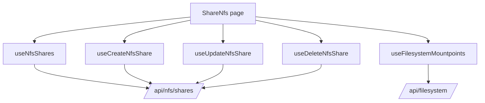

# NFS Shares

## Purpose

The NFS feature manages NFS exports backed by filesystem mountpoints.

Route: `/share-nfs`

Entry point: `src/pages/ShareNfs.tsx`

The feature owns NFS share CRUD, client access configuration, filesystem-mountpoint selection for new shares, and the UI representation of NFS options.

## Main responsibilities

The current implementation supports:

- listing NFS shares;
- manually refreshing the share list;
- creating a share from an available filesystem mountpoint;
- editing an existing share;
- deleting a share with confirmation;
- filtering mountpoints already used by existing NFS shares;
- translating frontend option names into backend semantics;
- restarting `nfs-server.service` in the current create flow.

## Runtime flow



## NFS share query

Canonical key:

```text
['nfs', 'shares']
```

Endpoint:

```text
GET /api/nfs/shares/
```

There is no continuous polling interval in `useNfsShares()`.

Refresh happens through normal React Query lifecycle, explicit manual `refetch()`, and successful mutation invalidation.

## Create share

Hook: `useCreateNfsShare()`

Endpoint:

```text
POST /api/nfs/shares/
```

The create modal requires:

- a valid filesystem mountpoint;
- a client IPv4 value;
- NFS option state.

The page loads mountpoint choices only while the Create modal is open.

## Filesystem mountpoint dependency

Hook: `useFilesystemMountpoints()`

Key:

```text
['filesystem-mountpoints']
```

Endpoint:

```text
GET /api/filesystem/?detail=true
```

The NFS page removes mountpoints whose path already exists in the current NFS share list before showing create choices.

This is UX filtering, not a backend integrity guarantee. The backend must still reject conflicting exports under concurrent administration.

## Edit share

Hook: `useUpdateNfsShare()`

Endpoint:

```text
PUT /api/nfs/shares/update/
```

The existing share path is fixed in edit mode; the operator edits clients/options rather than selecting a different mountpoint.

After success the canonical NFS share query is invalidated.

## Delete share

Hook: `useDeleteNfsShare()`

Endpoint:

```text
DELETE /api/nfs/shares/delete/?path=<share-path>
```

The hook tracks a pending path and uses a confirmation modal before mutation.

After success `['nfs','shares']` is invalidated.

## Option semantic translation

The UI model includes:

```text
read_write
sync
root_squash
no_subtree_check
```

The backend create/update payload expects `subtree_check`, not `no_subtree_check`.

Therefore the mutation layer intentionally translates:

```text
subtree_check = !no_subtree_check
```

This inversion is a semantic contract, not redundant boolean manipulation.

Do not simplify it away unless the backend API itself changes.

## Displayed option subset

The current modal does not render every option as a direct toggle. The visible option list excludes:

```text
root_squash
no_subtree_check
```

Those values are still part of the option model/default resolution.

Before adding or removing a displayed toggle, verify how `NFS_OPTION_DEFAULTS`, `NFS_OPTION_KEYS`, and backend translation interact.

## Service restart behavior

The current Create modal calls `useServiceAction()` for:

```text
nfs-server.service -> restart
```

Important current behavior:

- restart is requested in the create submission path **before** the NFS create mutation is submitted;
- edit mode does not run this restart path.

This ordering is suspicious from an operational perspective if restart is required to apply newly written export configuration, but it is current runtime behavior.

Do not reorder or broaden the restart automatically without confirming backend/system semantics.

A future cleanup should answer:

1. Does the backend endpoint already reload/restart NFS itself?
2. If not, should restart happen only after successful create/update/delete?
3. Are all NFS mutations subject to the same service-apply rule?
4. Should service application be owned by the backend instead of page UI?

Until those questions are resolved, this document records the existing behavior rather than presenting it as an ideal architecture.

## StateSync ownership

NFS is a persisted StateSync domain.

Successful `/api/nfs...` mutations map to:

```text
nfs
```

Canonical persistence snapshot:

```text
GET /api/nfs/shares/?save_to_db=true
```

That request is created by `StateSyncManager`, not by the NFS feature hooks.

Normal NFS queries and mutations must remain observational/operational traffic with centralized transport policy enforcing `save_to_db=false`.

## Query refresh versus persistence

After a successful NFS mutation two independent mechanisms can run:

1. the feature invalidates `['nfs','shares']` so the UI refreshes;
2. Axios/StateSync schedules the canonical NFS persistence snapshot.

These mechanisms must remain separate.

Do not add `save_to_db=true` to `NfsSharePayload` as a way to force refresh or persistence.

## Error handling

Create and Update normalize common backend error shapes:

```text
detail
message
errors
```

The page stores create/edit error text independently so the relevant modal can remain open and display the backend failure.

Delete uses the confirmation-controller pattern and exposes the target path/error state.

## Common failure scenarios

### No mountpoints are available

Check:

1. `/api/filesystem/?detail=true` response;
2. mountpoint normalization;
3. whether every filesystem mountpoint is already represented by an NFS share;
4. whether the Create modal is open, because the mountpoint query is conditionally enabled.

### Create succeeds but UI looks stale

Check:

1. `['nfs','shares']` invalidation;
2. backend list response;
3. React Query query state;
4. whether a previous error kept the create modal state open.

Do not solve this with persistence flags.

### `no_subtree_check` behaves backwards

Inspect the translation in Create/Update hooks. Backend `subtree_check` is intentionally the inverse of the UI's `no_subtree_check` field.

### Service behavior does not match config state

Treat the NFS mutation and `nfs-server.service` restart as separate operations when debugging. The current create flow does not guarantee that the restart occurs after a successful configuration write.

## Extension guide

When adding an NFS capability:

1. reuse `['nfs','shares']` for the canonical collection unless the lifecycle is genuinely different;
2. keep backend field translation in hooks/utils rather than page components;
3. use `axiosInstance` for every request;
4. never add caller-level `save_to_db` ownership;
5. invalidate the NFS collection after successful configuration mutations;
6. preserve StateSync ownership for persisted snapshots;
7. document any service restart/reload requirement explicitly;
8. treat mountpoint availability checks as UX assistance, not integrity enforcement;
9. document any multi-client or multi-request workflow that can partially succeed.

## Related files

- `src/pages/ShareNfs.tsx`
- `src/hooks/useNfsShares.ts`
- `src/hooks/useCreateNfsShare.ts`
- `src/hooks/useUpdateNfsShare.ts`
- `src/hooks/useDeleteNfsShare.ts`
- `src/hooks/useFilesystemMountpoints.ts`
- `src/components/nfs/NfsShareModal.tsx`
- `src/utils/nfsShares.ts`
- `src/utils/nfsShareOptions.ts`
- `src/lib/stateSyncManager.ts`

## Related documentation

- [`file-system.md`](./file-system.md)
- [`services.md`](./services.md)
- [`../04-core-flows/server-state-and-cache.md`](../04-core-flows/server-state-and-cache.md)
- [`../04-core-flows/state-sync-save-to-db.md`](../04-core-flows/state-sync-save-to-db.md)
- [`../04-core-flows/api-request-lifecycle.md`](../04-core-flows/api-request-lifecycle.md)
