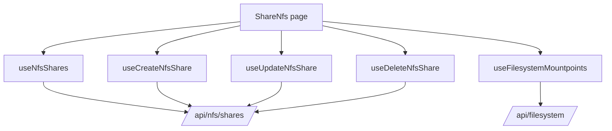

# NFS Shares

## هدف

Feature مربوط به NFS، exportهای NFS مبتنی بر filesystem mountpointها را مدیریت می‌کند.

Route:

```text
/share-nfs
```

Entry point:

```text
src/pages/ShareNfs.tsx
```

این feature مالک NFS share CRUD، client access configuration، انتخاب filesystem mountpoint برای share جدید و representation مربوط به NFS optionها در UI است.

## مسئولیت‌های اصلی

Implementation فعلی موارد زیر را پشتیبانی می‌کند:

- لیست کردن NFS shareها؛
- refresh دستی share list؛
- ایجاد share از filesystem mountpoint قابل دسترس؛
- edit کردن share موجود؛
- delete کردن share با confirmation؛
- filter کردن mountpointهایی که از قبل توسط NFS share دیگری استفاده شده‌اند؛
- ترجمه‌ی نام optionهای frontend به semantics مورد انتظار backend؛
- restart کردن `nfs-server.service` در create flow فعلی.

## runtime flow



## NFS share query

Canonical key:

```text
['nfs', 'shares']
```

Endpoint:

```text
GET /api/nfs/shares/
```

در `useNfsShares()` continuous polling interval وجود ندارد.

Refresh از طریق lifecycle عادی React Query، `refetch()` دستی و invalidation بعد از mutation موفق انجام می‌شود.

## Create share

Hook:

```text
useCreateNfsShare()
```

Endpoint:

```text
POST /api/nfs/shares/
```

Create modal موارد زیر را الزامی می‌داند:

- filesystem mountpoint معتبر؛
- client IPv4 value؛
- NFS option state.

صفحه mountpoint choiceها را فقط وقتی Create modal باز است load می‌کند.

## وابستگی به filesystem mountpoint

Hook:

```text
useFilesystemMountpoints()
```

Key:

```text
['filesystem-mountpoints']
```

Endpoint:

```text
GET /api/filesystem/?detail=true
```

NFS page پیش از نمایش create choiceها mountpointهایی را حذف می‌کند که path آن‌ها از قبل در NFS share list فعلی وجود دارد.

این filtering فقط UX assistance است و backend integrity guarantee نیست. Backend باید conflict مربوط به export را در concurrent administration همچنان reject کند.

## Edit share

Hook:

```text
useUpdateNfsShare()
```

Endpoint:

```text
PUT /api/nfs/shares/update/
```

در edit mode، path مربوط به share ثابت است و operator به‌جای انتخاب mountpoint دیگر، clientها و optionها را edit می‌کند.

بعد از success، canonical NFS share query invalidate می‌شود.

## Delete share

Hook:

```text
useDeleteNfsShare()
```

Endpoint:

```text
DELETE /api/nfs/shares/delete/?path=<share-path>
```

Hook pending path را track می‌کند و پیش از mutation از confirmation modal استفاده می‌کند.

پس از success، `['nfs','shares']` invalidate می‌شود.

## ترجمه‌ی semantics مربوط به optionها

UI model شامل fieldهای زیر است:

```text
read_write
sync
root_squash
no_subtree_check
```

Backend create/update payload به `subtree_check` نیاز دارد، نه `no_subtree_check`.

بنابراین mutation layer عمداً این translation را انجام می‌دهد:

```text
subtree_check = !no_subtree_check
```

این inversion یک semantic contract است، نه boolean manipulation اضافه.

تا زمانی که backend API تغییر نکرده، آن را ساده‌سازی یا حذف نکنید.

## subset optionهای نمایش‌داده‌شده

Modal فعلی همه‌ی optionها را به‌صورت toggle مستقیم render نمی‌کند. Visible option list شامل موارد زیر نیست:

```text
root_squash
no_subtree_check
```

اما این valueها همچنان بخشی از option model/default resolution هستند.

پیش از اضافه یا حذف کردن toggle قابل نمایش، interaction میان `NFS_OPTION_DEFAULTS`، `NFS_OPTION_KEYS` و backend translation را بررسی کنید.

## رفتار service restart

Create modal فعلی از `useServiceAction()` برای این operation استفاده می‌کند:

```text
nfs-server.service -> restart
```

رفتار فعلی مهم است:

- restart در create submission path **پیش از** ارسال NFS create mutation request می‌شود؛
- edit mode از این restart path استفاده نمی‌کند.

اگر restart برای apply شدن configuration تازه نوشته‌شده لازم باشد، این ordering از نظر operational مشکوک است؛ اما runtime behavior فعلی همین است.

بدون confirm کردن backend/system semantics، ترتیب را خودسرانه تغییر ندهید یا restart را به mutationهای دیگر تعمیم ندهید.

یک cleanup آینده باید این سؤال‌ها را پاسخ دهد:

1. آیا backend endpoint خودش NFS را reload/restart می‌کند؟
2. اگر نه، restart باید فقط بعد از create/update/delete موفق انجام شود؟
3. آیا همه‌ی NFS mutationها مشمول یک service-apply rule هستند؟
4. آیا اعمال service باید مالکیت backend باشد نه page UI؟

تا زمانی که این contract روشن نشده، این سند behavior فعلی را ثبت می‌کند و آن را architecture ایده‌آل معرفی نمی‌کند.

## مالکیت StateSync

NFS یک persisted StateSync domain است.

Mutationهای موفق زیر namespace `/api/nfs...` به domain زیر map می‌شوند:

```text
nfs
```

Canonical persistence snapshot:

```text
GET /api/nfs/shares/?save_to_db=true
```

این request توسط `StateSyncManager` ساخته می‌شود، نه feature hookهای NFS.

NFS query و mutationهای عادی باید observational/operational traffic باقی بمانند و centralized transport policy آن‌ها را با `save_to_db=false` ارسال کند.

## تفاوت query refresh و persistence

بعد از NFS mutation موفق دو mechanism مستقل ممکن است اجرا شوند:

1. feature، `['nfs','shares']` را invalidate می‌کند تا UI refresh شود؛
2. Axios/StateSync canonical NFS persistence snapshot را schedule می‌کند.

این دو mechanism باید جدا باقی بمانند.

برای force کردن refresh یا persistence، `save_to_db=true` را به `NfsSharePayload` اضافه نکنید.

## مدیریت خطا

Create و Update backend error shapeهای رایج زیر را normalize می‌کنند:

```text
detail
message
errors
```

صفحه create/edit error text را جداگانه نگه می‌دارد تا modal مرتبط باز بماند و backend failure را نمایش دهد.

Delete از confirmation-controller pattern استفاده می‌کند و target path/error state را expose می‌کند.

## failure scenarioهای رایج

### هیچ mountpointی در دسترس نیست

این موارد را بررسی کنید:

1. response مربوط به `/api/filesystem/?detail=true`؛
2. mountpoint normalization؛
3. آیا تمام filesystem mountpointها از قبل در NFS share list هستند؛
4. آیا Create modal باز است، چون mountpoint query conditionally enabled است.

### Create موفق است ولی UI stale به نظر می‌رسد

بررسی کنید:

1. invalidation مربوط به `['nfs','shares']`؛
2. backend list response؛
3. React Query query state؛
4. آیا error قبلی create modal state را باز نگه داشته است.

این مشکل را با persistence flag حل نکنید.

### `no_subtree_check` برعکس رفتار می‌کند

Translation در Create/Update hookها را بررسی کنید. Backend `subtree_check` عمداً inverse فیلد UI یعنی `no_subtree_check` است.

### رفتار service با config state هم‌خوان نیست

هنگام debugging، NFS mutation و restart مربوط به `nfs-server.service` را دو operation جدا در نظر بگیرید. Create flow فعلی guarantee نمی‌کند restart بعد از configuration write موفق انجام شود.

## راهنمای توسعه

هنگام افزودن NFS capability:

1. برای canonical collection از `['nfs','shares']` reuse کنید مگر lifecycle واقعاً مستقل باشد.
2. backend field translation را در hook/utils نگه دارید، نه page component.
3. تمام requestها را با `axiosInstance` ارسال کنید.
4. caller-level ownership برای `save_to_db` اضافه نکنید.
5. بعد از configuration mutation موفق، NFS collection را invalidate کنید.
6. ownership مربوط به StateSync را برای persisted snapshot حفظ کنید.
7. هر requirement مربوط به service restart/reload را صریحاً مستند کنید.
8. mountpoint availability check را UX assistance بدانید، نه integrity enforcement.
9. هر multi-client یا multi-request workflow با امکان partial failure را مستند کنید.

## فایل‌های مرتبط

- `src/pages/ShareNfs.tsx`
- `src/hooks/useNfsShares.ts`
- `src/hooks/useCreateNfsShare.ts`
- `src/hooks/useUpdateNfsShare.ts`
- `src/hooks/useDeleteNfsShare.ts`
- `src/hooks/useFilesystemMountpoints.ts`
- `src/components/nfs/NfsShareModal.tsx`
- `src/utils/nfsShares.ts`
- `src/utils/nfsShareOptions.ts`
- `src/lib/stateSyncManager.ts`

## مستندات مرتبط

- [`file-system.md`](./file-system.md)
- [`services.md`](./services.md)
- [`../04-core-flows/server-state-and-cache.md`](../04-core-flows/server-state-and-cache.md)
- [`../04-core-flows/state-sync-save-to-db.md`](../04-core-flows/state-sync-save-to-db.md)
- [`../04-core-flows/api-request-lifecycle.md`](../04-core-flows/api-request-lifecycle.md)
