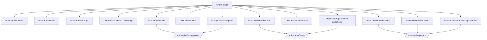
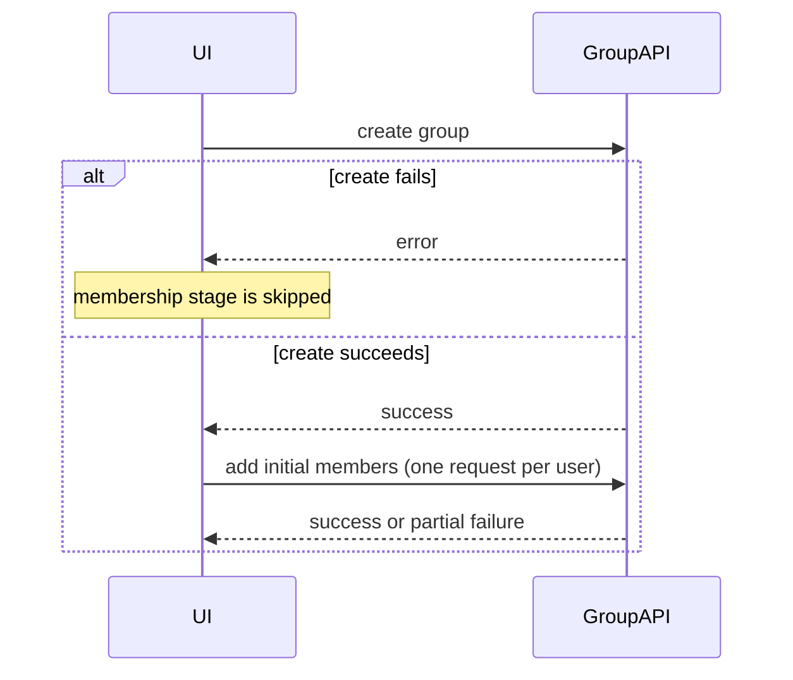

# Samba Shareها، Userها و Groupها

## هدف

Feature مربوط به Samba، سطح مدیریتی قابل مشاهده برای Operator جهت file-sharing configuration، Samba user، Samba group و access membership است.

Route: `/share`

Entry point: `src/pages/Share.tsx`

این page عمداً گسترده‌تر از یک «share list» ساده است و سه resource family مرتبط را هماهنگ می‌کند:

- Samba shareها؛
- Samba userها؛
- Samba groupها.

این domainها UI و access-management workflow مشترک دارند، اما React Query keyهای مستقل دارند. در contract صحیح فعلی GitLab، فقط `samba-shares` یک StateSync persisted domain است؛ Samba user/group از React Query refresh استفاده می‌کنند ولی StateSync domain مستقل ندارند.

## مسئولیت‌های اصلی

Feature فعلی موارد زیر را پشتیبانی می‌کند:

- list کردن Samba shareها؛
- ساخت و حذف share؛
- مشاهده‌ی detail مربوط به selected/pinned share؛
- مدیریت share user و group؛
- list کردن Samba userها؛
- ساخت، حذف، enable، disable و تغییر password مربوط به Samba user؛
- خواندن per-user Samba Account Flags؛
- list کردن Samba groupها؛
- ساخت و حذف Samba group؛
- اضافه/حذف کردن Samba user در group؛
- reload کردن `smbd.service` بعد از share creation موفق.

## Tabهای Page

`Share.tsx` سه tab expose می‌کند:

```text
samba-groups
samba-users
shares
```

Active tab مشخص می‌کند کدام user/group queryها enabled باشند. Share list مستقل load می‌شود چون در share detail state نیز استفاده می‌شود.

## Runtime Ownership



## Samba Shareها

Primary query key:

```text
['samba', 'shares']
```

Endpoint:

```text
GET /api/samba/sharepoints/?property=all
```

`useSambaShares()` boolean-like fieldهای شناخته‌شده را normalize می‌کند، از جمله:

- `read only`؛
- `available`؛
- `guest ok`؛
- `browseable`؛
- `inherit permissions`؛
- `is_custom`.

String valueهایی مثل `yes/no` و `true/false` در صورت امکان تبدیل می‌شوند تا componentها مجبور به duplicate کردن backend normalization نباشند.

`useSambaShares()` continuous polling interval ندارد.

## ساخت Share

Hook: `useCreateShare()`

Endpoint:

```text
POST /api/samba/sharepoints/
```

Payload فعلی شامل share name، path، access memberها و default Samba optionها است.

Defaultهای مهم فعلی:

```text
available = true
read_only = false
guest_ok = false
browseable = true
max_connections = 10
create_mask = 0777
directory_mask = 0777
inherit_permissions = false
```

Page پیش از submit شدن request حداقل یک access member از میان selected user/groupها نیاز دارد.

پس از success:

1. Samba share query invalidate می‌شود؛
2. create modal بسته می‌شود؛
3. `Share.tsx` از `useServiceAction()` می‌خواهد `smbd.service` را reload کند.

Service reload operational behavior است، نه persistence behavior.

## حذف Share

Hook: `useDeleteShare()`

Endpoint:

```text
DELETE /api/samba/sharepoints/{shareName}/
```

Deletion از confirmation flow استفاده می‌کند و pending share name را track می‌کند تا row در حال حذف disable/mark شود.

پس از success، canonical share query invalidate می‌شود.

## Share Member Management

Component: `ManageShareMembersModal`

Modal دو presentation mode دارد:

```text
users
groups
```

Backend access representation از property مربوط به Samba یعنی `valid users` خوانده می‌شود. Utility functionها این representation را به user/group تفکیک می‌کنند و نتیجه‌ی editشده را دوباره به یک access-member list واحد merge می‌کنند.

نکته‌ی مهم: **تفکیک user و group در UI به معنی نوشته‌شدن دو backend property مستقل نیست.** Member editor فعلی پیش از update share، complete access set را rebuild می‌کند.

### Membership Business Rule

Modal اجازه نمی‌دهد staged access list خالی شود. آخرین access member از طریق این UI قابل حذف نیست.

در نتیجه normal editor flow نمی‌تواند share بدون user/group access configureشده ایجاد کند.

### Update Endpoint

Share changeها از endpoint زیر استفاده می‌کنند:

```text
PUT /api/samba/sharepoints/{shareName}/update/
```

`useUpdateSharepoint()` display/backend aliasها را map می‌کند:

```text
read only           -> read_only
guest ok            -> guest_ok
max connections     -> max_connections
valid users         -> valid_users
create mask         -> create_mask
directory mask      -> directory_mask
inherit permissions -> inherit_permissions
```

این mapping را centralized نگه دارید. Componentها نباید API field alias را مستقل از هم بسازند.

## Samba Userها

Primary query key:

```text
['samba-users']
```

Primary list endpoint:

```text
GET /api/samba/users/?property=all
```

Query از stale time برابر 15 ثانیه استفاده می‌کند و continuous polling interval ندارد.

### Account Status Fan-out

Samba list response تنها source مورد استفاده‌ی UI برای enabled/disabled state نیست.

برای هر username نمایش‌داده‌شده، `useSambaUserAccountFlags()` query جداگانه‌ای می‌سازد:

```text
['samba-user', username, 'account-flags']
```

Endpoint:

```text
GET /api/samba/users/{username}/?property=Account Flags
```

Account Flagها به‌شکل زیر normalize می‌شوند:

- flag شامل `D` → disabled؛
- flag شامل `U` → enabled؛
- در غیر این صورت → unknown.

این یک **N-per-user query fan-out** intentional است. هنگام بررسی request volume در Samba Users tab، این requestها را accidental duplicate list fetch در نظر نگیرید.

اگر backend در آینده account state را داخل main user-list response ارائه کرد، این fan-out candidate ساده‌سازی است.

## Samba User Mutationها

Create:

```text
POST /api/samba/users/
```

Delete:

```text
DELETE /api/samba/users/{username}/
```

Enable/disable/password update:

```text
PUT /api/samba/users/{username}/update/
```

Supported update actionها:

```text
enable
disable
change_password
```

پس از status change، هم Samba user list و هم Account Flags query همان user invalidate می‌شوند.

پس از password change، Samba user list invalidate می‌شود.

### Delete Dependency Rule

Page، HTTP 400 هنگام حذف Samba user را به‌عنوان احتمال active-share dependency در نظر می‌گیرد و به Operator می‌گوید ابتدا usage مربوط به share را حذف کند.

Backend همچنان authoritative برای dependency check است.

## Samba Groupها

Primary query key:

```text
['samba-groups']
```

Primary endpoint:

```text
GET /api/samba/groups/?property=all&contain_system_groups=false
```

System groupها از ordinary Samba group administration view exclude می‌شوند.

Create:

```text
POST /api/samba/groups/
```

Delete:

```text
DELETE /api/samba/groups/{groupName}/
```

## Group Membership Update

Group member changeها از endpoint زیر استفاده می‌کنند:

```text
PUT /api/samba/groups/{groupName}/update/
```

Action valueها به‌شکل زیر derive می‌شوند:

```text
add    -> add_user
remove -> remove_user
```

Service فعلی برای **هر username یک PUT جدا** ارسال می‌کند.

پس از mutation موفق، implementation موارد زیر را invalidate می‌کند:

- group list؛
- selected group's member query؛
- selected group's available-user query.

### Partial-failure Behavior مهم

Multi-user membership operation یک frontend transaction نیست.

اگر چند username در حال update باشند و request شماره N fail شود، requestهای موفق قبلی به‌صورت خودکار rollback نمی‌شوند.

بنابراین troubleshooting باید final backend membership state را مقایسه کند، نه این‌که فرض کند کل batch یا کامل موفق شده یا کامل fail شده است.

## Create-group Workflow نیز Non-atomic است

ساخت group همراه initial memberها دو stage منطقی دارد:



اگر group ساخته شود اما اضافه‌کردن یک یا چند member fail شود، group جدید باقی می‌ماند. Frontend برای rollback آن را delete نمی‌کند.

این maintenance invariant مهم است و نباید پشت abstraction عمومی «create group» مخفی شود.

## Detail Split-view State

Shareها از `detailSplitViewStore` با view id زیر استفاده می‌کنند:

```text
samba-shares
```

Page، pinned/active detail identifierهایی را که دیگر در latest share list وجود ندارند حذف می‌کند.

Samba userها نیز detail-view id دارند:

```text
samba-users
```

Samba user detail panel فعلی در page فعال نیست، ولی store cleanup logic هنوز وجود دارد. Dead/disabled UI path باید یا حذف شود یا صریحاً restore شود؛ نباید به‌صورت commented JSX برای مدت نامحدود باقی بماند.

## StateSync Boundary

بر اساس contract صحیح فعلی GitLab، فقط Samba Share یک StateSync persisted domain دارد:

```text
samba-shares
```

Mapping فعلی:

```text
/api/samba/sharepoints... -> samba-shares
other /api/samba...       -> samba-shares
```

Canonical snapshot:

```text
samba-shares -> GET /api/samba/sharepoints/?property=all
```

در contract فعلی:

- `samba-users` StateSync domain نیست؛
- `samba-groups` StateSync domain نیست.

در نتیجه mutationهای Samba user/group برای UI freshness از React Query invalidation/refetch استفاده می‌کنند، اما نباید frontend canonical `save_to_db=true` snapshot برای user/group ایجاد کنند.

Normal list request و mutation نباید خودشان مالک `save_to_db=true` باشند.

اگر در آینده persistence مربوط به Samba user/group لازم شد، ابتدا باید canonical endpoint و backend contract مشخص شوند و سپس centralized `StateSyncManager` تغییر کند؛ نه individual hook.

## Service Reload Boundary

Page فعلی پس از share creation موفق service زیر را reload می‌کند:

```text
smbd.service
```

فرض نکنید هر Samba mutation service reload انجام می‌دهد. User/group/member operationها در وضعیت فعلی به behavior endpoint خود و query invalidation متکی‌اند، مگر صریحاً wiring دیگری وجود داشته باشد.

اگر backend semantics در آینده تغییر کرد و config mutation نیازمند reload/restart شد، این operational rule را centralized کنید و reloadهای پراکنده به modalها اضافه نکنید.

## Error Handling

Feature ترکیبی از موارد زیر استفاده می‌کند:

- modal-local error text؛
- `react-hot-toast` feedback؛
- Axios-derived backend message؛
- explicit dependency message مانند active-share failure هنگام حذف Samba user.

Backend error authoritative باقی می‌ماند. Frontend duplicate/member check UX را بهتر می‌کند، اما در concurrent administration consistency را تضمین نمی‌کند.

## Failure Scenarioهای رایج

### Share List Stale است

بررسی کنید:

1. query state مربوط به `['samba','shares']`؛
2. mutation success؛
3. targeted invalidation؛
4. response مربوط به `/api/samba/sharepoints/`؛
5. آیا change از pathای انجام شده که `axiosInstance` را bypass می‌کند.

### Samba User Status مقدار Unknown نشان می‌دهد

بررسی کنید:

1. Account Flags request همان username؛
2. backend flag format؛
3. normalization در `useSambaUserAccountFlags()`؛
4. active/enabled بودن Users tab.

### Group Memberها Partial Update شده‌اند

به یاد داشته باشید implementation برای هر username یک request می‌فرستد. پس از failed username، backend membership را inspect کنید و بدون بررسی کل operation را کورکورانه retry نکنید.

### Share Creation موفق بوده ولی Samba Behavior تغییر نکرده

Mutation مربوط به reload کردن `smbd.service` و error toast آن را جدا از share-create request بررسی کنید.

### Samba User/Group Persistence Snapshot دیده نمی‌شود

این behavior با contract فعلی expected است؛ user/group StateSync domain ندارند. اگر persistence requirement وجود دارد، ابتدا backend contract را مشخص کنید و centralized StateSync را تغییر دهید.

## راهنمای Extension

هنگام اضافه‌کردن Samba capability:

1. مشخص کنید مربوط به share، user، group یا چند domain است؛
2. canonical query key همان resource را reuse کنید؛
3. backend field alias را در hook/service normalize کنید، نه component؛
4. برای تمام API traffic از `axiosInstance` استفاده کنید؛
5. caller-level `save_to_db` flag اضافه نکنید؛
6. فقط اگر mutation persisted domain فعلی را تحت تأثیر قرار می‌دهد StateSync mapping را بررسی/توسعه دهید؛
7. multi-request workflow و partial-failure behavior را مستند کنید؛
8. پس از success کوچک‌ترین meaningful query family را invalidate کنید؛
9. هنگام افزودن status/detail query، per-user/per-group fan-out را در نظر بگیرید؛
10. مشخص کنید service reload/restart از نظر operational لازم است یا خیر.

## فایل‌های مرتبط

- `src/pages/Share.tsx`
- `src/hooks/useSambaShares.ts`
- `src/hooks/useCreateShare.ts`
- `src/hooks/useDeleteShare.ts`
- `src/hooks/useUpdateSharepoint.ts`
- `src/hooks/useSambaUsers.ts`
- `src/hooks/useSambaUserAccountFlags.ts`
- `src/hooks/useCreateSambaUser.ts`
- `src/hooks/useDeleteSambaUser.ts`
- `src/hooks/useUpdateSambaUserStatus.ts`
- `src/hooks/useUpdateSambaUserPassword.ts`
- `src/hooks/useSambaGroups.ts`
- `src/hooks/useCreateSambaGroup.ts`
- `src/hooks/useDeleteSambaGroup.ts`
- `src/hooks/useUpdateSambaGroupMember.ts`
- `src/lib/sambaUserService.ts`
- `src/lib/sambaGroupService.ts`
- `src/lib/stateSyncManager.ts`
- `src/components/share/ManageShareMembersModal.tsx`

## مستندات مرتبط

- [`users.md`](./users.md)
- [`file-system.md`](./file-system.md)
- [`services.md`](./services.md)
- [`../04-core-flows/server-state-and-cache.md`](../04-core-flows/server-state-and-cache.md)
- [`../04-core-flows/state-sync-save-to-db.md`](../04-core-flows/state-sync-save-to-db.md)
- [`../04-core-flows/api-request-lifecycle.md`](../04-core-flows/api-request-lifecycle.md)
