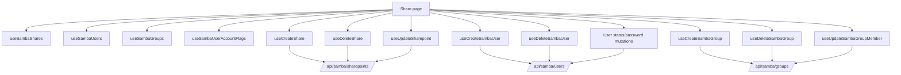
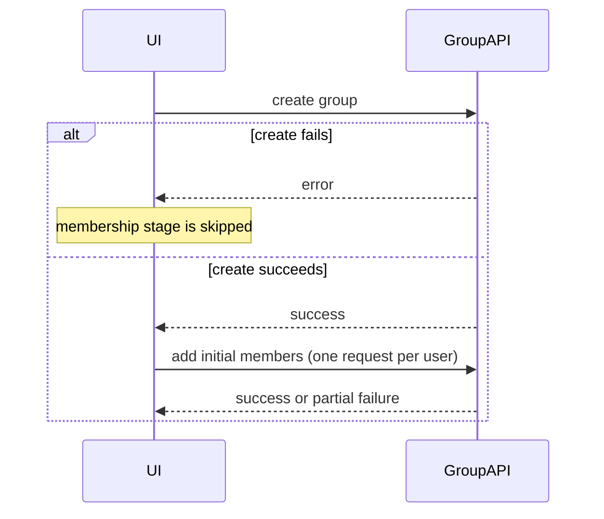

# Samba Shares, Users, and Groups

## Purpose

The Samba feature is the operator-facing administration surface for file-sharing configuration, Samba users, Samba groups, and access membership.

Route: `/share`

Entry point: `src/pages/Share.tsx`

The page is intentionally broader than a single "share list". It coordinates three related but independently persisted backend domains:

- Samba shares;
- Samba users;
- Samba groups.

These domains share UI and access-management workflows, but they have separate React Query keys and separate StateSync ownership.

## Main responsibilities

The current feature supports:

- listing Samba shares;
- creating and deleting shares;
- inspecting selected/pinned share details;
- managing share users and groups;
- listing Samba users;
- creating, deleting, enabling, disabling, and changing the password of Samba users;
- reading per-user Samba account flags;
- listing Samba groups;
- creating and deleting Samba groups;
- adding/removing Samba users from groups;
- reloading `smbd.service` after successful share creation.

## Page tabs

`Share.tsx` exposes three tabs:

```text
samba-groups
samba-users
shares
```

The active tab controls which user/group queries are enabled. The share list is loaded independently because it is also used by share detail state.

## Runtime ownership



## Samba shares

Primary query key:

```text
['samba', 'shares']
```

Endpoint:

```text
GET /api/samba/sharepoints/?property=all
```

`useSambaShares()` normalizes known boolean-like fields such as:

- `read only`;
- `available`;
- `guest ok`;
- `browseable`;
- `inherit permissions`;
- `is_custom`.

String values such as `yes/no` and `true/false` are converted where possible so components do not need to repeat backend normalization.

There is no continuous polling interval in `useSambaShares()`.

## Share creation

Hook: `useCreateShare()`

Endpoint:

```text
POST /api/samba/sharepoints/
```

The current payload contains the share name, path, access members, and default Samba options.

Important current defaults include:

```text
available = true
read_only = false
guest_ok = false
browseable = true
max_connections = 10
create_mask = 0777
directory_mask = 0777
inherit_permissions = false
```

The page requires at least one access member across selected users/groups before the request is submitted.

On success:

1. the Samba share query is invalidated;
2. the create modal closes;
3. `Share.tsx` asks `useServiceAction()` to reload `smbd.service`.

The service reload is operational behavior, not persistence behavior.

## Share deletion

Hook: `useDeleteShare()`

Endpoint:

```text
DELETE /api/samba/sharepoints/{shareName}/
```

Deletion uses a confirmation flow and tracks the pending share name so the UI can disable/mark the row being removed.

After success the canonical share query is invalidated.

## Share member management

Component: `ManageShareMembersModal`

The modal supports two presentation modes:

```text
users
groups
```

The backend access representation is read from the Samba `valid users` property. Utility functions split that representation into users and groups and merge the edited result back into a single access-member list.

This is important: **the UI distinction between users and groups does not imply two independent backend properties are always written.** The current member editor rebuilds the complete access set before updating the share.

### Membership business rule

The modal does not allow the staged access list to become empty. The last access member cannot be removed through this UI.

This prevents the normal editor flow from producing a share with no configured user/group access.

### Update endpoint

Share changes use:

```text
PUT /api/samba/sharepoints/{shareName}/update/
```

`useUpdateSharepoint()` maps display/backend aliases such as:

```text
read only          -> read_only
guest ok           -> guest_ok
max connections    -> max_connections
valid users        -> valid_users
create mask        -> create_mask
directory mask     -> directory_mask
inherit permissions -> inherit_permissions
```

Keep this mapping centralized. Components should not independently invent API field aliases.

## Samba users

Primary query key:

```text
['samba-users']
```

Primary list endpoint:

```text
GET /api/samba/users/?property=all
```

The query uses a 15-second stale time and no continuous polling interval.

### Account status fan-out

The Samba list response is not the only source used by the UI for enabled/disabled state.

For each displayed username, `useSambaUserAccountFlags()` creates a separate query:

```text
['samba-user', username, 'account-flags']
```

Endpoint:

```text
GET /api/samba/users/{username}/?property=Account Flags
```

Account flags are normalized as:

- flag containing `D` -> disabled;
- flag containing `U` -> enabled;
- otherwise -> unknown.

This is an intentional **N-per-user query fan-out**. When investigating request volume on the Samba Users tab, do not mistake these requests for accidental duplicate list fetches.

If the backend later provides account state in the main user-list response, this fan-out is a candidate for simplification.

## Samba user mutations

Create:

```text
POST /api/samba/users/
```

Delete:

```text
DELETE /api/samba/users/{username}/
```

Enable/disable/password update:

```text
PUT /api/samba/users/{username}/update/
```

Supported update actions are:

```text
enable
disable
change_password
```

After status changes, both the Samba user list and that user's Account Flags query are invalidated.

After password changes, the Samba user list is invalidated.

### Delete dependency rule

The page treats HTTP 400 during Samba-user deletion as a likely active-share dependency and tells the operator to remove related share usage first.

The backend remains authoritative for this dependency check.

## Samba groups

Primary query key:

```text
['samba-groups']
```

Primary endpoint:

```text
GET /api/samba/groups/?property=all&contain_system_groups=false
```

System groups are excluded from the ordinary Samba group administration view.

Create:

```text
POST /api/samba/groups/
```

Delete:

```text
DELETE /api/samba/groups/{groupName}/
```

## Group membership updates

Group member changes use:

```text
PUT /api/samba/groups/{groupName}/update/
```

with action values derived as:

```text
add    -> add_user
remove -> remove_user
```

The current service sends **one PUT per username**.

After the mutation succeeds, the implementation invalidates:

- the group list;
- the selected group's member query;
- the selected group's available-user query.

### Important partial-failure behavior

A multi-user membership operation is not a frontend transaction.

If several usernames are being updated and request number N fails, earlier successful requests are not rolled back automatically.

Troubleshooting must therefore compare the final backend membership state rather than assuming the whole batch either succeeded or failed.

## Create-group workflow is also non-atomic

Creating a group with initial members happens in two logical stages:



If the group is created but adding one or more members fails, the new group remains. The frontend does not delete it as rollback.

This is a significant maintenance invariant and should not be hidden behind a generic "create group" abstraction.

## Detail split-view state

Shares use `detailSplitViewStore` with view id:

```text
samba-shares
```

The page removes pinned/active detail identifiers that no longer exist in the latest share list.

Samba users also have a detail-view id:

```text
samba-users
```

The currently rendered Samba user detail panel is not active in the page, but the store cleanup logic still exists. Dead/disabled UI paths should be removed or explicitly restored rather than retained indefinitely as commented JSX.

## StateSync ownership

Samba persistence is centralized.

`StateSyncManager` maps successful mutations as follows:

```text
/api/samba/users...       -> samba-users + samba-groups
/api/samba/groups...      -> samba-groups + samba-users
/api/samba/sharepoints... -> samba-shares
other /api/samba...       -> samba-users + samba-groups + samba-shares
```

The cross-domain user/group mapping is intentional because membership state can be visible from both sides.

Normal list requests and mutations must not own `save_to_db=true` themselves.

Only canonical StateSync snapshot requests persist frontend-requested Samba snapshots:

```text
samba-users  -> GET /api/samba/users/?property=all
samba-groups -> GET /api/samba/groups/?property=all&contain_system_groups=false
samba-shares -> GET /api/samba/sharepoints/?property=all
```

## Service reload boundary

The current page reloads:

```text
smbd.service
```

after successful share creation.

Do not assume every Samba mutation performs a service reload. User/group/member operations currently rely on their own backend endpoint behavior and query invalidation unless explicitly wired otherwise.

If backend semantics change so config mutations require reload/restart, centralize that operational rule instead of adding arbitrary reloads in individual modals.

## Error handling

The feature uses a mixture of:

- modal-local error text;
- `react-hot-toast` feedback;
- Axios-derived backend messages;
- explicit dependency messages such as active-share Samba-user deletion failures.

Backend errors remain authoritative. Frontend duplicate/member checks improve UX but cannot guarantee consistency under concurrent administration.

## Common failure scenarios

### Share list is stale

Check:

1. `['samba','shares']` query state;
2. mutation success;
3. targeted invalidation;
4. backend `/api/samba/sharepoints/` response;
5. whether the change was made through a path that bypasses `axiosInstance`.

### Samba user status shows unknown

Check:

1. Account Flags request for that username;
2. the backend flag format;
3. `useSambaUserAccountFlags()` normalization;
4. whether the Users tab is active/enabled.

### Group members are partially updated

Remember the implementation sends one request per username. Inspect the backend membership after the failed username instead of retrying the whole operation blindly.

### Share creation succeeded but Samba behavior did not change

Check the `smbd.service` reload mutation and its error toast separately from the share-create request.

## Extension guide

When adding a Samba capability:

1. decide whether it belongs to shares, users, groups, or multiple domains;
2. reuse the canonical query key for that domain;
3. normalize backend field aliases in a hook/service rather than the component;
4. use `axiosInstance` for all API traffic;
5. do not add caller-level `save_to_db` flags;
6. extend StateSync URL-to-domain mapping only when a mutation affects a persisted domain not already covered;
7. document any multi-request workflow and partial-failure behavior;
8. invalidate the smallest meaningful query family on success;
9. account for per-user/per-group fan-out when adding status/detail queries;
10. document whether a service reload/restart is operationally required.

## Related files

- `src/pages/Share.tsx`
- `src/hooks/useSambaShares.ts`
- `src/hooks/useCreateShare.ts`
- `src/hooks/useDeleteShare.ts`
- `src/hooks/useUpdateSharepoint.ts`
- `src/hooks/useSambaUsers.ts`
- `src/hooks/useSambaUserAccountFlags.ts`
- `src/hooks/useCreateSambaUser.ts`
- `src/hooks/useDeleteSambaUser.ts`
- `src/hooks/useUpdateSambaUserStatus.ts`
- `src/hooks/useUpdateSambaUserPassword.ts`
- `src/hooks/useSambaGroups.ts`
- `src/hooks/useCreateSambaGroup.ts`
- `src/hooks/useDeleteSambaGroup.ts`
- `src/hooks/useUpdateSambaGroupMember.ts`
- `src/lib/sambaUserService.ts`
- `src/lib/sambaGroupService.ts`
- `src/lib/stateSyncManager.ts`
- `src/components/share/ManageShareMembersModal.tsx`

## Related documentation

- [`users.md`](./users.md)
- [`file-system.md`](./file-system.md)
- [`services.md`](./services.md)
- [`../04-core-flows/server-state-and-cache.md`](../04-core-flows/server-state-and-cache.md)
- [`../04-core-flows/state-sync-save-to-db.md`](../04-core-flows/state-sync-save-to-db.md)
- [`../04-core-flows/api-request-lifecycle.md`](../04-core-flows/api-request-lifecycle.md)
