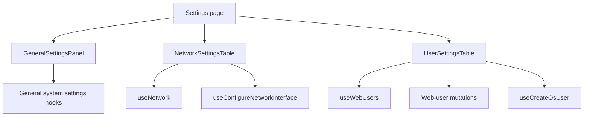
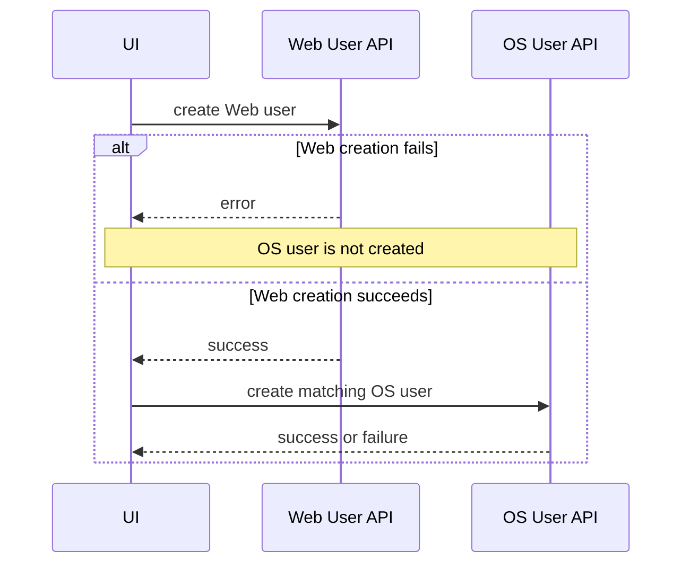

# Settings

## Purpose

The Settings feature groups administrative configuration that does not belong to storage/share resource pages.

Route: `/settings`

Entry point: `src/pages/Settings.tsx`

The page currently contains three distinct tabs:

```text
General
Network
Users
```

These tabs share navigation and presentation but have different backend resources and mutation semantics.

## Runtime structure



## Tab ownership

### General

Owns host identity and time-related operating-system configuration:

- hostname;
- system/local/UTC time information;
- timezone;
- NTP enablement and server list;
- manual system time;
- hardware RTC operations;
- system version display.

### Network

Owns interface-level configuration and display:

- interface name;
- configuration mode;
- IPv4 information;
- netmask;
- gateway;
- DNS;
- MTU;
- link speed;
- DHCP/static reconfiguration.

### Users

Owns **Web/UI users**, not the OS/Samba user-management feature from `/users`.

It supports:

- list Web users;
- create Web user;
- edit Web user profile fields;
- change Web user password;
- delete Web user except the protected `admin` account;
- create a matching OS user after successful Web-user creation.

## General settings data

Query keys:

```text
['general-settings','time']
['general-settings','timezones']
['general-settings','hostname']
['general-settings','version']
```

Read endpoints:

```text
GET /api/system/time/
GET /api/system/time/zones/
GET /api/system/hostname/
GET /api/system/version/
```

Current stale-time policy:

```text
system time    15 seconds
timezones      24 hours
hostname       15 seconds
version        1 hour
```

These queries disable window-focus refetch explicitly.

Detailed response normalization and UI rules are maintained in [`../general-settings.md`](../general-settings.md).

## General settings mutations

Current endpoints:

```text
POST /api/system/hostname/set/
POST /api/system/time/set-timezone/
POST /api/system/time/ntp/
POST /api/system/time/set-time/
POST /api/system/time/hwclock/
```

Each mutation invalidates the smallest relevant query family after success.

Examples:

- hostname mutation -> hostname query;
- timezone/NTP/manual time -> system time query;
- hardware-clock mutation -> system time query when the action changes state.

`hwclock` action `show` is observational and therefore does not invalidate system time.

## Confirmation and dirty-form behavior

General settings deliberately distinguishes backend state from unsaved UI edits.

Examples include:

- hostname dirty state;
- timezone dirty state;
- NTP dirty state;
- confirmation dialogs for system-impacting mutations.

This prevents query refreshes from overwriting fields the operator is actively editing.

System-impacting changes are staged into a `PendingAction` and require confirmation before mutation.

## Manual time and NTP dependency

Manual time and automatic NTP synchronization are not independent concepts.

The current UI accounts for a case where the operator switches NTP off inside the time editor but has not separately persisted that toggle yet. The manual-time confirmation flow can first disable NTP and then set the requested manual time.

That is a multi-step system operation and must be treated as such when refactoring or troubleshooting.

## Network settings

`NetworkSettingsTable` reads the shared network resource through `useNetwork()` and derives a table row for each interface.

The table normalizes:

- IPv4 entries;
- configuration mode;
- gateway list;
- DNS list;
- MTU;
- link speed.

Network edit state is modal-local.

## Network configuration mutation

Hook: `useConfigureNetworkInterface()`

The current backend uses different endpoints depending on mode:

```text
DHCP:
POST /api/network/{interface}/configure/

Static:
POST /api/system/network/{interface}/configure/
```

This asymmetry is current backend contract and must not be collapsed into one guessed URL.

DHCP body:

```text
mode = dhcp
mtu = supplied value or 1500
```

Static body includes:

```text
mode = static
ip
netmask
optional gateway
optional dns[]
mtu = supplied value or 1500
```

After success the network query family is invalidated.

## Web users

Canonical key:

```text
['web-users']
```

List endpoint:

```text
GET /api/system/ui-user/
```

Web-user mutations:

```text
POST   /api/system/ui-user/
DELETE /api/system/ui-user/{username}/
PUT    /api/system/ui-user/{username}/update/?action=update
PUT    /api/system/ui-user/{username}/update/?action=change_password
```

Each successful Web-user mutation invalidates `['web-users']`.

## Protected admin deletion rule

The Settings UI prevents deletion when the normalized username is:

```text
admin
```

This is a UX/safety rule, not a security boundary. The backend must independently prevent deletion of any account that is operationally protected.

## Web-user creation also creates an OS user

After `useCreateWebUser()` succeeds, `UserSettingsTable` starts a second mutation through `useCreateOsUser()` with `DEFAULT_LOGIN_SHELL`.

Current sequence:



### Important partial-failure behavior

This flow is not atomic.

If Web-user creation succeeds but OS-user creation fails:

- the Web user remains;
- no frontend rollback deletes the Web user;
- the success toast for Web-user creation has already been shown;
- the OS mutation currently has no page-level recovery transaction.

This distinction must be preserved in troubleshooting documentation.

## Delete does not imply OS-user deletion

Deleting a Web user calls only:

```text
DELETE /api/system/ui-user/{username}/
```

The frontend does not automatically delete a same-named OS user.

Do not assume Web and OS user lifecycles are symmetric merely because creation currently links them.

## StateSync boundary

General system settings, network settings, Web users, and OS users are not currently represented as persisted `StateSyncDomain` values.

Therefore these features use normal backend mutations and React Query refresh without canonical `save_to_db=true` snapshots from the frontend.

Do not add ad-hoc persistence flags to compensate. If one of these domains later requires snapshot persistence, extend StateSync architecture explicitly.

## RTL invariant

`Settings.tsx` explicitly applies:

```text
dir="rtl"
```

to the settings content because `dir` is an HTML semantic attribute and is not produced by Emotion/Stylis RTL mirroring.

This comment is intentional architectural UI documentation and should remain unless direction ownership moves to a higher semantic DOM boundary.

Technical values such as IPs, hostnames, timezones, and server names may remain LTR inside the RTL page.

## Common failure scenarios

### General setting reverts while editing

Check dirty-state guards before blaming React Query. Query data is intentionally not copied over a field that has local unsaved edits.

### Network configuration succeeds but table remains stale

Check network-query invalidation and the correct DHCP/static endpoint before changing cache policy.

### Web user exists but matching OS user does not

This is a valid partial-failure state of the current two-stage creation flow. Inspect the Web-user and OS-user mutations separately.

### Admin delete button is disabled

This is intentional frontend protection for username `admin`.

## Extension guide

When extending Settings:

1. identify which tab owns the setting;
2. use React Query for authoritative backend configuration;
3. preserve dirty-form guards for editable server state;
4. require confirmation for operations with system-wide impact;
5. keep network mode-to-endpoint mapping explicit;
6. distinguish Web users from OS/Samba identities;
7. document any multi-step cross-domain workflow and lack of rollback;
8. do not introduce caller-level persistence flags for domains not owned by StateSync;
9. keep semantic RTL direction at an appropriate DOM boundary.

## Related files

- `src/pages/Settings.tsx`
- `src/components/settings/GeneralSettingsPanel.tsx`
- `src/components/settings/NetworkSettingsTable.tsx`
- `src/components/settings/UserSettingsTable.tsx`
- `src/hooks/useGeneralSystemSettings.ts`
- `src/hooks/useConfigureNetworkInterface.ts`
- `src/hooks/useNetwork.ts`
- `src/hooks/useWebUsers.ts`
- `src/hooks/useCreateWebUser.ts`
- `src/hooks/useDeleteWebUser.ts`
- `src/hooks/useUpdateWebUser.ts`
- `src/hooks/useUpdateWebUserPassword.ts`
- `src/hooks/useCreateOsUser.ts`

## Related documentation

- [`../general-settings.md`](../general-settings.md)
- [`users.md`](./users.md)
- [`../04-core-flows/server-state-and-cache.md`](../04-core-flows/server-state-and-cache.md)
