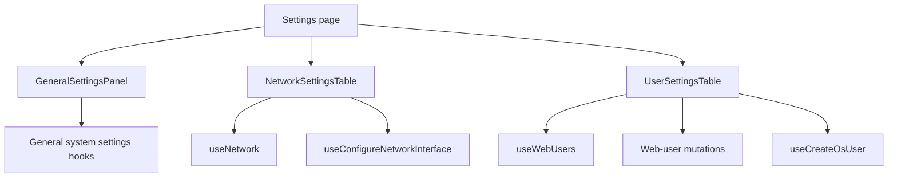
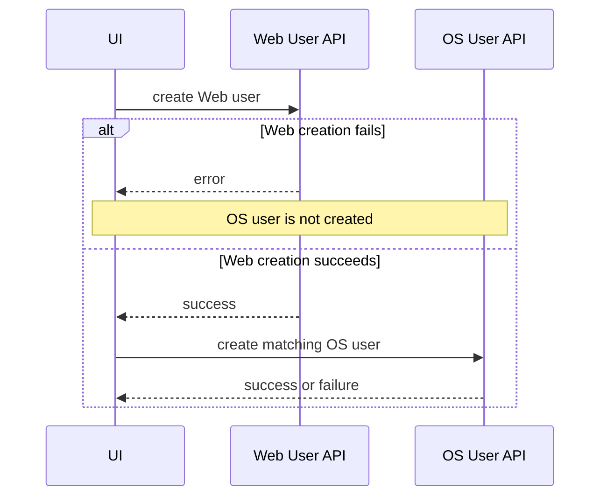

# Settings

## هدف

Feature مربوط به Settings، configurationهای مدیریتی را گروه‌بندی می‌کند که متعلق به صفحه‌های storage/share نیستند.

Route:

```text
/settings
```

Entry point:

```text
src/pages/Settings.tsx
```

صفحه در حال حاضر سه tab مستقل دارد:

```text
General
Network
Users
```

این tabها navigation و presentation مشترک دارند، اما backend resource و mutation semantics متفاوتی دارند.

## ساختار runtime



## ownership هر tab

### General

مالک configurationهای مربوط به host identity و time در سیستم‌عامل است:

- hostname؛
- اطلاعات system/local/UTC time؛
- timezone؛
- NTP enablement و server list؛
- manual system time؛
- hardware RTC operationها؛
- system version display.

### Network

مالک configuration و display در سطح interface است:

- interface name؛
- configuration mode؛
- IPv4 information؛
- netmask؛
- gateway؛
- DNS؛
- MTU؛
- link speed؛
- reconfiguration به حالت DHCP/static.

### Users

مالک **Web/UI user**ها است، نه OS/Samba user-management feature موجود در `/users`.

این tab از موارد زیر پشتیبانی می‌کند:

- list کردن Web userها؛
- create کردن Web user؛
- edit کردن profile fieldهای Web user؛
- تغییر password؛
- delete کردن Web user به‌جز account محافظت‌شده‌ی `admin`؛
- create کردن OS user همنام پس از Web-user creation موفق.

## General settings data

Query keyها:

```text
['general-settings','time']
['general-settings','timezones']
['general-settings','hostname']
['general-settings','version']
```

Read endpointها:

```text
GET /api/system/time/
GET /api/system/time/zones/
GET /api/system/hostname/
GET /api/system/version/
```

Policy فعلی `staleTime`:

```text
system time    15 seconds
timezones      24 hours
hostname       15 seconds
version        1 hour
```

این queryها window-focus refetch را صریحاً disable می‌کنند.

جزئیات response normalization و UI ruleها در سند زیر نگهداری می‌شود:

[`../general-settings.md`](../general-settings.md)

## General settings mutationها

Endpointهای فعلی:

```text
POST /api/system/hostname/set/
POST /api/system/time/set-timezone/
POST /api/system/time/ntp/
POST /api/system/time/set-time/
POST /api/system/time/hwclock/
```

هر mutation پس از success کوچک‌ترین query family مرتبط را invalidate می‌کند.

مثال:

- hostname mutation → hostname query؛
- timezone/NTP/manual time → system time query؛
- hardware-clock mutation → system time query در صورتی که action state را تغییر دهد.

Action مربوط به `hwclock` با مقدار `show` observational است و system time را invalidate نمی‌کند.

## confirmation و dirty-form behavior

General settings عمداً backend state را از unsaved UI edit جدا می‌کند.

مثال‌ها:

- hostname dirty state؛
- timezone dirty state؛
- NTP dirty state؛
- confirmation dialog برای system-impacting mutationها.

این کار مانع overwrite شدن fieldی می‌شود که operator در حال edit آن است، صرفاً به‌دلیل query refresh.

System-impacting change ابتدا داخل `PendingAction` stage می‌شود و قبل از mutation نیاز به confirmation دارد.

## وابستگی manual time و NTP

Manual time و automatic NTP synchronization دو مفهوم کاملاً مستقل نیستند.

UI فعلی حالتی را پوشش می‌دهد که operator در time editor، NTP را off می‌کند ولی آن toggle هنوز جداگانه persist نشده است. Manual-time confirmation flow می‌تواند ابتدا NTP را disable کند و بعد manual time درخواستی را set کند.

این یک multi-step system operation است و در refactor یا troubleshooting باید همین‌طور در نظر گرفته شود.

## Network settings

`NetworkSettingsTable` shared network resource را از `useNetwork()` می‌خواند و برای هر interface یک row می‌سازد.

Table این موارد را normalize می‌کند:

- IPv4 entryها؛
- configuration mode؛
- gateway list؛
- DNS list؛
- MTU؛
- link speed.

Network edit state داخل modal نگهداری می‌شود.

## Network configuration mutation

Hook:

```text
useConfigureNetworkInterface()
```

Backend فعلی بر اساس mode از endpoint متفاوت استفاده می‌کند:

```text
DHCP:
POST /api/network/{interface}/configure/

Static:
POST /api/system/network/{interface}/configure/
```

این asymmetry بخشی از backend contract فعلی است و نباید با حدس به یک URL واحد collapse شود.

DHCP body:

```text
mode = dhcp
mtu = supplied value or 1500
```

Static body شامل موارد زیر است:

```text
mode = static
ip
netmask
optional gateway
optional dns[]
mtu = supplied value or 1500
```

پس از success، network query family invalidate می‌شود.

## Web users

Canonical key:

```text
['web-users']
```

List endpoint:

```text
GET /api/system/ui-user/
```

Web-user mutationها:

```text
POST   /api/system/ui-user/
DELETE /api/system/ui-user/{username}/
PUT    /api/system/ui-user/{username}/update/?action=update
PUT    /api/system/ui-user/{username}/update/?action=change_password
```

هر Web-user mutation موفق `['web-users']` را invalidate می‌کند.

## قانون محافظت از حذف admin

Settings UI وقتی normalized username برابر مقدار زیر باشد delete را غیرفعال می‌کند:

```text
admin
```

این UX/safety rule است، نه security boundary. Backend باید مستقل از frontend حذف هر account محافظت‌شده‌ی عملیاتی را جلوگیری کند.

## Web-user creation و ساخت OS user

بعد از موفق شدن `useCreateWebUser()`، `UserSettingsTable` یک mutation دوم با `useCreateOsUser()` و `DEFAULT_LOGIN_SHELL` اجرا می‌کند.

Sequence فعلی:



### partial-failure behavior مهم

این flow atomic نیست.

اگر Web-user creation موفق ولی OS-user creation ناموفق باشد:

- Web user باقی می‌ماند؛
- frontend rollback برای حذف Web user ندارد؛
- success toast مربوط به Web-user creation از قبل نمایش داده شده است؛
- OS mutation فعلاً page-level recovery transaction ندارد.

این distinction باید در troubleshooting حفظ شود.

## Delete به معنی حذف OS user نیست

Delete کردن Web user فقط endpoint زیر را call می‌کند:

```text
DELETE /api/system/ui-user/{username}/
```

Frontend به‌صورت خودکار OS user همنام را حذف نمی‌کند.

صرفاً چون creation فعلی این دو domain را به هم وصل می‌کند، lifecycle آن‌ها را symmetric فرض نکنید.

## StateSync boundary

General system settings، network settings، Web userها و OS userها در حال حاضر persisted `StateSyncDomain` نیستند.

بنابراین این featureها از backend mutation عادی و React Query refresh استفاده می‌کنند و frontend برای آن‌ها canonical `save_to_db=true` snapshot ایجاد نمی‌کند.

برای جبران این موضوع ad-hoc persistence flag اضافه نکنید. اگر یکی از این domainها در آینده snapshot persistence بخواهد، StateSync architecture باید صریحاً extend شود.

## RTL invariant

`Settings.tsx` صریحاً این attribute را روی settings content اعمال می‌کند:

```text
dir="rtl"
```

دلیل آن این است که `dir` یک semantic HTML attribute است و توسط Emotion/Stylis RTL mirroring تولید نمی‌شود.

این comment عمداً architectural UI documentation است و تا زمانی که direction ownership به DOM boundary بالاتری منتقل نشده باید حفظ شود.

Technical valueهایی مثل IP، hostname، timezone و server name می‌توانند در صفحه‌ی RTL به‌صورت LTR باقی بمانند.

## failure scenarioهای رایج

### General setting هنگام edit revert می‌شود

پیش از مقصر دانستن React Query، dirty-state guardها را بررسی کنید. Query data عمداً روی field دارای local unsaved edit overwrite نمی‌شود.

### Network configuration موفق است ولی table stale می‌ماند

Network-query invalidation و endpoint درست DHCP/static را بررسی کنید، نه اینکه cache policy را فوراً تغییر دهید.

### Web user وجود دارد ولی OS user همنام ایجاد نشده

این یک partial-failure state معتبر در flow دو مرحله‌ای فعلی است. Web-user mutation و OS-user mutation را جداگانه بررسی کنید.

### Admin delete button disabled است

این frontend protection عمدی برای username برابر `admin` است.

## راهنمای توسعه

هنگام توسعه‌ی Settings:

1. مشخص کنید setting متعلق به کدام tab است.
2. برای authoritative backend configuration از React Query استفاده کنید.
3. dirty-form guard را برای editable server state حفظ کنید.
4. برای operation با system-wide impact confirmation الزامی کنید.
5. network mode-to-endpoint mapping را صریح نگه دارید.
6. Web user را از OS/Samba identity جدا در نظر بگیرید.
7. multi-step cross-domain workflow و نبود rollback را مستند کنید.
8. برای domain خارج از StateSync، caller-level persistence flag اضافه نکنید.
9. semantic RTL direction را در DOM boundary مناسب حفظ کنید.

## فایل‌های مرتبط

- `src/pages/Settings.tsx`
- `src/components/settings/GeneralSettingsPanel.tsx`
- `src/components/settings/NetworkSettingsTable.tsx`
- `src/components/settings/UserSettingsTable.tsx`
- `src/hooks/useGeneralSystemSettings.ts`
- `src/hooks/useConfigureNetworkInterface.ts`
- `src/hooks/useNetwork.ts`
- `src/hooks/useWebUsers.ts`
- `src/hooks/useCreateWebUser.ts`
- `src/hooks/useDeleteWebUser.ts`
- `src/hooks/useUpdateWebUser.ts`
- `src/hooks/useUpdateWebUserPassword.ts`
- `src/hooks/useCreateOsUser.ts`

## مستندات مرتبط

- [`../general-settings.md`](../general-settings.md)
- [`users.md`](./users.md)
- [`../04-core-flows/server-state-and-cache.md`](../04-core-flows/server-state-and-cache.md)
