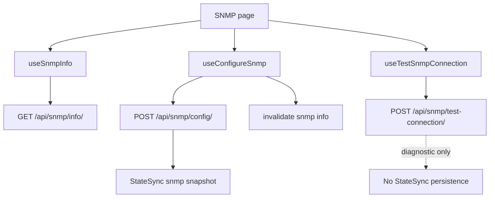

# SNMP

## Purpose

The SNMP feature lets an operator inspect SNMP configuration, update the configuration, and test connectivity with explicit connection parameters.

Route: `/snmp-service`

Entry point: `src/pages/SnmpService.tsx`

The feature has three distinct responsibilities:

- configuration state;
- configuration mutation;
- diagnostic connection testing.

The diagnostic test must not be treated as persisted configuration state.

## Main responsibilities

The current implementation supports:

- reading normalized SNMP configuration;
- manually refreshing the configuration view;
- opening and submitting the configuration modal;
- testing an SNMP connection;
- interpreting several backend success-flag shapes;
- showing a dedicated test-result modal;
- re-running the test without modifying persisted SNMP configuration.

## Runtime flow



## SNMP info

Canonical query key:

```text
['snmp', 'info']
```

Endpoint:

```text
GET /api/snmp/info/
```

The query uses:

```text
staleTime = 60 seconds
```

and has no continuous polling interval.

The page header exposes manual `refetch()`.

## Normalized configuration model

`useSnmpInfo()` normalizes missing values so components receive stable defaults.

Current normalized fields include:

```text
community
allowed_ips
contact
location
sys_name
enabled
port
bind_ip
version
```

`allowed_ips` is normalized to a string array and optional scalar fields default to empty values where appropriate.

Keep this normalization in the data layer rather than duplicating defensive checks across SNMP components.

## Configure SNMP

Hook: `useConfigureSnmp()`

Endpoint:

```text
POST /api/snmp/config/
```

Configuration payload fields currently include:

```text
community
allowed_ips
contact
location
sys_name
port
bind_ip
```

Persistence is transport/StateSync-owned and must not be part of the domain payload.

After successful configuration, the feature invalidates:

```text
['snmp', 'info']
```

so the page rereads canonical backend configuration.

## Test connection

Hook: `useTestSnmpConnection()`

Endpoint:

```text
POST /api/snmp/test-connection/
```

Payload:

```text
community
host
port
```

This operation is diagnostic. It does not represent a configuration change and must not schedule an SNMP persistence snapshot.

## Test-result normalization

Backend versions can expose connection success in several forms.

The page checks, in order:

1. top-level `connection_success`;
2. `data.connection_success`;
3. top-level `ok === true` as fallback.

Boolean-like strings are accepted, including values such as:

```text
true / false
1 / 0
yes / no
on / off
success / failed
failure
```

This compatibility logic is intentionally centralized in the page-level result resolver.

Do not remove it solely because one current backend response uses a boolean unless the response contract is formally narrowed.

## Result flow

A test success or failure opens `SnmpTestResultModal` with:

- normalized `ok` state;
- message;
- returned data when available;
- original test payload.

The operator can choose Retest, which closes the result modal and reopens the test input modal.

Transport failure and a successful HTTP response reporting `connection_success=false` are presented differently internally but both result in an unsuccessful test state.

## StateSync ownership

SNMP configuration is a persisted StateSync domain.

Canonical snapshot:

```text
GET /api/snmp/info/?save_to_db=true
```

The snapshot is owned exclusively by `StateSyncManager`.

### Diagnostic exclusion

`POST /api/snmp/test-connection/` must not schedule StateSync because it does not mutate SNMP configuration.

The URL-to-domain resolver therefore needs an explicit diagnostic exclusion before the generic SNMP mapping.

This distinction is important whenever a persisted domain also exposes POST-based actions that are read-only diagnostics.

## Query refresh versus persistence

After configuration success:

1. React Query invalidates `['snmp','info']` for UI freshness;
2. StateSync schedules the persisted SNMP snapshot.

After test success:

- no configuration query invalidation is required;
- no StateSync snapshot is required.

Do not conflate POST method with persisted mutation semantics.

## Error handling

Configuration errors are surfaced through the config modal and toast messages.

Test transport errors are converted into a result state with:

```text
ok = false
```

so the operator still sees a structured result modal rather than only a transient toast.

## Common failure scenarios

### SNMP configuration saves but overview looks stale

Check:

1. `/api/snmp/config/` success;
2. invalidation of `['snmp','info']`;
3. `/api/snmp/info/` response;
4. normalization in `useSnmpInfo()`.

### Test returns HTTP success but UI reports failure

Inspect `connection_success` at both top-level and `data`, then verify the boolean-like value normalization.

### Test triggers unexpected persistence traffic

Verify that `/api/snmp/test-connection/` is excluded in `resolveStateDomainsForMutation()` before the generic `/api/snmp` mapping.

## Extension guide

When adding an SNMP action:

1. decide whether it actually changes persisted SNMP configuration;
2. reuse `['snmp','info']` for canonical config reads;
3. use `axiosInstance` for all API traffic;
4. do not place `save_to_db` in domain payloads;
5. invalidate SNMP info only when the config may have changed;
6. map true configuration mutations to the SNMP StateSync domain;
7. explicitly exclude diagnostic POST actions from StateSync;
8. preserve response compatibility normalization until the backend contract is formally stable.

## Related files

- `src/pages/SnmpService.tsx`
- `src/hooks/useSnmpInfo.ts`
- `src/hooks/useConfigureSnmp.ts`
- `src/hooks/useTestSnmpConnection.ts`
- `src/@types/snmp.ts`
- `src/components/snmp/SnmpOverview.tsx`
- `src/components/snmp/SnmpConfigModal.tsx`
- `src/components/snmp/SnmpTestConnectionModal.tsx`
- `src/components/snmp/SnmpTestResultModal.tsx`
- `src/lib/stateSyncManager.ts`

## Related documentation

- [`../04-core-flows/state-sync-save-to-db.md`](../04-core-flows/state-sync-save-to-db.md)
- [`../04-core-flows/server-state-and-cache.md`](../04-core-flows/server-state-and-cache.md)
- [`../04-core-flows/api-request-lifecycle.md`](../04-core-flows/api-request-lifecycle.md)
