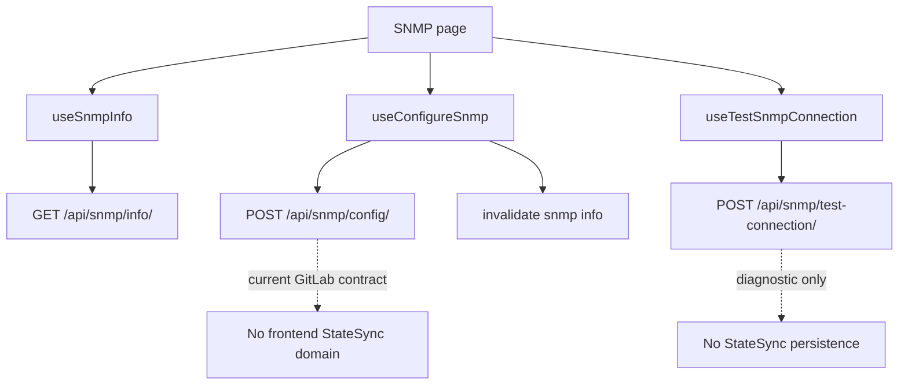

# SNMP

## هدف

Feature مربوط به SNMP به Operator اجازه می‌دهد SNMP configuration را مشاهده و update کند و connectivity را با connection parameterهای صریح test کند.

Route: `/snmp-service`

Entry point: `src/pages/SnmpService.tsx`

این feature سه مسئولیت جدا دارد:

- configuration state؛
- configuration mutation؛
- diagnostic connection testing.

Diagnostic test نباید persisted configuration state در نظر گرفته شود.

## مسئولیت‌های اصلی

Implementation فعلی موارد زیر را پشتیبانی می‌کند:

- خواندن normalized SNMP configuration؛
- manual refresh نمای configuration؛
- بازکردن و submit کردن configuration modal؛
- test کردن SNMP connection؛
- تفسیر چند backend success-flag shape؛
- نمایش test-result modal اختصاصی؛
- اجرای دوباره‌ی test بدون تغییر persisted SNMP configuration.

## Runtime Flow



## SNMP Info

Canonical query key:

```text
['snmp', 'info']
```

Endpoint:

```text
GET /api/snmp/info/
```

Query از مقدار زیر استفاده می‌کند:

```text
staleTime = 60 seconds
```

و continuous polling interval ندارد.

Page header، manual `refetch()` را expose می‌کند.

## Normalized Configuration Model

`useSnmpInfo()` missing valueها را normalize می‌کند تا componentها defaultهای stable دریافت کنند.

Fieldهای normalized فعلی شامل موارد زیر هستند:

```text
community
allowed_ips
contact
location
sys_name
enabled
port
bind_ip
version
```

`allowed_ips` به string array normalize می‌شود و optional scalar fieldها در محل مناسب default خالی می‌گیرند.

این normalization را در data layer نگه دارید و defensive check تکراری در componentهای SNMP ایجاد نکنید.

## Configure SNMP

Hook: `useConfigureSnmp()`

Endpoint:

```text
POST /api/snmp/config/
```

Configuration payload fieldهای فعلی:

```text
community
allowed_ips
contact
location
sys_name
port
bind_ip
```

Domain payload نباید caller-level `save_to_db` داشته باشد. Normal mutation از transport policy عبور می‌کند و `save_to_db=false` دارد.

پس از configuration موفق، feature query زیر را invalidate می‌کند:

```text
['snmp', 'info']
```

تا page canonical backend configuration را دوباره بخواند.

## Test Connection

Hook: `useTestSnmpConnection()`

Endpoint:

```text
POST /api/snmp/test-connection/
```

Payload:

```text
community
host
port
```

این operation diagnostic است. Configuration change محسوب نمی‌شود و نباید persistence snapshot ایجاد کند.

## Test-result Normalization

Backend versionهای مختلف ممکن است connection success را با shapeهای متفاوت expose کنند.

Page به ترتیب زیر بررسی می‌کند:

1. top-level `connection_success`؛
2. `data.connection_success`؛
3. top-level `ok === true` به‌عنوان fallback.

Boolean-like stringها نیز accepted هستند، از جمله:

```text
true / false
1 / 0
yes / no
on / off
success / failed
failure
```

این compatibility logic عمداً در page-level result resolver متمرکز است.

صرفاً چون backend فعلی boolean برمی‌گرداند این logic را حذف نکنید، مگر response contract رسماً محدود و stable شده باشد.

## Result Flow

Test success یا failure، `SnmpTestResultModal` را با موارد زیر باز می‌کند:

- normalized `ok` state؛
- message؛
- returned data در صورت وجود؛
- original test payload.

Operator می‌تواند Retest را انتخاب کند؛ result modal بسته و test input modal دوباره باز می‌شود.

Transport failure و HTTP success با `connection_success=false` از نظر internal متفاوت‌اند، اما هر دو unsuccessful test state ایجاد می‌کنند.

## StateSync Boundary

بر اساس contract صحیح فعلی GitLab، **SNMP یک frontend StateSync domain نیست**.

یعنی mutationهای SNMP از جمله:

```text
POST /api/snmp/config/
POST /api/snmp/test-connection/
```

نباید از طریق `StateSyncManager` یک canonical SNMP snapshot با `save_to_db=true` schedule کنند.

UI freshness پس از configuration از طریق React Query invalidation/refetch انجام می‌شود.

اگر persistence مربوط به SNMP در backend لازم است، مسئولیت آن باید طبق backend contract فعلی انجام شود یا در صورت نیاز به frontend StateSync، ابتدا canonical snapshot contract به‌صورت صریح تعریف و سپس `StateSyncManager` مرکزی تغییر کند.

### Diagnostic Test

`POST /api/snmp/test-connection/` علاوه بر این‌که SNMP StateSync domain ندارد، از نظر semantic نیز کاملاً diagnostic است و persisted configuration را تغییر نمی‌دهد.

هیچ‌گاه صرفاً به دلیل POST بودن یک request آن را persisted mutation در نظر نگیرید.

## Query Refresh در برابر Persistence

پس از configuration success:

1. React Query، `['snmp','info']` را برای UI freshness invalidate می‌کند؛
2. در contract فعلی GitLab frontend StateSync snapshot برای SNMP وجود ندارد.

پس از test success:

- configuration query invalidation لازم نیست؛
- StateSync snapshot لازم نیست.

## Error Handling

Configuration errorها از طریق config modal و toast messageها surface می‌شوند.

Test transport error به result state زیر تبدیل می‌شود:

```text
ok = false
```

تا Operator به‌جای فقط transient toast، structured result modal ببیند.

## Failure Scenarioهای رایج

### SNMP Configuration Save می‌شود ولی Overview Stale است

بررسی کنید:

1. success مربوط به `/api/snmp/config/`؛
2. invalidation مربوط به `['snmp','info']`؛
3. response مربوط به `/api/snmp/info/`؛
4. normalization در `useSnmpInfo()`.

### Test HTTP Success دارد ولی UI Failure نشان می‌دهد

`connection_success` را در top-level و `data` بررسی کنید و سپس boolean-like normalization را verify کنید.

### SNMP Request باعث Persistence Traffic غیرمنتظره می‌شود

این behavior با contract فعلی GitLab ناسازگار است. بررسی کنید URL مربوط به SNMP به‌اشتباه داخل `resolveStateDomainsForMutation()` به StateSync domain map نشده باشد و caller-level `save_to_db` نیز وجود نداشته باشد.

## راهنمای Extension

هنگام اضافه‌کردن SNMP action:

1. مشخص کنید action واقعاً persisted SNMP configuration را تغییر می‌دهد یا diagnostic است؛
2. برای canonical config read از `['snmp','info']` reuse کنید؛
3. برای تمام API traffic از `axiosInstance` استفاده کنید؛
4. `save_to_db` را داخل domain payload قرار ندهید؛
5. فقط وقتی config ممکن است تغییر کرده باشد SNMP info را invalidate کنید؛
6. تا زمانی که frontend/backend persistence contract تغییر نکرده SNMP StateSync domain ایجاد نکنید؛
7. diagnostic POST actionها را observational نگه دارید؛
8. response compatibility normalization را تا زمانی که backend contract رسماً stable نشده حفظ کنید.

## فایل‌های مرتبط

- `src/pages/SnmpService.tsx`
- `src/hooks/useSnmpInfo.ts`
- `src/hooks/useConfigureSnmp.ts`
- `src/hooks/useTestSnmpConnection.ts`
- `src/@types/snmp.ts`
- `src/components/snmp/SnmpOverview.tsx`
- `src/components/snmp/SnmpConfigModal.tsx`
- `src/components/snmp/SnmpTestConnectionModal.tsx`
- `src/components/snmp/SnmpTestResultModal.tsx`
- `src/lib/stateSyncManager.ts`

## مستندات مرتبط

- [`../04-core-flows/state-sync-save-to-db.md`](../04-core-flows/state-sync-save-to-db.md)
- [`../04-core-flows/server-state-and-cache.md`](../04-core-flows/server-state-and-cache.md)
- [`../04-core-flows/api-request-lifecycle.md`](../04-core-flows/api-request-lifecycle.md)
