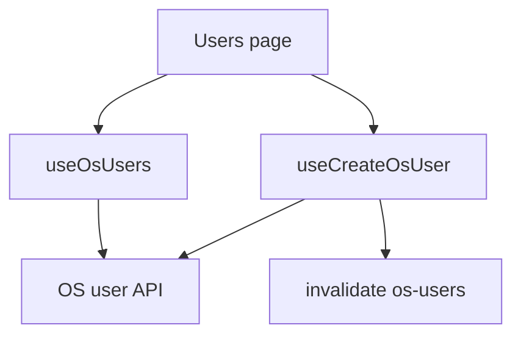
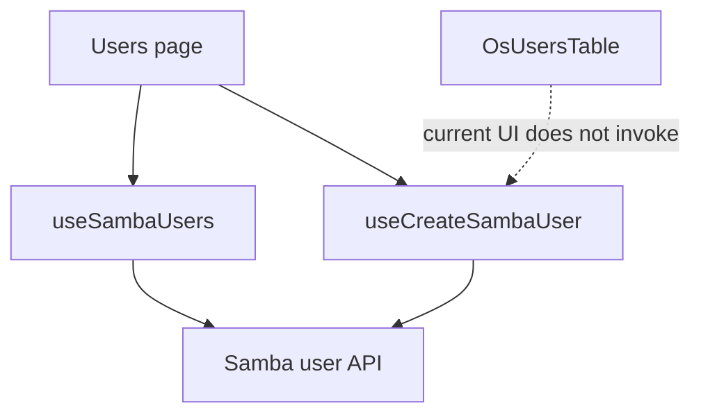
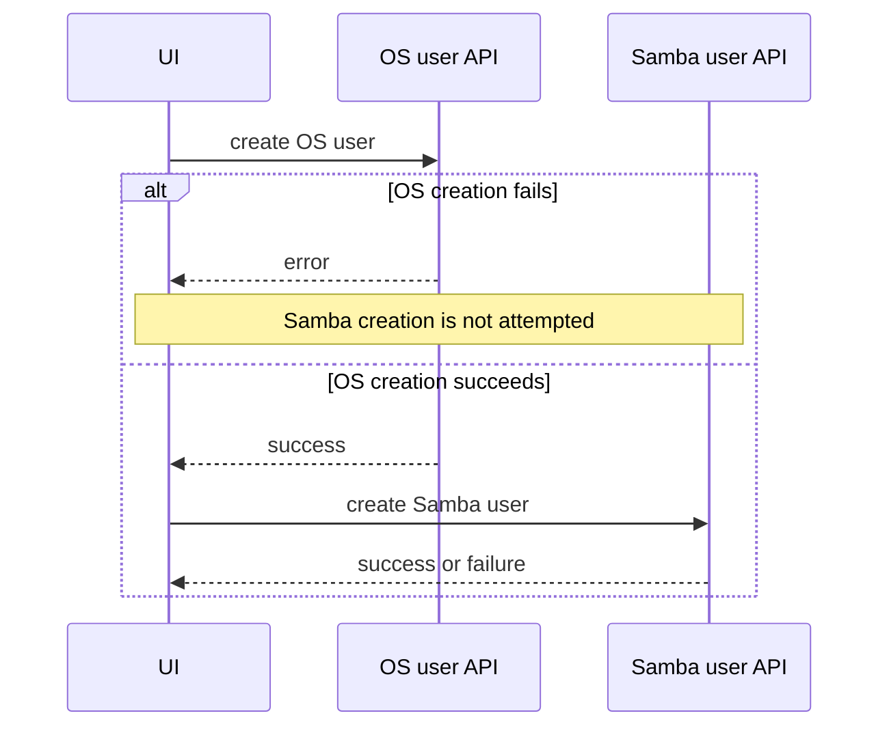

# Users

## Purpose

The Users feature is the operator-facing page for operating-system user administration, with partially wired Samba-user integration.

Route: `/users`

Entry point: `src/pages/Users.tsx`

The current page has two tabs:

- `کاربران سامانه` — active OS-user listing and create flow.
- `سایر کاربران` — placeholder only; not implemented.

The page contains Samba query/create scaffolding, but the current `OsUsersTable` does **not** render the historical Samba-status column and does not currently expose a row action that opens the Samba-create flow. Do not describe that dormant wiring as an operator-visible capability until the table UI is intentionally restored.

This feature is not a general identity provider. The backend remains authoritative for OS and Samba identities.

## Current operator-visible responsibilities

The current rendered UI supports:

- listing non-system OS users;
- manually refreshing the OS-user list;
- creating an OS user;
- frontend duplicate-name validation based on the currently loaded OS-user collection;
- showing an explicit placeholder for the unimplemented Other Users tab.

The OS-user table also renders an Edit control that currently triggers a placeholder browser alert and a disabled Delete control. Those controls must not be documented as completed update/delete workflows.

## Dormant Samba integration in the page

`Users.tsx` still contains supporting state and hooks for:

- loading Samba users;
- correlating OS usernames with Samba usernames;
- opening `SambaUserCreateModal` with a prefilled OS username;
- creating a Samba user;
- optionally creating an OS user before the Samba user.

However, the current `OsUsersTable` does not invoke the supplied `onCreateSambaUser` callback and does not display the supplied Samba-status information. Therefore the page-level Samba flow is not currently reachable from the rendered OS-user table.

Treat this as dormant integration scaffolding, not production UI behavior.

A future change should make an explicit product decision:

1. restore a supported Samba-status/action surface in the Users table; or
2. remove the dormant Users-page Samba wiring and keep Samba administration exclusively under `/share`.

Do not leave the two layers drifting indefinitely.

## Runtime flow

Current active operator path:



Additional dormant page wiring currently exists:



OS-user and Samba-user state are separate backend resources with separate React Query keys.

## OS users

Hook: `useOsUsers()`

Base query key:

```text
['os-users']
```

Full key:

```text
['os-users', { includeSystem }]
```

Endpoint:

```text
GET /api/os/user?include_system=<boolean>
```

The current page keeps:

```text
includeSystem = false
```

so system accounts are intentionally excluded from the ordinary Users table.

The query uses a 15-second stale time and no continuous polling interval.

The page exposes manual refresh through `osUsersQuery.refetch()`.

## Current OS-user table

Component: `src/components/users/OsUsersTable.tsx`

The table currently renders:

- row number;
- username;
- an Actions column.

Current Actions behavior:

- Edit: placeholder behavior only (`alert('edit')`);
- Delete: disabled.

The table does **not** currently render Samba-account status.

The table's prop contract still contains `isSambaStatusLoading` and `onCreateSambaUser`, but the rendered component does not consume those values. This is a known internal API debt and should be resolved together with the product decision about Samba integration.

## Samba correlation state

Although it is not currently rendered, `Users.tsx` still loads Samba users while the OS-user tab is active.

Samba key:

```text
['samba-users']
```

Endpoint through `sambaUserService`:

```text
GET /api/samba/users/?property=all
```

The page normalizes both username sets and calculates `hasSambaUser` for OS-user rows.

If the normalized OS-user model already includes an explicit `hasSambaUser`, that value wins; otherwise the page derives correlation from the current Samba username set.

Because the table no longer renders that field, this calculation currently creates background work without a visible status column.

If the Samba status UI is not restored, this query/correlation path is a candidate for removal to avoid unnecessary API traffic.

## Create OS user

Hook: `useCreateOsUser()`

Endpoint:

```text
POST /api/os/user/create/
```

Payload fields:

```text
username
login_shell
shell
```

The hook resolves `shell` from `shell ?? login_shell` and sends both backend fields.

On success it invalidates the OS-user base query family so all `includeSystem` variants can refresh.

## Frontend duplicate-name rule

Before creating an OS user, the page:

1. trims the username;
2. lowercases it for comparison;
3. rejects it when the normalized username already exists in the loaded OS-user set.

This is UX validation only. The backend must still enforce uniqueness because:

- the list can be stale;
- another operator can create the user concurrently;
- frontend checks are not an authorization or integrity boundary.

## Dormant Samba-create workflow

Hook: `useCreateSambaUser()`

Endpoint:

```text
POST /api/samba/users/
```

Domain payload:

```text
username
password
```

`Users.tsx` still defines a modal flow that can:

- prefill a username;
- create a Samba user;
- optionally create the OS user first.

The current rendered table does not open that modal, so this flow is not currently operator-reachable from `/users`.

Samba users remain actively manageable through the Samba feature documented in [`samba-shares.md`](./samba-shares.md).

## Optional OS-first Samba sequence

If the dormant Users-page Samba modal is made reachable again, its existing submission contract includes:

```text
createOsUserFirst
```

When true, the page performs two mutations in sequence:



The default shell for this bridge flow is `DEFAULT_LOGIN_SHELL`.

This sequence is not atomic. If OS-user creation succeeds and Samba-user creation fails, the OS account remains; no frontend rollback deletes it.

That partial-failure contract must be preserved or redesigned explicitly if the flow is restored.

## StateSync boundary

### OS users

`/api/os/user...` is not currently mapped to a StateSync persisted domain.

OS-user operations therefore use ordinary backend mutation plus React Query refresh without a frontend canonical `save_to_db=true` snapshot workflow.

Do not invent caller-level persistence flags for OS users.

### Samba users

`/api/samba/users...` mutations are centrally mapped by `StateSyncManager` to:

```text
samba-users + samba-groups
```

Feature code should send only domain mutation data. `StateSyncManager` owns canonical persisted snapshots.

## Current product limitation: Other Users tab

The second tab currently renders only:

```text
بخش سایر کاربران در دست توسعه است.
```

Do not infer a backend identity model from this placeholder.

## Error handling

The active OS-user create path uses normalized API errors and keeps the creation modal open on failure.

The dormant Samba-create path also contains modal/toast error handling, including stopping the sequence when an optional OS-first create fails.

Do not use unreachable error-handling code as evidence that the corresponding UI workflow is active.

## Important invariants

- OS users and Samba users are distinct backend resources and cache entries.
- Current OS listing excludes system accounts.
- Frontend duplicate checks are advisory; backend uniqueness remains authoritative.
- Current `OsUsersTable` does not show Samba status or expose Samba creation.
- Placeholder Edit/Delete controls must not be documented as implemented operations.
- Dormant Samba integration should either be restored deliberately or removed deliberately.
- OS-user mutations are not a current StateSync domain.
- Samba-user mutations are centrally persisted through the Samba User/Group StateSync domains.
- The Other Users tab is not production functionality.

## Common failure scenarios

### OS-user list does not update after create

Check:

1. `POST /api/os/user/create/` response;
2. OS-user query invalidation;
3. `GET /api/os/user?include_system=false`;
4. response normalization in `useOsUsers()`.

### Samba status is not visible in the Users table

This is current UI behavior. The historical status column is not rendered by `OsUsersTable`.

Do not debug the Samba API solely because no status icon appears; first verify whether the product intends to restore that column.

### Samba requests appear while the OS-user tab is open

`Users.tsx` still loads Samba users for dormant correlation logic. If the integration remains intentionally hidden, this is unnecessary background work and should be removed in a focused cleanup.

### Edit button shows only a browser alert

The current edit control is placeholder UI. There is no completed OS-user edit mutation documented for this feature.

### Delete is unavailable

The current Delete control is disabled. Implementing deletion requires an explicit backend contract, dependency behavior, confirmation UX, and cache invalidation strategy.

### Backend snapshot does not contain OS-user changes

The current frontend does not define an OS-user StateSync domain. Confirm the backend persistence contract before changing centralized StateSync.

## Extension guide

### Completing OS-user edit/delete

1. confirm backend endpoint and authorization semantics;
2. implement dedicated hooks/API functions;
3. remove placeholder `alert`/disabled controls;
4. require confirmation for destructive deletion;
5. invalidate `osUsersBaseQueryKey` after success;
6. decide whether Samba dependencies block or cascade;
7. confirm whether OS users need a centralized StateSync domain;
8. update this document and the API endpoint map.

### Restoring Users-page Samba integration

If product requirements want Samba status/action directly on `/users`:

1. restore a supported table column/action, not commented historical code;
2. consume the existing correlation data intentionally;
3. make the Samba-create modal reachable through explicit UI;
4. preserve duplicate checks and partial-failure semantics;
5. test the cross-domain OS→Samba sequence;
6. update the table prop contract to match real usage.

### Removing dormant Samba integration

If Samba administration should live only under `/share`:

1. remove the Samba query from `Users.tsx`;
2. remove unused correlation state;
3. remove unreachable Samba modal/create handlers;
4. remove unused `OsUsersTable` Samba props;
5. confirm request volume drops without changing OS-user behavior;
6. update this document accordingly.

### Expanding the Other Users tab

Define its backend resource and ownership explicitly before reusing OS/Samba query keys. Do not mix unrelated identity domains into one cache entry merely because they appear on the same page.

## Related files

- `src/pages/Users.tsx`
- `src/components/users/OsUsersTable.tsx`
- `src/components/users/OsUserCreateModal.tsx`
- `src/components/users/SambaUserCreateModal.tsx`
- `src/hooks/useOsUsers.ts`
- `src/hooks/useCreateOsUser.ts`
- `src/hooks/useSambaUsers.ts`
- `src/hooks/useCreateSambaUser.ts`
- `src/lib/sambaUserService.ts`
- `src/utils/osUsers.ts`
- `src/utils/sambaUsers.ts`
- `src/constants/users.ts`

## Related documentation

- [`../04-core-flows/server-state-and-cache.md`](../04-core-flows/server-state-and-cache.md)
- [`../04-core-flows/api-request-lifecycle.md`](../04-core-flows/api-request-lifecycle.md)
- [`../04-core-flows/state-sync-save-to-db.md`](../04-core-flows/state-sync-save-to-db.md)
- [`samba-shares.md`](./samba-shares.md)
