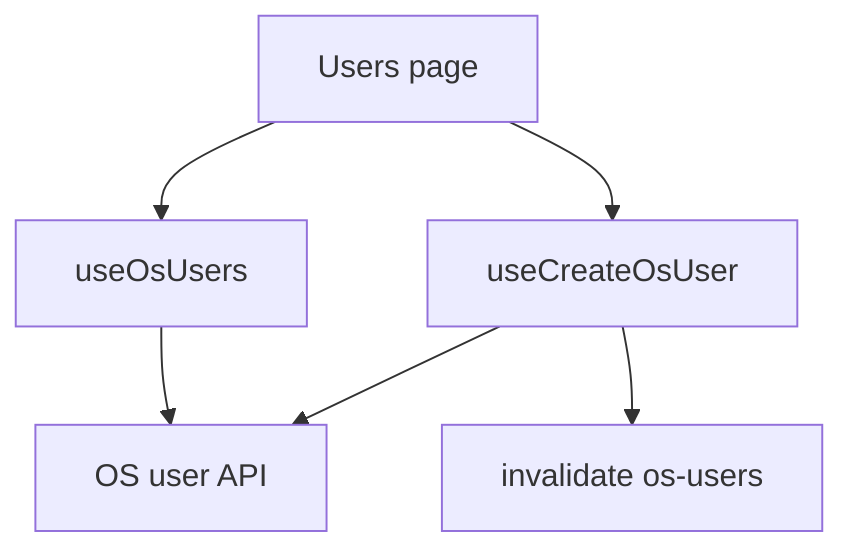
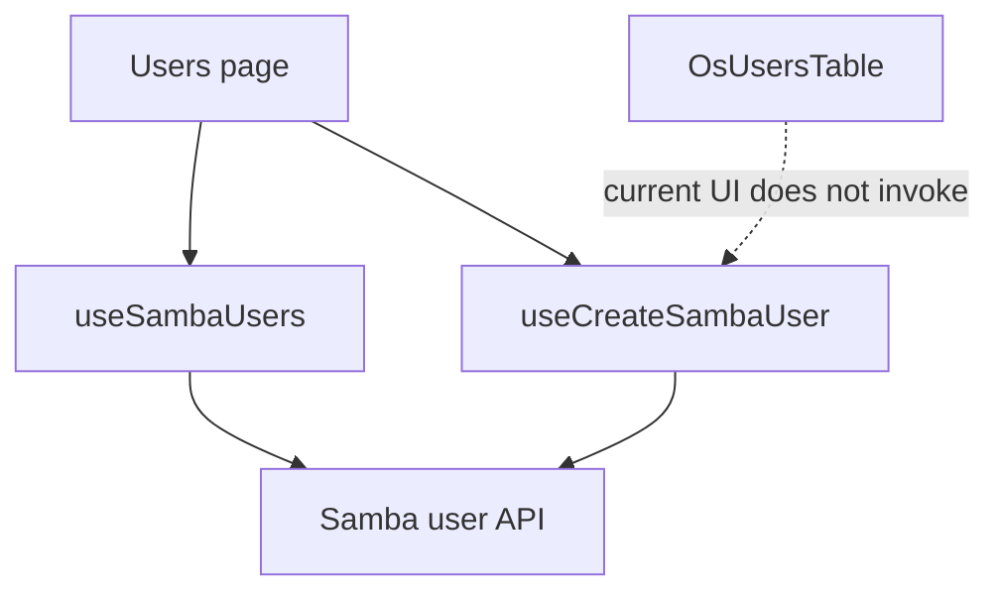
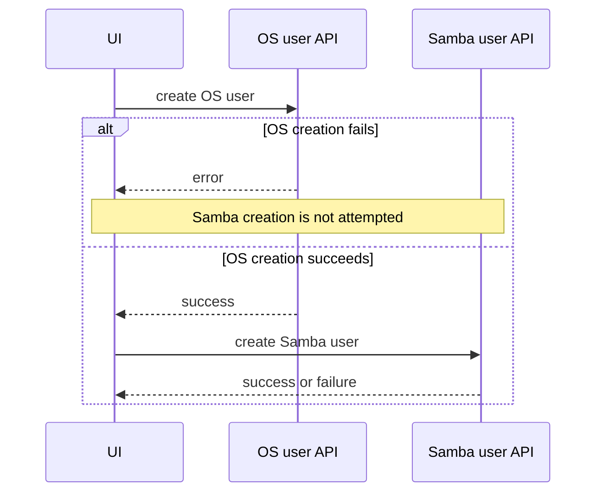

# Users

## هدف

Feature مربوط به Users، صفحه‌ی Operator برای مدیریت OS user است و بخشی از integration مربوط به Samba user نیز در page وجود دارد که در UI فعلی به‌صورت کامل expose نشده است.

Route: `/users`

Entry point: `src/pages/Users.tsx`

Page فعلی دو tab دارد:

- `کاربران سامانه` — لیست فعال OS user و create flow.
- `سایر کاربران` — فقط placeholder و هنوز پیاده‌سازی نشده است.

Page شامل Samba query/create scaffolding است، اما `OsUsersTable` فعلی **ستون تاریخی Samba status را render نمی‌کند** و row actionای برای بازکردن Samba-create flow ندارد. تا زمانی که table UI عمداً restore نشده، این dormant wiring را operator-visible capability توصیف نکنید.

این feature یک general identity provider نیست. Backend همچنان authoritative برای OS identity و Samba identity است.

## مسئولیت‌های فعلی قابل مشاهده برای Operator

UI renderشده‌ی فعلی موارد زیر را پشتیبانی می‌کند:

- list کردن OS userهای non-system؛
- manual refresh لیست OS user؛
- ساخت OS user؛
- frontend duplicate-name validation بر اساس OS-user collection loadشده؛
- نمایش placeholder صریح برای tab پیاده‌سازی‌نشده‌ی Other Users.

OS-user table همچنین Edit control دارد که در حال حاضر فقط placeholder browser alert اجرا می‌کند و Delete control نیز disabled است. این controlها نباید به‌عنوان update/delete workflow تکمیل‌شده مستند شوند.

## Dormant Samba Integration در Page

`Users.tsx` هنوز state و hookهای پشتیبان زیر را دارد:

- load کردن Samba userها؛
- correlate کردن OS username با Samba username؛
- بازکردن `SambaUserCreateModal` با OS username از قبل پرشده؛
- ساخت Samba user؛
- در صورت انتخاب، ساخت OS user پیش از Samba user.

با این حال `OsUsersTable` فعلی callback مربوط به `onCreateSambaUser` را invoke نمی‌کند و Samba-status information ارسال‌شده را نمایش نمی‌دهد. بنابراین Samba flow موجود در page در وضعیت فعلی از OS-user table قابل دسترسی نیست.

این بخش را dormant integration scaffolding در نظر بگیرید، نه production UI behavior.

Change آینده باید product decision صریحی بگیرد:

1. Samba status/action surface پشتیبانی‌شده را در Users table restore کند؛ یا
2. dormant Samba wiring را از Users page حذف کند و Samba administration فقط زیر `/share` باقی بماند.

این دو layer نباید برای مدت نامحدود از یکدیگر drift کنند.

## Runtime Flow

مسیر فعال فعلی Operator:



Dormant page wiring اضافی:



OS-user state و Samba-user state دو backend resource مستقل با React Query keyهای جدا هستند.

## OS Users

Hook: `useOsUsers()`

Base query key:

```text
['os-users']
```

Full key:

```text
['os-users', { includeSystem }]
```

Endpoint:

```text
GET /api/os/user?include_system=<boolean>
```

Page فعلی مقدار زیر را ثابت نگه می‌دارد:

```text
includeSystem = false
```

در نتیجه system accountها عمداً از Users table عادی حذف می‌شوند.

Query از `staleTime` برابر 15 ثانیه استفاده می‌کند و continuous polling interval ندارد.

Page، manual refresh را از طریق `osUsersQuery.refetch()` expose می‌کند.

## OS-user Table فعلی

Component: `src/components/users/OsUsersTable.tsx`

Table فعلی موارد زیر را render می‌کند:

- row number؛
- username؛
- ستون Actions.

Behavior فعلی Actions:

- Edit: فقط placeholder (`alert('edit')`)؛
- Delete: disabled.

Table در حال حاضر Samba-account status را render نمی‌کند.

Prop contract مربوط به table هنوز `isSambaStatusLoading` و `onCreateSambaUser` را دارد، اما rendered component این valueها را consume نمی‌کند. این مورد internal API debt شناخته‌شده است و باید همراه با product decision مربوط به Samba integration حل شود.

## Samba Correlation State

با وجود render نشدن در UI، `Users.tsx` هنوز وقتی OS-user tab active است Samba userها را load می‌کند.

Samba key:

```text
['samba-users']
```

Endpoint از طریق `sambaUserService`:

```text
GET /api/samba/users/?property=all
```

Page هر دو username set را normalize می‌کند و `hasSambaUser` را برای OS-user rowها محاسبه می‌کند.

اگر normalized OS-user model از قبل `hasSambaUser` صریح داشته باشد همان value اولویت دارد؛ در غیر این صورت page correlation را از current Samba username set derive می‌کند.

چون table دیگر این field را render نمی‌کند، این calculation در وضعیت فعلی background work بدون visible status column ایجاد می‌کند.

اگر Samba status UI قرار نیست restore شود، این query/correlation path candidate حذف است تا API traffic غیرضروری کاهش پیدا کند.

## ساخت OS User

Hook: `useCreateOsUser()`

Endpoint:

```text
POST /api/os/user/create/
```

Payload fieldها:

```text
username
login_shell
shell
```

Hook مقدار `shell` را از `shell ?? login_shell` resolve کرده و هر دو backend field را ارسال می‌کند.

پس از success، OS-user base query family invalidate می‌شود تا تمام variantهای `includeSystem` بتوانند refresh شوند.

## Frontend Duplicate-name Rule

پیش از ساخت OS user، page:

1. username را trim می‌کند؛
2. برای comparison آن را lowercase می‌کند؛
3. اگر normalized username از قبل در OS-user set loadشده وجود داشته باشد request را reject می‌کند.

این فقط UX validation است. Backend همچنان باید uniqueness را enforce کند، چون:

- list ممکن است stale باشد؛
- Operator دیگری می‌تواند هم‌زمان user بسازد؛
- frontend check یک authorization/integrity boundary نیست.

## Dormant Samba-create Workflow

Hook: `useCreateSambaUser()`

Endpoint:

```text
POST /api/samba/users/
```

Domain payload:

```text
username
password
```

`Users.tsx` هنوز modal flowای تعریف می‌کند که می‌تواند:

- username را prefill کند؛
- Samba user بسازد؛
- در صورت انتخاب، ابتدا OS user را بسازد.

Rendered table فعلی این modal را باز نمی‌کند، بنابراین flow از `/users` برای Operator قابل دسترسی نیست.

Samba userها همچنان از Samba feature که در [`samba-shares.md`](./samba-shares.md) مستند شده قابل مدیریت هستند.

## Optional OS-first Samba Sequence

اگر dormant Samba modal در Users page دوباره reachable شود، submission contract فعلی شامل value زیر است:

```text
createOsUserFirst
```

وقتی true باشد page دو mutation را پشت‌سرهم اجرا می‌کند:



Default shell برای این bridge flow برابر `DEFAULT_LOGIN_SHELL` است.

این sequence atomic نیست. اگر OS-user creation موفق و Samba-user creation fail شود، OS account باقی می‌ماند و frontend rollback برای حذف آن ندارد.

اگر flow restore شد، این partial-failure contract باید حفظ یا به‌صورت صریح redesign شود.

## StateSync Boundary

### OS Userها

`/api/os/user...` در حال حاضر به StateSync persisted domain map نشده است.

OS-user operationها از ordinary backend mutation + React Query refresh استفاده می‌کنند و frontend canonical snapshot با `save_to_db=true` ندارند.

برای OS user caller-level persistence flag اختراع نکنید.

### Samba Userها

بر اساس contract صحیح فعلی GitLab، `samba-users` و `samba-groups` StateSync domain مستقل نیستند.

Mutationهای `/api/samba/users...` ممکن است از طریق mutation success و React Query invalidation باعث refresh UI شوند، اما نباید از سمت feature code یا frontend StateSync، canonical `save_to_db=true` snapshot برای Samba user/group schedule کنند.

StateSync مربوط به Samba در contract فعلی فقط domain زیر را دارد:

```text
samba-shares
```

و mutation family مربوط به Samba sharepoint را پوشش می‌دهد.

اگر در آینده persistence مربوط به Samba user/group لازم شد، باید ابتدا backend contract و canonical snapshot endpoint تأیید و سپس `StateSyncManager` به‌صورت مرکزی تغییر کند.

## محدودیت فعلی محصول: Other Users Tab

Tab دوم در حال حاضر فقط متن زیر را render می‌کند:

```text
بخش سایر کاربران در دست توسعه است.
```

از روی این placeholder هیچ backend identity modelای استنتاج نکنید.

## Error Handling

Active OS-user create path از normalized API error استفاده می‌کند و هنگام failure creation modal را باز نگه می‌دارد.

Dormant Samba-create path نیز modal/toast error handling دارد و اگر optional OS-first create fail شود sequence را متوقف می‌کند.

Unreachable error-handling code را evidence برای active بودن UI workflow مربوطه در نظر نگیرید.

## Invariantهای مهم

- OS user و Samba user دو backend resource و cache entry مستقل هستند.
- OS listing فعلی system accountها را exclude می‌کند.
- Frontend duplicate check فقط advisory است؛ backend uniqueness authoritative باقی می‌ماند.
- `OsUsersTable` فعلی Samba status را نمایش نمی‌دهد و Samba creation را expose نمی‌کند.
- Placeholder Edit/Delete control نباید implementation کامل توصیف شود.
- Dormant Samba integration باید عمداً restore یا عمداً حذف شود.
- OS-user mutation در حال حاضر StateSync domain ندارد.
- Samba-user/group mutation نیز در contract صحیح فعلی GitLab StateSync domain مستقل ندارد.
- Other Users tab production functionality نیست.

## Failure Scenarioهای رایج

### OS-user List پس از Create Update نمی‌شود

بررسی کنید:

1. response مربوط به `POST /api/os/user/create/`؛
2. OS-user query invalidation؛
3. `GET /api/os/user?include_system=false`؛
4. response normalization در `useOsUsers()`.

### Samba Status در Users Table دیده نمی‌شود

این behavior فعلی UI است. Historical status column توسط `OsUsersTable` render نمی‌شود.

فقط به دلیل نبود status icon سراغ debug کردن Samba API نروید؛ ابتدا verify کنید product اصلاً قصد restore کردن آن column را دارد یا خیر.

### هنگام باز بودن OS-user Tab، Samba Request دیده می‌شود

`Users.tsx` هنوز Samba userها را برای dormant correlation logic load می‌کند. اگر integration عمداً hidden باقی می‌ماند، این background work غیرضروری است و باید در cleanup متمرکز حذف شود.

### Edit Button فقط Browser Alert نشان می‌دهد

Edit control فعلی placeholder UI است و OS-user edit mutation تکمیل‌شده‌ای برای این feature وجود ندارد.

### Delete در دسترس نیست

Delete control فعلی disabled است. Implementation حذف نیازمند backend contract صریح، dependency behavior، confirmation UX و cache invalidation strategy است.

### Backend Snapshot شامل OS/Samba User Change نیست

Frontend فعلی برای OS user، Samba user و Samba group StateSync domain ندارد. پیش از تغییر centralized StateSync، backend persistence contract را تأیید کنید.

## راهنمای Extension

### تکمیل OS-user Edit/Delete

1. backend endpoint و authorization semantics را تأیید کنید؛
2. hook/API function اختصاصی پیاده‌سازی کنید؛
3. placeholder `alert` و disabled control را حذف کنید؛
4. برای destructive deletion confirmation اجباری کنید؛
5. پس از success، `osUsersBaseQueryKey` را invalidate کنید؛
6. مشخص کنید Samba dependency باعث block یا cascade می‌شود؛
7. تأیید کنید OS user به centralized StateSync domain نیاز دارد یا خیر؛
8. این سند و API endpoint map را update کنید.

### Restore کردن Users-page Samba Integration

اگر product requirement می‌خواهد Samba status/action مستقیماً در `/users` باشد:

1. supported table column/action را restore کنید، نه historical commented code؛
2. existing correlation data را عمداً consume کنید؛
3. Samba-create modal را با UI صریح reachable کنید؛
4. duplicate check و partial-failure semantics را حفظ کنید؛
5. cross-domain OS→Samba sequence را test کنید؛
6. table prop contract را با usage واقعی هماهنگ کنید.

### حذف Dormant Samba Integration

اگر Samba administration باید فقط زیر `/share` باشد:

1. Samba query را از `Users.tsx` حذف کنید؛
2. unused correlation state را حذف کنید؛
3. unreachable Samba modal/create handlerها را حذف کنید؛
4. unused Samba propهای `OsUsersTable` را حذف کنید؛
5. verify کنید request volume کاهش یافته بدون این‌که OS-user behavior تغییر کند؛
6. این سند را update کنید.

### توسعه‌ی Other Users Tab

پیش از reuse کردن OS/Samba query key، backend resource و ownership آن را صریح تعریف کنید. صرفاً چون identity domainهای مختلف در یک page دیده می‌شوند آن‌ها را در یک cache entry ادغام نکنید.

## فایل‌های مرتبط

- `src/pages/Users.tsx`
- `src/components/users/OsUsersTable.tsx`
- `src/components/users/OsUserCreateModal.tsx`
- `src/components/users/SambaUserCreateModal.tsx`
- `src/hooks/useOsUsers.ts`
- `src/hooks/useCreateOsUser.ts`
- `src/hooks/useSambaUsers.ts`
- `src/hooks/useCreateSambaUser.ts`
- `src/lib/sambaUserService.ts`
- `src/utils/osUsers.ts`
- `src/utils/sambaUsers.ts`
- `src/constants/users.ts`

## مستندات مرتبط

- [`../04-core-flows/server-state-and-cache.md`](../04-core-flows/server-state-and-cache.md)
- [`../04-core-flows/api-request-lifecycle.md`](../04-core-flows/api-request-lifecycle.md)
- [`../04-core-flows/state-sync-save-to-db.md`](../04-core-flows/state-sync-save-to-db.md)
- [`samba-shares.md`](./samba-shares.md)
