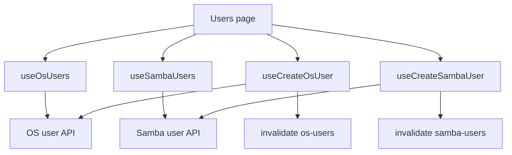
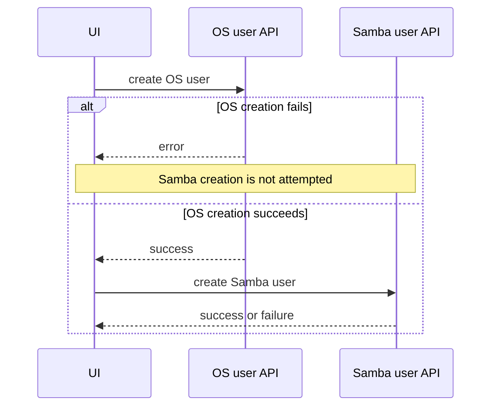

# Users

## Purpose

The Users feature is the operator-facing bridge between operating-system users and Samba users.

Route: `/users`

Entry point: `src/pages/Users.tsx`

The current page has two tabs:

- `کاربران سامانه` — implemented OS-user management and Samba-user linkage.
- `سایر کاربران` — currently a placeholder and not yet implemented.

The feature is not a general identity provider. It manages backend OS/Samba accounts used by the storage and file-sharing stack.

## Main responsibilities

The current implementation coordinates:

- listing non-system OS users;
- creating OS users;
- reading Samba users so OS rows can show Samba-account status;
- creating a Samba user from an existing OS user;
- optionally creating an OS user first when the Samba-create flow requests it;
- preventing obvious duplicate usernames using currently loaded frontend state;
- manually refreshing the OS-user list.

## Runtime flow



OS-user and Samba-user state are separate backend resources with separate React Query keys.

## OS users

Hook: `useOsUsers()`

Base query key:

```text
['os-users']
```

Full key:

```text
['os-users', { includeSystem }]
```

Endpoint:

```text
GET /api/os/user?include_system=<boolean>
```

The current page keeps:

```text
includeSystem = false
```

so system accounts are intentionally excluded from the ordinary Users table.

The query uses a 15-second stale time and no continuous polling interval.

The page exposes manual refresh through `osUsersQuery.refetch()`.

## Samba user visibility on OS-user rows

The page also loads Samba users while the implemented OS-user tab is active.

Samba key:

```text
['samba-users']
```

Endpoint through `sambaUserService`:

```text
GET /api/samba/users/?property=all
```

The page normalizes both username sets and uses Samba usernames to determine whether an OS user already has a corresponding Samba account.

If the normalized OS-user model already includes `hasSambaUser`, that explicit value wins. Otherwise the page derives the status from the current Samba username set.

This is presentation correlation, not a new authoritative identity relation stored in the frontend.

## Create OS user

Hook: `useCreateOsUser()`

Endpoint:

```text
POST /api/os/user/create/
```

Payload fields:

```text
username
login_shell
shell
```

The hook resolves `shell` from `shell ?? login_shell` and sends both backend fields.

On success it invalidates the OS-user base query family so all `includeSystem` variants can refresh.

## Frontend duplicate-name rule

Before creating an OS user, the page:

1. trims the username;
2. lowercases it for comparison;
3. rejects it when the normalized username already exists in the loaded OS-user set.

This is UX validation only. The backend must still enforce uniqueness because:

- the list can be stale;
- another operator can create the user concurrently;
- frontend checks are not an authorization/integrity boundary.

## Create Samba user from Users

Hook: `useCreateSambaUser()`

Current Samba create endpoint:

```text
POST /api/samba/users/
```

Domain payload:

```text
username
password
```

On success the canonical Samba-user list is invalidated.

The Users page can prefill the Samba-create modal with an OS username when the operator starts from an OS-user row.

## Optional OS-first Samba creation

The Samba-create submission contract includes:

```text
createOsUserFirst
```

When true, the page performs two mutations in sequence:



The default shell for this bridge flow is `DEFAULT_LOGIN_SHELL`.

### Important partial-failure behavior

This is **not an atomic frontend transaction**.

If OS-user creation succeeds and Samba-user creation fails, the newly created OS user remains. There is no frontend rollback that deletes the OS user.

Troubleshooting must therefore inspect both stages rather than assuming a single all-or-nothing operation.

## Duplicate checks for Samba creation

Before Samba creation, the page rejects a username when it already exists in the loaded Samba-user set.

If `createOsUserFirst` is requested, it also rejects a username already present in the loaded OS-user set.

Again, backend uniqueness and cross-resource validity remain authoritative.

## StateSync boundary

### OS users

`/api/os/user...` is not currently mapped to a StateSync persisted domain.

OS user operations therefore use ordinary backend mutation + React Query refresh without a frontend canonical snapshot workflow.

Do not invent a local `save_to_db` flag for OS users.

### Samba users

`/api/samba/users...` mutations are mapped centrally by `StateSyncManager` to:

```text
samba-users + samba-groups
```

The cross-domain mapping exists because Samba user mutations can affect group-related state.

Feature code should send only domain mutation data. `StateSyncManager` owns canonical persisted snapshots.

## Loading model

OS-user and Samba-user queries are independent.

The OS table receives:

- OS-list loading/fetching state;
- a separate Samba-status loading state.

This allows the table to distinguish “OS rows are loading” from “rows are loaded but Samba correlation is still being resolved.”

## Current product limitation: Other Users tab

The second tab currently renders only:

```text
بخش سایر کاربران در دست توسعه است.
```

Do not document it as a completed identity domain or infer backend behavior that does not exist in the current implementation.

## Error handling

OS-user and Samba-user creation use normalized API error messages and display both modal-level error state and toast feedback.

A failed OS-first step stops the Samba-create sequence.

A failed Samba step after OS success does not roll back the OS account.

## Important invariants

- OS users and Samba users are distinct resources and cache entries.
- Current OS listing excludes system accounts.
- Frontend duplicate checks are case-normalized but remain advisory.
- OS→Samba bridge creation is sequential and non-atomic.
- Samba creation must not begin if the requested OS-first mutation failed.
- OS user mutations are not a current StateSync domain.
- Samba user mutations are centrally persisted through Samba User/Group StateSync domains.
- The unimplemented Other Users tab must not be treated as production functionality.

## Common failure scenarios

### OS user exists but Samba status is still false

Check the Samba-user query independently. OS list success does not imply the Samba list has loaded or contains a corresponding account.

### Samba creation fails after choosing “create OS user first”

Check whether OS creation already succeeded. The frontend does not roll it back automatically.

### Duplicate validation misses a user

Frontend validation uses the currently loaded cache. Confirm the backend response and uniqueness rules rather than adding more client-only assumptions.

### Manual refresh updates OS users but Samba status looks stale

The header refresh currently refetches the OS-user query. Samba data has its own query key/lifecycle.

### Backend snapshot does not contain OS-user changes

The current frontend does not define an OS-user StateSync domain. Confirm whether snapshot persistence is part of the backend contract before extending centralized StateSync.

## Extension guide

### Adding OS-user delete/update

1. confirm backend endpoint and authorization semantics;
2. implement a dedicated hook/API function;
3. invalidate `osUsersBaseQueryKey` after success;
4. decide whether Samba dependencies must block or cascade;
5. confirm whether OS users need a new centralized StateSync domain;
6. keep destructive operations confirmation-driven.

### Expanding the Other Users tab

Define its backend resource and ownership explicitly before reusing OS/Samba query keys. Do not mix unrelated identity domains into one cache entry merely because they appear on the same page.

## Related files

- `src/pages/Users.tsx`
- `src/components/users/OsUsersTable.tsx`
- `src/components/users/OsUserCreateModal.tsx`
- `src/components/users/SambaUserCreateModal.tsx`
- `src/hooks/useOsUsers.ts`
- `src/hooks/useCreateOsUser.ts`
- `src/hooks/useSambaUsers.ts`
- `src/hooks/useCreateSambaUser.ts`
- `src/lib/sambaUserService.ts`
- `src/utils/osUsers.ts`
- `src/utils/sambaUsers.ts`
- `src/constants/users.ts`

## Related documentation

- [`../04-core-flows/server-state-and-cache.md`](../04-core-flows/server-state-and-cache.md)
- [`../04-core-flows/api-request-lifecycle.md`](../04-core-flows/api-request-lifecycle.md)
- [`../04-core-flows/state-sync-save-to-db.md`](../04-core-flows/state-sync-save-to-db.md)
- [`samba-shares.md`](./samba-shares.md)
