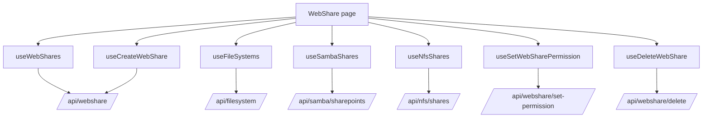
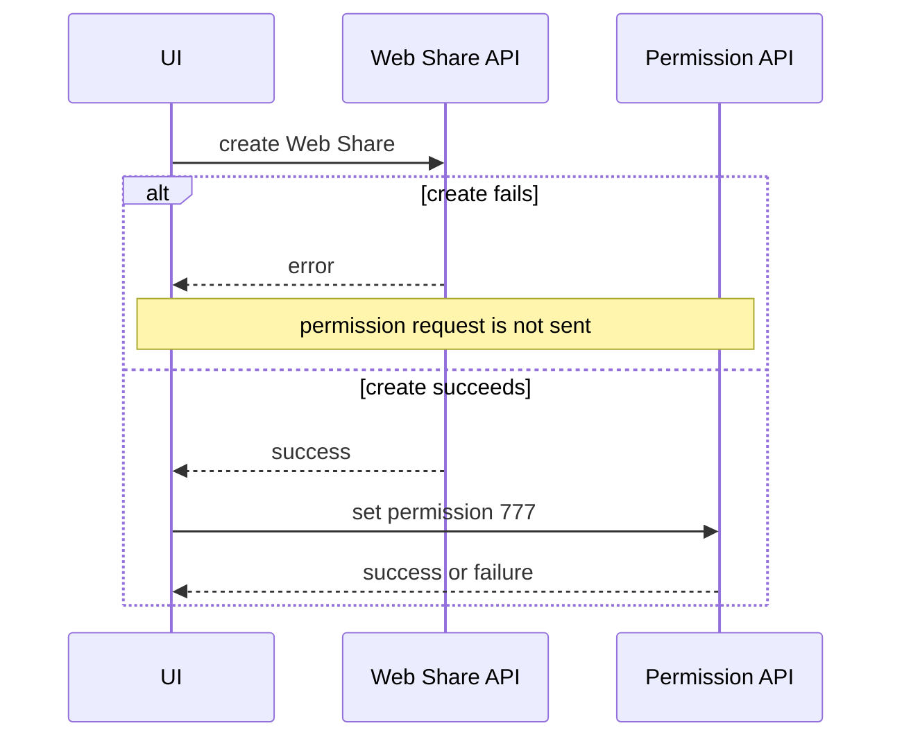

# Web Share

## Purpose

The Web Share feature exposes eligible filesystem-backed share targets through the application's web-serving layer.

Route: `/web-share`

Entry point: `src/pages/WebShare.tsx`

The page is not a generic filesystem picker. A filesystem becomes eligible for Web Share creation only when it is already backed by an SMB or NFS share and does not already have a Web Share entry.

## Main responsibilities

The current implementation supports:

- listing Web Share entries;
- manually refreshing the Web Share list;
- correlating filesystems with Samba and NFS share paths;
- filtering out filesystems that already have a Web Share;
- creating a Web Share;
- applying permission `777` after creation;
- deleting a Web Share;
- presenting the browser host as part of Web Share access information.

## Runtime flow



## Web Share query

Canonical query key:

```text
['webshare', 'shares']
```

Endpoint:

```text
GET /api/webshare/?detail=true
```

The query uses a 15-second stale time and has no continuous polling interval.

`normalizeWebShares()` accepts multiple backend shapes, including arrays, keyed objects, string entries, and records with several possible field aliases. It normalizes them into `WebShareEntry` objects before the UI renders them.

## Target identity

The frontend represents a Web Share target with a combined name derived from:

```text
poolName_fsName
```

`parseTargetName()` splits on the first underscore when backend data provides only this combined target string.

This convention is part of current frontend normalization. If backend identity changes, update the parser and all create/existing-key comparisons together.

## Eligibility for Web Share creation

The page combines four data sources:

1. filesystem inventory;
2. Samba shares;
3. NFS shares;
4. existing Web Shares.

A filesystem is eligible only when:

- its mountpoint is a usable absolute path;
- an SMB or NFS share path equals that mountpoint or is inside that mountpoint;
- the `poolName_fsName` key does not already exist in the Web Share list.

Paths are normalized by trimming trailing slashes. Values such as `/`, `/none`, and `/legacy` are not considered usable mountpoints.

This is a frontend eligibility rule for operator UX. The backend must still enforce actual resource integrity.

## Create workflow

Creating a Web Share is currently a two-stage frontend workflow:



Create endpoint:

```text
POST /api/webshare/
```

Domain payload:

```text
pool_name
fs_name
```

Permission endpoint:

```text
POST /api/webshare/set-permission/
```

Permission payload:

```text
pool_name
fs_name
permission = "777"
```

### Important partial-failure behavior

The workflow is not atomic.

If Web Share creation succeeds but permission setup fails:

- the Web Share remains created;
- the modal reports that creation succeeded but permission `777` failed;
- there is no frontend rollback that deletes the new Web Share.

Troubleshooting must therefore inspect both the Web Share resource and its permission state.

## Delete workflow

Endpoint:

```text
DELETE /api/webshare/delete/
```

Parameters:

```text
pool_name
fs_name
```

Deletion is protected by a confirmation modal and tracks the pending share id for UI state.

On success, the canonical Web Share query is invalidated.

## Manual refresh

The page header calls `refetchWebShares()` directly.

Manual refresh is observational and must not persist backend snapshots itself.

## Cross-feature dependencies

Web Share creation depends on current state from:

- File System;
- Samba Shares;
- NFS Shares.

If any of those source queries fail, the page shows a warning that the creation candidate list may be incomplete.

The Web Share table itself can still render if its own query succeeds.

## StateSync ownership

Web Share is a persisted StateSync domain.

Successful `/api/webshare...` mutations map to:

```text
webshare
```

Canonical persistence snapshot:

```text
GET /api/webshare/?detail=true&save_to_db=true
```

Only `StateSyncManager` owns this snapshot request.

Normal Web Share reads, create/delete requests, and permission mutations must not carry caller-owned persistence semantics.

## Cache refresh versus persistence

Successful Web Share mutations currently invalidate:

```text
['webshare', 'shares']
```

This updates UI freshness.

Separately, the Axios response interceptor schedules the persisted `webshare` snapshot for matching successful `/api/webshare...` mutations.

These are independent responsibilities.

## Host display

The page passes:

```ts
window.location.hostname
```

to `WebSharesTable`.

This means displayed access information is based on the hostname through which the frontend itself was opened, not necessarily a dedicated backend-advertised Web Share hostname.

If deployment introduces a separate Web Share host/domain, this should move to explicit configuration rather than relying on the browser location.

## Error handling

`extractWebShareErrorMessage()` normalizes common backend error shapes:

```text
detail
message
error
errors
```

Create, permission, and delete failures are surfaced through toast messages.

The create flow deliberately distinguishes:

- create failure;
- permission failure after successful create.

Do not collapse these into one generic error because their recovery actions differ.

## Common failure scenarios

### No filesystem is available for creation

Check:

1. filesystem mountpoints;
2. SMB/NFS share paths;
3. path normalization;
4. whether each eligible filesystem already has a Web Share;
5. whether source queries failed and produced an incomplete candidate list.

### Web Share exists but permission is wrong

Check the second stage of the create workflow: `/api/webshare/set-permission/`.

Do not assume a successful create response means permission setup also succeeded.

### UI list is stale after mutation

Check:

1. `['webshare','shares']` invalidation;
2. backend `/api/webshare/?detail=true` response;
3. whether the mutation actually succeeded;
4. whether the request passed through `axiosInstance`.

## Extension guide

When extending Web Share:

1. preserve the distinction between eligibility rules and backend integrity;
2. keep backend-shape normalization in the hook, not the table;
3. reuse `['webshare','shares']` for the canonical collection;
4. use `axiosInstance` for all API requests;
5. do not add caller-level `save_to_db` fields;
6. document any additional multi-request workflow and its partial-failure behavior;
7. invalidate the Web Share collection after successful configuration changes;
8. verify StateSync mapping if a new endpoint does not include `/api/webshare`;
9. move host construction to explicit configuration if Web Share hosting diverges from the frontend hostname.

## Related files

- `src/pages/WebShare.tsx`
- `src/hooks/useWebShares.ts`
- `src/@types/webshare.ts`
- `src/components/webshare/WebSharesTable.tsx`
- `src/hooks/useFileSystems.ts`
- `src/hooks/useSambaShares.ts`
- `src/hooks/useNfsShares.ts`
- `src/lib/stateSyncManager.ts`

## Related documentation

- [`file-system.md`](./file-system.md)
- [`samba-shares.md`](./samba-shares.md)
- [`nfs-shares.md`](./nfs-shares.md)
- [`../04-core-flows/server-state-and-cache.md`](../04-core-flows/server-state-and-cache.md)
- [`../04-core-flows/state-sync-save-to-db.md`](../04-core-flows/state-sync-save-to-db.md)
