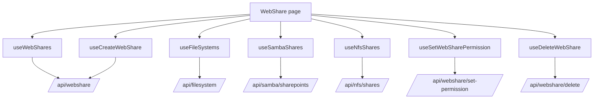
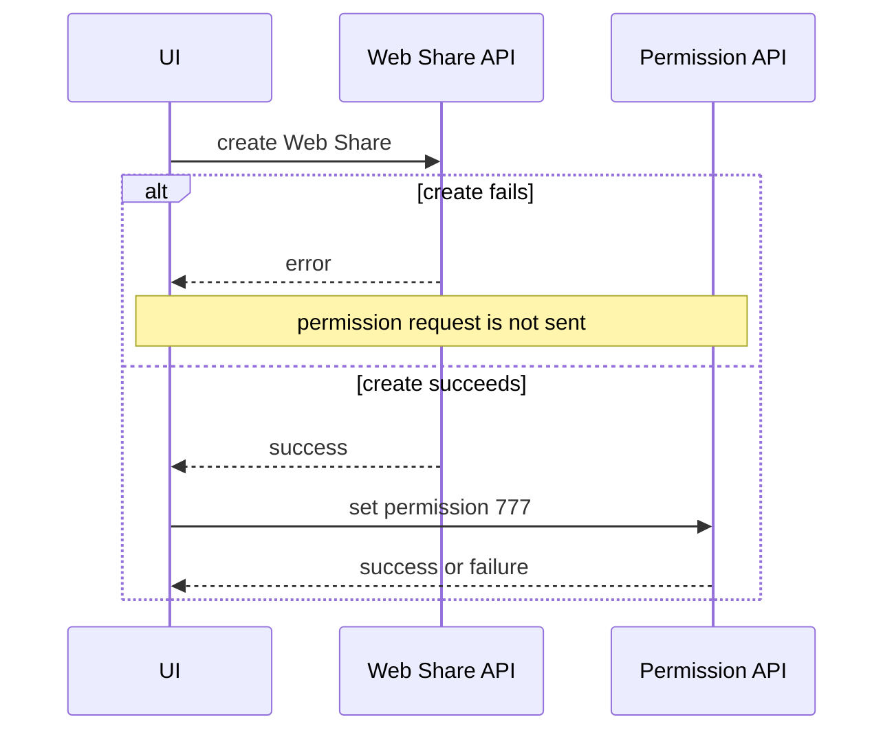

# Web Share

## هدف

Feature مربوط به Web Share، targetهای eligible مبتنی بر filesystem را از طریق web-serving layer اپلیکیشن expose می‌کند.

Route:

```text
/web-share
```

Entry point:

```text
src/pages/WebShare.tsx
```

این صفحه یک filesystem picker عمومی نیست. یک filesystem فقط زمانی برای ساخت Web Share eligible است که از قبل توسط SMB یا NFS share پوشش داده شود و Web Share موجود دیگری برای آن وجود نداشته باشد.

## مسئولیت‌های اصلی

Implementation فعلی موارد زیر را پشتیبانی می‌کند:

- لیست کردن Web Share entryها؛
- refresh دستی Web Share list؛
- correlate کردن filesystemها با pathهای Samba و NFS share؛
- filter کردن filesystemهایی که از قبل Web Share دارند؛
- create کردن Web Share؛
- اعمال permission برابر `777` پس از create؛
- delete کردن Web Share؛
- نمایش browser host به‌عنوان بخشی از access information مربوط به Web Share.

## runtime flow



## Web Share query

Canonical query key:

```text
['webshare', 'shares']
```

Endpoint:

```text
GET /api/webshare/?detail=true
```

Query دارای `staleTime` برابر 15 ثانیه است و continuous polling interval ندارد.

`normalizeWebShares()` چند backend shape مختلف را می‌پذیرد؛ از جمله array، keyed object، string entry و recordهایی با field aliasهای مختلف. پیش از render شدن UI، همه به `WebShareEntry` normalize می‌شوند.

## Target identity

Frontend یک Web Share target را با name ترکیبی زیر نمایش می‌دهد:

```text
poolName_fsName
```

وقتی backend فقط همین target ترکیبی را برمی‌گرداند، `parseTargetName()` روی اولین underscore split می‌کند.

این convention بخشی از normalization فعلی frontend است. اگر backend identity تغییر کند، parser و تمام create/existing-key comparisonها باید هم‌زمان update شوند.

## eligibility برای Web Share creation

صفحه چهار data source را ترکیب می‌کند:

1. filesystem inventory؛
2. Samba shareها؛
3. NFS shareها؛
4. Web Shareهای موجود.

یک filesystem فقط وقتی eligible است که:

- mountpoint آن یک absolute path قابل استفاده باشد؛
- path مربوط به SMB یا NFS share دقیقاً برابر mountpoint باشد یا داخل آن mountpoint قرار بگیرد؛
- key با فرمت `poolName_fsName` از قبل در Web Share list وجود نداشته باشد.

Pathها با حذف trailing slash normalize می‌شوند. Valueهایی مانند `/`، `/none` و `/legacy` mountpoint قابل استفاده محسوب نمی‌شوند.

این یک frontend eligibility rule برای UX operator است. Backend همچنان باید actual resource integrity را enforce کند.

## Create workflow

Create کردن Web Share در حال حاضر یک frontend workflow دو مرحله‌ای است:



Create endpoint:

```text
POST /api/webshare/
```

Domain payload:

```text
pool_name
fs_name
```

Permission endpoint:

```text
POST /api/webshare/set-permission/
```

Permission payload:

```text
pool_name
fs_name
permission = "777"
```

### partial-failure behavior مهم

این workflow atomic نیست.

اگر Web Share creation موفق ولی permission setup ناموفق باشد:

- Web Share ایجادشده باقی می‌ماند؛
- modal گزارش می‌دهد create موفق بوده ولی permission `777` fail شده است؛
- frontend rollback برای حذف Web Share جدید ندارد.

در troubleshooting باید هم Web Share resource و هم permission state آن بررسی شود.

## Delete workflow

Endpoint:

```text
DELETE /api/webshare/delete/
```

Parameterها:

```text
pool_name
fs_name
```

Delete پشت confirmation modal انجام می‌شود و pending share id برای UI state track می‌شود.

پس از success، canonical Web Share query invalidate می‌شود.

## Manual refresh

Page header مستقیماً `refetchWebShares()` را call می‌کند.

Manual refresh observational است و نباید خودش backend snapshot را persist کند.

## cross-feature dependencyها

Web Share creation به state فعلی این featureها وابسته است:

- File System؛
- Samba Shares؛
- NFS Shares.

اگر هرکدام از source queryها fail شوند، صفحه warning نشان می‌دهد که creation candidate list ممکن است ناقص باشد.

اگر Web Share query خودش موفق باشد، table همچنان می‌تواند render شود.

## مالکیت StateSync

Web Share یک persisted StateSync domain است.

Mutationهای موفق زیر namespace `/api/webshare...` به domain زیر map می‌شوند:

```text
webshare
```

Canonical persistence snapshot:

```text
GET /api/webshare/?detail=true&save_to_db=true
```

فقط `StateSyncManager` مالک این snapshot request است.

Web Share readهای عادی، create/delete requestها و permission mutationها نباید caller-owned persistence semantics داشته باشند.

## تفاوت cache refresh و persistence

Mutation موفق Web Share در حال حاضر query زیر را invalidate می‌کند:

```text
['webshare', 'shares']
```

این کار UI freshness را update می‌کند.

به‌صورت جداگانه، Axios response interceptor برای mutation موفقی که با `/api/webshare...` match شود persisted `webshare` snapshot را schedule می‌کند.

این دو concern مستقل‌اند.

## Host display

صفحه مقدار زیر را به `WebSharesTable` می‌دهد:

```ts
window.location.hostname
```

بنابراین access information نمایش‌داده‌شده بر اساس hostnameای است که frontend از طریق آن باز شده، نه لزوماً dedicated Web Share hostname اعلام‌شده از سمت backend.

اگر deployment در آینده host/domain جداگانه‌ای برای Web Share داشته باشد، این behavior باید به explicit configuration منتقل شود و به browser location متکی نباشد.

## مدیریت خطا

`extractWebShareErrorMessage()` backend error shapeهای رایج زیر را normalize می‌کند:

```text
detail
message
error
errors
```

Failure مربوط به create، permission و delete از طریق toast نمایش داده می‌شود.

Create flow عمداً میان این دو حالت فرق می‌گذارد:

- create failure؛
- permission failure پس از create موفق.

این دو را به generic error واحد تبدیل نکنید، چون recovery action آن‌ها متفاوت است.

## failure scenarioهای رایج

### هیچ filesystemی برای create قابل انتخاب نیست

بررسی کنید:

1. filesystem mountpointها؛
2. SMB/NFS share pathها؛
3. path normalization؛
4. آیا هر filesystem eligible از قبل Web Share دارد؛
5. آیا source queryها fail شده‌اند و candidate list ناقص است.

### Web Share وجود دارد ولی permission اشتباه است

مرحله‌ی دوم create workflow یعنی `/api/webshare/set-permission/` را بررسی کنید.

Create response موفق به معنی success در permission setup نیست.

### UI list بعد از mutation stale است

بررسی کنید:

1. invalidation مربوط به `['webshare','shares']`؛
2. response مربوط به `/api/webshare/?detail=true`؛
3. آیا mutation واقعاً موفق بوده؛
4. آیا request از `axiosInstance` عبور کرده است.

## راهنمای توسعه

هنگام توسعه‌ی Web Share:

1. distinction میان eligibility rule و backend integrity را حفظ کنید.
2. backend-shape normalization را در hook نگه دارید، نه table.
3. برای canonical collection از `['webshare','shares']` reuse کنید.
4. همه‌ی API requestها را با `axiosInstance` ارسال کنید.
5. caller-level `save_to_db` field اضافه نکنید.
6. هر multi-request workflow جدید و partial-failure behavior آن را مستند کنید.
7. بعد از configuration change موفق، Web Share collection را invalidate کنید.
8. اگر endpoint جدید شامل `/api/webshare` نیست، StateSync mapping را بررسی کنید.
9. اگر Web Share hosting از frontend hostname جدا شد، ساخت host را به explicit configuration منتقل کنید.

## فایل‌های مرتبط

- `src/pages/WebShare.tsx`
- `src/hooks/useWebShares.ts`
- `src/@types/webshare.ts`
- `src/components/webshare/WebSharesTable.tsx`
- `src/hooks/useFileSystems.ts`
- `src/hooks/useSambaShares.ts`
- `src/hooks/useNfsShares.ts`
- `src/lib/stateSyncManager.ts`

## مستندات مرتبط

- [`file-system.md`](./file-system.md)
- [`samba-shares.md`](./samba-shares.md)
- [`nfs-shares.md`](./nfs-shares.md)
- [`../04-core-flows/server-state-and-cache.md`](../04-core-flows/server-state-and-cache.md)
- [`../04-core-flows/state-sync-save-to-db.md`](../04-core-flows/state-sync-save-to-db.md)
